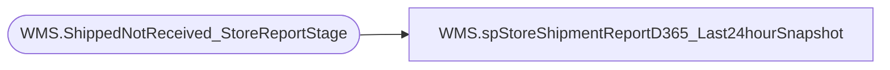

# WMS.spStoreShipmentReportD365_Last24hourSnapshot

**Database:** IntegrationStaging  

## Architecture Diagram



## Table Dependencies

| Referenced Table |
|---|
| WMS.ShippedNotReceived_StoreReportStage |

## Stored Procedure Code

```sql
CREATE proc [WMS].[spStoreShipmentReportD365_Last24hourSnapshot]
@DateDiff integer, @StoreNumber varchar(50)

WITH RECOMPILE 

as 

set nocount on 


SELECT [OrderNumber]
      ,[LicensePlate]
      ,[ItemNumber]
      ,[Name]
      ,[FromWarehouse]
      ,[ToWarehouse]
      ,[ProductHierarchy]
      ,[ShipDate]
      ,[ItemQty]
      ,[CartonQty]
	  ,[isMiscCarton]
      ,[MiscCartonDetails]
FROM [WMS].[ShippedNotReceived_StoreReportStage]
where  1=1
   --and DATEDIFF(dd, [ShipDate], getdate()) <= @DateDiff
   --and  DATEDIFF(hh, [ShipDate], getdate()) <= 24 
   and datediff(dd, ShipConfirmUTCDateTime, getdate()) <= @DateDiff
   and DATEDIFF(hh, ShipConfirmUTCDateTime, getdate()) <= 32 
   --and [ToWarehouse] = '1175'
   and [ToWarehouse] = @storeNumber
```

