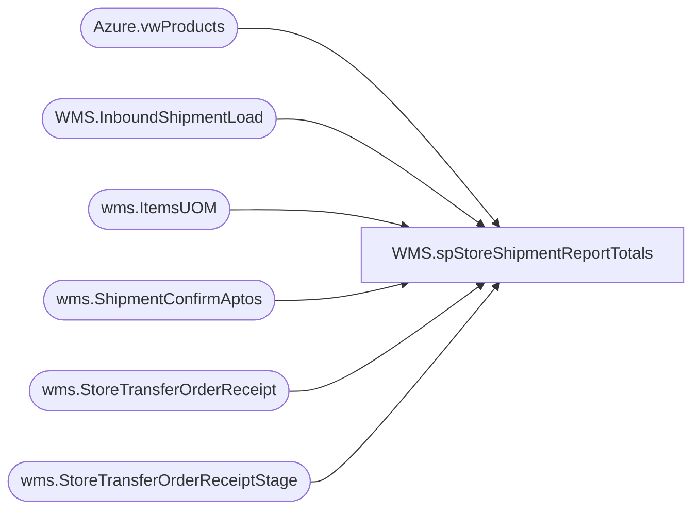

# WMS.spStoreShipmentReportTotals

**Database:** IntegrationStaging  

## Architecture Diagram



## Table Dependencies

| Referenced Table |
|---|
| Azure.vwProducts |
| WMS.InboundShipmentLoad |
| wms.ItemsUOM |
| wms.ShipmentConfirmAptos |
| wms.StoreTransferOrderReceipt |
| wms.StoreTransferOrderReceiptStage |

## Stored Procedure Code

```sql
CREATE proc [WMS].[spStoreShipmentReportTotals]
@DateDiff integer, @storeNumber varchar(50)

as 
set nocount on

		select s.ToLocation as 'Receiving Location',
		sum((isnull(uom.Factor,1) * s.ContainerUnitsShipped)) as '# of items being shipped', 
		count(distinct(s.ContainerID)) as '# of cartons in shipment' 
		from wms.ShipmentConfirmAptos s
		join papamart.dw.Azure.vwProducts p on s.ItemNumber = p.Style
		left join wms.ItemsUOM uom  on s.ItemNumber=uom.ProductNumber and s.ContainerUnitOfMeasure=uom.FromUnitSymbol and uom.ToUnitSymbol='ea' and uom.entity=1100
		 where 1=1 
		and  cast(s.ShipConfirmDateTime as date) >= '04/01/2023'
		and datediff(dd, s.ShipConfirmDateTime, getdate()) <= @DateDiff
		and s.ToLocation = @storeNumber
		
		 and s.OrderNumber not in  
		 (
		 select SourceOrderNumber from IntegrationStaging.wms.StoreTransferOrderReceipt 
		 )
		 group by s.ToLocation

		 	 union

		 -- 3PL orders not received 
		 select i.ToWarehouse as 'Receiving Location',
		  sum(i.TransferQuantity) as '# of items being shipped', 
		  count(distinct(i.ContainerID)) as '# of cartons in shipment' 
		 from  [WMS].[InboundShipmentLoad] i
		 join papamart.dw.Azure.vwProducts p on i.ItemNumber = p.Style
		 where 1=1 
		  and datediff(dd, i.InsertDate, getdate()) <= @DateDiff
		 and i.ToWarehouse = @storeNumber
		 and i.OrderId not in  
		 (
		 select SourceOrderNumber from IntegrationStaging.wms.StoreTransferOrderReceiptStage 
		 )
		 group by i.ToWarehouse
```

