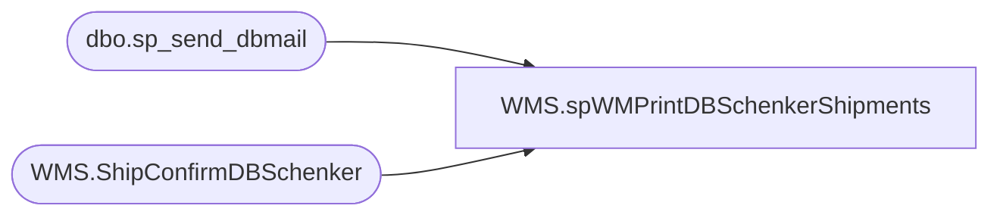

# WMS.spWMPrintDBSchenkerShipments

**Database:** IntegrationStaging  

## Architecture Diagram



## Table Dependencies

| Referenced Table |
|---|
| dbo.sp_send_dbmail |
| WMS.ShipConfirmDBSchenker |

## Stored Procedure Code

```sql
CREATE proc [WMS].[spWMPrintDBSchenkerShipments]
as

-- =====================================================================================================
-- Name: spWMPrintDBSchenkerShipments
--
-- Description:	Captures summary of Canadian shipments to export to DB Schenker system.
--
-- Input: NA
--
-- Output: text file to \\stl-ssis-p-01\IntegrationStaging\DBS
--
-- Dependencies: spWMSelectDBSchenkerShipments
--
-- Revision History
--		Name:			Date:			Comments:
--		Dan Tweedie		07/27/2012		Created proc.	
--		Dan Tweedie		1/30/2015		Added ops@cooperbrostrucking.com to email distribution
--		Tim Callahan	03/02/2018		Added ca.sm.tor.COAST-SHIPMENTS@dbschenker.com to email distribution at request of Santiago Beltran
--		Kelly Farrar	7/18/2019       Moved to IntegrationStaging and updated to use [WMS].[ShipConfirmDBSchenker] 
-- =====================================================================================================


set nocount on

---check for existence of new data to capture
if (object_id('tempdb..#a') is not null) drop table #a
select distinct loadNumber
into #a
from [WMS].[ShipConfirmDBSchenker] scdb (nolock) 
where warehouse in ('9980', '8175')
and datediff(dd, InsertDate, getdate()) = 0
and sentToHA is null

if (select count(*) from #a) > 0

BEGIN
---output csv file
	
	declare @query varchar(1000),
			@date varchar(52),
			@file_name varchar(100),
			@file_location varchar(100),
			@server varchar(20),
			@database varchar(20),
			@bcp varchar(1000)

		set @query = 'exec IntegrationStaging.WMS.spWMSelectDBSchenkerShipments'
		set @file_location = '\\stl-ssis-p-01\IntegrationStaging\DBS\'
		set @file_name = 'DBSexport.' + convert(varchar, datepart(yyyy, getdate())) + convert(varchar, datepart(mm, getdate())) + convert(varchar, datepart(dd, getdate())) + convert(varchar, datepart(hh, getdate())) + convert(varchar, datepart(mi, getdate())) + convert(varchar, datepart(ss, getdate())) + '.CSV'
		set @server = '[stl-ssis-t-01]'
		set @database = 'IntegrationStaging'
--		set @bcp = 'bcp "' + @query + '" queryout "' + @file_location + @file_name + '"  -t"," -T -c -S' + @server 
		set @bcp = 'bcp "' + @query + '" queryout "' + @file_location + @file_name + '"  -t"," -T -c'

	exec master..xp_cmdshell @bcp
	update [WMS].[ShipConfirmDBSchenker] 
	set SentToHA = getdate()
	where warehouse in ('9980', '8175')
	and datediff(dd, InsertDate, getdate()) = 0 
	and loadNumber in (select loadNumber from #a)


declare @attach varchar(1000)
set @attach = @file_location + @file_name

--send email with shipment file attached
EXEC msdb.dbo.sp_send_dbmail
@profile_name = 'biadmin',
--@recipients = 'windsor@dbschenker.com;ca.sm.tor.COAST-SHIPMENTS@dbschenker.com',
--@copy_recipients = 'merchadmin@buildabear.com;larryw@buildabear.com;shauns@buildabear.com;gdockus@halogistics.com;santiagob@buildabear.com;ops@cooperbrostrucking.com',
@recipients = 'dant@buildabear.com',
@subject = 'Build-A-Bear Ohio to Canada Shipment Export to DB Schenker',
@body = 'Please see attached shipment data from Build-A-Bear Workshop.',
@file_attachments = @attach

--move file to history folder
EXEC master..xp_cmdshell 'move \\stl-ssis-p-01\IntegrationStaging\DBS\*.CSV \\stl-ssis-p-01\IntegrationStaging\DBS\Archive'

END
```

