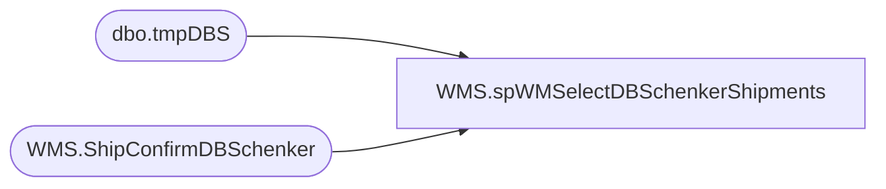

# WMS.spWMSelectDBSchenkerShipments

**Database:** IntegrationStaging  

## Architecture Diagram



## Table Dependencies

| Referenced Table |
|---|
| dbo.tmpDBS |
| WMS.ShipConfirmDBSchenker |

## Stored Procedure Code

```sql
CREATE  proc [WMS].[spWMSelectDBSchenkerShipments]
as

-- =====================================================================================================
-- Name: spWMSelectDBSchenkerShipments
--
-- Description:	Selects summary of Canadian shipments to export to DB Schenker system. 
--
-- Input: NA
--
-- Output: na
--
-- Dependencies: na
--
-- Revision History
--		Name:			Date:			Comments:
--		Dan Tweedie		07/27/2012		Created proc.	
--		Dan Tweedie		10/04/2012		Added Replace string to remove commas from sku_desc
--		Dan Tweedie		08/21/2013		Added filter to exclude international parcel by excluding rec type 66 
--		Dan Tweedie		09/22/2014		Added filter to exclude rec type 62, 63, 33, 34, 35
--		Tim Callahan	07/24/2018		Updated select statement to only select first 7 characters of HTS code
--										This was at request of Santiago Beltran related to the implimentation of D365
--		Dan Tweedie		2019-06-12		Backed up proc and added code to update tmpDUB to set CountryOrOrigin equal to what is derived from Dynamics for supplies
-- =====================================================================================================
set nocount on


if (object_id('tmpDBS') is not null) drop table tmpDBS
select 
	[itemId],
	[itemName],
	[countryOfOrigin],
	[harmonizedCode],
	[quantity],
	[unitPrice],
	[netSalesPrice],
	[loadNumber],
	[warehouse]
into tmpDBS
from [WMS].[ShipConfirmDBSchenker] (nolock) 
where warehouse in ('9980', '8175')
and datediff(dd, InsertDate, getdate()) = 0
And [SentToHA] is null


if (select count(*) from tmpDBS) > 0

BEGIN

	--truncate table tmpDUB

	declare @loads int,
			--@load int
			@load varchar(20)
			
	select @loads = count(distinct loadNumber) from tmpDBS
	
	while @loads > 0
	
	BEGIN
		select @load = max(loadNumber) from tmpDBS
		
		--insert tmpDUB
		select scdb.itemId as itemId, 
			   --scdb.itemName,
			   replace(scdb.itemName, ',', '') as itemName , --ensures no comma
			   scdb.countryOfOrigin as countryOfOrigin,
			   scdb.harmonizedCode as harmonizedCode,
			   scdb.unitPrice as unitPrice, 
			   scdb.quantity as quantity,
				--Case
				--when  scdb.unitPrice = 0 or  scdb.unitPrice like '-%' then cast((.01 * sum( scdb.quantity)) as numeric(15,2)) 
				--else cast((cast(( scdb.unitPrice/ scdb.quantity) as numeric(15,4)) * cast(sum( scdb.quantity) as int))as numeric(15,2)) 
				--end as extended_cost,
				cast(scdb.netSalesPrice as numeric(15,2)) as extended_cost,
			   max(scdb.loadNumber) loadNumber
		from [WMS].[ShipConfirmDBSchenker] scdb (nolock)
		where warehouse in ('9980', '8175')
		and scdb.loadNumber = @load
		
		group by 
			scdb.itemId, 
			scdb.itemName, 
			scdb.countryOfOrigin, 
			scdb.harmonizedCode, 
			scdb.unitPrice, 
			scdb.netSalesPrice,
			scdb.quantity,
			scdb.loadNumber
		order by scdb.itemId
		
		delete from tmpDBS where loadNumber = @load
		select @loads = count(distinct loadNumber) from tmpDBS
		if @loads < 1
			break
		else
			continue
	
	END

	

END
```

