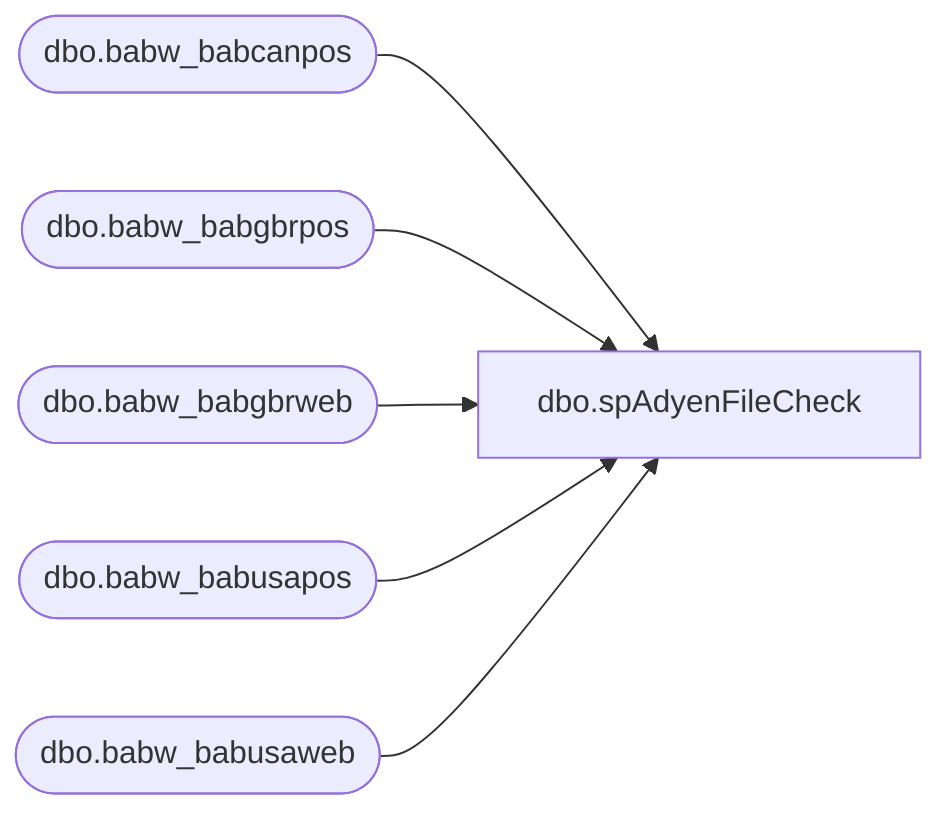

# dbo.spAdyenFileCheck

**Database:** IntegrationStaging  

## Architecture Diagram



## Table Dependencies

| Referenced Table |
|---|
| dbo.babw_babcanpos |
| dbo.babw_babgbrpos |
| dbo.babw_babgbrweb |
| dbo.babw_babusapos |
| dbo.babw_babusaweb |

## Stored Procedure Code

```sql
CREATE PROCEDURE [dbo].[spAdyenFileCheck] 
	@merchant varchar(80),
    @batch integer

AS
-- =============================================================================================================
--      Ian Wallace		20230129		checks if file has already been delivered to Dynamics
-- =============================================================================================================

declare @filename nvarchar(80)
declare @result integer


if @merchant = 'BABCANPOS'
BEGIN
set @filename = (select D365filename as varFileLoaded from [dbo].[babw_babcanpos] where Batch_Number = @batch)
END

if @merchant = 'BABGBRPOS'
BEGIN
set @filename = (select D365filename as varFileLoaded from [dbo].[babw_babgbrpos] where Batch_Number = @batch)
END

if @merchant = 'BABGBRWEB'
BEGIN
set @filename = (select D365filename as varFileLoaded from [dbo].[babw_babgbrweb] where Batch_Number = @batch)
END

IF @merchant = 'BABUSAPOS'  
BEGIN
set @filename = (select D365filename as varFileLoaded from [dbo].[babw_babusapos] where Batch_Number = @batch)
END

if @merchant = 'BABUSAWEB'
BEGIN
set @filename = (select D365filename as varFileLoaded from [dbo].[babw_babusaweb] where Batch_Number = @batch)
END

if @filename is null 
BEGIN
set @result = 0
END

if @filename is not null
BEGIN
set @result = 1
END

--return @result
select @result as 'varFileLoaded'
```

