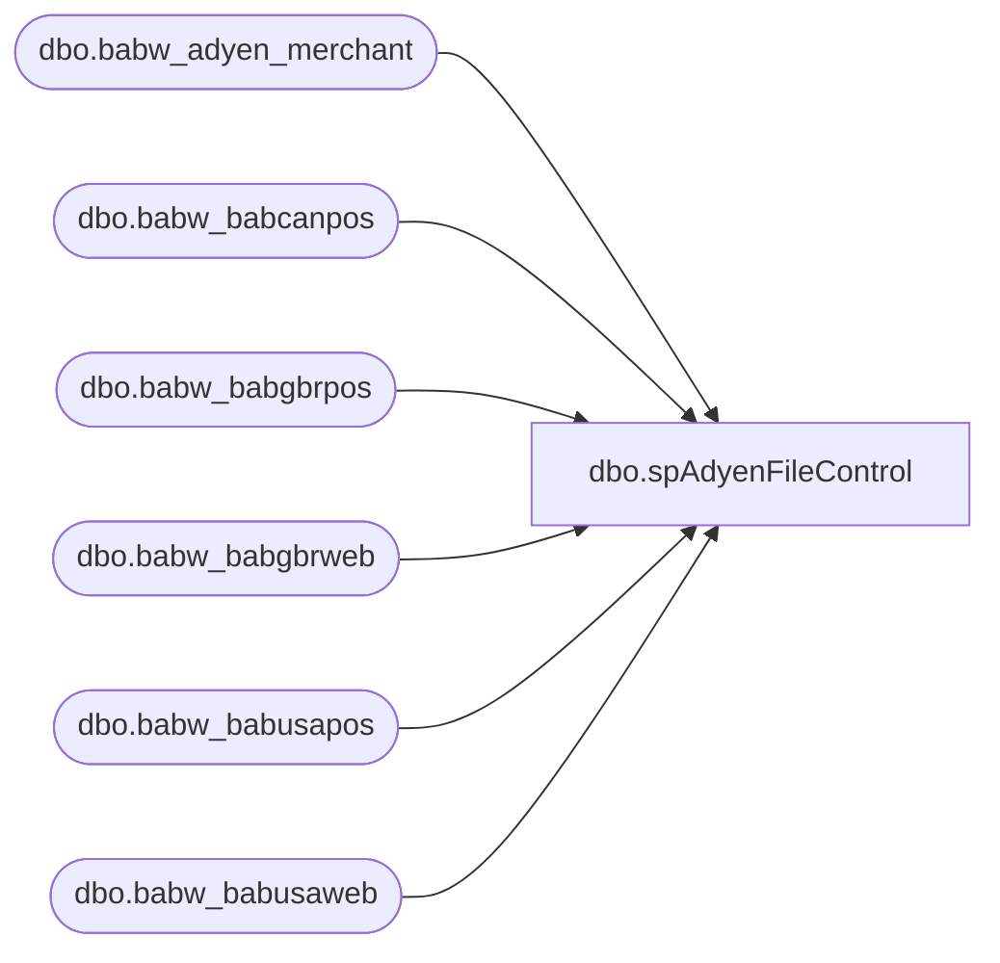

# dbo.spAdyenFileControl

**Database:** IntegrationStaging  

## Architecture Diagram



## Table Dependencies

| Referenced Table |
|---|
| dbo.babw_adyen_merchant |
| dbo.babw_babcanpos |
| dbo.babw_babgbrpos |
| dbo.babw_babgbrweb |
| dbo.babw_babusapos |
| dbo.babw_babusaweb |

## Stored Procedure Code

```sql
CREATE PROCEDURE [dbo].[spAdyenFileControl] 
	@merchant varchar(80),
    @batch integer,
	@filename varchar(80)

AS
-- =============================================================================================================
--      Ian Wallace		20230129		checks if file has already been delivered to Dynamics
-- =============================================================================================================


if @merchant = 'BABCANPOS'
BEGIN
update  [dbo].[babw_adyen_merchant] set lastBatchNum = @batch where MerchantAccount = 'BABCANPOS'
INSERT INTO [dbo].[babw_babcanpos]  ([Batch_Number],[D365filename]) VALUES (@batch, @filename)
END

if @merchant = 'BABGBRPOS'
BEGIN
update  [dbo].[babw_adyen_merchant] set lastBatchNum = @batch where MerchantAccount = 'BABGBRPOS'
INSERT INTO [dbo].[babw_babgbrpos] ([Batch_Number],[D365filename]) VALUES (@batch, @filename)
END

if @merchant = 'BABGBRWEB'
BEGIN
update  [dbo].[babw_adyen_merchant] set lastBatchNum = @batch where MerchantAccount = 'BABGBRWEB'
INSERT INTO [dbo].[babw_babgbrweb] ([Batch_Number],[D365filename]) VALUES (@batch, @filename)
END

IF @merchant = 'BABUSAPOS'  
BEGIN
update  [dbo].[babw_adyen_merchant] set lastBatchNum = @batch where MerchantAccount = 'BABUSAPOS' 
INSERT INTO [dbo].[babw_babusapos] ([Batch_Number],[D365filename]) VALUES (@batch, @filename)
END

if @merchant = 'BABUSAWEB'
BEGIN
update  [dbo].[babw_adyen_merchant] set lastBatchNum = @batch where MerchantAccount = 'BABUSAWEB'
INSERT INTO [dbo].[babw_babusaweb] ([Batch_Number],[D365filename]) VALUES (@batch, @filename)
END
```

