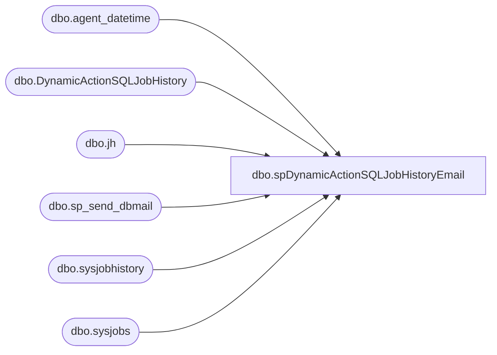

# dbo.spDynamicActionSQLJobHistoryEmail

**Database:** IntegrationStaging  

## Architecture Diagram



## Table Dependencies

| Referenced Table |
|---|
| dbo.agent_datetime |
| dbo.DynamicActionSQLJobHistory |
| dbo.jh |
| dbo.sp_send_dbmail |
| dbo.sysjobhistory |
| dbo.sysjobs |

## Stored Procedure Code

```sql
CREATE proc [dbo].[spDynamicActionSQLJobHistoryEmail]

as

set nocount on

if (select count(*) from DynamicActionSQLJobHistory where datediff(dd, InsertDate, getdate()) <> 0) > 0
	begin

		delete from DynamicActionSQLJobHistory 
		where datediff(dd, InsertDate, getdate()) <> 0
	end


IF (Object_ID('tempdb..#DynamicActionSQLJobHistory') IS NOT NULL) DROP TABLE #DynamicActionSQLJobHistory

;
with 
ServerJobs as
	(
		
		select 'STL-SSIS-P-01' as servername, name, job_id 
		from [STL-SSIS-P-01].msdb.dbo.sysjobs
	
	),
JOBS as
	(
		select 
			servername,
			name, 
			job_id,
			case 
				when name in 
					(
						'WEB_OMSCustomOrderExportETL', 
						'WebDemandTrackingETL'
						
						
					) then 'Deck Data Extract' 
				when name in
					(
						'WEB - DynamicAction_StockInventory', -- runs wms_inventorySync and update web inventory fact web only
						'WEB - DynamicAction_ExternalSales',
						'WEB - DynamicActionProductProperties',
						'WEB - DynamicAction_ProductAttributes',
						'WEB - DynamicActionSellingInventoryLocation',
						'WEB - DynamicActionOrderHeaderAndLines'
					) then 'File Export and Upload'
				
				end as 'DataSet'
				
		from Serverjobs
	)

select 
	j.servername as server,
	j.name as 'JobName',
	cast(msdb.dbo.agent_datetime(run_date, run_time) as datetime)  as 'RealRunDateTime',
	convert(varchar, msdb.dbo.agent_datetime(run_date, run_time), 100)  as 'RunDateTime',
	((run_duration/10000*3600 + (run_duration/100)%100*60 + run_duration%100 + 31 ) / 60) 
         as 'RunDurationMinutes',
	case h.run_status
		when 0 then 'Failed'
		when 1 then 'Succeeded'
		when 2 then 'Retry'
		when 3 then 'Canceled'
		when NULL then 'No History'
	end as Run_Status,
	j.DataSet
into #DynamicActionSQLJobHistory
From JOBS j
left join [STL-SSIS-P-01].msdb.dbo.sysjobhistory h 
	on j.job_id = h.job_id 
	and h.step_id = 0 --job outcome
	and 
		(
			( --jobs ran yesterday on/after 5pm
				datediff(dd, msdb.dbo.agent_datetime(h.run_date, h.run_time), getdate()-1) = 0
				and datepart(hh, msdb.dbo.agent_datetime(run_date, run_time)) > 16
			) -- or jobs ran today
			or datediff(dd, msdb.dbo.agent_datetime(h.run_date, h.run_time), getdate()) = 0
		)
where j.servername = 'STL-SSIS-P-01'
and j.DataSet in 
	(
		'Deck Data Extract',
		'File Export and Upload'
	)


----===================================================================

	;
	with 
	MaxDate as
		(
			select [server], JobName, max(RealRunDateTime) RealRunDateTime
			from #DynamicActionSQLJobHistory
			group by server, JobName
		)
	delete jh
	from #DynamicActionSQLJobHistory jh
	join MaxDate md 
		on jh.[server]=md.[server] 
		and jh.JobName=md.JobName 
		and jh.RealRunDateTime<>md.RealRunDateTime
	;

-----
	;
	merge into DynamicActionSQLJobHistory as target 
	using #DynamicActionSQLJobHistory as source
		on 
			target.[Server]=source.[server]
			and 
			target.JobName=source.JobName
			and 
			target.DataSet=source.DataSet
	when matched 
		and
			isnull(target.Run_Status,'x') <> 'Succeeded'
			--and 	
			--(
			--	isnull(target.RunDateTime,convert(varchar, getdate(), 100))<>isnull(source.RunDateTime,convert(varchar, getdate(), 100))
			--	OR
			--	isnull(target.Run_Status,'x')<>isnull(source.Run_Status,'x')
			--)
	then update
		set 
			target.RunDateTime=source.RunDateTime,
			target.RunDurationMinutes=source.RunDurationMinutes,
			target.Run_Status=source.Run_Status,
			target.UpdateDate=getdate()
	when not matched by target
	then insert
		(
			[Server],
			JobName,
			DataSet,
			RunDateTime,
			RunDurationMinutes,
			Run_Status,
			InsertDate
		)
		values
		(
			source.[Server],
			source.JobName,
			source.DataSet,
			source.RunDateTime,
			source.RunDurationMinutes,
			source.Run_Status,
			getdate()
		)
	;
----

;
	with Succeeded as
		(
			select JobName, cast(RunDateTime as datetime) as RunDateTime 
			from DynamicActionSQLJobHistory
			where run_status = 'Succeeded'
		)
	delete t
	from DynamicActionSQLJobHistory t
	join Succeeded s on t.JobName = s.JobName 
	where t.run_status <> 'Succeeded' 
	and cast(t.RunDateTime as datetime) < s.RunDateTime 
;
--=====================================================================================================================================
--=====================================================================================================================================

if (select count(*) from DynamicActionSQLJobHistory) > 0
BEGIN
	
			Declare @Recip varchar(100),
					@text nvarchar(max),
					@DeckExtract varchar(4),
					@FileExport varchar(4),
					@SequenceCheck varchar(4),
					@Subj varchar(100)
	
		
		
 
			if (
					select count(*) from DynamicActionSQLJobHistory j
						where j.DataSet = 'Deck Data Extract'
							and 
							(
								(
									(j.Run_Status <> 'Succeeded' or j.Run_Status is NULL) 
										and
									j.JobName not in (select jj.JobName from DynamicActionSQLJobHistory jj where jj.DataSet = 'Deck Data Extract' and jj.Run_Status = 'Succeeded' and jj.RunDateTime > j.RunDateTime ) --in case we ran the job again after it failed
								) 

							)
				) > 0 
		
				set @DeckExtract = 'Fail' else set @DeckExtract = 'Pass'

			if (
					select count(*) from DynamicActionSQLJobHistory j
						where j.DataSet = 'File Export and Upload' 
							and (
								(
									(j.Run_Status <> 'Succeeded' or j.Run_Status is NULL) 
										and
									j.JobName not in (select jj.JobName from DynamicActionSQLJobHistory jj where jj.DataSet = 'File Export and Upload' and jj.Run_Status = 'Succeeded' and jj.RunDateTime > j.RunDateTime )--in case we ran the job again after it failed
								)
								)
				) > 0
				set @FileExport = 'Fail' else set @FileExport = 'Pass'

			

			set @text = '<H1><font face =arial> Dynamic Action Critical Job Status </font> </H1>' +
				'<font face =arial size = 2> These jobs are critical to our Dynamic Action environment and must run successfully each morning.' +
				'<br> 
				</font><br><br>' +
				'<br>' + 
				'<font face =arial size = 2> <b> SUMMARY </b> </font>' +
				'<br>' +
				'<table border="1">' +
				'<font face =arial size = 2>' + 
				'<tr><th>DATASET</th><th>PASS / FAIL</th></tr>' +
				CAST ( ( SELECT distinct
								td = jh.Dataset,'',
								td = case jh.DataSet 
									when 'Deck Data Extract' then @DeckExtract
									when 'File Export and Upload' then @FileExport
								end, ''
							from DynamicActionSQLJobHistory jh
							--left join #PassFail pf on jh.DataSet = pf.DataSet and jh.JobName = pf.JobName
							group by jh.DataSet--, pf.condition
							order by jh.Dataset
						  FOR XML PATH('tr'), TYPE 
				) AS NVARCHAR(MAX) ) +
				'</font></table>
				<br>'
				+
				'<font face =arial size = 2> <b> Deck Data Extract </b> </font>' +
				'<br>' +
				'<table border="1">' +
				'<font face =arial size = 2>' + 
				'<tr><th>SERVER</th><th>JOB NAME</th><th>DATETIME</th><th>DURATION</th><th>STATUS</th></tr>' +
				CAST ( ( SELECT td = server,'',
								td = jobName, '',
								td = isnull(RunDateTime, 0), '',
								td = isnull(RunDurationMinutes, ''), '',
								td = Run_Status, ''
						  from DynamicActionSQLJobHistory
						  where DataSet = 'Deck Data Extract'
						  order by RunDateTime
						  FOR XML PATH('tr'), TYPE 
				) AS NVARCHAR(MAX) ) +
				'</font></table>
				<br>' +
				'<font face =arial size = 2> <b> File Export and Upload </b> </font>' +
				'<br>' +
				'<table border="1">' +
				'<font face =arial size = 2>' + 
				'<tr><th>SERVER</th><th>JOB NAME</th><th>DATETIME</th><th>DURATION</th><th>STATUS</th></tr>' +
				CAST ( ( SELECT td = server,'',
								td = jobName, '',
								td = isnull(RunDateTime, 0), '',
								td = isnull(RunDurationMinutes, ''), '',
								td = Run_Status, ''
						  from DynamicActionSQLJobHistory
						  where DataSet = 'File Export and Upload'
						  order by RunDateTime
						  FOR XML PATH('tr'), TYPE 
				) AS NVARCHAR(MAX) ) +
				'</font></table>
				<br>' +
				'<br>
				<font face =arial size = 2>This report was generated by stl-ssis-p-01.IntegrationStaging.dbo.spDynamicActionSQLJobHistoryEmail, which was executed from STL-SSIS-P-01 SQL Agent: WEB - DYNAMIC ACTION - CRITICAL JOB CHECK.</font>
				<br>
				<br>'

			if 
					@DeckExtract = 'Fail'
					or
					@FileExport = 'Fail' 
					
				select 
					@subj = 'Dynamic Action Critical Job Status: Fail',
					@Recip = 'BIAdminTextAlert@buildabear.com'
			else

				select 
					@subj = 'Dynamic Action Critical Job Status: Pass',
					@Recip = 'biadmin@buildabear.com'
		
	
			exec msdb.dbo.sp_send_dbmail
				@profile_name = 'biadmin',
				@recipients = @Recip, 
				@body = @text,
				@subject = @subj,
				@body_format = 'HTML'


		
END
```

