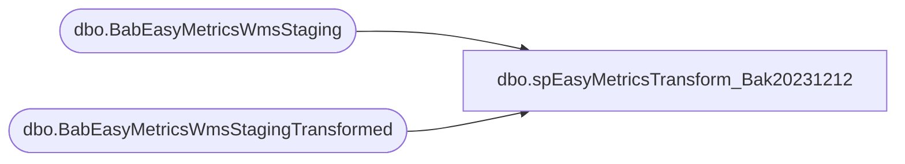

# dbo.spEasyMetricsTransform_Bak20231212

**Database:** IntegrationStaging  

## Architecture Diagram



## Table Dependencies

| Referenced Table |
|---|
| dbo.BabEasyMetricsWmsStaging |
| dbo.BabEasyMetricsWmsStagingTransformed |

## Stored Procedure Code

```sql
CREATE proc [dbo].[spEasyMetricsTransform_Bak20231212]

as


set nocount on 

truncate table BabEasyMetricsWmsStagingTransformed

-- Build Ranges Tables 
IF OBJECT_ID(N'tempdb..#Ranges') IS NOT NULL
DROP TABLE #Ranges
select 
e.WorkId, 
e.WorkType, 
e.WorkClassId, 
min (e.LineNum) as StartingLineNumber, 
max (e.LineNum) as EndingLineNumber
into #Ranges
from BabEasyMetricsWmsStaging e
where 1=1
and e.WorkType in ('Pick','Put')
group by 
e.WorkId, 
e.WorkType, 
e.WorkClassId
order by min (e.LineNum)

-- Create Mapped Table for All Details 
IF OBJECT_ID(N'tempdb..#AllDetails') IS NOT NULL
DROP TABLE #AllDetails
select 
r.StartingLineNumber, 
r.EndingLineNumber, 
rank() over (Partition by e.WorkId , e.WorkType, e.workClassId order by e.LineNum) as JoinKey,
e.CUBE as'Cube',
e.LEVEL as'Level',
e.LOCTYPE as'StartEndLocationType',
e.UNITID as'QuantityUOM',
e.WEIGHT as'Weight',
e.ProcessType as'ProcessType',
e.WHSWORKTABLE_INVENTSITEID as'Site',
e.WHSWORKTABLE_INVENTLOCATIONID as'Facility',
e.WHSWORKTABLE_CONTAINERID as'CaseId',
e.WHSWORKTABLE_TARGETLICENSEPLATEID as'PalletLpId',
e.WORKTYPE as'Directionality',
e.USERID as'Employee',
e.WORKCLOSEDUTCDATETIME as'StartDateTime',
--e.Calculated as'EndDateTime',
e.WorkClosedUTCDateTime as EndDateTime,
e.QTYWORK as'Units',
e.UNITID as'HandlingMetric',
e.WORKCLOSEDUTCDATETIME as'Timestamp',
e.ORDERNUM as'OrderNumber',
e.ITEMID as'Sku',
e.INVENTQTYWORK as'Quantity',
e.WMSLOCATIONID as'StartLocation',
--e.Calculated as'EndLocation',
e.WMSLocationId as EndLocation, 
e.ZONEID as'StartZone',
e.WORKCLASSID as'EquipmentType',
e.WHSWORKTABLE_WORKID as'TransactionId',
e.LINENUM as'TransactionSequence',
'NA' as'WorklineStatus',
e.WORKCLASSID as'WorkClass',
e.LOCPROFILEID as'StartLocationProfile',
--e.Calculated as'EndLocationProfile',
e.LocProfileId as 'EndLocationProfile',
e.WORKTEMPLATECODE as'WorkTemplate',
--e.Calculated as'EndZone',
e.ZoneId as EndZone,
e.WORKMANUALLYCOMPLETEDBY as'WorkManuallyCompletedBy',
e.ACCOUNTNUM as'CustomerAccount',
e.STATE as'OrderDeliveryState',
e.INVENTLOCATIONIDFROM as'FromWarehouse'
into #AllDetails
from BabEasyMetricsWmsStaging e
join #Ranges r on r.WorkId=e.WorkId and r.WorkType=e.WorkType and r.WorkClassId=e.WorkClassId
where 1=1
and e.WorkType in ('Pick','Put')
order by e.WorkId, e.LineNum

-- Create Pick Details Table 
IF OBJECT_ID(N'tempdb..#PickDetails') IS NOT NULL
DROP TABLE #PickDetails
select
StartingLineNumber, 
EndingLineNumber, 
a.JoinKey, 
a.Cube, 
a.Level, 
a.StartEndLocationType, 
a.QuantityUOM, 
a.Weight, 
a.ProcessType, 
a.Site, 
a.Facility, 
a.CaseId, 
a.PalletLpId, 
a.Directionality, 
a.Employee, 
a.StartDateTime, 
--a.EndDateTime,  --Only want this from the Put Details 
a.Units, 
a.HandlingMetric, 
a.Timestamp, 
a.OrderNumber, 
a.Sku, 
a.Quantity, 
a.StartLocation, 
--a.EndLocation, --Only want this from the Put Details 
a.StartZone, 
a.EquipmentType, 
a.TransactionId, 
a.TransactionSequence, 
a.WorklineStatus, 
a.WorkClass, 
a.StartLocationProfile, 
--a.EndLocationProfile, --Only want this from the Put Details 
a.WorkTemplate, 
--a.EndZone, --Only want this from the Put Details 
a.WorkManuallyCompletedBy, 
a.CustomerAccount, 
a.OrderDeliveryState, 
a.FromWarehouse
into #PickDetails
from #AllDetails a 
where 1=1
and a.Directionality = 'Pick'


-- Create Put Details Table 
IF OBJECT_ID(N'tempdb..#PutDetails') IS NOT NULL
DROP TABLE #PutDetails
select 
StartingLineNumber, 
EndingLineNumber, 
a.JoinKey,
a.TransactionId, 
a.EndDateTime, 
a.EndLocation, 
a.EndLocationProfile, 
a.EndZone, 
a.TransactionSequence as PutTransactionSequence, 
a.WorkClass
into #PutDetails
from #AllDetails a
where 1=1
and a.Directionality = 'Put'

-- Create Min Put Details Table 
IF OBJECT_ID(N'tempdb..#MinPutDetails') IS NOT NULL
DROP TABLE #MinPutDetails
select 
pd.TransactionId, 
pd.EndDateTime, 
pd.EndLocation, 
pd.EndLocationProfile, 
pd.EndZone, 
pd.WorkClass,
min (pd.PutTransactionSequence) as PutLine
into #MinPutDetails
from #PutDetails pd
group by 
pd.TransactionId, 
pd.EndDateTime, 
pd.EndLocation, 
pd.EndLocationProfile, 
pd.EndZone, 
pd.WorkClass


IF OBJECT_ID(N'tempdb..#Summary1') IS NOT NULL
DROP TABLE #Summary1
select
pid.EndingLineNumber, 
pud.EndingLineNumber as PutEndingLingNumber, 
pid.JoinKey, 
pud.JoinKey as PutJoinKey, 
pid.Cube, 
pid.Level, 
pid.StartEndLocationType, 
pid.QuantityUOM, 
pid.Weight, 
pid.ProcessType, 
pid.Site, 
pid.Facility, 
pid.CaseId, 
pid.PalletLpId, 
pid.Directionality, 
pid.Employee, 
pid.StartDateTime, 
pud.EndDateTime,  --Only want this from the Put Details 
pid.Units, 
pid.HandlingMetric, 
pid.Timestamp, 
pid.OrderNumber, 
pid.Sku, 
pid.Quantity, 
pid.StartLocation, 
pud.EndLocation, --Only want this from the Put Details 
pid.StartZone, 
pid.EquipmentType, 
pid.TransactionId, 
pid.TransactionSequence, 
pud.PutTransactionSequence,
pid.WorklineStatus, 
pid.WorkClass, 
pid.StartLocationProfile, 
pud.EndLocationProfile, --Only want this from the Put Details 
pid.WorkTemplate, 
pud.EndZone, --Only want this from the Put Details 
pid.WorkManuallyCompletedBy, 
pid.CustomerAccount, 
pid.OrderDeliveryState, 
pid.FromWarehouse
into #Summary1
from #PickDetails pid 
left join #PutDetails pud on pud.TransactionId=pid.TransactionId
							and pid.WorkClass=pud.WorkClass
							and pid.TransactionSequence <> pud.PutTransactionSequence
							and pid.JoinKey = pud.JoinKey							
							--and pid.StartLocation <> pud.EndLocation

IF OBJECT_ID(N'tempdb..#Summary2') IS NOT NULL
DROP TABLE #Summary2
select
s.EndingLineNumber, 
s.JoinKey, 
s.PutJoinKey, 
s.Cube, 
s.Level, 
s.StartEndLocationType, 
s.QuantityUOM, 
s.Weight, 
s.ProcessType, 
s.Site, 
s.Facility, 
s.CaseId, 
s.PalletLpId, 
s.Directionality, 
s.Employee, 
s.StartDateTime, 
isnull(s.EndDateTime, mpd.EndDateTime) as EndDateTime, 
s.Units, 
s.HandlingMetric, 
s.Timestamp, 
s.OrderNumber, 
s.Sku, 
s.Quantity, 
s.StartLocation, 
isnull(s.EndLocation, mpd.EndLocation) as EndLocation, 
s.StartZone, 
s.EquipmentType, 
s.TransactionId, 
s.TransactionSequence, 
s.WorklineStatus, 
s.WorkClass, 
s.StartLocationProfile, 
isnull(s.EndLocationProfile, mpd.EndLocationProfile) as EndLocationProfile, 
s.WorkTemplate, 
isnull(s.EndZone, mpd.EndZone) as EndZone, 
s.WorkManuallyCompletedBy, 
s.CustomerAccount, 
s.OrderDeliveryState, 
s.FromWarehouse
into #Summary2
from #Summary1 s
join #MinPutDetails mpd on mpd.TransactionId = s.TransactionId			
			and s.WorkClass = mpd.WorkClass
where 1=1 


-- Final Cleanup 
IF OBJECT_ID(N'tempdb..#Summary3') IS NOT NULL
DROP TABLE #Summary3
select
EndingLineNumber, 
JoinKey, 
PutJoinKey, 
Cube, 
Level, 
StartEndLocationType, 
QuantityUOM, 
Weight, 
ProcessType, 
Site, 
Facility, 
CaseId, 
PalletLpId, 
Directionality, 
Employee, 
StartDateTime, 
EndDateTime, 
Units, 
HandlingMetric, 
Timestamp, 
OrderNumber, 
Sku, 
Quantity, 
StartLocation, 
EndLocation, 
StartZone, 
EquipmentType, 
TransactionId, 
TransactionSequence, 
WorklineStatus, 
WorkClass, 
StartLocationProfile, 
EndLocationProfile, 
WorkTemplate, 
EndZone, 
WorkManuallyCompletedBy, 
CustomerAccount, 
OrderDeliveryState, 
FromWarehouse
into #Summary3
from #Summary2 s
group by 
EndingLineNumber, 
JoinKey, 
PutJoinKey, 
[Cube], 
Level, 
StartEndLocationType, 
QuantityUOM, 
Weight, 
ProcessType, 
Site, 
Facility, 
CaseId, 
PalletLpId, 
Directionality, 
Employee, 
StartDateTime, 
EndDateTime, 
Units, 
HandlingMetric, 
Timestamp, 
OrderNumber, 
Sku, 
Quantity, 
StartLocation, 
EndLocation, 
StartZone, 
EquipmentType, 
TransactionId, 
TransactionSequence, 
WorklineStatus, 
WorkClass, 
StartLocationProfile, 
EndLocationProfile, 
WorkTemplate, 
EndZone, 
WorkManuallyCompletedBy, 
CustomerAccount, 
OrderDeliveryState, 
FromWarehouse

-- Final Step 
Insert into BabEasyMetricsWmsStagingTransformed
select
s.[Cube], 
s.[Level], 
s.StartEndLocationType, 
s.QuantityUOM, 
s.[Weight], 
s.ProcessType, 
s.[Site], 
s.Facility, 
s.CaseId, 
s.PalletLpId, 
s.Directionality, 
s.Employee, 
s.StartDateTime, 
s.EndDateTime, 
s.Units, 
s.HandlingMetric, 
s.[Timestamp], 
s.OrderNumber, 
s.Sku, 
s.Quantity, 
s.StartLocation, 
s.EndLocation, 
s.StartZone, 
s.EquipmentType, 
s.TransactionId, 
s.TransactionSequence, 
s.WorklineStatus, 
s.WorkClass, 
s.StartLocationProfile, 
s.EndLocationProfile, 
s.WorkTemplate, 
s.EndZone, 
s.WorkManuallyCompletedBy, 
s.CustomerAccount, 
s.OrderDeliveryState, 
s.FromWarehouse
from #Summary3 s
where 1=1
order by s.TransactionId, s.TransactionSequence


dbo,spEmailExchangeRateDailyStatus,-- =============================================
-- Author:		<Author,,Name>
-- Create date: <Create Date,,>
-- Description:	<Description,,>
-- =============================================
CREATE PROCEDURE spEmailExchangeRateDailyStatus
	
AS
BEGIN
	
	SET NOCOUNT ON;

 
DECLARE @BR TABLE(effective_from_date datetime,effective_to_date datetime,[currency_conversion_type] int,to_currency_id int,currency_code varchar(4),exchange_rate decimal(10,6))
DECLARE @PM TABLE (to_currency_code varchar(4),to_currency_ID int,actual_date datetime,bbw_rate decimal(10,6),fiscal_month_ave_rate decimal(10,6))

INSERT INTO @BR (effective_from_date,effective_to_date ,[currency_conversion_type],to_currency_id ,currency_code,exchange_rate)
SELECT cc.effective_from_date AS [br.fromDate],cc.effective_to_date,cc.[currency_conversion_type],cc.to_currency_id,c.currency_code,cc.exchange_rate
FROM [BEDROCKTESTDB02].[me_01].[dbo].[currency_conversion] cc
LEFT JOIN [BEDROCKTESTDB02].[me_01].[dbo].[currency] c ON cc.to_currency_id = c.currency_id
WHERE cc.from_currency_id = 1 AND cc.currency_conversion_type = 1 and cc.effective_from_date > getdate()-2 and c.currency_code = 'CAD'
	
INSERT INTO @PM (to_currency_code,to_currency_ID,actual_date,bbw_rate ,fiscal_month_ave_rate)
SELECT to_currency_code AS [pm.ToCurrency],CASE WHEN to_currency_code = 'USD' THEN 1 WHEN to_currency_code = 'CAD' THEN 2 WHEN to_currency_code = 'GBP' THEN 3
WHEN to_currency_code = 'CNY' THEN 9 WHEN to_currency_code = 'DKK' THEN 8 WHEN to_currency_code = 'EUR' THEN 5 END	AS to_currency_ID
,actual_date, cast(1/bbw_rate as decimal(10,6)) as "bbw_rate" ,cast(1/fiscal_month_ave_rate as decimal(10,6)) as "fiscal_month_ave_rate" 
FROM Papamart.dw.dbo.exchange_rate_facts WHERE from_currency_code = 'USD' and to_currency_code IN ('CAD') and actual_date >  getdate()-2

IF (Object_ID('tempdb..##xResult') IS NOT NULL) DROP TABLE ##xResult

SELECT br.effective_from_date AS [br.effective_from_date],br.effective_to_date AS [br.effective_to_date],br.currency_code AS [br.currency_code]
,br.exchange_rate AS [br.exchange_rate],pm.actual_date AS [pm.actual_date],pm.to_currency_code AS [pm.to_currency_code],pm.bbw_rate AS [pm.bbw_rate]
,CASE WHEN br.exchange_rate = pm.bbw_rate THEN 'PASS' ELSE 'FAIL' END AS "Result"
 into ##xResult
FROM @BR br 
LEFT JOIN @PM pm ON CONVERT(VARCHAR(10), br.effective_from_date, 101) = DATEADD(day, 1,convert(varchar,pm.actual_date,101)) AND br.to_currency_id = pm.to_currency_ID
WHERE pm.to_currency_code = 'CAD' --ORDER BY 1 desc, 3


DECLARE @recipients VARCHAR(100),
	  @copy_recipients VARCHAR(100)
	  SET @recipients = 'ianw@buildabear.com'
		
if (select Result from ##xResult) = 'PASS'
begin 
EXEC msdb.dbo.sp_send_dbmail
@profile_name = 'BIAdmin',
@recipients=@recipients,
@body='exchange rate morning result',
@subject = 'daily xRate validation ~ pass',
@query = 'SELECT * from ##xResult',
@attach_query_result_as_file = 1,
@query_attachment_filename ='results3.xls'
end

if (select Result from ##xResult) = 'FAIL'
begin 
EXEC msdb.dbo.sp_send_dbmail
@profile_name = 'BIAdmin',
@recipients=@recipients,
@body='exchange rate morning result',
@subject = 'daily xRate validation ~ FAIL',
@query = 'SELECT * from ##xResult',
@attach_query_result_as_file = 1,
@query_attachment_filename ='results3.xls',
@importance= 'HIGH'
end
END

dbo,spEmailSQLAgentJobCompletion,CREATE proc spEmailSQLAgentJobCompletion
	@ProcessName varchar(1000),
	@SQLAgent varchar(100),
	@Recipients varchar(1000)

as

-------------------------------------------------------------------------------------------------
-------------------------------------------------------------------------------------------------
--2017-07-11   Dan Tweedie -- Created proc to be reused for SQL Agent job completion emails.
--  Proc can be called like this:
											--exec spEmailSQLAgentJobCompletion 
											--@ProcessName = 'Web Product Catalog Exports', 
											--@SQLAgent = 'WebProductCatalogExports',
											--@Recipients = 'BIAdmin@buildabear.com'
-------------------------------------------------------------------------------------------------
-------------------------------------------------------------------------------------------------

set nocount on


declare
	@Statement varchar(4000),
	@Subject varchar(1000)

select 
	@Statement = '
<font face=arial size=2> '  +
	'The <b>' + @ProcessName + '</b> process has completed.' +
    '<br><br>This process runs SQL Agent Job on STL-SSIS-P-01: ' + @SQLAgent + 
    '</font>',
	@Subject = 'Process Completion Notice:  --->  ' + @ProcessName 
    
   
exec msdb.dbo.sp_send_dbmail
	@profile_name = 'BIAdmin',
    @recipients = @Recipients,
    @body = @Statement,
	@subject = @Subject,
	@body_format = 'HTML'
```

