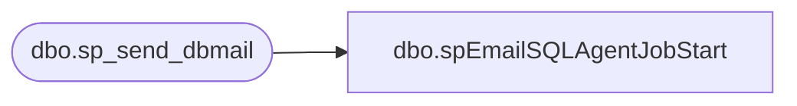

# dbo.spEmailSQLAgentJobStart

**Database:** IntegrationStaging  

## Architecture Diagram



## Table Dependencies

| Referenced Table |
|---|
| dbo.sp_send_dbmail |

## Stored Procedure Code

```sql
CREATE proc [dbo].[spEmailSQLAgentJobStart]
	@ProcessName varchar(1000),
	@SQLAgent varchar(100),
	@Recipients varchar(1000)

as

-------------------------------------------------------------------------------------------------
-------------------------------------------------------------------------------------------------
--2017-07-11   Dan Tweedie -- Created proc to be reused for SQL Agent job completion emails.
--  Proc can be called like this:
											--exec spEmailSQLAgentJobCompletion 
											--@ProcessName = 'Web Product Catalog Exports', 
											--@SQLAgent = 'WebProductCatalogExports',
											--@Recipients = 'BIAdmin@buildabear.com'
-------------------------------------------------------------------------------------------------
-------------------------------------------------------------------------------------------------

set nocount on


declare
	@Statement varchar(4000),
	@Subject varchar(1000)

select 
	@Statement = '
<font face=arial size=2> '  +
	'The <b>' + @ProcessName + '</b> process has started.' +
    '<br><br>This process runs SQL Agent Job on STL-SSIS-P-01: ' + @SQLAgent + 
    '</font>',
	@Subject = 'Process Start Notice:  --->  ' + @ProcessName 
    
   
exec msdb.dbo.sp_send_dbmail
	@profile_name = 'BIAdmin',
    @recipients = @Recipients,
    @body = @Statement,
	@subject = @Subject,
	@body_format = 'HTML'

dbo,spEmailStoreforceStoresNotConnected,CREATE proc [dbo].[spEmailStoreforceStoresNotConnected] 
as

set nocount on

if (select count(store_id) from IntegrationStaging.dbo.HangingSQLConnectionCheck_StoresNotConnected) > 0

begin
		declare @text nvarchar(max)


		set @text = '
		<font face =arial size = 2> '  +
			'</b>The following stores were excluded from the Storeforce feed due to being unable to connect to the store database.' +
			'<table border="1">' +
			'<tr><th>Store</th></tr>' +
    
			CAST ( ( SELECT td = store_id,''
					  from IntegrationStaging.dbo.HangingSQLConnectionCheck_StoresNotConnected 
					  group by store_id 
					  order by store_id
					  FOR XML PATH('tr'), TYPE 
			) AS NVARCHAR(MAX) ) +
			'</font></table></font></p></p><br>'
    
	declare @count int, @subj nvarchar(1000)
	select @count= count(*) from IntegrationStaging.dbo.HangingSQLConnectionCheck_StoresNotConnected 
   
   select @subj='Storeforce Stores Offline / Not Included: ' + cast(@count as varchar)

		exec msdb.dbo.sp_send_dbmail
			@profile_name = 'biadmin',
			@recipients = 'biadmin@buildabear.com',
			@body = @text,
			@subject = @subj,
			@body_format = 'HTML'
end
```

