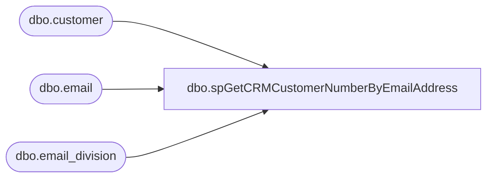

# dbo.spGetCRMCustomerNumberByEmailAddress

**Database:** IntegrationStaging  

## Architecture Diagram



## Table Dependencies

| Referenced Table |
|---|
| dbo.customer |
| dbo.email |
| dbo.email_division |

## Stored Procedure Code

```sql
CREATE PROCEDURE [dbo].[spGetCRMCustomerNumberByEmailAddress]
	@EmailAddress VARCHAR(100)

-- =============================================================================================================
-- Name: spGetCRMCustomerNumberByEmailAddress
--
-- Description:	Get CRM Customer Number by Email Address
--	
-- Output: CRM Customer Number
--	
-- Available actions:
--	
-- Dependencies: 
--		[crm].[dbo].[customer]

-- Revision History
--		Name:			Date:			Comments:
--		Ben Barud		07/26/2017		Creation
 	
-- =============================================================================================================

AS
BEGIN
	-- SET NOCOUNT ON added to prevent extra result sets from
	-- interfering with SELECT statements.
	SET NOCOUNT ON;

    SELECT TOP 1 customer_no
	FROM [stl-crmdb-p-01].[crm].[dbo].[email] e
	INNER JOIN [stl-crmdb-p-01].[crm].[dbo].[email_division] ed ON e.email_id = ed.email_id AND e.customer_id = ed.customer_id
	INNER JOIN [stl-crmdb-p-01].[crm].[dbo].[customer] c ON e.customer_id = c.customer_id
	WHERE e.email_address = @EmailAddress AND ed.division_id = 89
	ORDER BY e.email_id DESC
END

dbo,spHangingSQLConnectionCheck_KillJob,CREATE proc [dbo].[spHangingSQLConnectionCheck_KillJob]
@Job varchar(500)
--@Runtime int

as 

set nocount on

--TRUNCATE TABLE HangingSQLConnectionCheck_StoresNotConnected
delete from HangingSQLConnectionCheck_StoresNotConnected
where store_id in (select store_id from HangingSQLConnectionCheck_StoresConnected)

declare
--	@Job varchar(500),
	@Runtime int

select 
--	@Job='HangingSQLConnectionCheck_PhaseOne',
	@Runtime=1

--currently running sql agent jobs
IF (Object_ID('tempdb..#LongRunningJob') IS NOT null) DROP TABLE #LongRunningJob
SELECT
    ja.job_id,
    j.name AS job_name,
    ja.start_execution_date,      
    ISNULL(last_executed_step_id,0)+1 AS current_executed_step_id,
    Js.step_name,
	datediff(mi, ja.start_execution_date, getdate()) RunningMinutes
into #LongRunningJob
FROM msdb.dbo.sysjobactivity ja 
LEFT JOIN msdb.dbo.sysjobhistory jh ON ja.job_history_id = jh.instance_id
JOIN msdb.dbo.sysjobs j ON ja.job_id = j.job_id
JOIN msdb.dbo.sysjobsteps js
    ON ja.job_id = js.job_id
    AND ISNULL(ja.last_executed_step_id,0)+1 = js.step_id
WHERE ja.session_id = (SELECT TOP 1 session_id FROM msdb.dbo.syssessions ORDER BY agent_start_date DESC)
AND start_execution_date is not null
AND stop_execution_date is null
and j.name = @Job 
and datediff(mi, ja.start_execution_date, getdate())>= @Runtime 


if (select count(*) from #LongRunningJob) > 0
begin
	EXEC msdb.dbo.sp_stop_job @Job

	
	insert HangingSQLConnectionCheck_StoresNotConnected
	select 
		--sl.store_group,
		sl.store_id
	from HangingSQLConnectionCheck_StoreList sl
	left join HangingSQLConnectionCheck_StoresConnected ss on sl.store_id=ss.store_id
	where ss.store_id is null
	and sl.store_id not in (select store_id from HangingSQLConnectionCheck_StoresNotConnected)
	--order by sl.store_group, sl.store_id

	waitfor delay '00:00:10'
	--when HangingSQLConnectionCheck_Phase2 Runs, it will only stage stores from HangingSQLConnectionCheck_StoresNotConnected and will only try those which are in StoreGroup SSIS that didn't complete successfully
end


if (select count(*) from #LongRunningJob) = 0
begin
	RAISERROR('HangingSQLConnectionCheck_PhaseOne -- No Problem',16,1)
end
```

