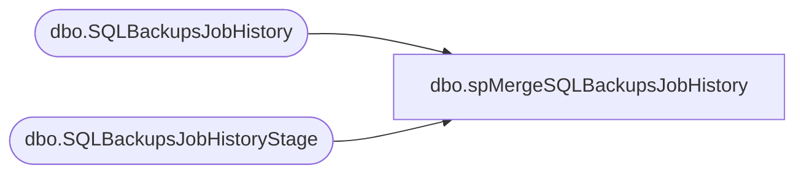

# dbo.spMergeSQLBackupsJobHistory

**Database:** IntegrationStaging  

## Architecture Diagram



## Table Dependencies

| Referenced Table |
|---|
| dbo.SQLBackupsJobHistory |
| dbo.SQLBackupsJobHistoryStage |

## Stored Procedure Code

```sql
CREATE proc [dbo].[spMergeSQLBackupsJobHistory] 
as

set nocount on 

delete from SQLBackupsJobHistory
where 
	ServerName is NULL
	or job_id is NULL
;
merge into SQLBackupsJobHistory as target
using 
	(
		select ServerName, JobName, job_id, backupLocation, min(NextRunDate) NextRunDate, max(LastRunDate) LastRunDate, LastRunStatus, LastRunDuration 
		from SQLBackupsJobHistoryStage 
		group by ServerName, JobName, job_id, backupLocation,LastRunStatus, LastRunDuration
	)
	as source
on 
	target.ServerName=source.ServerName
	and 
	target.job_id=source.job_id
when matched 
	and 
		isnull(target.JobName,'x')<>isnull(source.JobName,'x')
		or
		isnull(target.BackupLocation,'x')<>isnull(source.BackupLocation,'x')
		or
		isnull(target.NextRunDate,getdate())<>isnull(source.NextRunDate,getdate())
		or
		isnull(target.LastRunDate,getdate())<>isnull(source.LastRunDate,getdate())
		or
		isnull(target.LastRunStatus,'x')<>isnull(source.LastRunStatus,'x')
		or
		isnull(target.LastRunDuration,'x')<>isnull(source.LastRunDuration,'x')
		
then update
	set
		target.JobName=source.JobName,
		target.BackupLocation=source.BackupLocation,
		target.NextRunDate=source.NextRunDate,
		target.LastRunDate=source.LastRunDate,
		target.LastRunStatus=source.LastRunStatus,
		target.LastRunDuration=source.LastRunDuration,
		target.UpdateDate=getdate()
when not matched by target
then insert 
	(
		ServerName,
		job_id,
		JobName,
		BackupLocation,
		NextRunDate,
		LastRunDate,
		LastRunStatus,
		LastRunDuration,
		InsertDate
	)
values
	(
		source.ServerName,
		source.job_id,
		source.JobName,
		source.BackupLocation,
		source.NextRunDate,
		source.LastRunDate,
		source.LastRunStatus,
		source.LastRunDuration,
		getdate()
	)
;
dbo,spMergeSQLBackupsMostRecentDates,CREATE proc [dbo].[spMergeSQLBackupsMostRecentDates]

as

set nocount on

delete from SQLBackupsMostRecentDates
where ServerName is NULL or DatabaseName is null

merge into SQLBackupsMostRecentDates as target
using SQLBackupsMostRecentDatesStage as source
on 
	target.ServerName=source.ServerName
	and 
	target.DatabaseName=source.DatabaseName
when matched
	and
		isnull(target.DatabaseType,'x')<>isnull(source.DatabaseType,'x')
		or
		isnull(target.FullBackupDate,getdate())<>isnull(source.FullBackupDate,getdate())
		or
		isnull(target.DifferentialBackupDate,getdate())<>isnull(source.DifferentialBackupDate,getdate())
		or
		isnull(target.SQLServerServiceAccount,'x')<>isnull(source.SQLServerServiceAccount,'x')
		or
		isnull(target.SQLAgentServerAccount,'x')<>isnull(source.SQLAgentServerAccount,'x')
then 
	update
		set
			target.DatabaseType=source.DatabaseType,
			target.FullBackupDate=source.FullBackupDate,
			target.DifferentialBackupDate=source.DifferentialBackupDate,
			target.SQLServerServiceAccount=source.SQLServerServiceAccount,
			target.SQLAgentServerAccount=source.SQLAgentServerAccount,
			target.UpdateDate=getdate()
when not matched by target
then insert
	(
		ServerName,
		DatabaseName,
		DatabaseType,
		FullBackupDate,
		DifferentialBackupDate,
		SQLServerServiceAccount,
		SQLAgentServerAccount,
		InsertDate
	)
values
	(
		source.ServerName,
		source.DatabaseName,
		source.DatabaseType,
		source.FullBackupDate,
		source.DifferentialBackupDate,
		source.SQLServerServiceAccount,
		source.SQLAgentServerAccount,
		getdate()
	)
;
```

