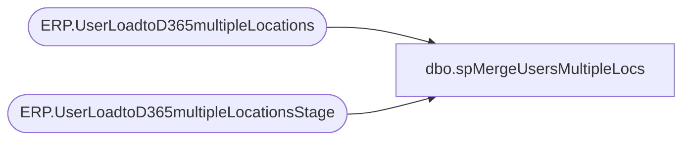

# dbo.spMergeUsersMultipleLocs

**Database:** IntegrationStaging  

## Architecture Diagram



## Table Dependencies

| Referenced Table |
|---|
| ERP.UserLoadtoD365multipleLocations |
| ERP.UserLoadtoD365multipleLocationsStage |

## Stored Procedure Code

```sql
CREATE proc [dbo].[spMergeUsersMultipleLocs] 

as 

---------------------------------------------------------------------------------------------------------
--	Ian Wallace	-	2023-04-04	-	Created proc - Merges sales Data from JMC postgre to dw
-------------------------------------------------------------------------------------------------------

set nocount on

merge into IntegrationStaging.ERP.UserLoadtoD365multipleLocations as target
--using DWStaging.dbo.JMC_sls_trans_stage as source 
using 
(

select WAREHOUSEID, WAREHOUSEMOBILEDEVICEUSERID, ENTITY  from IntegrationStaging.ERP.UserLoadtoD365multipleLocationsStage

) as source 
on 
	(
		target.[WAREHOUSEID]=source.[WAREHOUSEID] 
		and
		target.[WAREHOUSEMOBILEDEVICEUSERID]=source.[WAREHOUSEMOBILEDEVICEUSERID]
		and
		target.[ENTITY]=source.[ENTITY]
		
	)
When Matched and
	(		
			
			isnull(target.[WAREHOUSEID],'x')<>isnull(source.[WAREHOUSEID],'x')
			or
			isnull(target.[WAREHOUSEMOBILEDEVICEUSERID],'x')<>isnull(source.[WAREHOUSEMOBILEDEVICEUSERID],'x')
			or
			isnull(target.[ENTITY],'x')<>isnull(source.[ENTITY],'x')
		
	)
Then Update
	set     
	--target.[business_date]=source.[business_date],
	target.[WAREHOUSEID]=source.[WAREHOUSEID],
	target.[WAREHOUSEMOBILEDEVICEUSERID]=source.[WAREHOUSEMOBILEDEVICEUSERID],
	target.[ENTITY]=source.[ENTITY],
	target.[UpdateDate]=getdate()
	

When Not Matched by target
Then Insert
	(
	[WAREHOUSEID],
	[WAREHOUSEMOBILEDEVICEUSERID],
	[ENTITY],
	[InsertDate]
	
	)
Values
	(
	source.[WAREHOUSEID],
	source.[WAREHOUSEMOBILEDEVICEUSERID],
	source.[ENTITY],
	getdate()

	)
When Not Matched by source 
 --Then delete 
 then update set target.isDeactivated = 1
;
```

