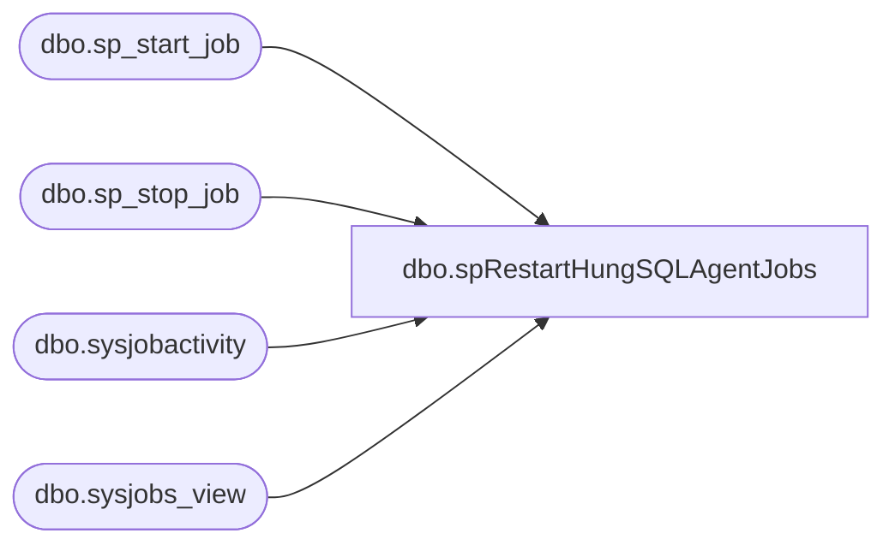

# dbo.spRestartHungSQLAgentJobs

**Database:** IntegrationStaging  

## Architecture Diagram



## Table Dependencies

| Referenced Table |
|---|
| dbo.sp_start_job |
| dbo.sp_stop_job |
| dbo.sysjobactivity |
| dbo.sysjobs_view |

## Stored Procedure Code

```sql
CREATE proc [dbo].[spRestartHungSQLAgentJobs] 

as

------------------------------------------------------------------------------------------
--Dan Tweedie	-	2017-10-11	-	CREATED PROC TO ENSURE WEB INVENTORY DOESN'T GET HUNG
------------------------------------------------------------------------------------------

set nocount on

declare 
	@JobName varchar(100)
declare
	@RunningJobs table (Name varchar(100), ElapsedMinutes int)

Insert @RunningJobs
select 
	job.Name,
	datediff(minute, activity.run_requested_Date, getdate()) as ElapsedMinutes
from msdb.dbo.sysjobs_view job
inner join msdb.dbo.sysjobactivity activity on (job.job_id = activity.job_id)
where run_Requested_date is not null
and stop_execution_date is null
and datediff(minute, activity.run_requested_Date, getdate()) >= 15 --JOB HAS BEEN RUNNING FOR 15 MINUTES

if (select count(*) from @RunningJobs where Name = 'WEB - InventoryAndLocationsExports') > 0
begin
--************************************************************
	select @JobName = Name
	from @RunningJobs
	where Name = 'WEB - InventoryAndLocationsExports'

	exec msdb.dbo.sp_stop_job	@job_name = @JobName
	waitfor delay '00:00:30'
	exec msdb.dbo.sp_start_job @job_name = @JobName
--*************************************************************
end

if (select count(*) from @RunningJobs where Name = 'WEB - InventoryDeltaExport') > 0
begin
--************************************************************
	select @JobName = Name
	from @RunningJobs
	where Name = 'WEB - InventoryDeltaExport'

	exec msdb.dbo.sp_stop_job	@job_name = @JobName
	waitfor delay '00:00:30'
	exec msdb.dbo.sp_start_job @job_name = @JobName
--*************************************************************
end

if (select count(*) from @RunningJobs where Name = 'WEB - ProductCatalogExports') > 0
begin
--************************************************************
	select @JobName = Name
	from @RunningJobs
	where Name = 'WEB - ProductCatalogExports'

	exec msdb.dbo.sp_stop_job	@job_name = @JobName
	waitfor delay '00:00:30'
	exec msdb.dbo.sp_start_job @job_name = @JobName
--*************************************************************
end

-----------------------------------------------------------------------------------------------------------
--TO ADD MORE JOBS, EITHER CREATE WHILE LOOP ABOVE WITH LIST OF JOBS CODED INTO @RUNNINGJOBS
--OR SIMPLY ADD MORE OF THESE
		--select @JobName = Name
		--from @RunningJobs
		--where Name = ' YOUR JOB NAME'

		--sp_stop_job	@job_name = @JobName
		--sp_start_job @job_name = @JobName
------------------------------------------------------------------------------------------------------------
```

