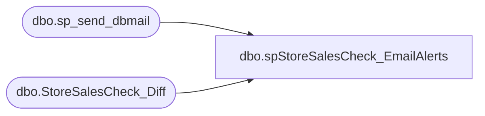

# dbo.spStoreSalesCheck_EmailAlerts

**Database:** IntegrationStaging  

## Architecture Diagram



## Table Dependencies

| Referenced Table |
|---|
| dbo.sp_send_dbmail |
| dbo.StoreSalesCheck_Diff |

## Stored Procedure Code

```sql
-- =============================================================================================================
-- Name: spStoreSalesCheck_EmailAlerts
--
-- Description:	
--		Spawn off important emails related to the StoreSalesCheck process
--		
-- =============================================================================================================

CREATE PROCEDURE [dbo].[spStoreSalesCheck_EmailAlerts]
AS
BEGIN
-- SET NOCOUNT ON added to prevent extra result sets from
-- interfering with SELECT statements.
SET NOCOUNT ON;

declare @subject varchar(100)
declare @query varchar(8000)
declare @recipients varchar(200)

set @subject = case 
					when (select count(*) from StoreSalesCheck_Diff) = 0 
					then 'StoreSalesCheck - No Issues'
					else 'StoreSalesCheck - Issues'
				end

set @recipients = 'BIAdmin@buildabear.com;benb@buildabear.com;brandonh@buildabear.com;enjolia@buildabear.com;bradw@buildabear.com;juanp@buildabear.com;entsyssupport@buildabear.com'
--'poll@buildabear.com'


declare @body nvarchar(4000)
declare @store_id nvarchar(20)
declare @aw_units nvarchar(20)
declare @store_units nvarchar(20)
declare @diff_units nvarchar(20)
declare @issue nvarchar(20)

declare @max_body_length_reached bit
declare @max_body_length int
set @max_body_length = 350000 --this was previously 3500, which only allowed for about 100 rows
set @max_body_length_reached = 0

set @body = 
	'
	<html>
	<body>
	<STYLE TYPE="text/css">
	<!--
	TD{font-family: Arial; font-size: 9pt; text-align: right}
	--->
	</STYLE>

	<table border=1>
	<tr><b><td>store</td><td>aw_units</td><td>st_units</td><td>diff</td><td>issue</td></b></tr>
	'
	
	DECLARE curStores CURSOR READ_ONLY FORWARD_ONLY LOCAL
	FOR
		select store_id, aw_units, store_units, diff_units, issue
		from StoreSalesCheck_Diff
		where cast(aw_units as int) < cast(store_units as int)
		order by store_id
	
	OPEN curStores
	FETCH NEXT FROM curStores INTO @store_id, @aw_units, @store_units, @diff_units, @issue
	 
	WHILE (@@Fetch_Status <> -1)
	BEGIN
		if @max_body_length_reached = 0
		begin
			if len(@body) > @max_body_length
			begin
				set @body = @body + '<tr><td colspan=5> too many to list</td></tr>'
				set @max_body_length_reached = 1
			end

			else 
			begin
				set @body = @body + '<tr><td>' + @store_id + '</td><td>' + @aw_units + '</td><td>' + @store_units + '</td><td>' + @diff_units + '</td><td>' + @issue + '</td></tr>'
			end
		end

		FETCH NEXT FROM curStores INTO @store_id, @aw_units, @store_units, @diff_units, @issue
	END	
	
	CLOSE curStores
	DEALLOCATE curStores	
	
	set @body = @body +
	'</table>

	<font face =arial size = 1><i>This was run from stl-ssis-p-01.IntegrationStaging.dbo.spStoreSalesCheck_EmailAlerts.</i></font>
	</body>
	<html>
	'

    EXEC msdb.dbo.sp_send_dbmail 
		@profile_name='biadmin',
		@recipients = @recipients, 
		--@blind_copy_recipients='biadmin@buildabear.com',
        @subject = @subject, --@query_result_width = 500,
        @body_format = 'HTML', @body = @body

END
```

