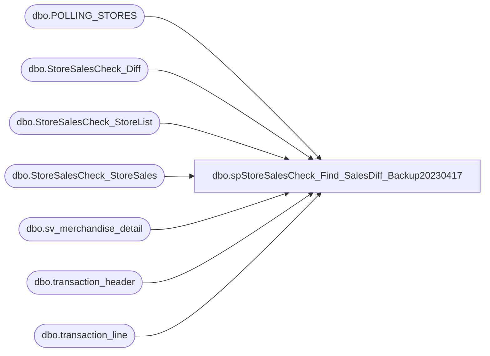

# dbo.spStoreSalesCheck_Find_SalesDiff_Backup20230417

**Database:** IntegrationStaging  

## Architecture Diagram



## Table Dependencies

| Referenced Table |
|---|
| dbo.POLLING_STORES |
| dbo.StoreSalesCheck_Diff |
| dbo.StoreSalesCheck_StoreList |
| dbo.StoreSalesCheck_StoreSales |
| dbo.sv_merchandise_detail |
| dbo.transaction_header |
| dbo.transaction_line |

## Stored Procedure Code

```sql
CREATE PROCEDURE [dbo].[spStoreSalesCheck_Find_SalesDiff_Backup20230417]
AS
-- =============================================================================================================
-- Name: spStoreSalesCheck_Find_SalesDiff
--
-- Description:	
--		Pull the auditworks sales and calculate the diff.
--		
-- =============================================================================================================

BEGIN
-- SET NOCOUNT ON added to prevent extra result sets from
-- interfering with SELECT statements.
SET NOCOUNT ON;

-- grab the AW sales and units
IF (Object_ID('tempdb.dbo.#aw_sales') IS NOT NULL) DROP TABLE #aw_sales
SELECT 
	CASE 
		WHEN th.store_no in (470, 480, 990) THEN 0 
		WHEN th.store_no in (473) THEN 13 
		ELSE th.store_no 
	END AS store_id, 
	th.transaction_date, 
	SUM(tl.gross_line_amount * tl.db_cr_none * tl.voiding_reversal_flag) as Net_Sales,
	cast(SUM(md.units * md.db_cr_none*-1 * md.voiding_reversal_flag) as bigint) as Units 
INTO #aw_sales
FROM bedrockdb01.auditworks.dbo.transaction_header th with (nolock)
	join bedrockdb01.auditworks.dbo.transaction_line tl with (nolock)
	on tl.transaction_id = th.transaction_id
	join bedrockdb01.auditworks.dbo.sv_merchandise_detail md with (nolock)
	on md.transaction_id = tl.transaction_id
	and md.line_id = tl.line_id
WHERE 1=1
	and th.transaction_date between CONVERT(char, DATEADD(day,-1,GETDATE()), 101) and CONVERT(char, DATEADD(day,-1,GETDATE()), 101)
	AND (th.store_no IN (

								SELECT 
									cast(STORE_NUM as int) AS store_no
								FROM bedrockdb01.auditworks.dbo.POLLING_STORES
								WHERE POLLING_VLDTN = 1
								AND POLLING_VLDTN_DATE <= GETDATE()

							)
			OR th.store_no IN (13, 2013)
		)
    and th.transaction_void_flag = 0 
    and tl.line_void_flag=0 
    and tl.line_object IN (100,101,102,103,104,105,106,204,400,405)
	AND th.register_no not in (52,53,56,57) -- ADDED 2020-06-30 DANT
GROUP BY 
	CASE 
		WHEN th.store_no in (470, 480, 990) THEN 0 
		WHEN th.store_no in (473) THEN 13 
		ELSE th.store_no 
	END, 
	th.transaction_date

-- add in the important web stores
insert into StoreSalesCheck_StoreList(store_id)
select ss.store_id
from (
	select distinct store_id from StoreSalesCheck_StoreSales 
	) ss
	left join StoreSalesCheck_StoreList sl
	on sl.store_id = ss.store_id
where sl.store_id is null
	and ss.store_id in (13, 136, 1513, 2013)

-- remove some crap that probably came in from the FTD sales
delete from StoreSalesCheck_StoreSales where store_id is null

-- pull in the stores where the diff is off or we have aw units but no store units
IF (Object_ID('tempdb..#unit_diff') IS NOT NULL) DROP TABLE #unit_diff
select store_id, store_units, aw_units, abs(store_units - aw_units) diff_units, connected
into #unit_diff
from (
	select sl.store_id, isnull(s.units,0) store_units, isnull(aw.units, 0) aw_units, case when s.units is null then 'offline' else '' end connected
	from StoreSalesCheck_StoreList sl
		left join (
			select store_id, sum(units) units, sum(sales) sales--, case when s.units is null then 0 else 1 end connected
			from StoreSalesCheck_StoreSales s
			group by store_id
			) s
		on s.store_id = sl.store_id
		left join #aw_sales aw
		on aw.store_id = sl.store_id
	) d
where abs(store_units - aw_units) > 5
	or connected != ''


-- clear out the table
truncate table StoreSalesCheck_Diff

-- pull in the stores where the diff is off or we have aw units but no store units
insert into StoreSalesCheck_Diff(store_id, aw_units, store_units, diff_units, issue)
select store_id, 
	aw_units, 
	store_units, 
	diff_units, 
	connected
from #unit_diff

-- clear out the store units for those stores we couldn't connect to since the really don't exist
update StoreSalesCheck_Diff
set store_units = '' 
where issue != ''

-- pull in any store that we couldn't connect to and didn't have aw units
insert into StoreSalesCheck_Diff(store_id, aw_units, store_units, diff_units, issue)
select s.store_id, '', '', '', 'offline'
from StoreSalesCheck_StoreSales s
	left join StoreSalesCheck_Diff p
	on p.store_id = s.store_id
where sales_date is null
	and p.store_id is null

END
```

