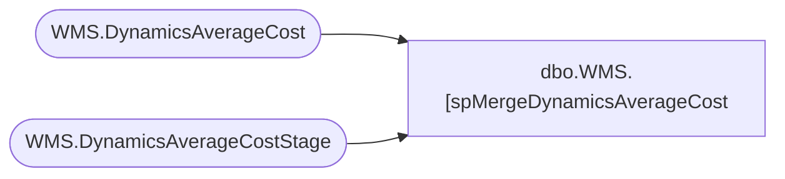

# dbo.WMS.[spMergeDynamicsAverageCost

**Database:** IntegrationStaging  

## Architecture Diagram



## Table Dependencies

| Referenced Table |
|---|
| WMS.DynamicsAverageCost |
| WMS.DynamicsAverageCostStage |

## Stored Procedure Code

```sql
CREATE proc [WMS.[spMergeDynamicsAverageCost] -- Update to Proper Name 

as 

-------------------------------------------------------------------------------------------------------
--	Tim Callahan	-	2025-05-20	-	Created proc - Merges <Data Description> Data from <Staging Table> to <Destination Table>
-------------------------------------------------------------------------------------------------------

set nocount on

merge into [WMS].[DynamicsAverageCost] as target
using [WMS].[DynamicsAverageCostStage] as source -- Use Entire Table as Source 
--using ( select * from table) as source -- Use SQL Command As Source
on 
	(
		target.[InventSiteId]=source.[InventSiteId] -- Key 
			and 
		target.[InventLocationId]=source.[InventLocationId] -- Key 
			and 
		target.[ItemId]=source.[ItemId] -- Key 
	)
When Matched and
	(		
			-- Besure to use isnull logic for compare otherwise may have unintended results 
		    isnull(target.[AverageCostRounded],'0.00')<>isnull(source.[AverageCostRounded],'0.00') 
				or 
			isnull(target.[AverageCost],'0.00')<>isnull(source.[AverageCost],'0.00') 
				or 
			isnull(target.[PostedValue],'0.00')<>isnull(source.[PostedValue],'0.00') 
				or 
			isnull(target.[PostedQty],'0.00')<>isnull(source.[PostedQty],'0.00') 
       
	)
Then Update
	-- Fields to be updated
	set     
		target.PostedQty = source.PostedQty,
		target.PostedValue = source.PostedValue,
		target.AverageCost = source.AverageCost,
		target.AverageCostRounded = source.AverageCostRounded,
		target.UpdateDate = getdate () 

 
When Not Matched by target
Then Insert
	(
		-- Fields to be inserted 
			Entity,
			InventSiteId,
			InventLocationId,
			ItemId,
			ItemName,
			ItemPropertyId,
			PostedQty,
			PostedValue,
			AverageCost,
			AverageCostRounded,
			InsertDate	

         
	)
Values
	(
		source.Entity,
		source.InventSiteId,
		source.InventLocationId,
		source.ItemId,
		source.ItemName,
		source.ItemPropertyId,
		source.PostedQty,
		source.PostedValue,
		source.AverageCost,
		source.AverageCostRounded,
		getdate()	

	)
;
```

