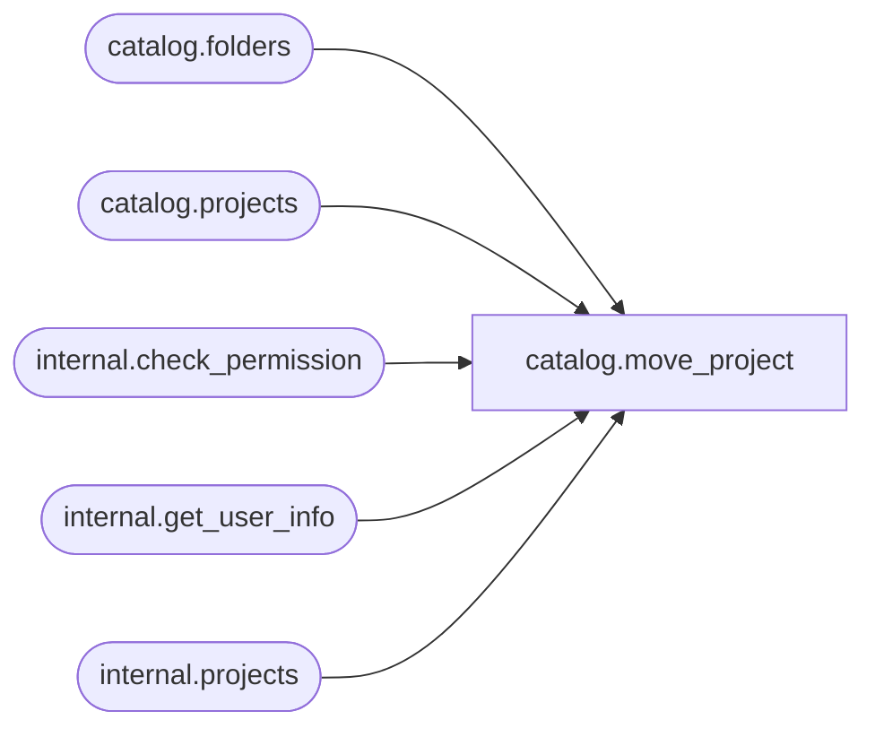

# catalog.move_project

**Database:** SSISDB  

## Architecture Diagram



## Table Dependencies

| Referenced Table |
|---|
| catalog.folders |
| catalog.projects |
| internal.check_permission |
| internal.get_user_info |
| internal.projects |

## Stored Procedure Code

```sql
CREATE PROCEDURE [catalog].[move_project]
        @source_folder            nvarchar(128),
        @project_name           nvarchar(128),
        @destination_folder     nvarchar(128)
AS
    SET NOCOUNT ON
    
    DECLARE @target_folder_id bigint
    DECLARE @result bit    
    DECLARE @folder_name nvarchar(128)
    
    SET @folder_name = @source_folder
    
    
    DECLARE @caller_id     int
    DECLARE @caller_name   [internal].[adt_sname]
    DECLARE @caller_sid    [internal].[adt_sid]
    DECLARE @suser_name    [internal].[adt_sname]
    DECLARE @suser_sid     [internal].[adt_sid]
    
    EXECUTE AS CALLER
        EXEC [internal].[get_user_info]
            @caller_name OUTPUT,
            @caller_sid OUTPUT,
            @suser_name OUTPUT,
            @suser_sid OUTPUT,
            @caller_id OUTPUT;
          
          
        IF(
            EXISTS(SELECT [name]
                    FROM sys.server_principals
                    WHERE [sid] = @suser_sid AND [type] = 'S')  
            OR
            EXISTS(SELECT [name]
                    FROM sys.database_principals
                    WHERE ([sid] = @caller_sid AND [type] = 'S')) 
            )
        BEGIN
            RAISERROR(27123, 16, 2) WITH NOWAIT
            RETURN 1
        END
    REVERT
    
    IF(
            EXISTS(SELECT [name]
                    FROM sys.server_principals
                    WHERE [sid] = @suser_sid AND [type] = 'S')  
            OR
            EXISTS(SELECT [name]
                    FROM sys.database_principals
                    WHERE ([sid] = @caller_sid AND [type] = 'S')) 
            )
    BEGIN
            RAISERROR(27123, 16, 2) WITH NOWAIT
            RETURN 1
    END
    
    IF (@source_folder IS NULL OR @project_name IS NULL OR @destination_folder IS NULL)
    BEGIN
        RAISERROR(27138, 16 , 6) WITH NOWAIT 
        RETURN 1 
    END

    
    SET TRANSACTION ISOLATION LEVEL SERIALIZABLE
    
    
    
    DECLARE @tran_count INT = @@TRANCOUNT;
    DECLARE @savepoint_name NCHAR(32);
    IF @tran_count > 0
    BEGIN
        SET @savepoint_name = REPLACE(CONVERT(NCHAR(36), NEWID()), N'-', N'');
        SAVE TRANSACTION @savepoint_name;
    END
    ELSE
        BEGIN TRANSACTION;                                                                                        
    
    BEGIN TRY
    
        
    DECLARE @project_id bigint;
    EXECUTE AS CALLER
        SET @project_id = (SELECT projs.[project_id]
                                FROM [catalog].[projects] projs INNER JOIN [catalog].[folders] fld
                                ON projs.[folder_id] = fld.[folder_id]
                                AND projs.[name] = @project_name
                                AND fld.name = @folder_name);
    REVERT
    IF @project_id IS NULL
    BEGIN
        RAISERROR(27109 , 16 , 1, @project_name) WITH NOWAIT
    END
    EXECUTE AS CALLER
        SET @result = [internal].[check_permission]
        (
            2,
            @project_id,
            2
         )
    REVERT
    IF @result = 0
    BEGIN
        RAISERROR(27109 , 16 , 1, @project_name) WITH NOWAIT
    END

       SET @target_folder_id = 
            (SELECT [folder_id] FROM [catalog].[folders] WHERE [name] = @destination_folder)
            
        IF @target_folder_id IS NULL
        BEGIN
            RAISERROR(27115 , 16 , 1, @destination_folder) WITH NOWAIT
        END
        
        
        SET @result = [internal].[check_permission] 
        (
            1,
            @target_folder_id,
            100
         )
        
        IF @result = 0
        BEGIN
            RAISERROR(27223 , 16 , 1, @destination_folder) WITH NOWAIT     
        END
          
        
        IF EXISTS (SELECT [name] FROM [internal].[projects]
                    WHERE [folder_id] = @target_folder_id AND [name] = @project_name)
        BEGIN
            RAISERROR(27181 , 16 , 1, @project_name) WITH NOWAIT     
        END
    
        UPDATE [internal].[projects] SET folder_id = @target_folder_id 
            WHERE [project_id] = @project_id   
        
        
        IF @@ROWCOUNT <> 1
        BEGIN
            RAISERROR(27112, 16, 1, N'projects') WITH NOWAIT
        END
    
        
        IF @tran_count = 0
            COMMIT TRANSACTION;                                                                                 
    END TRY
    BEGIN CATCH
        
        IF @tran_count = 0 
            ROLLBACK TRANSACTION;
        
        ELSE IF XACT_STATE() <> -1
            ROLLBACK TRANSACTION @savepoint_name;                                                                                  
        THROW 
    END CATCH
    
    RETURN 0      
        

catalog,remove_data_tap,CREATE PROCEDURE [catalog].[remove_data_tap]
        @data_tap_id             bigint
AS
    SET NOCOUNT ON
    
    
    DECLARE @caller_id     int
    DECLARE @caller_name   [internal].[adt_sname]
    DECLARE @caller_sid    [internal].[adt_sid]
    DECLARE @suser_name    [internal].[adt_sname]
    DECLARE @suser_sid     [internal].[adt_sid]
    
    EXECUTE AS CALLER
        EXEC [internal].[get_user_info]
            @caller_name OUTPUT,
            @caller_sid OUTPUT,
            @suser_name OUTPUT,
            @suser_sid OUTPUT,
            @caller_id OUTPUT;
          
          
        IF(
            EXISTS(SELECT [name]
                    FROM sys.server_principals
                    WHERE [sid] = @suser_sid AND [type] = 'S')  
            OR
            EXISTS(SELECT [name]
                    FROM sys.database_principals
                    WHERE ([sid] = @caller_sid AND [type] = 'S')) 
            )
        BEGIN
            RAISERROR(27123, 16, 1) WITH NOWAIT
            RETURN 1
        END
    REVERT
    
    IF(
            EXISTS(SELECT [name]
                    FROM sys.server_principals
                    WHERE [sid] = @suser_sid AND [type] = 'S')  
            OR
            EXISTS(SELECT [name]
                    FROM sys.database_principals
                    WHERE ([sid] = @caller_sid AND [type] = 'S')) 
            )
    BEGIN
            RAISERROR(27123, 16, 1) WITH NOWAIT
            RETURN 1
    END
    
    DECLARE @execution_id bigint

    SELECT @execution_id = [execution_id]
    FROM [catalog].[execution_data_taps]
    WHERE [data_tap_id] = @data_tap_id

    IF (@execution_id is null)
    BEGIN
        RAISERROR(27215, 16, 1, @data_tap_id) WITH NOWAIT
        RETURN 1
    END

    IF [internal].[check_permission] 
    (
        4,
        @execution_id,
        2
    ) = 0
    BEGIN
        RAISERROR(27143, 16, 5, @execution_id) WITH NOWAIT
        RETURN 1     
    END

    DECLARE @execution_status int
    SELECT @execution_status = [status] FROM [internal].[operations] WHERE [operation_id] = @execution_id
    IF (@execution_status != 1)
    BEGIN
        RAISERROR(27212, 16, 1) WITH NOWAIT
        RETURN 1 
    END

    DELETE FROM [internal].[execution_data_taps] WHERE [data_tap_id] = @data_tap_id

    RETURN 0
```

