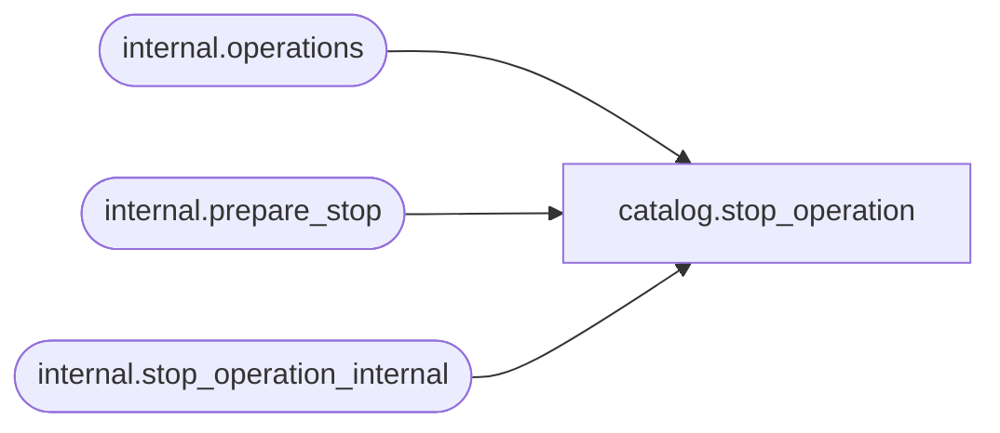

# catalog.stop_operation

**Database:** SSISDB  

## Architecture Diagram



## Table Dependencies

| Referenced Table |
|---|
| internal.operations |
| internal.prepare_stop |
| internal.stop_operation_internal |

## Stored Procedure Code

```sql
CREATE PROCEDURE [catalog].[stop_operation]
    @operation_id bigint                                
AS
BEGIN
    SET NOCOUNT ON
    
    DECLARE @operation_guid uniqueIdentifier   
    DECLARE @process_id bigint
    DECLARE @return_value int
    DECLARE @stop_id bigint
    DECLARE @status int
    
    IF @operation_id IS NULL 
    BEGIN
       RAISERROR(27100, 16 , 11, 'operation_id') WITH NOWAIT
       RETURN 1
    END
    
    EXEC @return_value = [internal].[prepare_stop] 
                            @operation_id,
                            @process_id output, 
                            @operation_guid output,
                            @stop_id output

    IF @return_value = 0
    BEGIN
        BEGIN TRY
            EXEC @return_value=[internal].[stop_operation_internal] 
                    @operation_id, 
                    @process_id,
                    @operation_guid
        END TRY
        BEGIN CATCH         
            UPDATE [internal].[operations] SET 
                [end_time]  = SYSDATETIMEOFFSET(),
                [status]    = 4
                WHERE operation_id    = @stop_id;
            THROW;
        END CATCH
    END
    
    SET @status =
        CASE
            WHEN (@return_value = 0) THEN 7
            ELSE 4
        END

    UPDATE [internal].[operations] SET 
        [end_time]  = SYSDATETIMEOFFSET(),
        [status]    = @status
        WHERE operation_id    = @stop_id
    RETURN @return_value       
END

catalog,validate_package,CREATE PROCEDURE [catalog].[validate_package]
        @folder_name                     nvarchar(128),     
        @project_name                    nvarchar(128),     
        @package_name                    nvarchar(260),     
        @validation_id                   bigint output,     
        @use32bitruntime                 bit = 0,           
        @environment_scope              char(1) = 'D',     
        @reference_id                    bigint = NULL      
AS
    SET NOCOUNT ON
    
    DECLARE @package_id bigint
    DECLARE @return_value        int
    
    
    IF(@folder_name IS NULL OR @project_name IS NULL OR @use32bitruntime IS NULL
        OR @package_name IS NULL OR @environment_scope IS NULL)
    BEGIN
        RAISERROR(27138, 16 , 4) WITH NOWAIT
        RETURN 1
    END
    
    IF @environment_scope NOT IN ('A','S','D')
    BEGIN
        RAISERROR(27101, 16 , 2, N'environment_scope') WITH NOWAIT
        RETURN 1;
    END
    
    IF @environment_scope = 'S' AND @reference_id IS NULL
    BEGIN
        RAISERROR(27101, 16 , 2, N'reference_id') WITH NOWAIT
        RETURN 1;
    END
    
    IF (@environment_scope = 'A' OR @environment_scope = 'D')  AND @reference_id IS NOT NULL
    BEGIN
        RAISERROR(27101, 16 , 2, N'reference_id') WITH NOWAIT
        RETURN 1;
    END
    
    DECLARE @project_id bigint
    DECLARE @version_id bigint        
    EXEC @return_value =  [internal].[prepare_validate_package] 
                            @folder_name,
                            @project_name,
                            @package_name,                  
                            @use32bitruntime,
                            @environment_scope,
                            @reference_id,
                            @validation_id OUTPUT,
                            @project_id OUTPUT,
                            @package_id OUTPUT,
                            @version_id OUTPUT    
    IF (@return_value <> 0)
    
    BEGIN
        RETURN 1  
    END
    
    IF @validation_id IS NULL OR @project_id IS NULL OR @version_id IS NULL OR @package_id IS NULL
    BEGIN
        
        RETURN 1
    END
    
      
    BEGIN TRY       
        EXEC @return_value = [internal].[validate_package_internal] 
                            @project_id,
                            @package_id,
                            @version_id,
                            @validation_id,
                            @environment_scope,
                            @use32bitruntime
    END TRY
    BEGIN CATCH
        UPDATE [internal].[operations] 
            SET [status] = 4,
                [end_time]  = SYSDATETIMEOFFSET()
            WHERE [operation_id] = @validation_id;             
        THROW;
    END CATCH       
                

catalog,validate_project,CREATE PROCEDURE [catalog].[validate_project]
        @folder_name                     nvarchar(128),     
        @project_name                    nvarchar(128),     
        @validate_type                   char(1) = 'F',     
        @validation_id                   bigint output,     
        @use32bitruntime                 bit = 0,           
        @environment_scope              char(1) = 'D',     
        @reference_id                    bigint = NULL      
AS 
    SET NOCOUNT ON
    DECLARE @return_value   int
    
    
    IF(@folder_name IS NULL OR @project_name IS NULL 
        OR @validate_type IS NULL OR @environment_scope IS NULL)
    BEGIN
        RAISERROR(27138, 16 , 4) WITH NOWAIT
        RETURN 1
    END
    
    
    IF @validate_type <> 'F'
    BEGIN
        RAISERROR(27101, 16 , 2, N'validate_type') WITH NOWAIT
        RETURN 1;
    END
    
    IF @environment_scope NOT IN ('A','S','D')
    BEGIN
        RAISERROR(27101, 16 , 2, N'environment_scope') WITH NOWAIT
        RETURN 1;
    END  
    
    IF (@validate_type = 'D' AND (@reference_id IS NOT NULL
        OR @environment_scope != 'D')) 
    BEGIN
        RAISERROR(27101, 16 , 2, N'reference_id, environment_scope') WITH NOWAIT
        RETURN 1
    END
    
    IF @environment_scope = 'S' AND @reference_id IS NULL
    BEGIN
        RAISERROR(27101, 16 , 2, N'reference_id') WITH NOWAIT
        RETURN 1;
    END
    
    IF (@environment_scope = 'A' OR @environment_scope = 'D')  AND @reference_id IS NOT NULL
    BEGIN
        RAISERROR(27101, 16 , 2, N'reference_id') WITH NOWAIT
        RETURN 1;
    END 
DECLARE @project_id bigint
    DECLARE @version_id bigint        
    EXEC @return_value =  [internal].[prepare_validate_project] 
                            @folder_name,
                            @project_name,
                            @validate_type,                  
                            @use32bitruntime,
                            @environment_scope,
                            @reference_id,
                            @validation_id OUTPUT,
                            @project_id OUTPUT,
                            @version_id OUTPUT    
    IF (@return_value <> 0)
    
    BEGIN
        RETURN 1  
    END
    
    IF @validation_id IS NULL OR @project_id IS NULL OR @version_id IS NULL
    BEGIN
        
        RETURN 1
    END
    
      
    BEGIN TRY       
        EXEC @return_value = [internal].[validate_project_internal] 
                            @project_id,
                            @version_id,
                            @validation_id,
                            @environment_scope,
                            @use32bitruntime
    END TRY
    BEGIN CATCH
        UPDATE [internal].[operations] 
            SET [status] = 4,
                [end_time]  = SYSDATETIMEOFFSET()
            WHERE [operation_id] = @validation_id;             
        THROW;
    END CATCH
```

