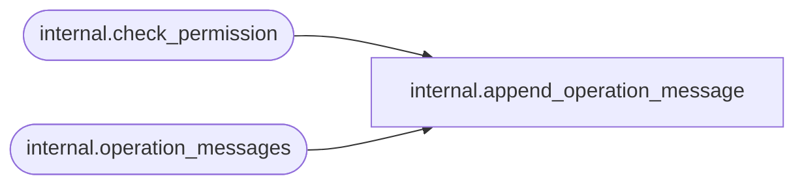

# internal.append_operation_message

**Database:** SSISDB  

## Architecture Diagram



## Table Dependencies

| Referenced Table |
|---|
| internal.check_permission |
| internal.operation_messages |

## Stored Procedure Code

```sql
CREATE PROCEDURE [internal].[append_operation_message]
        @operation_id       bigint,                             
        @message_type       int,                                
        @message_time          datetimeoffset,                     
        @message_source     smallint,                           
        @message            nvarchar(max),                      
        @extended_info_id   bigint = NULL
AS
SET NOCOUNT ON
                   

    IF [internal].[check_permission] 
    (
        4,
        @operation_id,
        2
    ) = 0
    BEGIN
        RAISERROR(27143, 16, 5, @operation_id) WITH NOWAIT;
        RETURN 1;      
    END

   INSERT INTO [internal].[operation_messages] 
           ([operation_id], 
            [message_type], 
            [message_time],
            [message_source_type], 
            [message], 
            [extended_info_id])
        VALUES(
            @operation_id,  
            @message_type,
            @message_time,
            @message_source,
            @message,
            @extended_info_id)
    RETURN 0

internal,append_packages,CREATE PROCEDURE [internal].[append_packages]
        @project_id             bigint,
        @object_version_lsn     bigint,
        @packages_data         [internal].[PackageTableType] READONLY
AS
    SET NOCOUNT ON
    
    DECLARE @result bit

    IF (@project_id IS NULL  OR @object_version_lsn IS NULL )
    BEGIN
        RAISERROR(27138, 16 , 6) WITH NOWAIT 
        RETURN 1     
    END
    
    IF (@project_id <= 0)
    BEGIN
        RAISERROR(27101, 16 , 10, N'project_id') WITH NOWAIT
        RETURN 1 
    END

    IF (@object_version_lsn <= 0)
    BEGIN
        RAISERROR(27101, 16 , 10, N'object_version_lsn') WITH NOWAIT
        RETURN 1  
    END

    IF NOT EXISTS (SELECT [object_version_lsn] FROM [internal].[object_versions] 
                WHERE [object_version_lsn] = @object_version_lsn AND [object_type] = 20
                AND [object_id] = @project_id AND [object_status] = 'D')
    BEGIN
        RAISERROR(27194 , 16 , 1) WITH NOWAIT
        RETURN 1         
    END
    
    SET @result = [internal].[check_permission] 
    (
        2,
        @project_id,
        2
    ) 
    
    IF @result = 0        
    BEGIN
        RAISERROR(27194 , 16 , 1) WITH NOWAIT
        RETURN 1        
    END
   
    
    INSERT INTO [internal].[packages]
           ([project_version_lsn]
           ,[name]
           ,[package_guid]
           ,[description]
           ,[package_format_version]
           ,[version_major]
           ,[version_minor]
           ,[version_build]
           ,[version_comments]
           ,[version_guid]
           ,[project_id]
           ,[entry_point]
           ,[validation_status]
           ,[last_validation_time]
           ,[package_data])
        SELECT            
            @object_version_lsn
           ,[name]
           ,[package_guid]
           ,[description]
           ,[package_format_version]
           ,[version_major]
           ,[version_minor]
           ,[version_build]
           ,[version_comments]
           ,[version_guid]
           ,@project_id
           ,[entry_point]
           ,[validation_status]
           ,[last_validation_time]
           ,[package_data] 
        FROM @packages_data      
      
      RETURN 0     

internal,append_parameter,CREATE PROCEDURE [internal].[append_parameter]
        @project_id             bigint,
        @object_version_lsn     bigint,
        @object_type smallint,
        @object_name nvarchar(260),
        @parameter_name nvarchar(128),
        @parameter_data_type nvarchar(128),
        @required bit,
        @sensitive bit,
        @description nvarchar (1024) = NULL,
        @design_default_value sql_variant = NULL,
        @value_set bit  
AS
    SET NOCOUNT ON
    
    DECLARE @result bit

    IF (@project_id IS NULL  OR @object_version_lsn IS NULL OR 
        @object_type IS NULL OR @object_name IS NULL OR
        @parameter_name IS NULL OR @parameter_data_type IS NULL OR
        @required  IS NULL OR @sensitive IS NULL )
    BEGIN
        RAISERROR(27138, 16 , 6) WITH NOWAIT 
        RETURN 1     
    END
    
    IF (@project_id <= 0)
    BEGIN
        RAISERROR(27101, 16 , 10, N'project_id') WITH NOWAIT
        RETURN 1 
    END

    IF (@object_version_lsn <= 0)
    BEGIN
        RAISERROR(27101, 16 , 10, N'object_version_lsn') WITH NOWAIT
        RETURN 1  
    END
    
    IF (@parameter_data_type NOT IN 
            (SELECT [ssis_data_type] FROM [internal].[data_type_mapping]))   
    BEGIN
        RAISERROR(27101, 16 , 10, N'parameters_data_type') WITH NOWAIT
        RETURN 1
    END                                   
        
    IF NOT EXISTS (SELECT [object_version_lsn] FROM [internal].[object_versions] 
                WHERE [object_version_lsn] = @object_version_lsn AND [object_type] = 20
                AND [object_id] = @project_id AND [object_status] = 'D')
    BEGIN
        RAISERROR(27194 , 16 , 1) WITH NOWAIT
        RETURN 1         
    END
    
    SET @result = [internal].[check_permission] 
    (
        2,
        @project_id,
        2
    ) 
    
    IF @result = 0        
    BEGIN
        RAISERROR(27194 , 16 , 1) WITH NOWAIT
        RETURN 1        
    END
   
    
    INSERT INTO [internal].[object_parameters]
       ([project_id]
       ,[project_version_lsn]
       ,[object_type]
       ,[object_name]
       ,[parameter_name]
       ,[parameter_data_type]
       ,[required]
       ,[sensitive]
       ,[description]
       ,[design_default_value]
       ,[value_type]
       ,[value_set]
       ,[validation_status])
    VALUES (@project_id,
           @object_version_lsn,
           @object_type ,
           @object_name,
           @parameter_name,
           @parameter_data_type,
           @required,
           @sensitive,
           @description,
           @design_default_value,
           'V',                 
           @value_set,
           'N')                  
    RETURN 0
```

