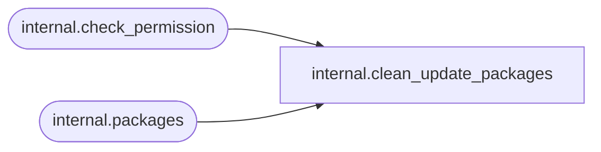

# internal.clean_update_packages

**Database:** SSISDB  

## Architecture Diagram



## Table Dependencies

| Referenced Table |
|---|
| internal.check_permission |
| internal.packages |

## Stored Procedure Code

```sql
CREATE PROCEDURE [internal].[clean_update_packages]
        @project_id             bigint,
        @project_version_lsn    bigint
WITH EXECUTE AS 'AllSchemaOwner'
AS
    SET NOCOUNT ON

    DECLARE @result bit
    EXECUTE AS CALLER   
        SET @result = [internal].[check_permission] 
        (
            2,
            @project_id,
            2
        ) 
    REVERT

    IF @result = 0
    BEGIN
        RAISERROR(27109 , 16 , 1, @project_id) WITH NOWAIT
        RETURN 1
    END
     
    DELETE FROM [internal].[packages]
    WHERE [project_id] = @project_id AND [project_version_lsn] = @project_version_lsn
```

