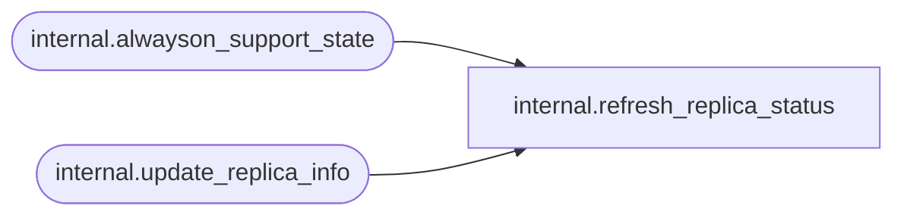

# internal.refresh_replica_status

**Database:** SSISDB  

## Architecture Diagram



## Table Dependencies

| Referenced Table |
|---|
| internal.alwayson_support_state |
| internal.update_replica_info |

## Stored Procedure Code

```sql
CREATE PROCEDURE [internal].[refresh_replica_status]
	@server_name		nvarchar(256),
	@status				tinyint output
AS
BEGIN
	SET NOCOUNT ON
	
	IF (@server_name IS NULL)
	BEGIN
		RAISERROR(27138, 16 , 6) WITH NOWAIT 
        RETURN 1 
	END
	
	DECLARE @last_role tinyint
	SET @last_role = (SELECT [state]
					  FROM [internal].[alwayson_support_state]
					  WHERE [server_name] = @server_name)
	
	IF (@last_role IS NULL)
	BEGIN
		RAISERROR(27228, 16, 1, @server_name) WITH NOWAIT 
		RETURN 1
	END

	IF (@last_role = 2)
	BEGIN
		EXEC [internal].[update_replica_info] @server_name = @server_name
		SET @status = 1
	END
	ELSE
		SET @status = 0
	
	RETURN 0
END
```

