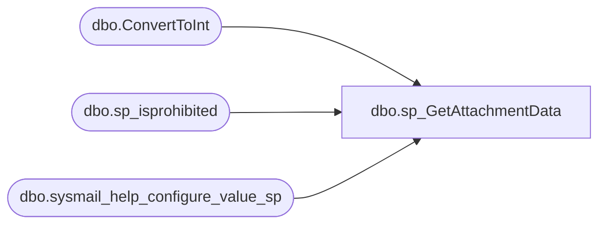

# dbo.sp_GetAttachmentData

**Database:** msdb  

## Architecture Diagram



## Table Dependencies

| Referenced Table |
|---|
| dbo.ConvertToInt |
| dbo.sp_isprohibited |
| dbo.sysmail_help_configure_value_sp |

## Stored Procedure Code

```sql
CREATE PROCEDURE sp_GetAttachmentData
   @attachments           nvarchar(max),
   @temp_table_uid        uniqueidentifier,
   @exclude_query_output  BIT        = 0
AS
BEGIN
    SET NOCOUNT ON
    SET QUOTED_IDENTIFIER ON

    DECLARE @rc             INT,
            @prohibitedExts NVARCHAR(1000),
            @attachFilePath NVARCHAR(260),
            @scIndex        INT,
            @startLocation  INT,
            @fileSizeStr    NVARCHAR(256),
            @fileSize       INT,
            @mailDbName     sysname,
            @uidStr         VARCHAR(36)

    --Get the maximum file size allowed for attachments from sysmailconfig.
    EXEC msdb.dbo.sysmail_help_configure_value_sp @parameter_name = N'MaxFileSize', 
                                                @parameter_value = @fileSizeStr OUTPUT
    --ConvertToInt will return the default if @fileSizeStr is null
    SET @fileSize = dbo.ConvertToInt(@fileSizeStr, 0x7fffffff, 100000)

    --May need this if attaching files
    EXEC msdb.dbo.sysmail_help_configure_value_sp @parameter_name = N'ProhibitedExtensions', 
                                                @parameter_value = @prohibitedExts OUTPUT

    SET @mailDbName = DB_NAME()
    SET @uidStr = CONVERT(VARCHAR(36), @temp_table_uid)

   SET @attachments = @attachments + ';'
   SET @startLocation = 0
   SET @scIndex = CHARINDEX(';', @attachments, @startLocation)

   WHILE (@scIndex <> 0)
   BEGIN
      SET @attachFilePath = SUBSTRING(@attachments, @startLocation, (@scIndex - @startLocation))
      
      -- Make sure we have an attachment file name to work with, and that it hasn't been truncated
      IF (@scIndex - @startLocation > 260 )
      BEGIN
            RAISERROR(14628, 16, 1)
          RETURN 1 
      END

        IF ((@attachFilePath IS NULL) OR (LEN(@attachFilePath) = 0))
        BEGIN
            RAISERROR(14628, 16, 1)
          RETURN 1 
        END

      --Check if attachment ext is allowed 
      EXEC @rc = sp_isprohibited @attachFilePath, @prohibitedExts
      IF (@rc <> 0)
      BEGIN
          RAISERROR(14630, 16, 1, @attachFilePath, @prohibitedExts)
          RETURN @rc
      END

        DECLARE  @no_output_int  INT
        SET @no_output_int         = CONVERT(int, @exclude_query_output)

        -- return code checked after select and delete calls
        EXEC @rc = master..xp_sysmail_attachment_load @message       = @mailDbName, 
                                                      @attachments      = @attachFilePath,
                                                      @subject       = @uidStr,
                                                      @max_attachment_size = @fileSize,
                                                      @no_output = @no_output_int
      IF (@rc <> 0)
            RETURN (@rc)
               
        --Get next substring index
      SET @startLocation = @scIndex + 1
      SET @scIndex = CHARINDEX(';', @attachments, @startLocation)

      IF (@scIndex = 0)
         BREAK
   END

    RETURN 0
END

dbo,sp_grant_login_to_proxy,CREATE PROCEDURE dbo.sp_grant_login_to_proxy
   @login_name        NVARCHAR(256) = NULL,
   @fixed_server_role NVARCHAR(256) = NULL, 
   @msdb_role         NVARCHAR(256) = NULL, 
   -- must specify only one of above parameter to identify the type of login
   @proxy_id             int           = NULL,
   @proxy_name         sysname       = NULL
   -- must specify only one of above parameter to identify the proxy
AS
BEGIN
  DECLARE @retval   INT
  DECLARE @name nvarchar(256)
  DECLARE @flags INT
  DECLARE @sid VARBINARY(85)
  DECLARE @is_sysadmin BIT
  
  SET NOCOUNT ON

  -- Remove any leading/trailing spaces from parameters
  SELECT @proxy_name              = LTRIM(RTRIM(@proxy_name))
  SELECT @fixed_server_role       = LTRIM(RTRIM(@fixed_server_role))
  SELECT @msdb_role               = LTRIM(RTRIM(@msdb_role))

  -- Turn [nullable] empty string parameters into NULLs
  IF @proxy_name         = '' SELECT @proxy_name = NULL
  IF @login_name         = '' SELECT @login_name = NULL
  IF @fixed_server_role  = '' SELECT @fixed_server_role = NULL
  IF @msdb_role          = '' SELECT @msdb_role  = NULL
    
  EXECUTE @retval = sp_verify_proxy_identifiers '@proxy_name',
                                                 '@proxy_id',
                                                 @proxy_name OUTPUT,
                                                 @proxy_id   OUTPUT
  IF (@retval <> 0)
    RETURN(1) -- Failure

  EXECUTE @retval = sp_verify_login_identifiers  @login_name,
                                                 @fixed_server_role,
                                                 @msdb_role,
                                                 @name OUTPUT,
                                                 @sid OUTPUT,
                                                 @flags OUTPUT
  IF (@retval <> 0)
    RETURN(1) -- Failure
    
  -- is login member of sysadmin role?
  SELECT @is_sysadmin = 0
  IF (@login_name IS NOT NULL)
  BEGIN
     EXEC @is_sysadmin = sp_sqlagent_is_srvrolemember N'sysadmin', @login_name -- check role membership 
  END

  IF (@is_sysadmin = 1)
  BEGIN
   -- @name is sysadmin, it cannot granted to proxy
   -- issue a message and do nothing
   RAISERROR(14395, 10, 1, @name)
  END
  ELSE
  BEGIN
   --check if we already added an user for the pair subsystem-proxy
   IF (EXISTS(SELECT * FROM sysproxylogin WHERE proxy_id = @proxy_id 
               AND ISNULL(sid, 0) = ISNULL(@sid,0) 
               AND flags = @flags))
   BEGIN
      RAISERROR(14531, -1, -1)
      RETURN(1) -- Failure
   END

   INSERT INTO sysproxylogin
      (  proxy_id, sid,  flags )
      VALUES
      ( @proxy_id, @sid, @flags)
  END
END

dbo,sp_grant_proxy_to_subsystem,CREATE PROCEDURE dbo.sp_grant_proxy_to_subsystem
   @proxy_id      int = NULL,
   @proxy_name    sysname = NULL,
   -- must specify only one of above parameter to identify the proxy
   @subsystem_id  int = NULL,
   @subsystem_name sysname = NULL
   -- must specify only one of above parameter to identify the subsystem
AS
BEGIN
   DECLARE @retval   INT
   DECLARE @proxy_account sysname
   SET NOCOUNT ON

   -- Remove any leading/trailing spaces from parameters
   SELECT @subsystem_name          = LTRIM(RTRIM(@subsystem_name))
   SELECT @proxy_name              = LTRIM(RTRIM(@proxy_name))

  -- Turn [nullable] empty string parameters into NULLs
  IF @subsystem_name    = '' SELECT @subsystem_name = NULL
  IF @proxy_name         = '' SELECT @proxy_name = NULL
    
   EXECUTE @retval = sp_verify_proxy_identifiers '@proxy_name',
                                                  '@proxy_id',
                                                   @proxy_name OUTPUT,
                                                   @proxy_id   OUTPUT
    IF (@retval <> 0)
      RETURN(1) -- Failure

   EXECUTE @retval = sp_verify_subsystem_identifiers '@subsystem_name',
                                                  '@subsystem_id',
                                                   @subsystem_name OUTPUT,
                                                   @subsystem_id   OUTPUT
    IF (@retval <> 0)
      RETURN(1) -- Failure
   

  --TSQL subsystem is prohibited
  IF @subsystem_id = 1
   BEGIN
     RAISERROR(14530, -1, -1)
     RETURN(1) -- Failure
   END

  --check if we already added an user for the pair subsystem-proxy
  IF (EXISTS(SELECT * FROM sysproxysubsystem WHERE subsystem_id = @subsystem_id
               AND proxy_id = @proxy_id))
  BEGIN
     RAISERROR(14531, -1, -1)
     RETURN(1) -- Failure
   END

   -- For CmdExec and Powershell subsystems, make sure that proxy is mapped to windows login
    IF ((UPPER(@subsystem_name collate SQL_Latin1_General_CP1_CS_AS) = 'CMDEXEC') OR
        (UPPER(@subsystem_name collate SQL_Latin1_General_CP1_CS_AS) = 'POWERSHELL'))
    BEGIN
        DECLARE  @credential_name [sysname] 
        DECLARE @credential_id [INT] 
    
        SELECT @credential_id = credential_id FROM sysproxies 
        WHERE  proxy_id = @proxy_id

        EXECUTE @retval = sp_verify_credential_identifiers '@credential_name',
                                                            '@credential_id',
                                                            @credential_name OUTPUT,
                                                            @credential_id   OUTPUT,
                                                            @allow_only_windows_credential = 1
        IF (@retval <> 0)
        BEGIN
            RETURN(1) -- Failure
        END
    END
  
   INSERT INTO sysproxysubsystem
   (  subsystem_id,  proxy_id )
   VALUES
   (  @subsystem_id,    @proxy_id )

END

dbo,sp_help_alert,CREATE PROCEDURE sp_help_alert
  @alert_name    sysname = NULL,
  @order_by      sysname = N'name',
  @alert_id      INT     = NULL,
  @category_name sysname = NULL,
  @legacy_format BIT  = 0 
AS
BEGIN
  DECLARE @alert_id_as_char NVARCHAR(10)
  DECLARE @escaped_alert_name NVARCHAR(256) -- double sysname
  DECLARE @escaped_category_name NVARCHAR(256) -- double sysname
  SET NOCOUNT ON

  -- Remove any leading/trailing spaces from parameters
  SELECT @alert_name    = LTRIM(RTRIM(@alert_name))
  SELECT @order_by      = LTRIM(RTRIM(@order_by))
  SELECT @category_name = LTRIM(RTRIM(@category_name))

  -- Turn [nullable] empty string parameters into NULLs
  IF (@category_name = N'') SELECT @category_name = NULL
  IF (@alert_name = N'')    SELECT @alert_name = NULL

  -- Check alert name
  IF (@alert_name IS NOT NULL)
  BEGIN
    IF (NOT EXISTS (SELECT *
                    FROM msdb.dbo.sysalerts
                    WHERE (name = @alert_name)))
    BEGIN
      RAISERROR(14262, -1, -1, '@alert_name', @alert_name)
      RETURN(1) -- Failure
    END
  END

  -- Check alert id
  IF (@alert_id IS NOT NULL)
  BEGIN
    IF (NOT EXISTS (SELECT *
                    FROM msdb.dbo.sysalerts
                    WHERE (id = @alert_id)))
    BEGIN
      SELECT @alert_id_as_char = CONVERT(VARCHAR, @alert_id)
      RAISERROR(14262, -1, -1, '@alert_id', @alert_id_as_char)
      RETURN(1) -- Failure
    END
  END

  IF (@alert_id IS NOT NULL)
    SELECT @alert_id_as_char = CONVERT(VARCHAR, @alert_id)
  ELSE
    SELECT @alert_id_as_char = N'NULL'

  -- Double up any single quotes in @alert_name
  IF (@alert_name IS NOT NULL)
    SELECT @escaped_alert_name = REPLACE(@alert_name, N'''', N'''''')

  -- Double up any single quotes in @category_name
  IF (@category_name IS NOT NULL)
    SELECT @escaped_category_name = REPLACE(@category_name, N'''', N'''''')

  IF (@legacy_format <> 0)
  BEGIN
    
     -- @order_by parameter validation. 
     IF  ( (@order_by IS NOT NULL) AND 
           (EXISTS(SELECT so.object_id FROM msdb.sys.objects so 
                      JOIN msdb.sys.columns sc ON (so.object_id = sc.object_id) 
                   WHERE so.type='U' AND so.name='sysalerts' 
                                     AND LOWER(sc.name collate SQL_Latin1_General_CP1_CS_AS)=LOWER(@order_by collate SQL_Latin1_General_CP1_CS_AS)
                  )
          ) )
     BEGIN
       SELECT @order_by = N'sa.' + @order_by
     END
     ELSE 
     BEGIN
        IF (LOWER(@order_by collate SQL_Latin1_General_CP1_CS_AS) NOT IN ( N'job_name', N'category_name', N'type' ) )
           AND --special "order by" clause used only by sqlagent. if you change it you need to change agent too
           (@order_by <> N'event_id DESC, severity ASC, message_id ASC, database_name DESC') 
           AND
           (@order_by <> N'severity ASC, message_id ASC, database_name DESC')
        BEGIN
          RAISERROR(18750, -1, -1, 'sp_help_alert', '@order_by')
          RETURN(1) -- Failure
        END
     END
    
    -- Old query version (for SQL Server 2000 and older servers)
    -- database_name and performance_conditions are reported
    -- directly from sysalerts columns
    EXECUTE (N'SELECT sa.id,
               sa.name,
                    sa.event_source,
                    sa.event_category_id,
                    sa.event_id,
                    sa.message_id,
                    sa.severity,
                    sa.enabled,
                    sa.delay_between_responses,
                    sa.last_occurrence_date,
                    sa.last_occurrence_time,
                    sa.last_response_date,
                    sa.last_response_time,
                    sa.notification_message,
                    sa.include_event_description,
                    sa.database_name,
                    sa.event_description_keyword,
                    sa.occurrence_count,
                    sa.count_reset_date,
                    sa.count_reset_time,
                    sjv.job_id,
                    job_name = sjv.name,
                    sa.has_notification,
                    sa.flags,
                    sa.performance_condition,
                    category_name = sc.name,
                    type = CASE ISNULL(sa.performance_condition, ''!'')
                  WHEN ''!'' THEN 1            -- SQL Server event alert
                  ELSE CASE sa.event_id
                     WHEN 8 THEN 4          -- WMI event alert
                     ELSE 2                    -- SQL Server performance condition alert
                  END
               END
             FROM msdb.dbo.sysalerts                     sa
                  LEFT OUTER JOIN msdb.dbo.sysjobs_view  sjv ON (sa.job_id = sjv.job_id)
                  LEFT OUTER JOIN msdb.dbo.syscategories sc  ON (sa.category_id = sc.category_id)
             WHERE ((N''' + @escaped_alert_name + N''' = N'''') OR (sa.name = N''' + @escaped_alert_name + N'''))
               AND ((' + @alert_id_as_char + N' IS NULL) OR (sa.id = ' + @alert_id_as_char + N'))
               AND ((N''' + @escaped_category_name + N''' = N'''') OR (sc.name = N''' + @escaped_category_name + N'''))
             ORDER BY ' + @order_by)
  END
  ELSE
  BEGIN

     -- @order_by parameter validation. 
     IF  ( (@order_by IS NOT NULL) AND 
           (EXISTS(SELECT so.object_id FROM msdb.sys.objects so 
                      JOIN msdb.sys.columns sc ON (so.object_id = sc.object_id) 
                   WHERE so.type='U' AND so.name='sysalerts' 
                                     AND LOWER(sc.name collate SQL_Latin1_General_CP1_CS_AS)=LOWER(@order_by collate SQL_Latin1_General_CP1_CS_AS)
                  )
          ) )
     BEGIN
       SELECT @order_by = N'sa.' + @order_by
     END
     ELSE 
     BEGIN
        IF (LOWER(@order_by collate SQL_Latin1_General_CP1_CS_AS) NOT IN (N'database_name', N'job_name', N'performance_condition', N'category_name', N'wmi_namespace', N'wmi_query', N'type' ) )
           AND --special "order by" clause used only by sqlagent. if you change it you need to change agent too
           (@order_by <> N'event_id DESC, severity ASC, message_id ASC, database_name DESC') 
           AND
           (@order_by <> N'severity ASC, message_id ASC, database_name DESC')
        BEGIN
           RAISERROR(18750, -1, -1, 'sp_help_alert', '@order_by')
           RETURN(1) -- Failure
        END
     END

    -- New query version. If alert is a WMI alert 
    -- then database_name is reported as wmi_namespace and
    -- performance_condition is reported as wmi_query.
    -- For other alerts those two new columns are NULL
    EXECUTE (N'SELECT sa.id,
                    sa.name,
                    sa.event_source,
                    sa.event_category_id,
                    sa.event_id,
                    sa.message_id,
                    sa.severity,
                    sa.enabled,
                    sa.delay_between_responses,
                    sa.last_occurrence_date,
                    sa.last_occurrence_time,
                    sa.last_response_date,
                    sa.last_response_time,
                    sa.notification_message,
                    sa.include_event_description,
               database_name = CASE ISNULL(sa.event_id, 1)
                  WHEN 8 THEN NULL
                  ELSE sa.database_name 
               END,
                    sa.event_description_keyword,
                    sa.occurrence_count,
                    sa.count_reset_date,
                    sa.count_reset_time,
                    sjv.job_id,
                    job_name = sjv.name,
                    sa.has_notification,
                    sa.flags,
               performance_condition = CASE ISNULL(sa.event_id, 1)
                  WHEN 8 THEN NULL
                  ELSE sa.performance_condition 
               END,
                    category_name = sc.name,
                    wmi_namespace = CASE ISNULL(sa.event_id, 1)
                  WHEN 8 THEN sa.database_name
                  ELSE NULL
               END,
               wmi_query = CASE ISNULL(sa.event_id, 1)
                  WHEN 8 THEN sa.performance_condition
                  ELSE NULL
               END,
                    type = CASE ISNULL(sa.performance_condition, ''!'')
                  WHEN ''!'' THEN 1            -- SQL Server event alert
                  ELSE CASE sa.event_id
                     WHEN 8 THEN 4          -- WMI event alert
                     ELSE 2                    -- SQL Server performance condition alert
                  END
               END
             FROM msdb.dbo.sysalerts                     sa
                  LEFT OUTER JOIN msdb.dbo.sysjobs_view  sjv ON (sa.job_id = sjv.job_id)
                  LEFT OUTER JOIN msdb.dbo.syscategories sc  ON (sa.category_id = sc.category_id)
             WHERE ((N''' + @escaped_alert_name + N''' = N'''') OR (sa.name = N''' + @escaped_alert_name + N'''))
               AND ((' + @alert_id_as_char + N' IS NULL) OR (sa.id = ' + @alert_id_as_char + N'))
               AND ((N''' + @escaped_category_name + N''' = N'''') OR (sc.name = N''' + @escaped_category_name + N'''))
             ORDER BY ' + @order_by)
  END

  RETURN(@@error) -- 0 means success
END

dbo,sp_help_category,CREATE PROCEDURE sp_help_category
  @class  VARCHAR(8)   = 'JOB', -- JOB, ALERT or OPERATOR
  @type   VARCHAR(12)  = NULL,  -- LOCAL, MULTI-SERVER, or NONE
  @name   sysname      = NULL,
  @suffix BIT          = 0      -- 0 = no suffix, 1 = add suffix
AS
BEGIN
  DECLARE @retval         INT
  DECLARE @type_in        VARCHAR(12)
  DECLARE @category_type  INT
  DECLARE @category_class INT
  DECLARE @where_clause   NVARCHAR(500)
  DECLARE @cmd            NVARCHAR(max)

  SET NOCOUNT ON

  -- Both name and type can be NULL (this is valid, indeed it is how SQLDMO populates
  -- the JobCategory collection)

  -- Remove any leading/trailing spaces from parameters
  SELECT @class = LTRIM(RTRIM(@class))
  SELECT @type  = LTRIM(RTRIM(@type))
  SELECT @name  = LTRIM(RTRIM(@name))

  -- Turn [nullable] empty string parameters into NULLs
  IF (@type = '') SELECT @type = NULL
  IF (@name = N'') SELECT @name = NULL

  -- Check the type and class
  IF (@class = 'JOB') AND (@type IS NULL)
    SELECT @type_in = 'LOCAL' -- This prevents sp_verify_category from failing
  ELSE
  IF (@class <> 'JOB') AND (@type IS NULL)
    SELECT @type_in = 'NONE'
  ELSE
    SELECT @type_in = @type

  EXECUTE @retval = sp_verify_category @class,
                                       @type_in,
                                       NULL,
                                       @category_class OUTPUT,
                                       @category_type  OUTPUT
  IF (@retval <> 0)
    RETURN(1) -- Failure

  -- Make sure that 'suffix' is either 0 or 1
  IF (@suffix <> 0)
    SELECT @suffix = 1

  --check name - it should exist if not null
  IF @name IS NOT NULL AND
     NOT EXISTS(SELECT * FROM msdb.dbo.syscategories WHERE name = @name
      AND category_class = @category_class)
  BEGIN
      DECLARE @category_class_string NVARCHAR(25)
      SET @category_class_string = CAST(@category_class AS nvarchar(25))
      RAISERROR(14526, -1, -1, @name, @category_class_string)
      RETURN(1) -- Failure
  END
       

  -- Build the WHERE qualifier
  SELECT @where_clause = N'WHERE (category_class = ' + CONVERT(NVARCHAR, @category_class) + N') '
  IF (@name IS NOT NULL)
    SELECT @where_clause = @where_clause + N'AND (name = N' + QUOTENAME(@name, '''') + N') '
  IF (@type IS NOT NULL)
    SELECT @where_clause = @where_clause + N'AND (category_type = ' + CONVERT(NVARCHAR, @category_type) + N') '

  -- Construct the query
  SELECT @cmd = N'SELECT category_id, '
  IF (@suffix = 1)
  BEGIN
    SELECT @cmd = @cmd + N'''category_type'' = '
    SELECT @cmd = @cmd + N'CASE category_type '
    SELECT @cmd = @cmd + N'WHEN 0 THEN ''NONE'' '
    SELECT @cmd = @cmd + N'WHEN 1 THEN ''LOCAL'' '
    SELECT @cmd = @cmd + N'WHEN 2 THEN ''MULTI-SERVER'' '
    SELECT @cmd = @cmd + N'WHEN 3 THEN ''NONE'' '
    SELECT @cmd = @cmd + N'ELSE FORMATMESSAGE(14205) '
    SELECT @cmd = @cmd + N'END, '
  END
  ELSE
  BEGIN
    SELECT @cmd = @cmd + N'category_type, '
  END
  SELECT @cmd = @cmd + N'name '
  SELECT @cmd = @cmd + N'FROM msdb.dbo.syscategories '

  -- Execute the query
  EXECUTE (@cmd + @where_clause + N'ORDER BY category_type, name')

  RETURN(@@error) -- 0 means success
END

dbo,sp_help_downloadlist,CREATE PROCEDURE sp_help_downloadlist
  @job_id          UNIQUEIDENTIFIER = NULL, -- If provided must NOT also provide job_name
  @job_name        sysname          = NULL, -- If provided must NOT also provide job_id
  @operation       VARCHAR(64)      = NULL,
  @object_type     VARCHAR(64)      = NULL, -- Only 'JOB' or 'SERVER' are valid in 7.0
  @object_name     sysname          = NULL,
  @target_server   sysname         = NULL,
  @has_error       TINYINT          = NULL, -- NULL or 1
  @status          TINYINT          = NULL,
  @date_posted     DATETIME         = NULL  -- Include all entries made on OR AFTER this date
AS
BEGIN
  DECLARE @retval         INT
  DECLARE @operation_code INT
  DECLARE @object_type_id TINYINT

  SET NOCOUNT ON

  -- Remove any leading/trailing spaces from parameters
  SELECT @operation     = LTRIM(RTRIM(@operation))
  SELECT @object_type   = LTRIM(RTRIM(@object_type))
  SELECT @object_name   = LTRIM(RTRIM(@object_name))
  SELECT @target_server = UPPER(LTRIM(RTRIM(@target_server)))

  -- Turn [nullable] empty string parameters into NULLs
  IF (@operation     = '') SELECT @operation = NULL
  IF (@object_type   = '') SELECT @object_type = NULL
  IF (@object_name   = N'') SELECT @object_name = NULL
  IF (@target_server = N'') SELECT @target_server = NULL

  IF ((@job_id IS NOT NULL) OR (@job_name IS NOT NULL))
  BEGIN
    EXECUTE @retval = sp_verify_job_identifiers '@job_name',
                                                '@job_id',
                                                 @job_name OUTPUT,
                                                 @job_id   OUTPUT
    IF (@retval <> 0)
      RETURN(1) -- Failure
  END

  -- Check operation
  IF (@operation IS NOT NULL)
  BEGIN
    SELECT @operation = UPPER(@operation collate SQL_Latin1_General_CP1_CS_AS)
    SELECT @operation_code = CASE @operation
                               WHEN 'INSERT'    THEN 1
                               WHEN 'UPDATE'    THEN 2
                               WHEN 'DELETE'    THEN 3
                               WHEN 'START'     THEN 4
                               WHEN 'STOP'      THEN 5
                               WHEN 'RE-ENLIST' THEN 6
                               WHEN 'DEFECT'    THEN 7
                               WHEN 'SYNC-TIME' THEN 8
                               WHEN 'SET-POLL'  THEN 9
                               ELSE 0
                             END
    IF (@operation_code = 0)
    BEGIN
      RAISERROR(14266, -1, -1, '@operation_code', 'INSERT, UPDATE, DELETE, START, STOP, RE-ENLIST, DEFECT, SYNC-TIME, SET-POLL')
      RETURN(1) -- Failure
    END
  END

  -- Check object type (in 7.0 only 'JOB' and 'SERVER' are valid)
  IF (@object_type IS NOT NULL)
  BEGIN
    SELECT @object_type = UPPER(@object_type collate SQL_Latin1_General_CP1_CS_AS)
    IF ((@object_type <> 'JOB') AND (@object_type <> 'SERVER'))
    BEGIN
      RAISERROR(14266, -1, -1, '@object_type', 'JOB, SERVER')
      RETURN(1) -- Failure
    END
    ELSE
      SELECT @object_type_id = CASE @object_type
                                 WHEN 'JOB'    THEN 1
                                 WHEN 'SERVER' THEN 2
                                 ELSE 0
                               END
  END

  -- If object-type is supplied then object-name must also be supplied
  IF ((@object_type IS NOT NULL) AND (@object_name IS NULL)) OR
     ((@object_type IS NULL)     AND (@object_name IS NOT NULL))
  BEGIN
    RAISERROR(14272, -1, -1)
    RETURN(1) -- Failure
  END

  -- Check target server
  IF (@target_server IS NOT NULL) AND NOT EXISTS (SELECT *
                                                  FROM msdb.dbo.systargetservers
                                                  WHERE UPPER(server_name) = @target_server)
  BEGIN
    RAISERROR(14262, -1, -1, '@target_server', @target_server)
    RETURN(1) -- Failure
  END

  -- Check has-error
  IF (@has_error IS NOT NULL) AND (@has_error <> 1)
  BEGIN
    RAISERROR(14266, -1, -1, '@has_error', '1, NULL')
    RETURN(1) -- Failure
  END

  -- Check status
  IF (@status IS NOT NULL) AND (@status <> 0) AND (@status <> 1)
  BEGIN
    RAISERROR(14266, -1, -1, '@status', '0, 1')
    RETURN(1) -- Failure
  END

  -- Return the result set
  SELECT sdl.instance_id,
         sdl.source_server,
        'operation_code' = CASE sdl.operation_code
                             WHEN 1 THEN '1 (INSERT)'
                             WHEN 2 THEN '2 (UPDATE)'
                             WHEN 3 THEN '3 (DELETE)'
                             WHEN 4 THEN '4 (START)'
                             WHEN 5 THEN '5 (STOP)'
                             WHEN 6 THEN '6 (RE-ENLIST)'
                             WHEN 7 THEN '7 (DEFECT)'
                             WHEN 8 THEN '8 (SYNC-TIME)'
                             WHEN 9 THEN '9 (SET-POLL)'
                             ELSE CONVERT(VARCHAR, sdl.operation_code) + ' ' + FORMATMESSAGE(14205)
                           END,
        'object_name' = ISNULL(sjv.name, CASE
                                           WHEN (sdl.operation_code >= 1) AND (sdl.operation_code <= 5) AND (sdl.object_id = CONVERT(UNIQUEIDENTIFIER, 0x00)) THEN FORMATMESSAGE(14212) -- '(all jobs)'
                                           WHEN (sdl.operation_code  = 3) AND (sdl.object_id <> CONVERT(UNIQUEIDENTIFIER, 0x00)) THEN sdl.deleted_object_name -- Special case handling for a deleted job
                                           WHEN (sdl.operation_code >= 1) AND (sdl.operation_code <= 5) AND (sdl.object_id <> CONVERT(UNIQUEIDENTIFIER, 0x00)) THEN FORMATMESSAGE(14580) -- 'job' (safety belt: should never appear)
                                           WHEN (sdl.operation_code >= 6) AND (sdl.operation_code <= 9) THEN sdl.target_server
                                           ELSE FORMATMESSAGE(14205)
                                         END),
        'object_id' = ISNULL(sjv.job_id, CASE sdl.object_id
                                           WHEN CONVERT(UNIQUEIDENTIFIER, 0x00) THEN CONVERT(UNIQUEIDENTIFIER, 0x00)
                                           ELSE sdl.object_id
                                         END),
         sdl.target_server,
         sdl.error_message,
         sdl.date_posted,
         sdl.date_downloaded,
         sdl.status
  FROM msdb.dbo.sysdownloadlist sdl LEFT OUTER JOIN
       msdb.dbo.sysjobs_view    sjv ON (sdl.object_id = sjv.job_id)
  WHERE ((@operation_code IS NULL) OR (operation_code = @operation_code))
    AND ((@object_type_id IS NULL) OR (object_type = @object_type_id))
    AND ((@job_id         IS NULL) OR (object_id = @job_id))
    AND ((@target_server  IS NULL) OR (target_server = @target_server))
    AND ((@has_error      IS NULL) OR (DATALENGTH(error_message) >= 1 * @has_error))
    AND ((@status         IS NULL) OR (status = @status))
    AND ((@date_posted    IS NULL) OR (date_posted >= @date_posted))
  ORDER BY sdl.instance_id

  RETURN(@@error) -- 0 means success

END

dbo,sp_help_job,CREATE PROCEDURE sp_help_job
  -- Individual job parameters
  @job_id                     UNIQUEIDENTIFIER = NULL,  -- If provided should NOT also provide job_name
  @job_name                   sysname          = NULL,  -- If provided should NOT also provide job_id
  @job_aspect                 VARCHAR(9)       = NULL,  -- JOB, STEPS, SCHEDULES, TARGETS or ALL
  -- Job set parameters
  @job_type                   VARCHAR(12)      = NULL,  -- LOCAL or MULTI-SERVER
  @owner_login_name           sysname          = NULL,
  @subsystem                  NVARCHAR(40)     = NULL,
  @category_name              sysname          = NULL,
  @enabled                    TINYINT          = NULL,
  @execution_status           INT              = NULL,  -- 1 = Executing, 2 = Waiting For Thread, 3 = Between Retries, 4 = Idle, 5 = Suspended, 6 = [obsolete], 7 = PerformingCompletionActions
  @date_comparator            CHAR(1)          = NULL,  -- >, < or =
  @date_created               DATETIME         = NULL,
  @date_last_modified         DATETIME         = NULL,
  @description                NVARCHAR(512)    = NULL   -- We do a LIKE on this so it can include wildcards
AS
BEGIN
  DECLARE @retval          INT
  DECLARE @category_id     INT
  DECLARE @job_id_as_char  VARCHAR(36)
  DECLARE @res_valid_range NVARCHAR(200)

  SET NOCOUNT ON

  -- Remove any leading/trailing spaces from parameters (except @owner_login_name)
  SELECT @job_name         = LTRIM(RTRIM(@job_name))
  SELECT @job_aspect       = LTRIM(RTRIM(@job_aspect))
  SELECT @job_type         = LTRIM(RTRIM(@job_type))
  SELECT @subsystem        = LTRIM(RTRIM(@subsystem))
  SELECT @category_name    = LTRIM(RTRIM(@category_name))
  SELECT @description      = LTRIM(RTRIM(@description))

  -- Turn [nullable] empty string parameters into NULLs
  IF (@job_name         = N'') SELECT @job_name = NULL
  IF (@job_aspect       = '')  SELECT @job_aspect = NULL
  IF (@job_type         = '')  SELECT @job_type = NULL
  IF (@owner_login_name = N'') SELECT @owner_login_name = NULL
  IF (@subsystem        = N'') SELECT @subsystem = NULL
  IF (@category_name    = N'') SELECT @category_name = NULL
  IF (@description      = N'') SELECT @description = NULL

  IF ((@job_id IS NOT NULL) OR (@job_name IS NOT NULL))
  BEGIN
    EXECUTE @retval = sp_verify_job_identifiers '@job_name',
                                                '@job_id',
                                                 @job_name OUTPUT,
                                                 @job_id   OUTPUT
    IF (@retval <> 0)
      RETURN(1) -- Failure
  END

  SELECT @job_id_as_char = CONVERT(VARCHAR(36), @job_id)

  -- If the user provided a job name or id but no aspect, default to ALL
  IF ((@job_name IS NOT NULL) OR (@job_id IS NOT NULL)) AND (@job_aspect IS NULL)
    SELECT @job_aspect = 'ALL'

  -- The caller must supply EITHER job name (or job id) and aspect OR one-or-more of the set
  -- parameters OR no parameters at all
  IF (((@job_name IS NOT NULL) OR (@job_id IS NOT NULL))
      AND ((@job_aspect          IS NULL)     OR
           (@job_type            IS NOT NULL) OR
           (@owner_login_name    IS NOT NULL) OR
           (@subsystem           IS NOT NULL) OR
           (@category_name       IS NOT NULL) OR
           (@enabled             IS NOT NULL) OR
           (@date_comparator     IS NOT NULL) OR
           (@date_created        IS NOT NULL) OR
           (@date_last_modified  IS NOT NULL)))
     OR
     ((@job_name IS NULL) AND (@job_id IS NULL) AND (@job_aspect IS NOT NULL))
  BEGIN
    RAISERROR(14280, -1, -1)
    RETURN(1) -- Failure
  END

  IF (@job_id IS NOT NULL)
  BEGIN
    -- Individual job...

    -- Check job aspect
    SELECT @job_aspect = UPPER(@job_aspect collate SQL_Latin1_General_CP1_CS_AS)
    IF (@job_aspect NOT IN ('JOB', 'STEPS', 'SCHEDULES', 'TARGETS', 'ALL'))
    BEGIN
      RAISERROR(14266, -1, -1, '@job_aspect', 'JOB, STEPS, SCHEDULES, TARGETS, ALL')
      RETURN(1) -- Failure
    END

    -- Generate results set...

    IF (@job_aspect IN ('JOB', 'ALL'))
    BEGIN
      IF (@job_aspect = 'ALL')
      BEGIN
        RAISERROR(14213, 0, 1)
        PRINT REPLICATE('=', DATALENGTH(FORMATMESSAGE(14213)) / 2)
      END
      EXECUTE sp_get_composite_job_info @job_id,
                                        @job_type,
                                        @owner_login_name,
                                        @subsystem,
                                        @category_id,
                                        @enabled,
                                        @execution_status,
                                        @date_comparator,
                                        @date_created,
                                        @date_last_modified,
                                        @description
    END

    IF (@job_aspect IN ('STEPS', 'ALL'))
    BEGIN
      IF (@job_aspect = 'ALL')
      BEGIN
        PRINT ''
        RAISERROR(14214, 0, 1)
        PRINT REPLICATE('=', DATALENGTH(FORMATMESSAGE(14214)) / 2)
      END
      EXECUTE ('EXECUTE sp_help_jobstep @job_id = ''' + @job_id_as_char + ''', @suffix = 1')
    END

    IF (@job_aspect IN ('SCHEDULES', 'ALL'))
    BEGIN
      IF (@job_aspect = 'ALL')
      BEGIN
        PRINT ''
        RAISERROR(14215, 0, 1)
        PRINT REPLICATE('=', DATALENGTH(FORMATMESSAGE(14215)) / 2)
      END
      EXECUTE ('EXECUTE sp_help_jobschedule @job_id = ''' + @job_id_as_char + '''')
    END

    IF (@job_aspect IN ('TARGETS', 'ALL'))
    BEGIN
      IF (@job_aspect = 'ALL')
      BEGIN
        PRINT ''
        RAISERROR(14216, 0, 1)
        PRINT REPLICATE('=', DATALENGTH(FORMATMESSAGE(14216)) / 2)
      END
      EXECUTE ('EXECUTE sp_help_jobserver @job_id = ''' + @job_id_as_char + ''', @show_last_run_details = 1')
    END
  END
  ELSE
  BEGIN
    -- Set of jobs...

    -- Check job type
    IF (@job_type IS NOT NULL)
    BEGIN
      SELECT @job_type = UPPER(@job_type collate SQL_Latin1_General_CP1_CS_AS)
      IF (@job_type NOT IN ('LOCAL', 'MULTI-SERVER'))
      BEGIN
        RAISERROR(14266, -1, -1, '@job_type', 'LOCAL, MULTI-SERVER')
        RETURN(1) -- Failure
      END
    END

    -- Check owner
    IF (@owner_login_name IS NOT NULL)
    BEGIN
      IF (SUSER_SID(@owner_login_name, 0) IS NULL)--force case insensitive comparation for NT users
      BEGIN
        RAISERROR(14262, -1, -1, '@owner_login_name', @owner_login_name)
        RETURN(1) -- Failure
      END
    END

    -- Check subsystem
    IF (@subsystem IS NOT NULL)
    BEGIN
      EXECUTE @retval = sp_verify_subsystem @subsystem
      IF (@retval <> 0)
        RETURN(1) -- Failure
    END

    -- Check job category
    IF (@category_name IS NOT NULL)
    BEGIN
      SELECT @category_id = category_id
      FROM msdb.dbo.syscategories
      WHERE (category_class = 1) -- Job
        AND (name = @category_name)
      IF (@category_id IS NULL)
      BEGIN
        RAISERROR(14262, -1, -1, '@category_name', @category_name)
        RETURN(1) -- Failure
      END
    END

    -- Check enabled state
    IF (@enabled IS NOT NULL) AND (@enabled NOT IN (0, 1))
    BEGIN
      RAISERROR(14266, -1, -1, '@enabled', '0, 1')
      RETURN(1) -- Failure
    END

    -- Check current execution status
    IF (@execution_status IS NOT NULL)
    BEGIN
      IF (@execution_status NOT IN (0, 1, 2, 3, 4, 5, 7))
      BEGIN
        SELECT @res_valid_range = FORMATMESSAGE(14204)
        RAISERROR(14266, -1, -1, '@execution_status', @res_valid_range)
        RETURN(1) -- Failure
      END
    END

    -- If a date comparator is supplied, we must have either a date-created or date-last-modified
    IF ((@date_comparator IS NOT NULL) AND (@date_created IS NOT NULL) AND (@date_last_modified IS NOT NULL)) OR
       ((@date_comparator IS NULL)     AND ((@date_created IS NOT NULL) OR (@date_last_modified IS NOT NULL)))
    BEGIN
      RAISERROR(14282, -1, -1)
      RETURN(1) -- Failure
    END

    -- Check dates / comparator
    IF (@date_comparator IS NOT NULL) AND (@date_comparator NOT IN ('=', '<', '>'))
    BEGIN
      RAISERROR(14266, -1, -1, '@date_comparator', '=, >, <')
      RETURN(1) -- Failure
    END
    IF (@date_created IS NOT NULL) AND
       ((@date_created < '19900101') OR (@date_created > '99991231 23:59'))
    BEGIN
      RAISERROR(14266, -1, -1, '@date_created', '1990-01-01 12:00am .. 9999-12-31 11:59pm')
      RETURN(1) -- Failure
    END
    IF (@date_last_modified IS NOT NULL) AND
       ((@date_last_modified < '19900101') OR (@date_last_modified > '99991231 23:59'))
    BEGIN
      RAISERROR(14266, -1, -1, '@date_last_modified', '1990-01-01 12:00am .. 9999-12-31 11:59pm')
      RETURN(1) -- Failure
    END

    -- Generate results set...
    EXECUTE sp_get_composite_job_info @job_id,
                                      @job_type,
                                      @owner_login_name,
                                      @subsystem,
                                      @category_id,
                                      @enabled,
                                      @execution_status,
                                      @date_comparator,
                                      @date_created,
                                      @date_last_modified,
                                      @description
  END

  RETURN(0) -- Success
END

dbo,sp_help_jobactivity,CREATE PROCEDURE sp_help_jobactivity
  @job_id     UNIQUEIDENTIFIER = NULL,  -- If provided should NOT also provide job_name
  @job_name   sysname          = NULL,  -- If provided should NOT also provide job_id
  @session_id INT = NULL
AS
BEGIN
  DECLARE @retval          INT
  DECLARE @session_id_as_char NVARCHAR(16)
  SET NOCOUNT ON

  -- Remove any leading/trailing spaces from parameters (except @owner_login_name)
  SELECT @job_name         = LTRIM(RTRIM(@job_name))

  -- Turn [nullable] empty string parameters into NULLs
  IF (@job_name         = N'') SELECT @job_name = NULL

  IF ((@job_id IS NOT NULL) OR (@job_name IS NOT NULL))
  BEGIN
    EXECUTE @retval = sp_verify_job_identifiers '@job_name',
                                                '@job_id',
                                                 @job_name OUTPUT,
                                                 @job_id   OUTPUT
    IF (@retval <> 0)
      RETURN(1) -- Failure
  END
  


  IF @session_id IS NULL
    SELECT TOP(1) @session_id = session_id FROM syssessions ORDER by agent_start_date DESC 
  ELSE IF NOT EXISTS( SELECT * FROM syssessions WHERE session_id = @session_id)
  BEGIN
    SELECT @session_id_as_char = CONVERT(NVARCHAR(16), @session_id)
    RAISERROR(14262, -1, -1, '@session_id', @session_id_as_char)
    RETURN(1) --failure
  END

  SELECT
      ja.session_id,                
      ja.job_id,
    j.name AS job_name,
    ja.run_requested_date,        
    ja.run_requested_source,      
    ja.queued_date,               
    ja.start_execution_date,      
    ja.last_executed_step_id,     
    ja.last_executed_step_date,   
    ja.stop_execution_date,       
    ja.next_scheduled_run_date,
    ja.job_history_id,            
    jh.message,
    jh.run_status,
    jh.operator_id_emailed,
    jh.operator_id_netsent,
    jh.operator_id_paged
  FROM
    (msdb.dbo.sysjobactivity ja LEFT JOIN msdb.dbo.sysjobhistory jh ON ja.job_history_id = jh.instance_id)
    join msdb.dbo.sysjobs_view j on ja.job_id = j.job_id
  WHERE
    (@job_id IS NULL OR ja.job_id = @job_id) AND
     ja.session_id = @session_id

  RETURN(0)
END
```

