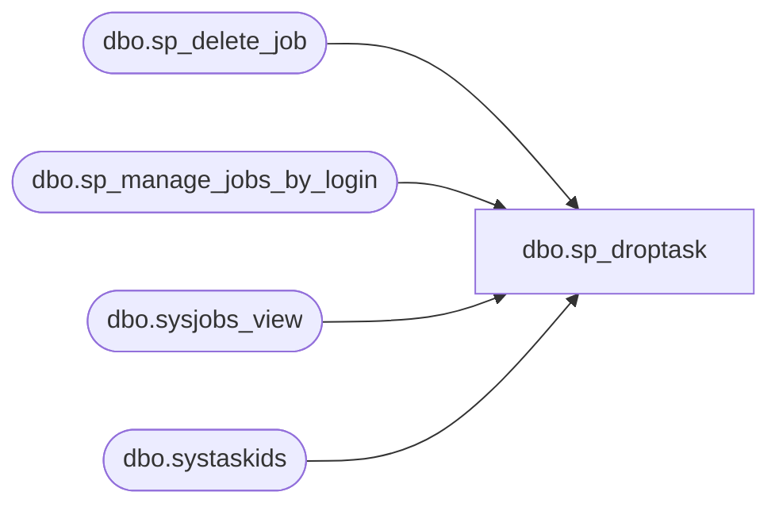

# dbo.sp_droptask

**Database:** msdb  

## Architecture Diagram



## Table Dependencies

| Referenced Table |
|---|
| dbo.sp_delete_job |
| dbo.sp_manage_jobs_by_login |
| dbo.sysjobs_view |
| dbo.systaskids |

## Stored Procedure Code

```sql
CREATE PROCEDURE sp_droptask
  @name      sysname = NULL, -- Was VARCHAR(100) in 6.x
  @loginname sysname = NULL, -- Was VARCHAR(30) in 6.x
  @id        INT     = NULL
AS
BEGIN
  DECLARE @retval INT
  DECLARE @job_id UNIQUEIDENTIFIER
  DECLARE @category_id int

  SET NOCOUNT ON

  IF ((@name      IS NULL)     AND (@id    IS NULL)     AND (@loginname IS NULL)) OR
     ((@name      IS NOT NULL) AND ((@id   IS NOT NULL) OR  (@loginname IS NOT NULL))) OR
     ((@id        IS NOT NULL) AND ((@name IS NOT NULL) OR  (@loginname IS NOT NULL))) OR
     ((@loginname IS NOT NULL) AND ((@name IS NOT NULL) OR  (@id        IS NOT NULL)))
  BEGIN
    RAISERROR(14245, -1, -1)
    RETURN(1) -- Failure
  END

  -- If the name is supplied, get the job_id directly from sysjobs
  IF (@name IS NOT NULL)
  BEGIN
    -- Check if the name is ambiguous
    IF ((SELECT COUNT(*)
         FROM msdb.dbo.sysjobs_view
         WHERE (name = @name)) > 1)
    BEGIN
      RAISERROR(14292, -1, -1, @name, '@id', '@name')
      RETURN(1) -- Failure
    END

    SELECT @job_id = job_id, @category_id = category_id
    FROM msdb.dbo.sysjobs_view
    WHERE (name = @name)

    SELECT @id = task_id
    FROM msdb.dbo.systaskids
    WHERE (job_id = @job_id)

    IF (@job_id IS NULL)
    BEGIN
      RAISERROR(14262, -1, -1, '@name', @name)
      RETURN(1) -- Failure
    END
  END

  -- If the id is supplied lookup the corresponding job_id from systaskids
  IF (@id IS NOT NULL)
  BEGIN
    SELECT @job_id = job_id
    FROM msdb.dbo.systaskids
    WHERE (task_id = @id)

    -- Check that the job still exists
    IF (NOT EXISTS (SELECT *
                    FROM msdb.dbo.sysjobs_view
                    WHERE (job_id = @job_id)))
    BEGIN
      SELECT @name = CONVERT(NVARCHAR, @id)
      RAISERROR(14262, -1, -1, '@id', @name)
      RETURN(1) -- Failure
    END

    -- Get the name of this job
    SELECT @name = name, @category_id = category_id
    FROM msdb.dbo.sysjobs_view
    WHERE (job_id = @job_id)
  END

  -- Delete the specific job
  IF (@name IS NOT NULL)
  BEGIN
    BEGIN TRANSACTION

    DELETE FROM msdb.dbo.systaskids
    WHERE (job_id = @job_id)
    EXECUTE @retval = sp_delete_job @job_id = @job_id
    IF (@retval <> 0)
   BEGIN
      ROLLBACK TRANSACTION
     GOTO Quit
   END

   -- If a Logreader or Snapshot task, delete corresponding replication agent information
   IF @category_id = 13 or @category_id = 15
   BEGIN
        EXECUTE @retval = sp_MSdrop_6x_replication_agent @job_id, @category_id
     IF (@retval <> 0)
     BEGIN
      ROLLBACK TRANSACTION
      GOTO Quit
     END
   END

    COMMIT TRANSACTION
  END

  -- Delete all jobs belonging to the specified login
  IF (@loginname IS NOT NULL)
  BEGIN
    BEGIN TRANSACTION

    DELETE FROM msdb.dbo.systaskids
    WHERE job_id IN (SELECT job_id
                     FROM msdb.dbo.sysjobs_view
                     WHERE (owner_sid = SUSER_SID(@loginname)))
    EXECUTE @retval = sp_manage_jobs_by_login @action = 'DELETE',
                                              @current_owner_login_name = @loginname
    IF (@retval <> 0)
    BEGIN
      ROLLBACK TRANSACTION
      GOTO Quit
    END     

    COMMIT TRANSACTION
  END

Quit:
  RETURN(@retval) -- 0 means success

END

dbo,sp_DTA_add_session,create procedure sp_DTA_add_session 
   @SessionName sysname, 
   @TuningOptions nvarchar(max),
   @SessionID int OUTPUT,
   @GlobalSessionID uniqueidentifier = NULL
as 
	declare @UserName as nvarchar(256) 
	declare	@x_SessionName sysname
	declare @ErrorString nvarchar(500)
	declare @XmlDocumentHandle int
	declare @retval int
	declare @dbcount int
	
	set nocount on
	begin transaction
		-- Check for duplicate session name
		select @x_SessionName = @SessionName
		from msdb.dbo.DTA_input
		where SessionName = @SessionName

		if (@x_SessionName IS NOT NULL)
			begin
				rollback transaction
				set @ErrorString = 'The session ' + '"' + LTRIM(RTRIM(@SessionName)) + '"' +' already exists. Please use a different session name.'
				raiserror (31001, -1,-1,@SessionName)
				return(1)
			end		
		
		-- Create new session
				
		if (@GlobalSessionID IS NOT NULL)
			begin
				insert into msdb.dbo.DTA_input (SessionName,TuningOptions, GlobalSessionID) 
				values (@SessionName,@TuningOptions,@GlobalSessionID) 
			end
		else
			begin
				insert into msdb.dbo.DTA_input (SessionName,TuningOptions) 
				values (@SessionName,@TuningOptions) 
			end

		select @SessionID = @@identity	

		
		if @@error <> 0
			begin
				rollback transaction
				return @@error
			end				


		if @@error <> 0
			begin
				rollback transaction
				return @@error
			end				

				-- Create an internal representation of the XML document.
				EXEC sp_xml_preparedocument @XmlDocumentHandle OUTPUT, @TuningOptions,
				'<DTAXML  xmlns:xsi="http://www.w3.org/2001/XMLSchema-instance" xmlns:x="http://schemas.microsoft.com/sqlserver/2004/07/dta"/>'
				
				if @@error <> 0
				begin
					rollback transaction
					return @@error
				end		
				-- Execute a SELECT statement using OPENXML rowset provider.

				insert into DTA_reports_database
				SELECT    @SessionID,msdb.dbo.fn_DTA_unquote_dbname([x:Name]),1
				FROM      OPENXML (@XmlDocumentHandle, 
									'/x:DTAXML/x:DTAInput/x:Server//x:Database',2)
						WITH ([x:Name]  nvarchar(128) ) 
				
				if @@error <> 0
				begin
					rollback transaction
					return @@error
				end		
			
				EXEC sp_xml_removedocument @XmlDocumentHandle

				if @@error <> 0
				begin
					rollback transaction
					return @@error
				end		
				
				

		
			-- Check if allowed to add session
			exec @retval =  sp_DTA_check_permission @SessionID

			if @retval = 1
			begin
				raiserror(31003,-1,-1)
				rollback transaction
				return (1)
			end	

			select @dbcount = count(*) from DTA_reports_database
			where SessionID = @SessionID			
			if @dbcount = 0 
			begin
				rollback transaction
				return (1)
			end

		-- Insert progress record
		insert into [msdb].[dbo].[DTA_progress]
		(SessionID,WorkloadConsumption,EstImprovement,TuningStage,ConsumingWorkLoadMessage,PerformingAnalysisMessage,GeneratingReportsMessage)
		values(@SessionID,0,0,0,N'',N'',N'')

		if @@error <> 0
		begin
			rollback transaction
			return @@error
		end		

		
	-- Commit if input/progress records are updated
	commit transaction
	return 0

dbo,sp_DTA_check_permission,create procedure sp_DTA_check_permission 
				@SessionID int
as 
begin
	declare @retcode  int
	declare @dbname nvarchar(128)	
	declare @sql nvarchar(256)
	declare @dbid int
	declare @ServVersion nvarchar(128)
	
	set nocount on
	set @retcode = 1

	-- Check if SA
	if (isnull(IS_SRVROLEMEMBER(N'sysadmin'), 0) = 1)
	begin
		return(0) 
	end
	
	-- if SQL Server 2000 return
	select @ServVersion=CONVERT(nvarchar(128), serverproperty(N'ProductVersion'))
	if (patindex('8.%',@ServVersion) > 0)
	begin
		return (1)
	end
	
	-- declare and open a cursor and get all the databases specified in the input
	declare db_cursor cursor for
	select DatabaseName from DTA_reports_database
	where SessionID = @SessionID and IsDatabaseSelectedToTune  = 1
	-- open
	open db_cursor
	-- fetch first db name
	fetch next from db_cursor
	into @dbname
	-- loop and get all the databases selected to tune
	while @@fetch_status = 0
	begin
		-- build use db string
		select  @dbid = DB_ID(@dbname)
	
		-- set @retcode to OK. Will be set to 1 in case of issues
		set @retcode = 0

		-- In Yukon this masks the error messages
		set @sql = N'begin try
			dbcc autopilot(5,@dbid) WITH NO_INFOMSGS 
		end try
		begin catch
			set @retcode = 1
		end catch'

		execute sp_executesql @sql
			, N'@dbid int output, @retcode int OUTPUT' 
			, @dbid output 
			, @retcode output
	
		-- if caller is not member of dbo
		if (@retcode = 1)
		begin
			-- close and reset cursor,switch context to current
			-- database and return 1
			close db_cursor
			deallocate db_cursor
			return(1)
		end
		fetch from db_cursor into @dbname
	end
	-- close and reset cursor,switch context to current
	-- database and return 1
	close db_cursor
	deallocate db_cursor
	-- if caller is not member of dbo
	if (@retcode = 1)
	begin
		return(1)
	end
	return(0) 
end		

dbo,sp_DTA_cleanup_hypothetical_metadata,create procedure sp_DTA_cleanup_hypothetical_metadata
	@DatabaseName sysname
as
begin

	declare @SQL nvarchar(max) 

	select @SQL = N'
	declare @strSQL nvarchar(max) 
	declare @objid int 
	declare @indid int 
	declare dta_indexes cursor for select object_id, index_id from sys.indexes where name LIKE ''%dta%'' order by name 
	open dta_indexes 
	fetch NEXT from dta_indexes into @objid, @indid 
	while (@@fetch_status != -1) 
	begin 
	select @strSQL = (select case when INDEXPROPERTY(i.object_id, i.name, ''IsStatistics'') = 1 then ''drop statistics ['' else ''drop index ['' end + schema_name(s.schema_id) + ''].['' + object_name(i.object_id) + ''].['' + i.name + '']'' 
	from sys.indexes i join sys.objects o on i.object_id = o.object_id join sys.schemas s on o.schema_id = s.schema_id
	where i.object_id = @objid and i.index_id = @indid and 
	(INDEXPROPERTY(i.object_id, i.name, ''IsHypothetical'') = 1 or
	(INDEXPROPERTY(i.object_id, i.name, ''IsStatistics'') = 1 and 
	INDEXPROPERTY(i.object_id, i.name, ''IsAutoStatistics'') = 0))) 
	EXEC(@strSQL) 
	fetch NEXT from dta_indexes into @objid, @indid
	end
	close dta_indexes 
	deallocate dta_indexes
	'

	if CHARINDEX('[', @DatabaseName) = 0
	begin
		select @DatabaseName = '[' + @DatabaseName + ']'
	end
	
	select @SQL = 'exec ' + @DatabaseName + '..sp_executesql N''' + replace(@SQL,'''','''''') + ''''
	exec (@SQL)

	return @@error
end

dbo,sp_DTA_column_access_helper_relational, create procedure sp_DTA_column_access_helper_relational
			@SessionID		int
			as
			begin select D1.DatabaseName as "Database Name" ,T1.SchemaName as "Schema Name" ,T1.TableName as "Table/View Name" ,C1.ColumnName as "Column Name" ,R.Count as "Number of references" ,CAST(R.Usage as decimal(38,2)) as "Percent Usage" from 
				[msdb].[dbo].[DTA_reports_database] as D1 ,
				[msdb].[dbo].[DTA_reports_table] as T1,
				[msdb].[dbo].[DTA_reports_column] as C1,
			
				(
					select D.DatabaseID,T.TableID,C.ColumnID,
							SUM(Q.Weight) as Count,
							100.0 *  SUM(Q.Weight) / 
							( 1.0 * (	select	CASE WHEN SUM(Q.Weight) > 0 THEN  SUM(Q.Weight)
												else 1
												end	
									
										from [msdb].[dbo].[DTA_reports_query] as Q
										where Q.SessionID = @SessionID ))
				as Usage
		from 
				[msdb].[dbo].[DTA_reports_column] as C
				LEFT OUTER JOIN
				DTA_reports_querycolumn as QC ON QC.ColumnID = C.ColumnID
				LEFT OUTER JOIN
				DTA_reports_query as Q ON QC.QueryID = Q.QueryID
				JOIN
				DTA_reports_table as T ON C.TableID = T.TableID
				JOIN
				DTA_reports_database as D ON T.DatabaseID = D.DatabaseID
				and Q.SessionID = QC.SessionID and 
				Q.SessionID = @SessionID		
				GROUP BY C.ColumnID,T.TableID,D.DatabaseID) as R
				where R.DatabaseID = D1.DatabaseID and
				R.TableID = T1.TableID and
				R.ColumnID = C1.ColumnID and
				D1.SessionID = @SessionID and
				R.Count > 0
				order by R.Count desc end 
dbo,sp_DTA_column_access_helper_xml,create procedure sp_DTA_column_access_helper_xml
			@SessionID		int
as
begin
		select 1            as Tag, 
		NULL          as Parent,
		'' as [ColumnAccessReport!1!!ELEMENT],
		NULL as [Database!2!DatabaseID!hide],
		NULL  as [Database!2!Name!ELEMENT] ,
		NULL  as [Schema!3!Name!ELEMENT] ,
		NULL as [Table!4!TableID!hide],
		NULL as [Table!4!Name!ELEMENT],
		NULL as [Column!5!ColumnID!hide],
		NULL as [Column!5!Name!ELEMENT],
		NULL as [Column!5!NumberOfReferences!ELEMENT],
		NULL as [Column!5!PercentUsage!ELEMENT]
	union all
	select 2 as Tag, 1 as Parent, NULL,
			D.DatabaseID,D.DatabaseName,
			NULL,NULL,NULL,NULL,NULL,NULL,NULL
	from [msdb].[dbo].[DTA_reports_database] as D
	where
	D.SessionID = @SessionID and
	D.DatabaseID in
	(select D.DatabaseID from
			[msdb].[dbo].[DTA_reports_querycolumn] as QC,
			[msdb].[dbo].[DTA_reports_column] as C,
			[msdb].[dbo].[DTA_reports_table] as T,
			[msdb].[dbo].[DTA_reports_database] as D
			where
			QC.ColumnID = C.ColumnID  and
			C.TableID = T.TableID and
			T.DatabaseID = D.DatabaseID and
			D.SessionID = @SessionID
			group by D.DatabaseID)
	union all
	select 3 as Tag, 2 as Parent, NULL,
			R.DatabaseID,D.DatabaseName,
			R.SchemaName,NULL,NULL,NULL,NULL,NULL,NULL
	from [msdb].[dbo].[DTA_reports_database] as D,
	(
		select D.DatabaseID,T.SchemaName from
		[msdb].[dbo].[DTA_reports_querycolumn] as QC,
		[msdb].[dbo].[DTA_reports_column] as C,
		[msdb].[dbo].[DTA_reports_table] as T,
		[msdb].[dbo].[DTA_reports_database] as D
		where
		QC.ColumnID = C.ColumnID  and
		C.TableID = T.TableID and
		T.DatabaseID = D.DatabaseID and
		D.SessionID = @SessionID
		group by D.DatabaseID,T.SchemaName
) R

	where
	D.SessionID = @SessionID and
	D.DatabaseID = R.DatabaseID
	union all
	select 4 as Tag, 3 as Parent, NULL,
			R.DatabaseID,D.DatabaseName,
			R.SchemaName,R.TableID,T.TableName,NULL,NULL,NULL,NULL
	from [msdb].[dbo].[DTA_reports_database] as D,
	 [msdb].[dbo].[DTA_reports_table] as T,
	(
		select D.DatabaseID,T.SchemaName,T.TableID from
		[msdb].[dbo].[DTA_reports_querycolumn] as QC,
		[msdb].[dbo].[DTA_reports_column] as C,
		[msdb].[dbo].[DTA_reports_table] as T,
		[msdb].[dbo].[DTA_reports_database] as D
		where
		QC.ColumnID = C.ColumnID  and
		C.TableID = T.TableID and
		T.DatabaseID = D.DatabaseID and
		D.SessionID = @SessionID
		group by D.DatabaseID,T.SchemaName,T.TableID
) R

	where
	D.SessionID = @SessionID and
	D.DatabaseID = R.DatabaseID and
	R.TableID = T.TableID and
	T.DatabaseID = D.DatabaseID

	union all
	select 5 as Tag, 4 as Parent, NULL,
			D1.DatabaseID,D1.DatabaseName,
			T1.SchemaName,T1.TableID,T1.TableName,C1.ColumnID,C1.ColumnName,
			R.Count,
			CAST(R.Usage as decimal(38,2))
	from 
	[msdb].[dbo].[DTA_reports_database]as D1 ,
	[msdb].[dbo].[DTA_reports_table] as T1,
	[msdb].[dbo].[DTA_reports_column] as C1,
	(
		select 	D.DatabaseID,T.TableID,C.ColumnID,
			SUM(Q.Weight) as Count,
			100.0 *  SUM(Q.Weight) / 
			( 1.0 * (	select	CASE WHEN SUM(Q.Weight) > 0 THEN  SUM(Q.Weight)
					else 1
					end	
					from [msdb].[dbo].[DTA_reports_query] as Q
					where Q.SessionID = @SessionID )) as Usage
		from 
			[msdb].[dbo].[DTA_reports_column] as C
			LEFT OUTER JOIN
			[msdb].[dbo].[DTA_reports_querycolumn] as QC ON QC.ColumnID = C.ColumnID
			LEFT OUTER JOIN
			[msdb].[dbo].[DTA_reports_query] as Q ON QC.QueryID = Q.QueryID
			JOIN
			[msdb].[dbo].[DTA_reports_table] as T ON C.TableID = T.TableID
			JOIN
			[msdb].[dbo].[DTA_reports_database] as D ON T.DatabaseID = D.DatabaseID
			and Q.SessionID = QC.SessionID and 
			Q.SessionID = @SessionID		
			GROUP BY C.ColumnID,T.TableID,D.DatabaseID ) as R

			where R.DatabaseID = D1.DatabaseID and
			R.TableID = T1.TableID and
			R.ColumnID = C1.ColumnID and
			D1.SessionID = @SessionID and
			R.Count > 0

	order by [Database!2!DatabaseID!hide],[Schema!3!Name!ELEMENT],[Table!4!TableID!hide],[Column!5!NumberOfReferences!ELEMENT] , [Column!5!ColumnID!hide] 
	FOR XML EXPLICIT
end

dbo,sp_DTA_database_access_helper_relational, create procedure sp_DTA_database_access_helper_relational
			@SessionID		int
			as
			begin select D1.DatabaseName as "Database Name" ,R.Count as "Number of references" ,CAST(R.Usage as decimal(38,2)) as "Percent Usage" from 
				[msdb].[dbo].[DTA_reports_database] as D1 ,
				(
					select D.DatabaseID,SUM(Q.Weight) as Count,
							100.0 *  SUM(Q.Weight) / 
							( 1.0 * (	select	CASE WHEN SUM(Q.Weight) > 0 THEN  SUM(Q.Weight)
												else 1
												end	
									
										from [msdb].[dbo].[DTA_reports_query] as Q
										where Q.SessionID = @SessionID ))
				as Usage
		from 
					[msdb].[dbo].[DTA_reports_database] as D
					LEFT OUTER JOIN
					[msdb].[dbo].[DTA_reports_querydatabase] as QD ON QD.DatabaseID = D.DatabaseID
					LEFT OUTER JOIN
					DTA_reports_query as Q ON QD.QueryID = Q.QueryID
					and Q.SessionID = QD.SessionID and 
					Q.SessionID = @SessionID		
					GROUP BY D.DatabaseID
				) as R
				where R.DatabaseID = D1.DatabaseID  and
				D1.SessionID = @SessionID and
				R.Count > 0
				order by R.Count desc  end
dbo,sp_DTA_database_access_helper_xml,create procedure sp_DTA_database_access_helper_xml
			@SessionID		int
as
begin
	select 1            as Tag, 
			NULL          as Parent,
			'' as [DatabaseAccessReport!1!!ELEMENT],
			NULL  as [Database!2!Name!ELEMENT] ,
			NULL as [Database!2!NumberOfReferences!ELEMENT],
			NULL as [Database!2!PercentUsage!ELEMENT]
		union all


	select 2 as Tag, 1 as Parent,NULL,D1.DatabaseName  ,
	R.Count  ,
	CAST(R.Usage as decimal(38,2))  from 
					[msdb].[dbo].[DTA_reports_database] as D1 ,
					(
						select D.DatabaseID,SUM(Q.Weight) as Count,
								100.0 *  SUM(Q.Weight) / 
								( 1.0 * (	select	CASE WHEN SUM(Q.Weight) > 0 THEN  SUM(Q.Weight)
													else 1
													end	
										
											from [msdb].[dbo].[DTA_reports_query] as Q
											where Q.SessionID = @SessionID ))
					as Usage
			from 
						[msdb].[dbo].[DTA_reports_database] as D
						LEFT OUTER JOIN
						[msdb].[dbo].[DTA_reports_querydatabase] as QD ON QD.DatabaseID = D.DatabaseID
						LEFT OUTER JOIN
						[msdb].[dbo].[DTA_reports_query] as Q ON QD.QueryID = Q.QueryID
						and Q.SessionID = QD.SessionID and 
						Q.SessionID = @SessionID		
						GROUP BY D.DatabaseID
					) as R
					where R.DatabaseID = D1.DatabaseID  and
					D1.SessionID = @SessionID and
					R.Count > 0
	order by Tag,[Database!2!NumberOfReferences!ELEMENT] desc
	FOR XML EXPLICIT
end
```

