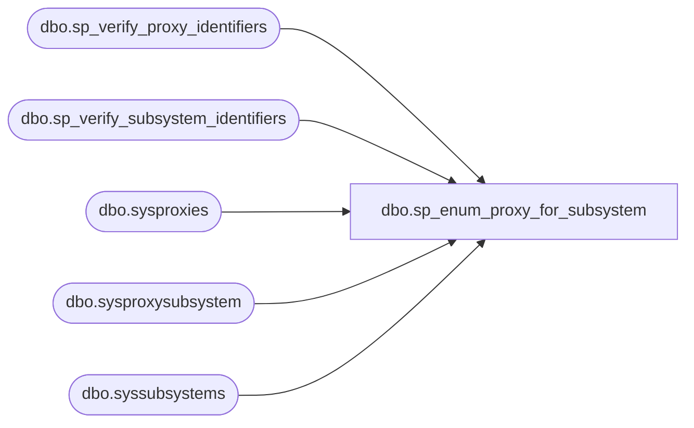

# dbo.sp_enum_proxy_for_subsystem

**Database:** msdb  

## Architecture Diagram



## Table Dependencies

| Referenced Table |
|---|
| dbo.sp_verify_proxy_identifiers |
| dbo.sp_verify_subsystem_identifiers |
| dbo.sysproxies |
| dbo.sysproxysubsystem |
| dbo.syssubsystems |

## Stored Procedure Code

```sql
CREATE PROCEDURE sp_enum_proxy_for_subsystem
   @proxy_id      int = NULL,
   @proxy_name    sysname = NULL,
   -- must specify only one of above parameter to identify the proxy or none
   @subsystem_id  int = NULL,
   @subsystem_name sysname = NULL
   -- must specify only one of above parameter to identify the subsystem or none
AS
BEGIN
   DECLARE @retval   INT
   SET NOCOUNT ON

   -- Remove any leading/trailing spaces from parameters
   SELECT @subsystem_name          = LTRIM(RTRIM(@subsystem_name))
   SELECT @proxy_name              = LTRIM(RTRIM(@proxy_name))

  -- Turn [nullable] empty string parameters into NULLs
  IF @subsystem_name    = '' SELECT @subsystem_name = NULL
  IF @proxy_name         = '' SELECT @proxy_name = NULL

   IF @proxy_name IS NOT NULL OR @proxy_id IS NOT NULL
   BEGIN
      EXECUTE @retval = sp_verify_proxy_identifiers '@proxy_name',
                                          '@proxy_id',
                                          @proxy_name OUTPUT,
                                          @proxy_id   OUTPUT
      IF (@retval <> 0)
   RETURN(1) -- Failure
   END

   IF @subsystem_name IS NOT NULL OR @subsystem_id IS NOT NULL
   BEGIN
      EXECUTE @retval = sp_verify_subsystem_identifiers '@subsystem_name',
                                       '@subsystem_id',
                                       @subsystem_name OUTPUT,
                                       @subsystem_id   OUTPUT
      IF (@retval <> 0)
      RETURN(1) -- Failure
   END

  SELECT ps.subsystem_id AS subsystem_id, s.subsystem AS subsystem_name, ps.proxy_id AS proxy_id, p.name AS proxy_name
   FROM sysproxysubsystem ps JOIN sysproxies p ON ps.proxy_id = p.proxy_id
  JOIN syssubsystems s ON ps.subsystem_id = s.subsystem_id
   WHERE
        ISNULL(@subsystem_id, ps.subsystem_id) = ps.subsystem_id AND
        ISNULL(@proxy_id,     ps.proxy_id    ) = ps.proxy_id     
END

dbo,sp_enum_sqlagent_subsystems,CREATE PROCEDURE sp_enum_sqlagent_subsystems
AS
BEGIN
  DECLARE @retval         INT
  EXEC @retval = msdb.dbo.sp_enum_sqlagent_subsystems_internal
  RETURN(@retval)
END

dbo,sp_enum_sqlagent_subsystems_internal,CREATE PROCEDURE sp_enum_sqlagent_subsystems_internal
   @syssubsytems_refresh_needed BIT = 0
AS
BEGIN
  DECLARE @retval INT
  SET NOCOUNT ON
  -- this call will populate subsystems table if necessary
  EXEC @retval = msdb.dbo.sp_verify_subsystems @syssubsytems_refresh_needed
  IF @retval <> 0
     RETURN(@retval)

  -- Check if replication is installed
  DECLARE @replication_installed INT
  EXECUTE master.dbo.xp_instance_regread N'HKEY_LOCAL_MACHINE',
                                         N'SOFTWARE\Microsoft\MSSQLServer\Replication',
                                         N'IsInstalled',
                                         @replication_installed OUTPUT,
                                         N'no_output'
  SELECT @replication_installed = ISNULL(@replication_installed, 0)

   DECLARE @subsystems TABLE
   (
      subsystem_id       INT         NOT NULL,
      subsystem          NVARCHAR(40)  NOT NULL,
      description_id     INT         NULL,
      subsystem_dll      NVARCHAR(255)  NULL,
      agent_exe          NVARCHAR(255)  NULL,
      start_entry_point  NVARCHAR(30)   NULL,
      event_entry_point  NVARCHAR(30)   NULL,
      stop_entry_point   NVARCHAR(30)   NULL,
      max_worker_threads INT           NULL  
   )
   
   -- @syssubsytems_refresh_needed is set when SQL Agent calls this proc on agent startup
   -- all other scenarios in SMO does not set @syssubsytems_refresh_needed
   IF(@syssubsytems_refresh_needed = 1)
   BEGIN
       -- system subsystems 
       INSERT INTO @subsystems
       SELECT subsystem_id, 
              subsystem,
              description_id,
              subsystem_dll,
              agent_exe,
              start_entry_point,
              event_entry_point,
              stop_entry_point,
              max_worker_threads
       FROM sys.fn_sqlagent_subsystems()
   END

   -- user subssytems
   INSERT INTO @subsystems
   SELECT subsystem_id, 
            subsystem,
            description_id,
            subsystem_dll,
            agent_exe,
            start_entry_point,
            event_entry_point,
            stop_entry_point,
            max_worker_threads
    FROM syssubsystems
            
    IF (@replication_installed = 0)
    BEGIN
        SELECT  subsystem,
            description = FORMATMESSAGE(description_id),
            subsystem_dll,
            agent_exe,
            start_entry_point,
            event_entry_point,
            stop_entry_point,
            max_worker_threads,
            subsystem_id
        FROM @subsystems
        WHERE (subsystem NOT IN (N'Distribution', N'LogReader', N'Merge', N'Snapshot', N'QueueReader'))
        ORDER by subsystem
    END
    ELSE
    BEGIN
        SELECT  subsystem,
            description = FORMATMESSAGE(description_id),
            subsystem_dll,
            agent_exe,
            start_entry_point,
            event_entry_point,
            stop_entry_point,
            max_worker_threads,
            subsystem_id
        FROM @subsystems
        ORDER by subsystem_id
    END
      
  RETURN(0)      
END

dbo,sp_ExternalMailQueueListener,-- Processes messages from the external mail queue
--
CREATE PROCEDURE [dbo].[sp_ExternalMailQueueListener]
AS
BEGIN
    DECLARE 
        @mailitem_id        INT,
        @sent_status        INT,
        @sent_account_id    INT,
        @rc                 INT,
        @processId          INT,
        @sent_date          DATETIME,
        @localmessage       NVARCHAR(max),
        @conv_handle        uniqueidentifier,
       @message_type_name  NVARCHAR(256),
       @xml_message_body   NVARCHAR(max),
        @LogMessage         NVARCHAR(max)

    -- Table to store message information.
    DECLARE @msgs TABLE
    (
        [conversation_handle]   uniqueidentifier,
       [message_type_name]     nvarchar(256),
       [message_body]          varbinary(max)
    )

    --RECEIVE messages from the external queue. 
    --MailItem status messages are sent from the external sql mail process along with other SSB notifications and errors
    ;RECEIVE conversation_handle, message_type_name, message_body FROM InternalMailQueue INTO @msgs
    -- Check if there was some error in reading from queue
    SET @rc = @@ERROR
    IF (@rc <> 0)
    BEGIN
        --Log error and continue. Don't want to block the following messages on the queue
        SET @localmessage = FORMATMESSAGE(@@ERROR)
        exec msdb.dbo.sysmail_logmailevent_sp @event_type=3, @description=@localmessage

        GOTO ErrorHandler;
    END
   
    -----------------------------------
    --Process sendmail status messages
    SELECT 
        @conv_handle        = conversation_handle,
        @message_type_name  = message_type_name, 
		@xml_message_body   = CAST(message_body AS NVARCHAR(MAX))
    FROM @msgs 
    WHERE [message_type_name] = N'{//www.microsoft.com/databasemail/messages}SendMailStatus'

    IF(@message_type_name IS NOT NULL)
    BEGIN
        --
        --Expecting the xml body to be n the following form:
        --
        --<?xml version="1.0" encoding="utf-16"?>
        --<responses:SendMail xmlns:xsi="http://www.w3.org/2001/XMLSchema-instance" xsi:schemaLocation="http://schemas.microsoft.com/databasemail/responses ResponseTypes.xsd" xmlns:responses="http://schemas.microsoft.com/databasemail/responses">
        --<Information>
        --    <Failure Message="THe error message...."/>
        --</Information>
        --<MailItemId Id="1" />
        --<SentStatus Status="3" />
        --<SentAccountId Id="0" />
        --<SentDate Date="2005-03-30T14:55:13" />
        --<CallingProcess Id="3012" />
        --</responses:SendMail>

        DECLARE @xmlblob xml
        SET  @xmlblob = CONVERT(xml, @xml_message_body)

        SELECT  @mailitem_id = MailResponses.Properties.value('(MailItemId/@Id)[1]', 'int'),
                @sent_status = MailResponses.Properties.value('(SentStatus/@Status)[1]', 'int'),
                @sent_account_id = MailResponses.Properties.value('(SentAccountId/@Id)[1]', 'int'),
                @sent_date = MailResponses.Properties.value('(SentDate/@Date)[1]', 'DateTime'),
                @processId = MailResponses.Properties.value('(CallingProcess/@Id)[1]', 'int'),
                @LogMessage = MailResponses.Properties.value('(Information/Failure/@Message)[1]', 'NVARCHAR(max)')
        FROM @xmlblob.nodes('
        declare namespace responses="http://schemas.microsoft.com/databasemail/responses";
        /responses:SendMail') 
        AS MailResponses(Properties) 

        IF(@mailitem_id IS NULL)
        BEGIN  
            --Log error and continue. Don't want to block the following messages on the queue by rolling back the tran
            SET @localmessage = FORMATMESSAGE(14652, CONVERT(NVARCHAR(50), @conv_handle), @message_type_name, @xml_message_body)
            exec msdb.dbo.sysmail_logmailevent_sp @event_type=3, @description=@localmessage
        END      
        ELSE
        BEGIN
            -- check sent_status is valid : 0(PendingSend), 1(SendSuccessful), 2(SendFailed), 3(AttemptingSendRetry)
            IF(@sent_status NOT IN (1, 2, 3))
            BEGIN
                SET @localmessage = FORMATMESSAGE(14653, N'SentStatus', CONVERT(NVARCHAR(50), @conv_handle), @message_type_name, @xml_message_body)
                exec msdb.dbo.sysmail_logmailevent_sp @event_type=2, @description=@localmessage

                --Set value to SendFailed
                SET @sent_status = 2
            END

            --Make the @sent_account_id NULL if it is 0. 
            IF(@sent_account_id IS NOT NULL AND @sent_account_id = 0)
                SET @sent_account_id = NULL

            --
            -- Update the mail status if not a retry. Nothing else needs to be done in this case
            UPDATE sysmail_mailitems
            SET sent_status     = CAST (@sent_status as TINYINT),
                sent_account_id = @sent_account_id,
                sent_date       = @sent_date
            WHERE mailitem_id = @mailitem_id
        
            -- Report a failure if no record is found in the sysmail_mailitems table
            IF (@@ROWCOUNT = 0)
            BEGIN
                SET @localmessage = FORMATMESSAGE(14653, N'MailItemId', CONVERT(NVARCHAR(50), @conv_handle), @message_type_name, @xml_message_body)
                exec msdb.dbo.sysmail_logmailevent_sp @event_type=3, @description=@localmessage
            END

            IF (@LogMessage IS NOT NULL)
            BEGIN
                exec msdb.dbo.sysmail_logmailevent_sp @event_type=3, @description=@LogMessage, @process_id=@processId, @mailitem_id=@mailitem_id, @account_id=@sent_account_id
            END
        END
    END

    -------------------------------------------------------
    --Process all other messages by logging to sysmail_log
    SET @conv_handle = NULL;
    
    --Always end the conversion if this message is received
    SELECT @conv_handle = conversation_handle
    FROM @msgs 
    WHERE [message_type_name] = N'http://schemas.microsoft.com/SQL/ServiceBroker/EndDialog'
    
    IF(@conv_handle IS NOT NULL)
    BEGIN
        END CONVERSATION @conv_handle;
    END

    DECLARE @queuemessage nvarchar(max)
    DECLARE queue_messages_cursor CURSOR LOCAL 
    FOR
        SELECT FORMATMESSAGE(14654, CONVERT(NVARCHAR(50), conversation_handle), message_type_name, message_body)
        FROM @msgs 
        WHERE [message_type_name] 
              NOT IN (N'http://schemas.microsoft.com/SQL/ServiceBroker/EndDialog',
                      N'{//www.microsoft.com/databasemail/messages}SendMailStatus')
  
    OPEN queue_messages_cursor 
    FETCH NEXT FROM queue_messages_cursor INTO @queuemessage
    WHILE (@@fetch_status = 0)
    BEGIN
        exec msdb.dbo.sysmail_logmailevent_sp @event_type=2, @description=@queuemessage
        FETCH NEXT FROM queue_messages_cursor INTO @queuemessage
    END
    CLOSE queue_messages_cursor 
    DEALLOCATE queue_messages_cursor 

    -- All done OK
    goto ExitProc;

    -----------------
    -- Error Handler
    -----------------
ErrorHandler:

    ------------------
    -- Exit Procedure
    ------------------
ExitProc:
    RETURN (@rc)
END

dbo,sp_generate_server_description,CREATE PROCEDURE sp_generate_server_description
  @description NVARCHAR(100) = NULL OUTPUT,
  @result_set  BIT = 0
AS
BEGIN
  SET NOCOUNT ON

  DECLARE @xp_results TABLE
  (
  id              INT           NOT NULL,
  name            NVARCHAR(30)  COLLATE database_default NOT NULL,
  internal_value  INT           NULL,
  character_value NVARCHAR(212) COLLATE database_default NULL
  )
  INSERT INTO @xp_results
  EXECUTE master.dbo.xp_msver

  UPDATE @xp_results
  SET character_value = FORMATMESSAGE(14205)
  WHERE (character_value IS NULL)

  SELECT @description = (SELECT character_value FROM @xp_results WHERE (id = 1)) + N' ' +
                        (SELECT character_value FROM @xp_results WHERE (id = 2)) + N' / Windows ' +
                        (SELECT character_value FROM @xp_results WHERE (id = 15)) + N' / ' +
                        (SELECT character_value FROM @xp_results WHERE (id = 16)) + N' ' +
                        (SELECT CASE character_value
                                  WHEN N'PROCESSOR_INTEL_386'     THEN N'386'
                                  WHEN N'PROCESSOR_INTEL_486'     THEN N'486'
                                  WHEN N'PROCESSOR_INTEL_PENTIUM' THEN N'Pentium'
                                  WHEN N'PROCESSOR_MIPS_R4000'    THEN N'MIPS'
                                  WHEN N'PROCESSOR_ALPHA_21064'   THEN N'Alpha'
                                  ELSE character_value
                                END
                         FROM @xp_results WHERE (id = 18)) + N' CPU(s) / ' +
                        (SELECT CONVERT(NVARCHAR, internal_value) FROM @xp_results WHERE (id = 19)) + N' MB RAM.'
  IF (@result_set = 1)
    SELECT @description
END

dbo,sp_generate_target_server_job_assignment_sql,CREATE PROCEDURE sp_generate_target_server_job_assignment_sql
  @server_name     sysname = NULL, 
  @new_server_name sysname = NULL  -- Use this if the target server computer has been renamed
AS
BEGIN
  SET NOCOUNT ON

  -- Change server name to always reflect real servername or servername\instancename
  IF (@server_name IS NULL) OR (UPPER(@server_name collate SQL_Latin1_General_CP1_CS_AS) = '(LOCAL)')
    SELECT @server_name = CONVERT(sysname, SERVERPROPERTY('ServerName'))
  
  IF (@server_name IS NOT NULL) 
    SELECT @server_name = UPPER(@server_name)

  -- Verify the server name
  IF (@server_name <> UPPER(CONVERT(sysname, SERVERPROPERTY('ServerName')))) AND
     (NOT EXISTS (SELECT *
                  FROM msdb.dbo.systargetservers
                  WHERE (UPPER(server_name) = @server_name)))
  BEGIN
    RAISERROR(14262, 16, 1, '@server_name', @server_name)
    RETURN(1) -- Failure
  END

  IF (EXISTS (SELECT *
              FROM msdb.dbo.sysjobservers    sjs,
                   msdb.dbo.systargetservers sts
              WHERE (sjs.server_id = sts.server_id)
                AND (UPPER(sts.server_name) = @server_name)))
  BEGIN
    -- Generate the SQL
    SELECT 'Execute this SQL to re-assign jobs to the target server' =
           'EXECUTE msdb.dbo.sp_add_jobserver @job_id = ''' + CONVERT(VARCHAR(36), sjs.job_id) +
           ''', @server_name = ''' +  ISNULL(@new_server_name, sts.server_name) + ''''
    FROM msdb.dbo.sysjobservers    sjs,
         msdb.dbo.systargetservers sts
    WHERE (sjs.server_id = sts.server_id)
      AND (UPPER(sts.server_name) = @server_name)
  END
  ELSE
    RAISERROR(14548, 10, 1, @server_name)

  RETURN(0) -- Success
END

dbo,sp_get_chunked_jobstep_params,CREATE PROCEDURE sp_get_chunked_jobstep_params
  @job_name sysname,
  @step_id  INT = 1
AS
BEGIN
  DECLARE @job_id           UNIQUEIDENTIFIER
  DECLARE @step_id_as_char  VARCHAR(10)
  DECLARE @retval           INT

  SET NOCOUNT ON

  -- Check that the job exists
  EXECUTE @retval = sp_verify_job_identifiers '@job_name',
                                              '@job_id',
                                               @job_name OUTPUT,
                                               @job_id   OUTPUT
  IF (@retval <> 0)
    RETURN(1) -- Failure

  -- Check that the step exists
  IF (NOT EXISTS (SELECT *
                  FROM msdb.dbo.sysjobsteps
                  WHERE (job_id = @job_id)
                    AND (step_id = @step_id)))
  BEGIN
    SELECT @step_id_as_char = CONVERT(VARCHAR(10), @step_id)
    RAISERROR(14262, -1, -1, '@step_id', @step_id_as_char)
    RETURN(1) -- Failure
  END

  -- Return the sysjobsteps.additional_parameters 
  SELECT additional_parameters
  FROM msdb.dbo.sysjobsteps
  WHERE (job_id = @job_id)
    AND (step_id = @step_id)


  RETURN(@@error) -- 0 means success
END

dbo,sp_get_composite_job_info,CREATE PROCEDURE sp_get_composite_job_info
  @job_id             UNIQUEIDENTIFIER = NULL,
  @job_type           VARCHAR(12)      = NULL,  -- LOCAL or MULTI-SERVER
  @owner_login_name   sysname          = NULL,
  @subsystem          NVARCHAR(40)     = NULL,
  @category_id        INT              = NULL,
  @enabled            TINYINT          = NULL,
  @execution_status   INT              = NULL,  -- 0 = Not idle or suspended, 1 = Executing, 2 = Waiting For Thread, 3 = Between Retries, 4 = Idle, 5 = Suspended, [6 = WaitingForStepToFinish], 7 = PerformingCompletionActions
  @date_comparator    CHAR(1)          = NULL,  -- >, < or =
  @date_created       DATETIME         = NULL,
  @date_last_modified DATETIME         = NULL,
  @description        NVARCHAR(512)    = NULL,  -- We do a LIKE on this so it can include wildcards
  @schedule_id        INT              = NULL   -- if supplied only return the jobs that use this schedule
AS
BEGIN
  DECLARE @can_see_all_running_jobs INT
  DECLARE @job_owner   sysname

  SET NOCOUNT ON

  -- By 'composite' we mean a combination of sysjobs and xp_sqlagent_enum_jobs data.
  -- This proc should only ever be called by sp_help_job, so we don't verify the
  -- parameters (sp_help_job has already done this).

  -- Step 1: Create intermediate work tables
  DECLARE @job_execution_state TABLE (job_id                  UNIQUEIDENTIFIER NOT NULL,
                                     date_started            INT              NOT NULL,
                                     time_started            INT              NOT NULL,
                                     execution_job_status    INT              NOT NULL,
                                     execution_step_id       INT              NULL,
                                     execution_step_name     sysname          COLLATE database_default NULL,
                                     execution_retry_attempt INT              NOT NULL,
                                     next_run_date           INT              NOT NULL,
                                     next_run_time           INT              NOT NULL,
                                     next_run_schedule_id    INT              NOT NULL)
  DECLARE @filtered_jobs TABLE (job_id                   UNIQUEIDENTIFIER NOT NULL,
                               date_created             DATETIME         NOT NULL,
                               date_last_modified       DATETIME         NOT NULL,
                               current_execution_status INT              NULL,
                               current_execution_step   NVARCHAR(MAX)          COLLATE database_default NULL,
                               current_retry_attempt    INT              NULL,
                               last_run_date            INT              NOT NULL,
                               last_run_time            INT              NOT NULL,
                               last_run_outcome         INT              NOT NULL,
                               next_run_date            INT              NULL,
                               next_run_time            INT              NULL,
                               next_run_schedule_id     INT              NULL,
                               type                     INT              NOT NULL)
  DECLARE @xp_results TABLE (job_id                UNIQUEIDENTIFIER NOT NULL,
                            last_run_date         INT              NOT NULL,
                            last_run_time         INT              NOT NULL,
                            next_run_date         INT              NOT NULL,
                            next_run_time         INT              NOT NULL,
                            next_run_schedule_id  INT              NOT NULL,
                            requested_to_run      INT              NOT NULL, -- BOOL
                            request_source        INT              NOT NULL,
                            request_source_id     sysname          COLLATE database_default NULL,
                            running               INT              NOT NULL, -- BOOL
                            current_step          INT              NOT NULL,
                            current_retry_attempt INT              NOT NULL,
                            job_state             INT              NOT NULL)

  -- Step 2: Capture job execution information (for local jobs only since that's all SQLServerAgent caches)
  SELECT @can_see_all_running_jobs = ISNULL(IS_SRVROLEMEMBER(N'sysadmin'), 0)
  IF (@can_see_all_running_jobs = 0)
  BEGIN
    SELECT @can_see_all_running_jobs = ISNULL(IS_MEMBER(N'SQLAgentReaderRole'), 0)
  END
  SELECT @job_owner = SUSER_SNAME()

  IF ((@@microsoftversion / 0x01000000) >= 8) -- SQL Server 8.0 or greater
    INSERT INTO @xp_results
    EXECUTE master.dbo.xp_sqlagent_enum_jobs @can_see_all_running_jobs, @job_owner, @job_id
  ELSE
    INSERT INTO @xp_results
    EXECUTE master.dbo.xp_sqlagent_enum_jobs @can_see_all_running_jobs, @job_owner

  INSERT INTO @job_execution_state
  SELECT xpr.job_id,
         xpr.last_run_date,
         xpr.last_run_time,
         xpr.job_state,
         sjs.step_id,
         sjs.step_name,
         xpr.current_retry_attempt,
         xpr.next_run_date,
         xpr.next_run_time,
         xpr.next_run_schedule_id
  FROM @xp_results                          xpr
       LEFT OUTER JOIN msdb.dbo.sysjobsteps sjs ON ((xpr.job_id = sjs.job_id) AND (xpr.current_step = sjs.step_id)),
       msdb.dbo.sysjobs_view                sjv
  WHERE (sjv.job_id = xpr.job_id)

  -- Step 3: Filter on everything but dates and job_type
  IF ((@subsystem        IS NULL) AND
      (@owner_login_name IS NULL) AND
      (@enabled          IS NULL) AND
      (@category_id      IS NULL) AND
      (@execution_status IS NULL) AND
      (@description      IS NULL) AND
      (@job_id           IS NULL))
  BEGIN
    -- Optimize for the frequently used case...
    INSERT INTO @filtered_jobs
    SELECT sjv.job_id,
           sjv.date_created,
           sjv.date_modified,
           ISNULL(jes.execution_job_status, 4), -- Will be NULL if the job is non-local or is not in @job_execution_state (NOTE: 4 = STATE_IDLE)
           CASE ISNULL(jes.execution_step_id, 0)
             WHEN 0 THEN NULL                   -- Will be NULL if the job is non-local or is not in @job_execution_state
             ELSE CONVERT(NVARCHAR, jes.execution_step_id) + N' (' + jes.execution_step_name + N')'
           END,
           jes.execution_retry_attempt,         -- Will be NULL if the job is non-local or is not in @job_execution_state
           0,  -- last_run_date placeholder    (we'll fix it up in step 3.3)
           0,  -- last_run_time placeholder    (we'll fix it up in step 3.3)
           5,  -- last_run_outcome placeholder (we'll fix it up in step 3.3 - NOTE: We use 5 just in case there are no jobservers for the job)
           jes.next_run_date,                   -- Will be NULL if the job is non-local or is not in @job_execution_state
           jes.next_run_time,                   -- Will be NULL if the job is non-local or is not in @job_execution_state
           jes.next_run_schedule_id,            -- Will be NULL if the job is non-local or is not in @job_execution_state
           0   -- type placeholder             (we'll fix it up in step 3.4)
    FROM msdb.dbo.sysjobs_view                sjv
         LEFT OUTER JOIN @job_execution_state jes ON (sjv.job_id = jes.job_id)
    WHERE ((@schedule_id IS NULL)
      OR   (EXISTS(SELECT * 
                 FROM sysjobschedules as js
                 WHERE (sjv.job_id = js.job_id)
                   AND (js.schedule_id = @schedule_id))))
  END
  ELSE
  BEGIN
    INSERT INTO @filtered_jobs
    SELECT DISTINCT
           sjv.job_id,
           sjv.date_created,
           sjv.date_modified,
           ISNULL(jes.execution_job_status, 4), -- Will be NULL if the job is non-local or is not in @job_execution_state (NOTE: 4 = STATE_IDLE)
           CASE ISNULL(jes.execution_step_id, 0)
             WHEN 0 THEN NULL                   -- Will be NULL if the job is non-local or is not in @job_execution_state
             ELSE CONVERT(NVARCHAR, jes.execution_step_id) + N' (' + jes.execution_step_name + N')'
           END,
           jes.execution_retry_attempt,         -- Will be NULL if the job is non-local or is not in @job_execution_state
           0,  -- last_run_date placeholder    (we'll fix it up in step 3.3)
           0,  -- last_run_time placeholder    (we'll fix it up in step 3.3)
           5,  -- last_run_outcome placeholder (we'll fix it up in step 3.3 - NOTE: We use 5 just in case there are no jobservers for the job)
           jes.next_run_date,                   -- Will be NULL if the job is non-local or is not in @job_execution_state
           jes.next_run_time,                   -- Will be NULL if the job is non-local or is not in @job_execution_state
           jes.next_run_schedule_id,            -- Will be NULL if the job is non-local or is not in @job_execution_state
           0   -- type placeholder             (we'll fix it up in step 3.4)
    FROM msdb.dbo.sysjobs_view                sjv
         LEFT OUTER JOIN @job_execution_state jes ON (sjv.job_id = jes.job_id)
         LEFT OUTER JOIN msdb.dbo.sysjobsteps sjs ON (sjv.job_id = sjs.job_id)
    WHERE ((@subsystem        IS NULL) OR (sjs.subsystem            = @subsystem))
      AND ((@owner_login_name IS NULL) 
          OR (sjv.owner_sid            = dbo.SQLAGENT_SUSER_SID(@owner_login_name)))--force case insensitive comparation for NT users
      AND ((@enabled          IS NULL) OR (sjv.enabled              = @enabled))
      AND ((@category_id      IS NULL) OR (sjv.category_id          = @category_id))
      AND ((@execution_status IS NULL) OR ((@execution_status > 0) AND (jes.execution_job_status = @execution_status))
                                       OR ((@execution_status = 0) AND (jes.execution_job_status <> 4) AND (jes.execution_job_status <> 5)))
      AND ((@description      IS NULL) OR (sjv.description       LIKE @description))
      AND ((@job_id           IS NULL) OR (sjv.job_id               = @job_id))
      AND ((@schedule_id IS NULL)
        OR (EXISTS(SELECT * 
                 FROM sysjobschedules as js
                 WHERE (sjv.job_id = js.job_id)
                   AND (js.schedule_id = @schedule_id))))
  END

  -- Step 3.1: Change the execution status of non-local jobs from 'Idle' to 'Unknown'
  UPDATE @filtered_jobs
  SET current_execution_status = NULL
  WHERE (current_execution_status = 4)
    AND (job_id IN (SELECT job_id
                    FROM msdb.dbo.sysjobservers
                    WHERE (server_id <> 0)))

  -- Step 3.2: Check that if the user asked to see idle jobs that we still have some.
  --           If we don't have any then the query should return no rows.
  IF (@execution_status = 4) AND
     (NOT EXISTS (SELECT *
                  FROM @filtered_jobs
                  WHERE (current_execution_status = 4)))
  BEGIN
    DELETE FROM @filtered_jobs
  END

  -- Step 3.3: Populate the last run date/time/outcome [this is a little tricky since for
  --           multi-server jobs there are multiple last run details in sysjobservers, so
  --           we simply choose the most recent].
  IF (EXISTS (SELECT *
              FROM msdb.dbo.systargetservers))
  BEGIN
    UPDATE @filtered_jobs
    SET last_run_date = sjs.last_run_date,
        last_run_time = sjs.last_run_time,
        last_run_outcome = sjs.last_run_outcome
    FROM @filtered_jobs         fj,
         msdb.dbo.sysjobservers sjs
    WHERE (CONVERT(FLOAT, sjs.last_run_date) * 1000000) + sjs.last_run_time =
           (SELECT MAX((CONVERT(FLOAT, last_run_date) * 1000000) + last_run_time)
            FROM msdb.dbo.sysjobservers
            WHERE (job_id = sjs.job_id))
      AND (fj.job_id = sjs.job_id)
  END
  ELSE
  BEGIN
    UPDATE @filtered_jobs
    SET last_run_date = sjs.last_run_date,
        last_run_time = sjs.last_run_time,
        last_run_outcome = sjs.last_run_outcome
    FROM @filtered_jobs         fj,
         msdb.dbo.sysjobservers sjs
    WHERE (fj.job_id = sjs.job_id)
  END

  -- Step 3.4 : Set the type of the job to local (1) or multi-server (2)
  --            NOTE: If the job has no jobservers then it wil have a type of 0 meaning
  --                  unknown.  This is marginally inconsistent with the behaviour of
  --                  defaulting the category of a new job to [Uncategorized (Local)], but
  --                  prevents incompletely defined jobs from erroneously showing up as valid
  --                  local jobs.
  UPDATE @filtered_jobs
  SET type = 1 -- LOCAL
  FROM @filtered_jobs         fj,
       msdb.dbo.sysjobservers sjs
  WHERE (fj.job_id = sjs.job_id)
    AND (server_id = 0)
  UPDATE @filtered_jobs
  SET type = 2 -- MULTI-SERVER
  FROM @filtered_jobs         fj,
       msdb.dbo.sysjobservers sjs
  WHERE (fj.job_id = sjs.job_id)
    AND (server_id <> 0)

  -- Step 4: Filter on job_type
  IF (@job_type IS NOT NULL)
  BEGIN
    IF (UPPER(@job_type collate SQL_Latin1_General_CP1_CS_AS) = 'LOCAL')
      DELETE FROM @filtered_jobs
      WHERE (type <> 1) -- IE. Delete all the non-local jobs
    IF (UPPER(@job_type collate SQL_Latin1_General_CP1_CS_AS) = 'MULTI-SERVER')
      DELETE FROM @filtered_jobs
      WHERE (type <> 2) -- IE. Delete all the non-multi-server jobs
  END

  -- Step 5: Filter on dates
  IF (@date_comparator IS NOT NULL)
  BEGIN
    IF (@date_created IS NOT NULL)
    BEGIN
      IF (@date_comparator = '=')
        DELETE FROM @filtered_jobs WHERE (date_created <> @date_created)
      IF (@date_comparator = '>')
        DELETE FROM @filtered_jobs WHERE (date_created <= @date_created)
      IF (@date_comparator = '<')
        DELETE FROM @filtered_jobs WHERE (date_created >= @date_created)
    END
    IF (@date_last_modified IS NOT NULL)
    BEGIN
      IF (@date_comparator = '=')
        DELETE FROM @filtered_jobs WHERE (date_last_modified <> @date_last_modified)
      IF (@date_comparator = '>')
        DELETE FROM @filtered_jobs WHERE (date_last_modified <= @date_last_modified)
      IF (@date_comparator = '<')
        DELETE FROM @filtered_jobs WHERE (date_last_modified >= @date_last_modified)
    END
  END

  -- Return the result set (NOTE: No filtering occurs here)
  SELECT sjv.job_id,
         originating_server, 
         sjv.name,
         sjv.enabled,
         sjv.description,
         sjv.start_step_id,
         category = ISNULL(sc.name, FORMATMESSAGE(14205)),
         owner = dbo.SQLAGENT_SUSER_SNAME(sjv.owner_sid),
         sjv.notify_level_eventlog,
         sjv.notify_level_email,
         sjv.notify_level_netsend,
         sjv.notify_level_page,
         notify_email_operator   = ISNULL(so1.name, FORMATMESSAGE(14205)),
         notify_netsend_operator = ISNULL(so2.name, FORMATMESSAGE(14205)),
         notify_page_operator    = ISNULL(so3.name, FORMATMESSAGE(14205)),
         sjv.delete_level,
         sjv.date_created,
         sjv.date_modified,
         sjv.version_number,
         fj.last_run_date,
         fj.last_run_time,
         fj.last_run_outcome,
         next_run_date = ISNULL(fj.next_run_date, 0),                                 -- This column will be NULL if the job is non-local
         next_run_time = ISNULL(fj.next_run_time, 0),                                 -- This column will be NULL if the job is non-local
         next_run_schedule_id = ISNULL(fj.next_run_schedule_id, 0),                   -- This column will be NULL if the job is non-local
         current_execution_status = ISNULL(fj.current_execution_status, 0),           -- This column will be NULL if the job is non-local
         current_execution_step = ISNULL(fj.current_execution_step, N'0 ' + FORMATMESSAGE(14205)), -- This column will be NULL if the job is non-local
         current_retry_attempt = ISNULL(fj.current_retry_attempt, 0),                 -- This column will be NULL if the job is non-local
         has_step = (SELECT COUNT(*)
                     FROM msdb.dbo.sysjobsteps sjst
                     WHERE (sjst.job_id = sjv.job_id)),
         has_schedule = (SELECT COUNT(*)
                         FROM msdb.dbo.sysjobschedules sjsch
                         WHERE (sjsch.job_id = sjv.job_id)),
         has_target = (SELECT COUNT(*)
                       FROM msdb.dbo.sysjobservers sjs
                       WHERE (sjs.job_id = sjv.job_id)),
         type = fj.type
  FROM @filtered_jobs                         fj
       LEFT OUTER JOIN msdb.dbo.sysjobs_view  sjv ON (fj.job_id = sjv.job_id)
       LEFT OUTER JOIN msdb.dbo.sysoperators  so1 ON (sjv.notify_email_operator_id = so1.id)
       LEFT OUTER JOIN msdb.dbo.sysoperators  so2 ON (sjv.notify_netsend_operator_id = so2.id)
       LEFT OUTER JOIN msdb.dbo.sysoperators  so3 ON (sjv.notify_page_operator_id = so3.id)
       LEFT OUTER JOIN msdb.dbo.syscategories sc  ON (sjv.category_id = sc.category_id)
  ORDER BY sjv.job_id

END

dbo,sp_get_composite_job_info_tc,CREATE PROCEDURE [dbo].[sp_get_composite_job_info_tc]
  @job_id             UNIQUEIDENTIFIER = NULL,
  @job_type           VARCHAR(12)      = NULL,  -- LOCAL or MULTI-SERVER
  @owner_login_name   sysname          = NULL,
  @subsystem          NVARCHAR(40)     = NULL,
  @category_id        INT              = NULL,
  @enabled            TINYINT          = NULL,
  @execution_status   INT              = NULL,  -- 0 = Not idle or suspended, 1 = Executing, 2 = Waiting For Thread, 3 = Between Retries, 4 = Idle, 5 = Suspended, [6 = WaitingForStepToFinish], 7 = PerformingCompletionActions
  @date_comparator    CHAR(1)          = NULL,  -- >, < or =
  @date_created       DATETIME         = NULL,
  @date_last_modified DATETIME         = NULL,
  @description        NVARCHAR(512)    = NULL,  -- We do a LIKE on this so it can include wildcards
  @schedule_id        INT              = NULL   -- if supplied only return the jobs that use this schedule
AS
BEGIN
  DECLARE @can_see_all_running_jobs INT
  DECLARE @job_owner   sysname

  SET NOCOUNT ON

  -- By 'composite' we mean a combination of sysjobs and xp_sqlagent_enum_jobs data.
  -- This proc should only ever be called by sp_help_job, so we don't verify the
  -- parameters (sp_help_job has already done this).

  -- Step 1: Create intermediate work tables
  DECLARE @job_execution_state TABLE (job_id                  UNIQUEIDENTIFIER NOT NULL,
                                     date_started            INT              NOT NULL,
                                     time_started            INT              NOT NULL,
                                     execution_job_status    INT              NOT NULL,
                                     execution_step_id       INT              NULL,
                                     execution_step_name     sysname          COLLATE database_default NULL,
                                     execution_retry_attempt INT              NOT NULL,
                                     next_run_date           INT              NOT NULL,
                                     next_run_time           INT              NOT NULL,
                                     next_run_schedule_id    INT              NOT NULL)
  DECLARE @filtered_jobs TABLE (job_id                   UNIQUEIDENTIFIER NOT NULL,
                               date_created             DATETIME         NOT NULL,
                               date_last_modified       DATETIME         NOT NULL,
                               current_execution_status INT              NULL,
                               current_execution_step   NVARCHAR(MAX)          COLLATE database_default NULL,
                               current_retry_attempt    INT              NULL,
                               last_run_date            INT              NOT NULL,
                               last_run_time            INT              NOT NULL,
                               last_run_outcome         INT              NOT NULL,
                               next_run_date            INT              NULL,
                               next_run_time            INT              NULL,
                               next_run_schedule_id     INT              NULL,
                               type                     INT              NOT NULL)
  DECLARE @xp_results TABLE (job_id                UNIQUEIDENTIFIER NOT NULL,
                            last_run_date         INT              NOT NULL,
                            last_run_time         INT              NOT NULL,
                            next_run_date         INT              NOT NULL,
                            next_run_time         INT              NOT NULL,
                            next_run_schedule_id  INT              NOT NULL,
                            requested_to_run      INT              NOT NULL, -- BOOL
                            request_source        INT              NOT NULL,
                            request_source_id     sysname          COLLATE database_default NULL,
                            running               INT              NOT NULL, -- BOOL
                            current_step          INT              NOT NULL,
                            current_retry_attempt INT              NOT NULL,
                            job_state             INT              NOT NULL)

  -- Step 2: Capture job execution information (for local jobs only since that's all SQLServerAgent caches)
  SELECT @can_see_all_running_jobs = ISNULL(IS_SRVROLEMEMBER(N'sysadmin'), 0)
  IF (@can_see_all_running_jobs = 0)
  BEGIN
    SELECT @can_see_all_running_jobs = ISNULL(IS_MEMBER(N'SQLAgentReaderRole'), 0)
  END
  SELECT @job_owner = SUSER_SNAME()

  IF ((@@microsoftversion / 0x01000000) >= 8) -- SQL Server 8.0 or greater
    INSERT INTO @xp_results
    EXECUTE master.dbo.xp_sqlagent_enum_jobs @can_see_all_running_jobs, @job_owner, @job_id
  ELSE
    INSERT INTO @xp_results
    EXECUTE master.dbo.xp_sqlagent_enum_jobs @can_see_all_running_jobs, @job_owner

  INSERT INTO @job_execution_state
  SELECT xpr.job_id,
         xpr.last_run_date,
         xpr.last_run_time,
         xpr.job_state,
         sjs.step_id,
         sjs.step_name,
         xpr.current_retry_attempt,
         xpr.next_run_date,
         xpr.next_run_time,
         xpr.next_run_schedule_id
  FROM @xp_results                          xpr
       LEFT OUTER JOIN msdb.dbo.sysjobsteps sjs ON ((xpr.job_id = sjs.job_id) AND (xpr.current_step = sjs.step_id)),
       msdb.dbo.sysjobs_view                sjv
  WHERE (sjv.job_id = xpr.job_id)

  -- Step 3: Filter on everything but dates and job_type
  IF ((@subsystem        IS NULL) AND
      (@owner_login_name IS NULL) AND
      (@enabled          IS NULL) AND
      (@category_id      IS NULL) AND
      (@execution_status IS NULL) AND
      (@description      IS NULL) AND
      (@job_id           IS NULL))
  BEGIN
    -- Optimize for the frequently used case...
    INSERT INTO @filtered_jobs
    SELECT sjv.job_id,
           sjv.date_created,
           sjv.date_modified,
           ISNULL(jes.execution_job_status, 4), -- Will be NULL if the job is non-local or is not in @job_execution_state (NOTE: 4 = STATE_IDLE)
           CASE ISNULL(jes.execution_step_id, 0)
             WHEN 0 THEN NULL                   -- Will be NULL if the job is non-local or is not in @job_execution_state
             ELSE CONVERT(NVARCHAR, jes.execution_step_id) + N' (' + jes.execution_step_name + N')'
           END,
           jes.execution_retry_attempt,         -- Will be NULL if the job is non-local or is not in @job_execution_state
           0,  -- last_run_date placeholder    (we'll fix it up in step 3.3)
           0,  -- last_run_time placeholder    (we'll fix it up in step 3.3)
           5,  -- last_run_outcome placeholder (we'll fix it up in step 3.3 - NOTE: We use 5 just in case there are no jobservers for the job)
           jes.next_run_date,                   -- Will be NULL if the job is non-local or is not in @job_execution_state
           jes.next_run_time,                   -- Will be NULL if the job is non-local or is not in @job_execution_state
           jes.next_run_schedule_id,            -- Will be NULL if the job is non-local or is not in @job_execution_state
           0   -- type placeholder             (we'll fix it up in step 3.4)
    FROM msdb.dbo.sysjobs_view                sjv
         LEFT OUTER JOIN @job_execution_state jes ON (sjv.job_id = jes.job_id)
    WHERE ((@schedule_id IS NULL)
      OR   (EXISTS(SELECT * 
                 FROM sysjobschedules as js
                 WHERE (sjv.job_id = js.job_id)
                   AND (js.schedule_id = @schedule_id))))
  END
  ELSE
  BEGIN
    INSERT INTO @filtered_jobs
    SELECT DISTINCT
           sjv.job_id,
           sjv.date_created,
           sjv.date_modified,
           ISNULL(jes.execution_job_status, 4), -- Will be NULL if the job is non-local or is not in @job_execution_state (NOTE: 4 = STATE_IDLE)
           CASE ISNULL(jes.execution_step_id, 0)
             WHEN 0 THEN NULL                   -- Will be NULL if the job is non-local or is not in @job_execution_state
             ELSE CONVERT(NVARCHAR, jes.execution_step_id) + N' (' + jes.execution_step_name + N')'
           END,
           jes.execution_retry_attempt,         -- Will be NULL if the job is non-local or is not in @job_execution_state
           0,  -- last_run_date placeholder    (we'll fix it up in step 3.3)
           0,  -- last_run_time placeholder    (we'll fix it up in step 3.3)
           5,  -- last_run_outcome placeholder (we'll fix it up in step 3.3 - NOTE: We use 5 just in case there are no jobservers for the job)
           jes.next_run_date,                   -- Will be NULL if the job is non-local or is not in @job_execution_state
           jes.next_run_time,                   -- Will be NULL if the job is non-local or is not in @job_execution_state
           jes.next_run_schedule_id,            -- Will be NULL if the job is non-local or is not in @job_execution_state
           0   -- type placeholder             (we'll fix it up in step 3.4)
    FROM msdb.dbo.sysjobs_view                sjv
         LEFT OUTER JOIN @job_execution_state jes ON (sjv.job_id = jes.job_id)
         LEFT OUTER JOIN msdb.dbo.sysjobsteps sjs ON (sjv.job_id = sjs.job_id)
    WHERE ((@subsystem        IS NULL) OR (sjs.subsystem            = @subsystem))
      AND ((@owner_login_name IS NULL) 
          OR (sjv.owner_sid            = dbo.SQLAGENT_SUSER_SID(@owner_login_name)))--force case insensitive comparation for NT users
      AND ((@enabled          IS NULL) OR (sjv.enabled              = @enabled))
      AND ((@category_id      IS NULL) OR (sjv.category_id          = @category_id))
      AND ((@execution_status IS NULL) OR ((@execution_status > 0) AND (jes.execution_job_status = @execution_status))
                                       OR ((@execution_status = 0) AND (jes.execution_job_status <> 4) AND (jes.execution_job_status <> 5)))
      AND ((@description      IS NULL) OR (sjv.description       LIKE @description))
      AND ((@job_id           IS NULL) OR (sjv.job_id               = @job_id))
      AND ((@schedule_id IS NULL)
        OR (EXISTS(SELECT * 
                 FROM sysjobschedules as js
                 WHERE (sjv.job_id = js.job_id)
                   AND (js.schedule_id = @schedule_id))))
  END

  -- Step 3.1: Change the execution status of non-local jobs from 'Idle' to 'Unknown'
  UPDATE @filtered_jobs
  SET current_execution_status = NULL
  WHERE (current_execution_status = 4)
    AND (job_id IN (SELECT job_id
                    FROM msdb.dbo.sysjobservers
                    WHERE (server_id <> 0)))

  -- Step 3.2: Check that if the user asked to see idle jobs that we still have some.
  --           If we don't have any then the query should return no rows.
  IF (@execution_status = 4) AND
     (NOT EXISTS (SELECT *
                  FROM @filtered_jobs
                  WHERE (current_execution_status = 4)))
  BEGIN
    DELETE FROM @filtered_jobs
  END

  -- Step 3.3: Populate the last run date/time/outcome [this is a little tricky since for
  --           multi-server jobs there are multiple last run details in sysjobservers, so
  --           we simply choose the most recent].
  IF (EXISTS (SELECT *
              FROM msdb.dbo.systargetservers))
  BEGIN
    UPDATE @filtered_jobs
    SET last_run_date = sjs.last_run_date,
        last_run_time = sjs.last_run_time,
        last_run_outcome = sjs.last_run_outcome
    FROM @filtered_jobs         fj,
         msdb.dbo.sysjobservers sjs
    WHERE (CONVERT(FLOAT, sjs.last_run_date) * 1000000) + sjs.last_run_time =
           (SELECT MAX((CONVERT(FLOAT, last_run_date) * 1000000) + last_run_time)
            FROM msdb.dbo.sysjobservers
            WHERE (job_id = sjs.job_id))
      AND (fj.job_id = sjs.job_id)
  END
  ELSE
  BEGIN
    UPDATE @filtered_jobs
    SET last_run_date = sjs.last_run_date,
        last_run_time = sjs.last_run_time,
        last_run_outcome = sjs.last_run_outcome
    FROM @filtered_jobs         fj,
         msdb.dbo.sysjobservers sjs
    WHERE (fj.job_id = sjs.job_id)
  END

  -- Step 3.4 : Set the type of the job to local (1) or multi-server (2)
  --            NOTE: If the job has no jobservers then it wil have a type of 0 meaning
  --                  unknown.  This is marginally inconsistent with the behaviour of
  --                  defaulting the category of a new job to [Uncategorized (Local)], but
  --                  prevents incompletely defined jobs from erroneously showing up as valid
  --                  local jobs.
  UPDATE @filtered_jobs
  SET type = 1 -- LOCAL
  FROM @filtered_jobs         fj,
       msdb.dbo.sysjobservers sjs
  WHERE (fj.job_id = sjs.job_id)
    AND (server_id = 0)
  UPDATE @filtered_jobs
  SET type = 2 -- MULTI-SERVER
  FROM @filtered_jobs         fj,
       msdb.dbo.sysjobservers sjs
  WHERE (fj.job_id = sjs.job_id)
    AND (server_id <> 0)

  -- Step 4: Filter on job_type
  IF (@job_type IS NOT NULL)
  BEGIN
    IF (UPPER(@job_type collate SQL_Latin1_General_CP1_CS_AS) = 'LOCAL')
      DELETE FROM @filtered_jobs
      WHERE (type <> 1) -- IE. Delete all the non-local jobs
    IF (UPPER(@job_type collate SQL_Latin1_General_CP1_CS_AS) = 'MULTI-SERVER')
      DELETE FROM @filtered_jobs
      WHERE (type <> 2) -- IE. Delete all the non-multi-server jobs
  END

  -- Step 5: Filter on dates
  IF (@date_comparator IS NOT NULL)
  BEGIN
    IF (@date_created IS NOT NULL)
    BEGIN
      IF (@date_comparator = '=')
        DELETE FROM @filtered_jobs WHERE (date_created <> @date_created)
      IF (@date_comparator = '>')
        DELETE FROM @filtered_jobs WHERE (date_created <= @date_created)
      IF (@date_comparator = '<')
        DELETE FROM @filtered_jobs WHERE (date_created >= @date_created)
    END
    IF (@date_last_modified IS NOT NULL)
    BEGIN
      IF (@date_comparator = '=')
        DELETE FROM @filtered_jobs WHERE (date_last_modified <> @date_last_modified)
      IF (@date_comparator = '>')
        DELETE FROM @filtered_jobs WHERE (date_last_modified <= @date_last_modified)
      IF (@date_comparator = '<')
        DELETE FROM @filtered_jobs WHERE (date_last_modified >= @date_last_modified)
    END
  END

  -- Return the result set (NOTE: No filtering occurs here)
  truncate table TempJobTable
  insert into TempJobTable (job_id, originating_server, name, enabled, current_execution_status) 
  SELECT 
		 sjv.job_id,
         originating_server, 
         sjv.name,
         sjv.enabled,
         --sjv.description,
         --sjv.start_step_id,
         --category = ISNULL(sc.name, FORMATMESSAGE(14205)),
         --owner = dbo.SQLAGENT_SUSER_SNAME(sjv.owner_sid),
         --sjv.notify_level_eventlog,
         --sjv.notify_level_email,
         --sjv.notify_level_netsend,
         --sjv.notify_level_page,
         --notify_email_operator   = ISNULL(so1.name, FORMATMESSAGE(14205)),
         --notify_netsend_operator = ISNULL(so2.name, FORMATMESSAGE(14205)),
         --notify_page_operator    = ISNULL(so3.name, FORMATMESSAGE(14205)),
         --sjv.delete_level,
         --sjv.date_created,
         --sjv.date_modified,
         --sjv.version_number,
         --fj.last_run_date,
         --fj.last_run_time,
         --fj.last_run_outcome,
         --next_run_date = ISNULL(fj.next_run_date, 0),                                 -- This column will be NULL if the job is non-local
         --next_run_time = ISNULL(fj.next_run_time, 0),                                 -- This column will be NULL if the job is non-local
         --next_run_schedule_id = ISNULL(fj.next_run_schedule_id, 0),                   -- This column will be NULL if the job is non-local
         current_execution_status = ISNULL(fj.current_execution_status, 0)          -- This column will be NULL if the job is non-local
         --current_execution_step = ISNULL(fj.current_execution_step, N'0 ' + FORMATMESSAGE(14205)), -- This column will be NULL if the job is non-local
         --current_retry_attempt = ISNULL(fj.current_retry_attempt, 0),                 -- This column will be NULL if the job is non-local
         --has_step = (SELECT COUNT(*)
         --            FROM msdb.dbo.sysjobsteps sjst
         --            WHERE (sjst.job_id = sjv.job_id)),
         --has_schedule = (SELECT COUNT(*)
         --                FROM msdb.dbo.sysjobschedules sjsch
         --                WHERE (sjsch.job_id = sjv.job_id)),
         --has_target = (SELECT COUNT(*)
         --              FROM msdb.dbo.sysjobservers sjs
         --              WHERE (sjs.job_id = sjv.job_id)),
         --type = fj.type
  
  FROM @filtered_jobs                         fj
       LEFT OUTER JOIN msdb.dbo.sysjobs_view  sjv ON (fj.job_id = sjv.job_id)
       LEFT OUTER JOIN msdb.dbo.sysoperators  so1 ON (sjv.notify_email_operator_id = so1.id)
       LEFT OUTER JOIN msdb.dbo.sysoperators  so2 ON (sjv.notify_netsend_operator_id = so2.id)
       LEFT OUTER JOIN msdb.dbo.sysoperators  so3 ON (sjv.notify_page_operator_id = so3.id)
       LEFT OUTER JOIN msdb.dbo.syscategories sc  ON (sjv.category_id = sc.category_id)
  ORDER BY sjv.job_id

END

dbo,sp_get_job_alerts,CREATE PROCEDURE sp_get_job_alerts
  @job_id   UNIQUEIDENTIFIER = NULL,
  @job_name sysname          = NULL
AS
BEGIN
  DECLARE @retval INT

  EXECUTE @retval = sp_verify_job_identifiers '@job_name',
                                              '@job_id',
                                               @job_name OUTPUT,
                                               @job_id   OUTPUT
  IF (@retval <> 0)
    RETURN(1) -- Failure

  SELECT id,
         name,
         enabled,
       type = CASE ISNULL(performance_condition, '!')
         WHEN '!' THEN 1              -- SQL Server event alert
         ELSE CASE event_id
            WHEN 8 THEN 3          -- WMI event alert
            ELSE 2                    -- SQL Server performance condition alert
         END
       END
  FROM msdb.dbo.sysalerts
  WHERE (job_id = @job_id)

  RETURN(0) -- Success
END

dbo,sp_get_jobstep_db_username,CREATE PROCEDURE sp_get_jobstep_db_username
  @database_name        sysname,
  @login_name           sysname = NULL,
  @username_in_targetdb sysname OUTPUT
AS
BEGIN
  DECLARE @suser_sid_clause NVARCHAR(512)

  -- Check the database name
  IF (DB_ID(@database_name) IS NULL)
  BEGIN
    RAISERROR(14262, 16, 1, 'database', @database_name)
    RETURN(1) -- Failure
  END

  -- Initialize return value
  SELECT @username_in_targetdb = NULL

  -- Make sure login name is never NULL
  IF (@login_name IS NULL)
    SELECT @login_name = SUSER_SNAME()
  IF (@login_name IS NULL)
    RETURN(1) -- Failure

  -- Handle an NT login name
  IF (@login_name LIKE N'%\%')
  BEGIN
    -- Special case...
    IF (UPPER(@login_name collate SQL_Latin1_General_CP1_CS_AS) = N'NT AUTHORITY\SYSTEM')
      SELECT @username_in_targetdb = N'dbo'
    ELSE
      SELECT @username_in_targetdb = @login_name

    RETURN(0) -- Success
  END

  -- Handle a SQL login name
  SELECT @suser_sid_clause = N'SUSER_SID(N' + QUOTENAME(@login_name, '''') + N')'
  IF (SUSER_SID(@login_name) IS NULL)
    RETURN(1) -- Failure

  DECLARE @quoted_database_name NVARCHAR(258)
  SELECT @quoted_database_name = QUOTENAME(@database_name, N'[')

  DECLARE @temp_username TABLE (user_name sysname COLLATE database_default NOT NULL, is_aliased BIT)

  -- 1) Look for the user name of the current login in the target database
  INSERT INTO @temp_username
  EXECUTE (N'SET NOCOUNT ON
             SELECT name, isaliased
             FROM '+ @quoted_database_name + N'.[dbo].[sysusers]
             WHERE (sid = ' + @suser_sid_clause + N')
               AND (hasdbaccess = 1)')

  -- 2) Look for the alias user name of the current login in the target database
  IF (EXISTS (SELECT *
              FROM @temp_username
              WHERE (is_aliased = 1)))
  BEGIN
    DELETE FROM @temp_username
    INSERT INTO @temp_username
    EXECUTE (N'SET NOCOUNT ON
               SELECT name, 0
               FROM '+ @quoted_database_name + N'.[dbo].[sysusers]
               WHERE uid = (SELECT altuid
                            FROM ' + @quoted_database_name + N'.[dbo].[sysusers]
                            WHERE (sid = ' + @suser_sid_clause + N'))
                 AND (hasdbaccess = 1)')
  END

  -- 3) Look for the guest user name in the target database
  IF (NOT EXISTS (SELECT *
                  FROM @temp_username))
    INSERT INTO @temp_username
    EXECUTE (N'SET NOCOUNT ON
               SELECT name, 0
               FROM '+ @quoted_database_name + N'.[dbo].[sysusers]
               WHERE (name = N''guest'')
                 AND (hasdbaccess = 1)')

  SELECT @username_in_targetdb = user_name
  FROM @temp_username

  RETURN(0) -- Success
END

dbo,sp_get_log_shipping_monitor_info,CREATE PROCEDURE sp_get_log_shipping_monitor_info
  @primary_server_name     sysname = N'%',
  @primary_database_name   sysname = N'%',
  @secondary_server_name   sysname = N'%',
  @secondary_database_name sysname = N'%'
AS BEGIN
  SET NOCOUNT ON
  DECLARE @lsp TABLE (
    primary_server_name            sysname       COLLATE database_default NOT NULL,
    primary_database_name          sysname       COLLATE database_default NOT NULL,
    secondary_server_name          sysname       COLLATE database_default NOT NULL,
    secondary_database_name        sysname       COLLATE database_default NOT NULL,
    backup_threshold               INT           NOT NULL,
    backup_threshold_alert         INT           NOT NULL,
    backup_threshold_alert_enabled BIT           NOT NULL,
    last_backup_filename           NVARCHAR(500) COLLATE database_default NOT NULL,
    last_backup_last_updated       DATETIME      NOT NULL,
    backup_outage_start_time       INT           NOT NULL,
    backup_outage_end_time         INT           NOT NULL,
    backup_outage_weekday_mask     INT           NOT NULL,
    backup_in_sync                 INT           NULL, -- 0 = in sync, -1 = out of sync, 1 = in outage window
    backup_delta                   INT           NULL,
    last_copied_filename           NVARCHAR(500) COLLATE database_default NOT NULL,
    last_copied_last_updated       DATETIME      NOT NULL,
    last_loaded_filename           NVARCHAR(500) COLLATE database_default NOT NULL,
    last_loaded_last_updated       DATETIME      NOT NULL,
    copy_delta                     INT           NULL,
    copy_enabled                   BIT           NOT NULL,
    load_enabled                   BIT           NOT NULL,
    out_of_sync_threshold          INT           NOT NULL,
    load_threshold_alert           INT           NOT NULL,
    load_threshold_alert_enabled   BIT           NOT NULL,
    load_outage_start_time         INT           NOT NULL,
    load_outage_end_time           INT           NOT NULL,
    load_outage_weekday_mask       INT           NOT NULL,
    load_in_sync                   INT           NULL, -- 0 = in sync, -1 = out of sync, 1 = in outage window
    load_delta                     INT           NULL,
    maintenance_plan_id             UNIQUEIDENTIFIER NULL,
    secondary_plan_id              UNIQUEIDENTIFIER NOT NULL)

  INSERT INTO @lsp

 SELECT
    primary_server_name,
    primary_database_name,
    secondary_server_name,
    secondary_database_name,
    backup_threshold,
    p.threshold_alert,
    p.threshold_alert_enabled,
    last_backup_filename,
    p.last_updated,
    p.planned_outage_start_time,
    p.planned_outage_end_time,
    p.planned_outage_weekday_mask,
    NULL,
    NULL,
    last_copied_filename,
    last_copied_last_updated,
    last_loaded_filename,
    last_loaded_last_updated,
    NULL,
    copy_enabled,
    load_enabled,
    out_of_sync_threshold,
    s.threshold_alert,
    s.threshold_alert_enabled,
    s.planned_outage_start_time,
    s.planned_outage_weekday_mask,
    s.planned_outage_end_time,
    NULL,
    NULL,
    maintenance_plan_id,
    secondary_plan_id
  FROM msdb.dbo.log_shipping_primaries p, msdb.dbo.log_shipping_secondaries s
  WHERE 
    p.primary_id = s.primary_id AND
    primary_server_name LIKE @primary_server_name AND
    primary_database_name LIKE @primary_database_name AND
    secondary_server_name LIKE @secondary_server_name AND
    secondary_database_name LIKE @secondary_database_name

  DECLARE @load_in_sync                   INT
  DECLARE @backup_in_sync                 INT
  DECLARE @_primary_server_name           sysname 
  DECLARE @_primary_database_name         sysname 
  DECLARE @_secondary_server_name         sysname
  DECLARE @_secondary_database_name       sysname
  DECLARE @last_loaded_last_updated       DATETIME
  DECLARE @last_loaded_filename           NVARCHAR (500)
  DECLARE @last_copied_filename           NVARCHAR (500)
  DECLARE @last_backup_last_updated       DATETIME
  DECLARE @last_backup_filename           NVARCHAR (500)
  DECLARE @backup_outage_start_time       INT
  DECLARE @backup_outage_end_time         INT
  DECLARE @backup_outage_weekday_mask     INT
  DECLARE @backup_threshold               INT
  DECLARE @backup_threshold_alert_enabled BIT
  DECLARE @load_outage_start_time         INT
  DECLARE @load_outage_end_time           INT
  DECLARE @load_outage_weekday_mask       INT
  DECLARE @load_threshold                 INT
  DECLARE @load_threshold_alert_enabled   BIT
  DECLARE @backupdt                       DATETIME
  DECLARE @restoredt                      DATETIME
  DECLARE @copydt                         DATETIME
  DECLARE @rv                             INT
  DECLARE @dt                             DATETIME
  DECLARE @copy_delta                     INT
  DECLARE @load_delta                     INT
  DECLARE @backup_delta                   INT
  DECLARE @last_copied_last_updated       DATETIME

  SELECT @dt = GETDATE ()

  DECLARE sync_update CURSOR FOR
    SELECT 
      primary_server_name, 
      primary_database_name, 
      secondary_server_name, 
      secondary_database_name,
      last_backup_filename,
      last_backup_last_updated,
      last_loaded_filename,
      last_loaded_last_updated,
      backup_outage_start_time,
      backup_outage_end_time,
      backup_outage_weekday_mask,
      backup_threshold,
      backup_threshold_alert_enabled,
      load_outage_start_time,
      load_outage_end_time,
      out_of_sync_threshold,
      load_outage_weekday_mask,
      load_threshold_alert_enabled,
      last_copied_filename,
      last_copied_last_updated
    FROM @lsp
    FOR READ ONLY

  OPEN sync_update

loop:
  FETCH NEXT FROM sync_update INTO
    @_primary_server_name, 
    @_primary_database_name, 
    @_secondary_server_name, 
    @_secondary_database_name,
    @last_backup_filename,
    @last_backup_last_updated,
    @last_loaded_filename,
    @last_loaded_last_updated,
    @backup_outage_start_time,
    @backup_outage_end_time,
    @backup_outage_weekday_mask,
    @backup_threshold,
    @backup_threshold_alert_enabled,
    @load_outage_start_time,
    @load_outage_end_time,
    @load_threshold,
    @load_outage_weekday_mask,
    @load_threshold_alert_enabled,
    @last_copied_filename,
    @last_copied_last_updated

  IF @@fetch_status <> 0
    GOTO _loop

  EXECUTE @rv = sp_log_shipping_get_date_from_file @_primary_database_name, @last_backup_filename, @backupdt OUTPUT
  IF (@rv <> 0)
    SELECT @backupdt = @last_backup_last_updated
  EXECUTE @rv = sp_log_shipping_get_date_from_file @_primary_database_name, @last_loaded_filename, @restoredt OUTPUT
  IF  (@rv <> 0)
    SELECT @restoredt = @last_loaded_last_updated
  EXECUTE @rv = sp_log_shipping_get_date_from_file @_primary_database_name, @last_copied_filename, @copydt OUTPUT
  IF  (@rv <> 0)
    SELECT @copydt = @last_copied_last_updated
  
  EXECUTE @load_in_sync = msdb.dbo.sp_log_shipping_in_sync
    @restoredt,
    @backupdt,
    @load_threshold,
    @load_outage_start_time,
    @load_outage_end_time,
    @load_outage_weekday_mask,
    @load_threshold_alert_enabled,
    @load_delta OUTPUT

  EXECUTE @backup_in_sync = msdb.dbo.sp_log_shipping_in_sync
    @last_backup_last_updated,
    @dt,
    @backup_threshold,
    @backup_outage_start_time,
    @backup_outage_end_time,
    @backup_outage_weekday_mask,
    @backup_threshold_alert_enabled,
    @backup_delta OUTPUT

  EXECUTE msdb.dbo.sp_log_shipping_in_sync
    @copydt,
    @backupdt,
    1,0,0,0,0,
    @copy_delta OUTPUT

  UPDATE @lsp 
  SET backup_in_sync = @backup_in_sync, load_in_sync  = @load_in_sync, 
    copy_delta = @copy_delta, load_delta = @load_delta, backup_delta = @backup_delta
  WHERE primary_server_name = @_primary_server_name AND
    secondary_server_name = @_secondary_server_name AND
    primary_database_name = @_primary_database_name AND
    secondary_database_name = @_secondary_database_name 
  GOTO loop
_loop:
  CLOSE sync_update
  DEALLOCATE sync_update
  SELECT * FROM @lsp
END

dbo,sp_get_message_description,CREATE PROCEDURE sp_get_message_description
  @error INT
AS
BEGIN
  IF EXISTS (SELECT * FROM master.dbo.sysmessages WHERE (error = @error) AND (msglangid = (SELECT msglangid FROM sys.syslanguages WHERE (langid = @@langid))))
    SELECT description FROM master.dbo.sysmessages WHERE (error = @error) AND (msglangid = (SELECT msglangid FROM sys.syslanguages WHERE (langid = @@langid)))
  ELSE
    SELECT description FROM master.dbo.sysmessages WHERE (error = @error) AND (msglangid = 1033)
END

dbo,sp_get_proxy_properties,CREATE PROCEDURE sp_get_proxy_properties
	@proxy_id [int] = NULL,  -- specify either @current_proxy_id or @current_proxy_name ; if both are specified as null, propery for all proxies are returned back
	@proxy_name [sysname] = NULL  
AS
BEGIN
    DECLARE @retval   INT
    SET NOCOUNT ON
    
	-- Validate only if either proxy name or proxy id was specified
    IF NOT (@proxy_id IS NULL ) AND (@proxy_name IS NULL)
	BEGIN
		EXECUTE @retval = sp_verify_proxy_identifiers '@proxy_name',
                                                 '@proxy_id',
                                                 @proxy_name OUTPUT,
                                                 @proxy_id   OUTPUT

		IF (@retval <> 0)
		BEGIN
			-- exception message was raised inside sp_verify_proxy_identifiers; we dont need to RAISERROR again here
			RETURN(1) -- Failure
		END
	END

    -- return domain name, user name, credential id; used by SQL agent to query for proxy 
	SELECT CASE CHARINDEX(N'\', c.credential_identity)
		WHEN 0 THEN  NULL
		ELSE LEFT(c.credential_identity, CHARINDEX(N'\', c.credential_identity)-1)
		END
		AS user_domain,
	RIGHT(c.credential_identity, LEN(c.credential_identity)- CHARINDEX(N'\', c.credential_identity)) AS user_name,    
	c.credential_id                                                 
	FROM msdb.dbo.sysproxies p JOIN 
	sys.credentials c 
	ON p.credential_id = c.credential_id
	WHERE (p.proxy_id = @proxy_id OR @proxy_id IS NULL)

END

dbo,sp_get_schedule_description,CREATE PROCEDURE sp_get_schedule_description
  @freq_type              INT          = NULL,
  @freq_interval          INT          = NULL,
  @freq_subday_type       INT          = NULL,
  @freq_subday_interval   INT          = NULL,
  @freq_relative_interval INT          = NULL,
  @freq_recurrence_factor INT          = NULL,
  @active_start_date      INT          = NULL,
  @active_end_date        INT          = NULL,
  @active_start_time      INT          = NULL,
  @active_end_time        INT          = NULL,
  @schedule_description   NVARCHAR(255) OUTPUT
AS
BEGIN
  DECLARE @loop              INT
  DECLARE @idle_cpu_percent  INT
  DECLARE @idle_cpu_duration INT

  SET NOCOUNT ON

  IF (@freq_type = 0x1) -- OneTime
  BEGIN
    SELECT @schedule_description = N'Once on ' + CONVERT(NVARCHAR, @active_start_date) + N' at ' + CONVERT(NVARCHAR, @active_start_time)
    RETURN
  END

  IF (@freq_type = 0x4) -- Daily
  BEGIN
    SELECT @schedule_description = N'Every day '
  END

  IF (@freq_type = 0x8) -- Weekly
  BEGIN
    SELECT @schedule_description = N'Every ' + CONVERT(NVARCHAR, @freq_recurrence_factor) + N' week(s) on '
    SELECT @loop = 1
    WHILE (@loop <= 7)
    BEGIN
      IF (@freq_interval & POWER(2, @loop - 1) = POWER(2, @loop - 1))
        SELECT @schedule_description = @schedule_description + DATENAME(dw, N'1996120' + CONVERT(NVARCHAR, @loop)) + N', '
      SELECT @loop = @loop + 1
    END
    IF (RIGHT(@schedule_description, 2) = N', ')
      SELECT @schedule_description = SUBSTRING(@schedule_description, 1, (DATALENGTH(@schedule_description) / 2) - 2) + N' '
  END

  IF (@freq_type = 0x10) -- Monthly
  BEGIN
    SELECT @schedule_description = N'Every ' + CONVERT(NVARCHAR, @freq_recurrence_factor) + N' months(s) on day ' + CONVERT(NVARCHAR, @freq_interval) + N' of that month '
  END

  IF (@freq_type = 0x20) -- Monthly Relative
  BEGIN
    SELECT @schedule_description = N'Every ' + CONVERT(NVARCHAR, @freq_recurrence_factor) + N' months(s) on the '
    SELECT @schedule_description = @schedule_description +
      CASE @freq_relative_interval
        WHEN 0x01 THEN N'first '
        WHEN 0x02 THEN N'second '
        WHEN 0x04 THEN N'third '
        WHEN 0x08 THEN N'fourth '
        WHEN 0x10 THEN N'last '
      END +
      CASE
        WHEN (@freq_interval > 00)
         AND (@freq_interval < 08) THEN DATENAME(dw, N'1996120' + CONVERT(NVARCHAR, @freq_interval))
        WHEN (@freq_interval = 08) THEN N'day'
        WHEN (@freq_interval = 09) THEN N'week day'
        WHEN (@freq_interval = 10) THEN N'weekend day'
      END + N' of that month '
  END

  IF (@freq_type = 0x40) -- AutoStart
  BEGIN
    SELECT @schedule_description = FORMATMESSAGE(14579)
    RETURN
  END

  IF (@freq_type = 0x80) -- OnIdle
  BEGIN
    EXECUTE master.dbo.xp_instance_regread N'HKEY_LOCAL_MACHINE',
                                           N'SOFTWARE\Microsoft\MSSQLServer\SQLServerAgent',
                                           N'IdleCPUPercent',
                                           @idle_cpu_percent OUTPUT,
                                           N'no_output'
    EXECUTE master.dbo.xp_instance_regread N'HKEY_LOCAL_MACHINE',
                                           N'SOFTWARE\Microsoft\MSSQLServer\SQLServerAgent',
                                           N'IdleCPUDuration',
                                           @idle_cpu_duration OUTPUT,
                                           N'no_output'
    SELECT @schedule_description = FORMATMESSAGE(14578, ISNULL(@idle_cpu_percent, 10), ISNULL(@idle_cpu_duration, 600))
    RETURN
  END

  -- Subday stuff
  SELECT @schedule_description = @schedule_description +
    CASE @freq_subday_type
      WHEN 0x1 THEN N'at ' + CONVERT(NVARCHAR, @active_start_time)
      WHEN 0x2 THEN N'every ' + CONVERT(NVARCHAR, @freq_subday_interval) + N' second(s)'
      WHEN 0x4 THEN N'every ' + CONVERT(NVARCHAR, @freq_subday_interval) + N' minute(s)'
      WHEN 0x8 THEN N'every ' + CONVERT(NVARCHAR, @freq_subday_interval) + N' hour(s)'
    END
  IF (@freq_subday_type IN (0x2, 0x4, 0x8))
    SELECT @schedule_description = @schedule_description + N' between ' +
           CONVERT(NVARCHAR, @active_start_time) + N' and ' + CONVERT(NVARCHAR, @active_end_time)
END

dbo,sp_get_sqlagent_properties,CREATE PROCEDURE sp_get_sqlagent_properties
AS
BEGIN
  DECLARE @auto_start                  INT
  DECLARE @startup_account             NVARCHAR(100)
  DECLARE @msx_server_name             SYSNAME

  -- Non-SQLDMO exposed properties
  DECLARE @sqlserver_restart           INT
  DECLARE @jobhistory_max_rows         INT
  DECLARE @jobhistory_max_rows_per_job INT
  DECLARE @errorlog_file               NVARCHAR(255)
  DECLARE @errorlogging_level          INT
  DECLARE @error_recipient             NVARCHAR(30)
  DECLARE @monitor_autostart           INT
  DECLARE @local_host_server           SYSNAME
  DECLARE @job_shutdown_timeout        INT
  DECLARE @cmdexec_account             VARBINARY(64)
  DECLARE @regular_connections         INT
  DECLARE @host_login_name             SYSNAME
  DECLARE @host_login_password         VARBINARY(512)
  DECLARE @login_timeout               INT
  DECLARE @idle_cpu_percent            INT
  DECLARE @idle_cpu_duration           INT
  DECLARE @oem_errorlog                INT
  DECLARE @email_profile               NVARCHAR(64)
  DECLARE @email_save_in_sent_folder   INT
  DECLARE @cpu_poller_enabled          INT
  DECLARE @alert_replace_runtime_tokens INT

  SET NOCOUNT ON

  -- NOTE: We return all SQLServerAgent properties at one go for performance reasons

  -- Read the values from the registry
  IF ((PLATFORM() & 0x1) = 0x1) -- NT
  BEGIN
    DECLARE @key NVARCHAR(200)

    SELECT @key = N'SYSTEM\CurrentControlSet\Services\'
    IF (SERVERPROPERTY('INSTANCENAME') IS NOT NULL)
      SELECT @key = @key + N'SQLAgent$' + CONVERT (sysname, SERVERPROPERTY('INSTANCENAME'))
    ELSE
      SELECT @key = @key + N'SQLServerAgent'

    EXECUTE master.dbo.xp_regread N'HKEY_LOCAL_MACHINE',
                                  @key,
                                  N'Start',
                                  @auto_start OUTPUT,
                                  N'no_output'
    EXECUTE master.dbo.xp_regread N'HKEY_LOCAL_MACHINE',
                                  @key,
                                  N'ObjectName',
                                  @startup_account OUTPUT,
                                  N'no_output'
  END
  ELSE
  BEGIN
    SELECT @auto_start = 3 -- Manual start
    SELECT @startup_account = NULL
  END
  EXECUTE master.dbo.xp_instance_regread N'HKEY_LOCAL_MACHINE',
                                         N'SOFTWARE\Microsoft\MSSQLServer\SQLServerAgent',
                                         N'MSXServerName',
                                         @msx_server_name OUTPUT,
                                         N'no_output'

  -- Non-SQLDMO exposed properties
  EXECUTE master.dbo.xp_instance_regread N'HKEY_LOCAL_MACHINE',
                                         N'SOFTWARE\Microsoft\MSSQLServer\SQLServerAgent',
                                         N'RestartSQLServer',
                                         @sqlserver_restart OUTPUT,
                                         N'no_output'
  EXECUTE master.dbo.xp_instance_regread N'HKEY_LOCAL_MACHINE',
                                         N'SOFTWARE\Microsoft\MSSQLServer\SQLServerAgent',
                                         N'JobHistoryMaxRows',
                                         @jobhistory_max_rows OUTPUT,
                                         N'no_output'
  EXECUTE master.dbo.xp_instance_regread N'HKEY_LOCAL_MACHINE',
                                         N'SOFTWARE\Microsoft\MSSQLServer\SQLServerAgent',
                                         N'JobHistoryMaxRowsPerJob',
                                         @jobhistory_max_rows_per_job OUTPUT,
                                         N'no_output'
  EXECUTE master.dbo.xp_instance_regread N'HKEY_LOCAL_MACHINE',
                                         N'SOFTWARE\Microsoft\MSSQLServer\SQLServerAgent',
                                         N'ErrorLogFile',
                                         @errorlog_file OUTPUT,
                                         N'no_output'
  EXECUTE master.dbo.xp_instance_regread N'HKEY_LOCAL_MACHINE',
                                         N'SOFTWARE\Microsoft\MSSQLServer\SQLServerAgent',
                                         N'ErrorLoggingLevel',
                                         @errorlogging_level OUTPUT,
                                         N'no_output'
  EXECUTE master.dbo.xp_instance_regread N'HKEY_LOCAL_MACHINE',
                                         N'SOFTWARE\Microsoft\MSSQLServer\SQLServerAgent',
                                         N'ErrorMonitor',
                                         @error_recipient OUTPUT,
                                         N'no_output'
  EXECUTE master.dbo.xp_instance_regread N'HKEY_LOCAL_MACHINE',
                                         N'SOFTWARE\Microsoft\MSSQLServer\SQLServerAgent',
                                         N'MonitorAutoStart',
                                         @monitor_autostart OUTPUT,
                                         N'no_output'
  EXECUTE master.dbo.xp_instance_regread N'HKEY_LOCAL_MACHINE',
                                         N'SOFTWARE\Microsoft\MSSQLServer\SQLServerAgent',
                                         N'ServerHost',
                                         @local_host_server OUTPUT,
                                         N'no_output'
  EXECUTE master.dbo.xp_instance_regread N'HKEY_LOCAL_MACHINE',
                                         N'SOFTWARE\Microsoft\MSSQLServer\SQLServerAgent',
                                         N'JobShutdownTimeout',
                                         @job_shutdown_timeout OUTPUT,
                                         N'no_output'
  EXECUTE master.dbo.xp_instance_regread N'HKEY_LOCAL_MACHINE',
                                         N'SOFTWARE\Microsoft\MSSQLServer\SQLServerAgent',
                                         N'CmdExecAccount',
                                         @cmdexec_account OUTPUT,
                                         N'no_output'
  EXECUTE master.dbo.xp_instance_regread N'HKEY_LOCAL_MACHINE',
                                         N'SOFTWARE\Microsoft\MSSQLServer\SQLServerAgent',
                                         N'LoginTimeout',
                                         @login_timeout OUTPUT,
                                         N'no_output'
  EXECUTE master.dbo.xp_instance_regread N'HKEY_LOCAL_MACHINE',
                                         N'SOFTWARE\Microsoft\MSSQLServer\SQLServerAgent',
                                         N'IdleCPUPercent',
                                         @idle_cpu_percent OUTPUT,
                                         N'no_output'
  EXECUTE master.dbo.xp_instance_regread N'HKEY_LOCAL_MACHINE',
                                         N'SOFTWARE\Microsoft\MSSQLServer\SQLServerAgent',
                                         N'IdleCPUDuration',
                                         @idle_cpu_duration OUTPUT,
                                         N'no_output'
  EXECUTE master.dbo.xp_instance_regread N'HKEY_LOCAL_MACHINE',
                                         N'SOFTWARE\Microsoft\MSSQLServer\SQLServerAgent',
                                         N'OemErrorLog',
                                         @oem_errorlog OUTPUT,
                                         N'no_output'

  EXECUTE master.dbo.xp_instance_regread N'HKEY_LOCAL_MACHINE',
                                         N'SOFTWARE\Microsoft\MSSQLServer\SQLServerAgent',
                                         N'AlertReplaceRuntimeTokens',
                                         @alert_replace_runtime_tokens OUTPUT,
                                         N'no_output'

  EXECUTE master.dbo.xp_instance_regread N'HKEY_LOCAL_MACHINE',
                                         N'SOFTWARE\Microsoft\MSSQLServer\SQLServerAgent',
                                         N'CoreEngineMask',
                                         @cpu_poller_enabled OUTPUT,
                                         N'no_output'
  IF (@cpu_poller_enabled IS NOT NULL)
    SELECT @cpu_poller_enabled = CASE WHEN (@cpu_poller_enabled & 32) = 32 THEN 0 ELSE 1 END

  -- Return the values to the client
  SELECT auto_start = CASE @auto_start
                        WHEN 2 THEN 1 -- 2 means auto-start
                        WHEN 3 THEN 0 -- 3 means don't auto-start
                        ELSE 0        -- Safety net
                      END,
         msx_server_name = @msx_server_name,
         sqlagent_type = (SELECT CASE
                                    WHEN (COUNT(*) = 0) AND (ISNULL(DATALENGTH(@msx_server_name), 0) = 0) THEN 1 -- Standalone
                                    WHEN (COUNT(*) = 0) AND (ISNULL(DATALENGTH(@msx_server_name), 0) > 0) THEN 2 -- TSX
                                    WHEN (COUNT(*) > 0) AND (ISNULL(DATALENGTH(@msx_server_name), 0) = 0) THEN 3 -- MSX
                                    WHEN (COUNT(*) > 0) AND (ISNULL(DATALENGTH(@msx_server_name), 0) > 0) THEN 0 -- Multi-Level MSX (currently invalid)
                                    ELSE 0 -- Invalid
                                  END
                           FROM msdb.dbo.systargetservers),
         startup_account = @startup_account,

         -- Non-SQLDMO exposed properties
         sqlserver_restart = ISNULL(@sqlserver_restart, 1),
         jobhistory_max_rows = @jobhistory_max_rows,
         jobhistory_max_rows_per_job = @jobhistory_max_rows_per_job,
         errorlog_file = @errorlog_file,
         errorlogging_level = ISNULL(@errorlogging_level, 7),
         error_recipient = @error_recipient,
         monitor_autostart = ISNULL(@monitor_autostart, 0),
         local_host_server = @local_host_server,
         job_shutdown_timeout = ISNULL(@job_shutdown_timeout, 15),
         cmdexec_account = @cmdexec_account,
         regular_connections = 0,         -- Obsolete
         host_login_name = NULL,          -- Obsolete
         host_login_password = NULL,      -- Obsolete
         login_timeout = ISNULL(@login_timeout, 30),
         idle_cpu_percent = ISNULL(@idle_cpu_percent, 10),
         idle_cpu_duration = ISNULL(@idle_cpu_duration, 600),
         oem_errorlog = ISNULL(@oem_errorlog, 0),
         sysadmin_only = NULL,            -- Obsolete
         email_profile = NULL,            -- Obsolete
         email_save_in_sent_folder = 0,   -- Obsolete
         cpu_poller_enabled = ISNULL(@cpu_poller_enabled, 0),
         alert_replace_runtime_tokens = ISNULL(@alert_replace_runtime_tokens, 0)
END
```

