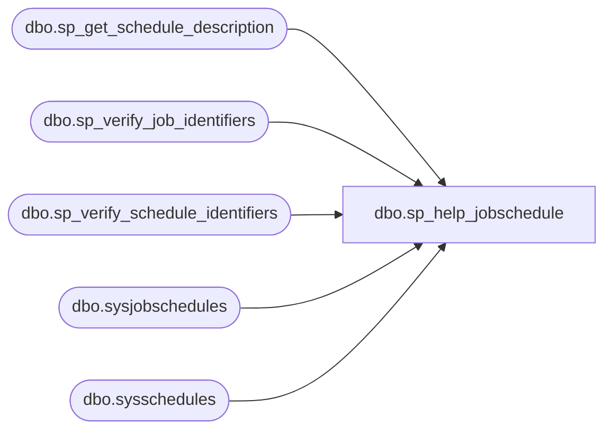

# dbo.sp_help_jobschedule

**Database:** msdb  

## Architecture Diagram



## Table Dependencies

| Referenced Table |
|---|
| dbo.sp_get_schedule_description |
| dbo.sp_verify_job_identifiers |
| dbo.sp_verify_schedule_identifiers |
| dbo.sysjobschedules |
| dbo.sysschedules |

## Stored Procedure Code

```sql
CREATE PROCEDURE sp_help_jobschedule
  @job_id              UNIQUEIDENTIFIER = NULL,
  @job_name            sysname          = NULL,
  @schedule_name       sysname          = NULL,
  @schedule_id         INT              = NULL,
  @include_description BIT              = 0 -- 1 if a schedule description is required (NOTE: It's expensive to generate the description)
AS
BEGIN
  DECLARE @retval                 INT
  DECLARE @schedule_description   NVARCHAR(255)
  DECLARE @name                   sysname
  DECLARE @freq_type              INT
  DECLARE @freq_interval          INT
  DECLARE @freq_subday_type       INT
  DECLARE @freq_subday_interval   INT
  DECLARE @freq_relative_interval INT
  DECLARE @freq_recurrence_factor INT
  DECLARE @active_start_date      INT
  DECLARE @active_end_date        INT
  DECLARE @active_start_time      INT
  DECLARE @active_end_time        INT
  DECLARE @schedule_id_as_char    VARCHAR(10)
  DECLARE @job_count               INT

  SET NOCOUNT ON

  -- Remove any leading/trailing spaces from parameters
  SELECT @schedule_name = LTRIM(RTRIM(@schedule_name))
  SELECT @job_count = 0

  -- Turn [nullable] empty string parameters into NULLs
  IF (@schedule_name = N'') SELECT @schedule_name = NULL

  -- The user must provide either:
  -- 1) job_id (or job_name) and (optionally) a schedule name
  -- or...
  -- 2) just schedule_id
  IF (@schedule_id IS NULL) AND
     (@job_id      IS NULL) AND
     (@job_name    IS NULL)
  BEGIN
    RAISERROR(14273, -1, -1)
    RETURN(1) -- Failure
  END

  IF (@schedule_id IS NOT NULL) AND ((@job_id        IS NOT NULL) OR
                                     (@job_name      IS NOT NULL) OR
                                     (@schedule_name IS NOT NULL))
  BEGIN
    RAISERROR(14273, -1, -1)
    RETURN(1) -- Failure
  END

  -- Check that the schedule (by ID) exists and it is only used by one job. 
  -- Allowing this for backward compatibility with versions prior to V9
  IF (@schedule_id IS NOT NULL) AND 
     (@job_id      IS NULL) AND
     (@job_name    IS NULL)
  BEGIN
  
    SELECT @job_count = COUNT(*)
    FROM msdb.dbo.sysjobschedules
    WHERE (schedule_id = @schedule_id) 
    
    if(@job_count > 1)
    BEGIN
      SELECT @schedule_id_as_char = CONVERT(VARCHAR, @schedule_id)
      RAISERROR(14369, -1, -1, @schedule_id_as_char)
      RETURN(1) -- Failure
    END
  
    SELECT @job_id = job_id
    FROM msdb.dbo.sysjobschedules
    WHERE (schedule_id = @schedule_id)
    IF (@job_id IS NULL)
    BEGIN
      SELECT @schedule_id_as_char = CONVERT(VARCHAR, @schedule_id)
      RAISERROR(14262, -1, -1, '@schedule_id', @schedule_id_as_char)
      RETURN(1) -- Failure
    END
  END

  -- Check that we can uniquely identify the job
  IF (@job_id IS NOT NULL) OR (@job_name IS NOT NULL)
  BEGIN
    EXECUTE @retval = sp_verify_job_identifiers '@job_name',
                                                '@job_id',
                                                 @job_name OUTPUT,
                                                 @job_id   OUTPUT,
                                                'NO_TEST'
    IF (@retval <> 0)
      RETURN(1) -- Failure
  END

  IF (@schedule_id IS NOT NULL OR @schedule_name IS NOT NULL)
  BEGIN
    -- Check that we can uniquely identify the schedule
    EXECUTE @retval = msdb.dbo.sp_verify_schedule_identifiers @name_of_name_parameter = '@schedule_name',
                                                              @name_of_id_parameter   = '@schedule_id',
                                                              @schedule_name          = @schedule_name OUTPUT,
                                                              @schedule_id            = @schedule_id   OUTPUT,
                                                              @owner_sid              = NULL,
                                                              @orig_server_id         = NULL,
                                                              @job_id_filter          = @job_id
    IF (@retval <> 0)
      RETURN(1) -- Failure
  
  END

  -- Check that the schedule (by name) exists
  IF (@schedule_name IS NOT NULL)
  BEGIN
    IF (NOT EXISTS (SELECT *
                    FROM msdb.dbo.sysjobschedules AS js
                      JOIN msdb.dbo.sysschedules AS s
                        ON js.schedule_id = s.schedule_id
                    WHERE (js.job_id = @job_id)
                      AND (s.name = @schedule_name)))
    BEGIN
      RAISERROR(14262, -1, -1, '@schedule_name', @schedule_name)
      RETURN(1) -- Failure
    END
  END

  -- Get the schedule(s) into a temporary table
  SELECT s.schedule_id,
        'schedule_name' = name,
         enabled,
         freq_type,
         freq_interval,
         freq_subday_type,
         freq_subday_interval,
         freq_relative_interval,
         freq_recurrence_factor,
         active_start_date,
         active_end_date,
         active_start_time,
         active_end_time,
         date_created,
        'schedule_description' = FORMATMESSAGE(14549),
         js.next_run_date,
         js.next_run_time,
         s.schedule_uid
  INTO #temp_jobschedule
  FROM msdb.dbo.sysjobschedules AS js
    JOIN msdb.dbo.sysschedules AS s
      ON js.schedule_id = s.schedule_id
  WHERE ((@job_id IS NULL) OR (js.job_id = @job_id))
    AND ((@schedule_name IS NULL) OR (s.name = @schedule_name))
    AND ((@schedule_id IS NULL) OR (s.schedule_id = @schedule_id))

  IF (@include_description = 1)
  BEGIN
    -- For each schedule, generate the textual schedule description and update the temporary
    -- table with it
    IF (EXISTS (SELECT *
                FROM #temp_jobschedule))
    BEGIN
      WHILE (EXISTS (SELECT *
                     FROM #temp_jobschedule
                     WHERE schedule_description = FORMATMESSAGE(14549)))
      BEGIN
        SET ROWCOUNT 1
        SELECT @name                   = schedule_name,
               @freq_type              = freq_type,
               @freq_interval          = freq_interval,
               @freq_subday_type       = freq_subday_type,
               @freq_subday_interval   = freq_subday_interval,
               @freq_relative_interval = freq_relative_interval,
               @freq_recurrence_factor = freq_recurrence_factor,
               @active_start_date      = active_start_date,
               @active_end_date        = active_end_date,
               @active_start_time      = active_start_time,
               @active_end_time        = active_end_time
        FROM #temp_jobschedule
        WHERE (schedule_description = FORMATMESSAGE(14549))
        SET ROWCOUNT 0

        EXECUTE sp_get_schedule_description
          @freq_type,
          @freq_interval,
          @freq_subday_type,
          @freq_subday_interval,
          @freq_relative_interval,
          @freq_recurrence_factor,
          @active_start_date,
          @active_end_date,
          @active_start_time,
          @active_end_time,
          @schedule_description OUTPUT

        UPDATE #temp_jobschedule
        SET schedule_description = ISNULL(LTRIM(RTRIM(@schedule_description)), FORMATMESSAGE(14205))
        WHERE (schedule_name = @name)
      END -- While
    END
  END

  -- Return the result set, adding job count to it
  SELECT *, (SELECT COUNT(*) FROM sysjobschedules WHERE sysjobschedules.schedule_id = #temp_jobschedule.schedule_id) as 'job_count'
  FROM #temp_jobschedule
  ORDER BY schedule_id

  RETURN(@@error) -- 0 means success
END


dbo,sp_help_jobserver,CREATE PROCEDURE sp_help_jobserver
  @job_id                UNIQUEIDENTIFIER = NULL, -- Must provide either this or job_name
  @job_name              sysname          = NULL, -- Must provide either this or job_id
  @show_last_run_details TINYINT          = 0     -- Controls if last-run execution information is part of the result set (1 = yes, 0 = no)
AS
BEGIN
  DECLARE @retval INT

  SET NOCOUNT ON

  EXECUTE @retval = sp_verify_job_identifiers '@job_name',
                                              '@job_id',
                                               @job_name OUTPUT,
                                               @job_id   OUTPUT
  IF (@retval <> 0)
    RETURN(1) -- Failure

  -- The show-last-run-details flag must be either 1 or 0
  IF (@show_last_run_details <> 0)
    SELECT @show_last_run_details = 1

  IF (@show_last_run_details = 1)
  BEGIN
    -- List the servers that @job_name has been targeted at (INCLUDING last-run details)
    SELECT stsv.server_id,
           stsv.server_name,
           stsv.enlist_date,
           stsv.last_poll_date,
           sjs.last_run_date,
           sjs.last_run_time,
           sjs.last_run_duration,
           sjs.last_run_outcome,  -- Same as JOB_OUTCOME_CODE (SQLAGENT_EXEC_x)
           sjs.last_outcome_message
    FROM msdb.dbo.sysjobservers         sjs  LEFT OUTER JOIN
         msdb.dbo.systargetservers_view stsv ON (sjs.server_id = stsv.server_id)
    WHERE (sjs.job_id = @job_id)
  END
  ELSE
  BEGIN
    -- List the servers that @job_name has been targeted at (EXCLUDING last-run details)
    SELECT stsv.server_id,
           stsv.server_name,
           stsv.enlist_date,
           stsv.last_poll_date
    FROM msdb.dbo.sysjobservers         sjs  LEFT OUTER JOIN
         msdb.dbo.systargetservers_view stsv ON (sjs.server_id = stsv.server_id)
    WHERE (sjs.job_id = @job_id)
  END

  RETURN(@@error) -- 0 means success
END

dbo,sp_help_jobstep,CREATE PROCEDURE sp_help_jobstep
  @job_id    UNIQUEIDENTIFIER = NULL, -- Must provide either this or job_name
  @job_name  sysname          = NULL, -- Must provide either this or job_id
  @step_id   INT              = NULL,
  @step_name sysname          = NULL,
  @suffix    BIT              = 0     -- A flag to control how the result set is formatted
AS
BEGIN
  DECLARE @retval      INT
  DECLARE @max_step_id INT
  DECLARE @valid_range VARCHAR(50)

  SET NOCOUNT ON

  EXECUTE @retval = sp_verify_job_identifiers '@job_name',
                                              '@job_id',
                                               @job_name OUTPUT,
                                               @job_id   OUTPUT,
                                              'NO_TEST'
  IF (@retval <> 0)
    RETURN(1) -- Failure

  -- The suffix flag must be either 0 (ie. no suffix) or 1 (ie. add suffix). 0 is the default.
  IF (@suffix <> 0)
    SELECT @suffix = 1

  -- Check step id (if supplied)
  IF (@step_id IS NOT NULL)
  BEGIN
    -- Get current maximum step id
    SELECT @max_step_id = ISNULL(MAX(step_id), 0)
    FROM msdb.dbo.sysjobsteps
    WHERE job_id = @job_id
   IF @max_step_id = 0
   BEGIN
      RAISERROR(14528, -1, -1, @job_name)
      RETURN(1) -- Failure 
   END
    ELSE IF (@step_id < 1) OR (@step_id > @max_step_id)
    BEGIN
      SELECT @valid_range = '1..' + CONVERT(VARCHAR, @max_step_id)
      RAISERROR(14266, -1, -1, '@step_id', @valid_range)
      RETURN(1) -- Failure
    END
  END

  -- Check step name (if supplied)
  -- NOTE: A supplied step id overrides a supplied step name
  IF ((@step_id IS NULL) AND (@step_name IS NOT NULL))
  BEGIN
    SELECT @step_id = step_id
    FROM msdb.dbo.sysjobsteps
    WHERE (step_name = @step_name)
      AND (job_id = @job_id)

    IF (@step_id IS NULL)
    BEGIN
      RAISERROR(14262, -1, -1, '@step_name', @step_name)
      RETURN(1) -- Failure
    END
  END

  -- Return the job steps for this job (or just return the specific step)
  IF (@suffix = 0)
  BEGIN
    SELECT step_id,
           step_name,
           subsystem,
           command,
           flags,
           cmdexec_success_code,
           on_success_action,
           on_success_step_id,
           on_fail_action,
           on_fail_step_id,
           server,
           database_name,
           database_user_name,
           retry_attempts,
           retry_interval,
           os_run_priority,
           output_file_name,
           last_run_outcome,
           last_run_duration,
           last_run_retries,
           last_run_date,
           last_run_time,
         proxy_id
    FROM msdb.dbo.sysjobsteps
    WHERE (job_id = @job_id)
      AND ((@step_id IS NULL) OR (step_id = @step_id))
    ORDER BY job_id, step_id
  END
  ELSE
  BEGIN
    SELECT step_id,
           step_name,
           subsystem,
           command,
          'flags' = CONVERT(NVARCHAR, flags) + N' (' +
                    ISNULL(CASE WHEN (flags = 0)     THEN FORMATMESSAGE(14561) END, '') +
                    ISNULL(CASE WHEN (flags & 1) = 1 THEN FORMATMESSAGE(14558) + ISNULL(CASE WHEN (flags > 1) THEN N', ' END, '') END, '') +
                    ISNULL(CASE WHEN (flags & 2) = 2 THEN FORMATMESSAGE(14559) + ISNULL(CASE WHEN (flags > 3) THEN N', ' END, '') END, '') +
                    ISNULL(CASE WHEN (flags & 4) = 4 THEN FORMATMESSAGE(14560) END, '') + N')',
           cmdexec_success_code,
          'on_success_action' = CASE on_success_action
                                  WHEN 1 THEN CONVERT(NVARCHAR, on_success_action) + N' ' + FORMATMESSAGE(14562)
                                  WHEN 2 THEN CONVERT(NVARCHAR, on_success_action) + N' ' + FORMATMESSAGE(14563)
                                  WHEN 3 THEN CONVERT(NVARCHAR, on_success_action) + N' ' + FORMATMESSAGE(14564)
                                  WHEN 4 THEN CONVERT(NVARCHAR, on_success_action) + N' ' + FORMATMESSAGE(14565)
                                  ELSE        CONVERT(NVARCHAR, on_success_action) + N' ' + FORMATMESSAGE(14205)
                                END,
           on_success_step_id,
          'on_fail_action' = CASE on_fail_action
                               WHEN 1 THEN CONVERT(NVARCHAR, on_fail_action) + N' ' + FORMATMESSAGE(14562)
                               WHEN 2 THEN CONVERT(NVARCHAR, on_fail_action) + N' ' + FORMATMESSAGE(14563)
                               WHEN 3 THEN CONVERT(NVARCHAR, on_fail_action) + N' ' + FORMATMESSAGE(14564)
                               WHEN 4 THEN CONVERT(NVARCHAR, on_fail_action) + N' ' + FORMATMESSAGE(14565)
                               ELSE        CONVERT(NVARCHAR, on_fail_action) + N' ' + FORMATMESSAGE(14205)
                             END,
           on_fail_step_id,
           server,
           database_name,
           database_user_name,
           retry_attempts,
           retry_interval,
          'os_run_priority' = CASE os_run_priority
                                WHEN -15 THEN CONVERT(NVARCHAR, os_run_priority) + N' ' + FORMATMESSAGE(14566)
                                WHEN -1  THEN CONVERT(NVARCHAR, os_run_priority) + N' ' + FORMATMESSAGE(14567)
                                WHEN  0  THEN CONVERT(NVARCHAR, os_run_priority) + N' ' + FORMATMESSAGE(14561)
                                WHEN  1  THEN CONVERT(NVARCHAR, os_run_priority) + N' ' + FORMATMESSAGE(14568)
                                WHEN  15 THEN CONVERT(NVARCHAR, os_run_priority) + N' ' + FORMATMESSAGE(14569)
                                ELSE          CONVERT(NVARCHAR, os_run_priority) + N' ' + FORMATMESSAGE(14205)
                              END,
           output_file_name,
           last_run_outcome,
           last_run_duration,
           last_run_retries,
           last_run_date,
           last_run_time,
         proxy_id
    FROM msdb.dbo.sysjobsteps
    WHERE (job_id = @job_id)
      AND ((@step_id IS NULL) OR (step_id = @step_id))
    ORDER BY job_id, step_id
  END

  RETURN(@@error) -- 0 means success

END

dbo,sp_help_jobsteplog,CREATE PROCEDURE sp_help_jobsteplog
  @job_id    UNIQUEIDENTIFIER = NULL, -- Must provide either this or job_name
  @job_name  sysname          = NULL, -- Must provide either this or job_id
  @step_id   INT              = NULL,
  @step_name sysname          = NULL
AS
BEGIN
  DECLARE @retval      INT
  DECLARE @max_step_id INT
  DECLARE @valid_range VARCHAR(50)

  EXECUTE @retval = sp_verify_job_identifiers '@job_name',
                                              '@job_id',
                                               @job_name OUTPUT,
                                               @job_id   OUTPUT,
                                              'NO_TEST'
  IF (@retval <> 0)
    RETURN(1) -- Failure

  -- Check step id (if supplied)
  IF (@step_id IS NOT NULL)
  BEGIN
    -- Get current maximum step id
    SELECT @max_step_id = ISNULL(MAX(step_id), 0)
    FROM msdb.dbo.sysjobsteps
    WHERE job_id = @job_id
   IF @max_step_id = 0
   BEGIN
      RAISERROR(14528, -1, -1, @job_name)
      RETURN(1) -- Failure 
   END
    ELSE IF (@step_id < 1) OR (@step_id > @max_step_id)
    BEGIN
      SELECT @valid_range = '1..' + CONVERT(VARCHAR, @max_step_id)
      RAISERROR(14266, -1, -1, '@step_id', @valid_range)
      RETURN(1) -- Failure
    END
  END

  -- Check step name (if supplied)
  -- NOTE: A supplied step id overrides a supplied step name
  IF ((@step_id IS NULL) AND (@step_name IS NOT NULL))
  BEGIN
    SELECT @step_id = step_id
    FROM msdb.dbo.sysjobsteps
    WHERE (step_name = @step_name)
      AND (job_id = @job_id)

    IF (@step_id IS NULL)
    BEGIN
      RAISERROR(14262, -1, -1, '@step_name', @step_name)
      RETURN(1) -- Failure
    END
  END


    SELECT sjv.job_id,
           @job_name as job_name,
           steps.step_id,
           steps.step_name,
           steps.step_uid,
           logs.date_created,
           logs.date_modified,
           logs.log_size,
           logs.log
    FROM msdb.dbo.sysjobs_view sjv, msdb.dbo.sysjobsteps as steps, msdb.dbo.sysjobstepslogs as logs 
    WHERE (sjv.job_id = @job_id)
      AND (steps.job_id = @job_id)
      AND ((@step_id IS NULL) OR (step_id = @step_id))
      AND (steps.step_uid = logs.step_uid)
   
  RETURN(@@error) -- 0 means success
END

dbo,sp_help_maintenance_plan,CREATE PROCEDURE sp_help_maintenance_plan
  @plan_id UNIQUEIDENTIFIER = NULL
AS
BEGIN
  IF (@plan_id IS NOT NULL)
    BEGIN
      /*return the information about the plan itself*/
      SELECT *
      FROM msdb.dbo.sysdbmaintplans
      WHERE plan_id=@plan_id
      /*return the information about databases this plan defined on*/
      SELECT database_name
      FROM msdb.dbo.sysdbmaintplan_databases
      WHERE plan_id=@plan_id
      /*return the information about the jobs that relating to the plan*/
      SELECT job_id
      FROM msdb.dbo.sysdbmaintplan_jobs
      WHERE plan_id=@plan_id
    END
  ELSE
    BEGIN
      SELECT *
      FROM msdb.dbo.sysdbmaintplans
    END
END

dbo,sp_help_notification,CREATE PROCEDURE sp_help_notification
  @object_type          CHAR(9),   -- Either 'ALERTS'    (enumerates Alerts for given Operator)
                                   --     or 'OPERATORS' (enumerates Operators for given Alert)
  @name                 sysname,   -- Either an Operator Name (if @object_type is 'ALERTS')
                                   --     or an Alert Name    (if @object_type is 'OPERATORS')
  @enum_type            CHAR(10),  -- Either 'ALL'    (enumerate all objects [eg. all alerts irrespective of whether 'Fred' receives a notification for them])
                                   --     or 'ACTUAL' (enumerate only the associated objects [eg. only the alerts which 'Fred' receives a notification for])
                                   --     or 'TARGET' (enumerate only the objects matching @target_name [eg. a single row showing how 'Fred' is notfied for alert 'Test'])
  @notification_method  TINYINT,   -- Either 1 (Email)   - Modifies the result set to only show use_email column
                                   --     or 2 (Pager)   - Modifies the result set to only show use_pager column
                                   --     or 4 (NetSend) - Modifies the result set to only show use_netsend column
                                   --     or 7 (All)     - Modifies the result set to show all the use_xxx columns
  @target_name   sysname = NULL    -- Either an Alert Name    (if @object_type is 'ALERTS')
                                   --     or an Operator Name (if @object_type is 'OPERATORS')
                                   -- NOTE: This parameter is only required if @enum_type is 'TARGET')
AS
BEGIN
  DECLARE @id              INT    -- We use this to store the decode of @name
  DECLARE @target_id       INT    -- We use this to store the decode of @target_name
  DECLARE @select_clause   NVARCHAR(1024)
  DECLARE @from_clause     NVARCHAR(512)
  DECLARE @where_clause    NVARCHAR(512)
  DECLARE @res_valid_range NVARCHAR(100)

  SET NOCOUNT ON

  SELECT @res_valid_range = FORMATMESSAGE(14208)

  -- Remove any leading/trailing spaces from parameters
  SELECT @object_type = UPPER(LTRIM(RTRIM(@object_type)) collate SQL_Latin1_General_CP1_CS_AS)
  SELECT @name        = LTRIM(RTRIM(@name))
  SELECT @enum_type   = UPPER(LTRIM(RTRIM(@enum_type)) collate SQL_Latin1_General_CP1_CS_AS)
  SELECT @target_name = LTRIM(RTRIM(@target_name))

  -- Turn [nullable] empty string parameters into NULLs
  IF (@target_name = N'') SELECT @target_name = NULL

  -- Check ObjectType
  IF (@object_type NOT IN ('ALERTS', 'OPERATORS'))
  BEGIN
    RAISERROR(14266, 16, 1, '@object_type', 'ALERTS, OPERATORS')
    RETURN(1) -- Failure
  END

  -- Check AlertName
  IF (@object_type = 'OPERATORS') AND
     (NOT EXISTS (SELECT *
                  FROM msdb.dbo.sysalerts
                  WHERE (name = @name)))
  BEGIN
    RAISERROR(14262, 16, 1, '@name', @name)
    RETURN(1) -- Failure
  END

  -- Check OperatorName
  IF (@object_type = 'ALERTS') AND
     (NOT EXISTS (SELECT *
                  FROM msdb.dbo.sysoperators
                  WHERE (name = @name)))
  BEGIN
    RAISERROR(14262, 16, 1, '@name', @name)
    RETURN(1) -- Failure
  END

  -- Check EnumType
  IF (@enum_type NOT IN ('ALL', 'ACTUAL', 'TARGET'))
  BEGIN
    RAISERROR(14266, 16, 1, '@enum_type', 'ALL, ACTUAL, TARGET')
    RETURN(1) -- Failure
  END

  -- Check Notification Method
  IF ((@notification_method < 1) OR (@notification_method > 7))
  BEGIN
    RAISERROR(14266, 16, 1, '@notification_method', @res_valid_range)
    RETURN(1) -- Failure
  END

  -- If EnumType is 'TARGET', check if we have a @TargetName parameter
  IF (@enum_type = 'TARGET') AND (@target_name IS NULL)
  BEGIN
    RAISERROR(14502, 16, 1)
    RETURN(1) -- Failure
  END

  -- If EnumType isn't 'TARGET', we shouldn't have an @target_name parameter
  IF (@enum_type <> 'TARGET') AND (@target_name IS NOT NULL)
  BEGIN
    RAISERROR(14503, 16, 1)
    RETURN(1) -- Failure
  END

  -- Translate the Name into an ID
  IF (@object_type = 'ALERTS')
  BEGIN
    SELECT @id = id
    FROM msdb.dbo.sysoperators
    WHERE (name = @name)
  END
  IF (@object_type = 'OPERATORS')
  BEGIN
    SELECT @id = id
    FROM msdb.dbo.sysalerts
    WHERE (name = @name)
  END

  -- Translate the TargetName into a TargetID
  IF (@target_name IS NOT NULL)
  BEGIN
    IF (@object_type = 'OPERATORS')
    BEGIN
      SELECT @target_id = id
      FROM msdb.dbo.sysoperators
      WHERE (name = @target_name )
    END
    IF (@object_type = 'ALERTS')
    BEGIN
      SELECT @target_id = id
      FROM msdb.dbo.sysalerts
      WHERE (name = @target_name)
    END
    IF (@target_id IS NULL) -- IE. the Target Name is invalid
    BEGIN
      RAISERROR(14262, 16, 1, @object_type, @target_name)
      RETURN(1) -- Failure
    END
  END

  -- Ok, the parameters look good so generate the SQL then EXECUTE() it...

  -- Generate the 'stub' SELECT clause and the FROM clause
  IF (@object_type = 'OPERATORS') -- So we want a list of Operators for the supplied AlertID
  BEGIN
    SELECT @select_clause = N'SELECT operator_id = o.id, operator_name = o.name, '
    IF (@enum_type = 'ALL')
      SELECT @from_clause = N'FROM msdb.dbo.sysoperators o LEFT OUTER JOIN msdb.dbo.sysnotifications sn ON (o.id = sn.operator_id) '
    ELSE
      SELECT @from_clause = N'FROM msdb.dbo.sysoperators o, msdb.dbo.sysnotifications sn '
  END
  IF (@object_type = 'ALERTS') -- So we want a list of Alerts for the supplied OperatorID
  BEGIN
    SELECT @select_clause = N'SELECT alert_id = a.id, alert_name = a.name, '
    IF (@enum_type = 'ALL')
      SELECT @from_clause = N'FROM msdb.dbo.sysalerts a LEFT OUTER JOIN msdb.dbo.sysnotifications sn ON (a.id = sn.alert_id) '
    ELSE
      SELECT @from_clause = N'FROM msdb.dbo.sysalerts a, msdb.dbo.sysnotifications sn '
  END

  -- Add the required use_xxx columns to the SELECT clause
  IF (@notification_method & 1 = 1)
    SELECT @select_clause = @select_clause + N'use_email = ISNULL((sn.notification_method & 1) / POWER(2, 0), 0), '
  IF (@notification_method & 2 = 2)
    SELECT @select_clause = @select_clause + N'use_pager = ISNULL((sn.notification_method & 2) / POWER(2, 1), 0), '
  IF (@notification_method & 4 = 4)
    SELECT @select_clause = @select_clause + N'use_netsend = ISNULL((sn.notification_method & 4) / POWER(2, 2), 0), '

  -- Remove the trailing comma
  SELECT @select_clause = SUBSTRING(@select_clause, 1, (DATALENGTH(@select_clause) / 2) - 2) + N' '

  -- Generate the WHERE clause
  IF (@object_type = 'OPERATORS')
  BEGIN
    IF (@enum_type = 'ALL')
      SELECT @from_clause = @from_clause + N' AND (sn.alert_id = ' + CONVERT(VARCHAR(10), @id) + N')'

    IF (@enum_type = 'ACTUAL')
      SELECT @where_clause = N'WHERE (o.id = sn.operator_id) AND (sn.alert_id = ' + CONVERT(VARCHAR(10), @id) + N') AND (sn.notification_method & ' + CONVERT(VARCHAR, @notification_method) + N' <> 0)'

    IF (@enum_type = 'TARGET')
      SELECT @where_clause = N'WHERE (o.id = sn.operator_id) AND (sn.operator_id = ' + CONVERT(VARCHAR(10), @target_id) + N') AND (sn.alert_id = ' + CONVERT(VARCHAR(10), @id) + N')'
  END
  IF (@object_type = 'ALERTS')
  BEGIN
    IF (@enum_type = 'ALL')
      SELECT @from_clause = @from_clause + N' AND (sn.operator_id = ' + CONVERT(VARCHAR(10), @id) + N')'

    IF (@enum_type = 'ACTUAL')
      SELECT @where_clause = N'WHERE (a.id = sn.alert_id) AND (sn.operator_id = ' + CONVERT(VARCHAR(10), @id) + N') AND (sn.notification_method & ' + CONVERT(VARCHAR, @notification_method) + N' <> 0)'

    IF (@enum_type = 'TARGET')
      SELECT @where_clause = N'WHERE (a.id = sn.alert_id) AND (sn.alert_id = ' + CONVERT(VARCHAR(10), @target_id) + N') AND (sn.operator_id = ' + CONVERT(VARCHAR(10), @id) + N')'
  END

  -- Add the has_email and has_pager columns to the SELECT clause
  IF (@object_type = 'OPERATORS')
  BEGIN
    SELECT @select_clause = @select_clause + N', has_email = PATINDEX(N''%[^ ]%'', ISNULL(o.email_address, N''''))'
    SELECT @select_clause = @select_clause + N', has_pager = PATINDEX(N''%[^ ]%'', ISNULL(o.pager_address, N''''))'
    SELECT @select_clause = @select_clause + N', has_netsend = PATINDEX(N''%[^ ]%'', ISNULL(o.netsend_address, N''''))'
  END
  IF (@object_type = 'ALERTS')
  BEGIN
    -- NOTE: We return counts so that the UI can detect 'unchecking' the last notification
    SELECT @select_clause = @select_clause + N', has_email = (SELECT COUNT(*) FROM sysnotifications WHERE (alert_id = a.id) AND ((notification_method & 1) = 1)) '
    SELECT @select_clause = @select_clause + N', has_pager = (SELECT COUNT(*) FROM sysnotifications WHERE (alert_id = a.id) AND ((notification_method & 2) = 2)) '
    SELECT @select_clause = @select_clause + N', has_netsend = (SELECT COUNT(*) FROM sysnotifications WHERE (alert_id = a.id) AND ((notification_method & 4) = 4)) '
  END

  EXECUTE (@select_clause + @from_clause + @where_clause)

  RETURN(@@error) -- 0 means success
END

dbo,sp_help_operator,CREATE PROCEDURE sp_help_operator
  @operator_name sysname = NULL,
  @operator_id   INT     = NULL
AS
BEGIN
  DECLARE @operator_id_as_char VARCHAR(10)

  SET NOCOUNT ON

  -- Remove any leading/trailing spaces from parameters
  SELECT @operator_name = LTRIM(RTRIM(@operator_name))
  IF (@operator_name = '') SELECT @operator_name = NULL

  -- Check operator name
  IF (@operator_name IS NOT NULL)
  BEGIN
    IF (NOT EXISTS (SELECT *
                    FROM msdb.dbo.sysoperators
                    WHERE (name = @operator_name)))
    BEGIN
      RAISERROR(14262, -1, -1, '@operator_name', @operator_name)
      RETURN(1) -- Failure
    END
  END

  -- Check operator id
  IF (@operator_id IS NOT NULL)
  BEGIN
    IF (NOT EXISTS (SELECT *
                    FROM msdb.dbo.sysoperators
                    WHERE (id = @operator_id)))
    BEGIN
      SELECT @operator_id_as_char = CONVERT(VARCHAR, @operator_id)
      RAISERROR(14262, -1, -1, '@operator_id', @operator_id_as_char)
      RETURN(1) -- Failure
    END
  END

  SELECT so.id,
         so.name,
         so.enabled,
         so.email_address,
         so.last_email_date,
         so.last_email_time,
         so.pager_address,
         so.last_pager_date,
         so.last_pager_time,
         so.weekday_pager_start_time,
         so.weekday_pager_end_time,
         so.saturday_pager_start_time,
         so.saturday_pager_end_time,
         so.sunday_pager_start_time,
         so.sunday_pager_end_time,
         so.pager_days,
         so.netsend_address,
         so.last_netsend_date,
         so.last_netsend_time,
         category_name = sc.name
  FROM msdb.dbo.sysoperators                  so
       LEFT OUTER JOIN msdb.dbo.syscategories sc ON (so.category_id = sc.category_id)
  WHERE ((@operator_name IS NULL) OR (so.name = @operator_name))
    AND ((@operator_id IS NULL) OR (so.id = @operator_id))
  ORDER BY so.name

  RETURN(@@error) -- 0 means success
END

dbo,sp_help_operator_jobs,CREATE PROCEDURE sp_help_operator_jobs
  @operator_name sysname = NULL
AS
BEGIN
  DECLARE @operator_id INT

  SET NOCOUNT ON

  -- Check operator name
  SELECT @operator_id = id
  FROM msdb.dbo.sysoperators
  WHERE (name = @operator_name)
  IF (@operator_id IS NULL)
  BEGIN
    RAISERROR(14262, -1, -1, '@operator_name', @operator_name)
    RETURN(1) -- Failure
  END

  -- Get the job info
  SELECT job_id, name, notify_level_email, notify_level_netsend, notify_level_page
  FROM msdb.dbo.sysjobs_view
  WHERE ((notify_email_operator_id = @operator_id)   AND (notify_level_email <> 0))
     OR ((notify_netsend_operator_id = @operator_id) AND (notify_level_netsend <> 0))
     OR ((notify_page_operator_id = @operator_id)    AND (notify_level_page <> 0))

  RETURN(0) -- Success
END
```

