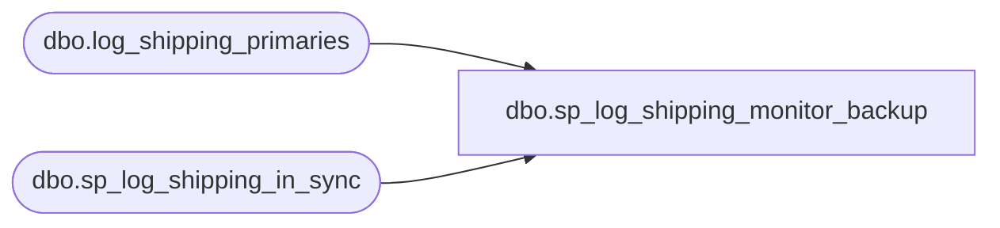

# dbo.sp_log_shipping_monitor_backup

**Database:** msdb  

## Architecture Diagram



## Table Dependencies

| Referenced Table |
|---|
| dbo.log_shipping_primaries |
| dbo.sp_log_shipping_in_sync |

## Stored Procedure Code

```sql
CREATE PROCEDURE sp_log_shipping_monitor_backup AS
BEGIN
  DECLARE @primary_id                  sysname
  DECLARE @primary_server_name         sysname 
  DECLARE @primary_database_name       sysname 
  DECLARE @maintenance_plan_id         UNIQUEIDENTIFIER
  DECLARE @backup_threshold            INT
  DECLARE @threshold_alert             INT 
  DECLARE @threshold_alert_enabled     BIT 
  DECLARE @last_backup_filename        sysname 
  DECLARE @last_updated                DATETIME
  DECLARE @planned_outage_start_time   INT
  DECLARE @planned_outage_end_time     INT 
  DECLARE @planned_outage_weekday_mask INT
  DECLARE @sync_status                 INT
  DECLARE @backup_delta                INT
  DECLARE @delta_string                NVARCHAR (10)
  DECLARE @dt                             DATETIME

  SELECT @dt = GETDATE ()

  SET NOCOUNT ON

  DECLARE bmlsp_cur CURSOR FOR
    SELECT primary_id, 
           primary_server_name, 
           primary_database_name, 
         maintenance_plan_id, 
           backup_threshold, 
           threshold_alert, 
           threshold_alert_enabled, 
           last_backup_filename, 
           last_updated,
           planned_outage_start_time, 
           planned_outage_end_time, 
           planned_outage_weekday_mask 
    FROM msdb.dbo.log_shipping_primaries
    FOR READ ONLY

  OPEN bmlsp_cur
loop:
  FETCH NEXT FROM bmlsp_cur 
  INTO @primary_id, 
       @primary_server_name, 
      @primary_database_name, 
      @maintenance_plan_id,
       @backup_threshold, 
      @threshold_alert, 
      @threshold_alert_enabled, 
      @last_backup_filename, 
      @last_updated, 
      @planned_outage_start_time,
       @planned_outage_end_time, 
      @planned_outage_weekday_mask

  IF @@FETCH_STATUS <> 0 -- nothing more to fetch, finish the loop
    GOTO _loop

  EXECUTE @sync_status = sp_log_shipping_in_sync
    @last_updated,
    @dt,
     @backup_threshold,
   @planned_outage_start_time,
   @planned_outage_end_time,
    @planned_outage_weekday_mask,
   @threshold_alert_enabled,
   @backup_delta OUTPUT

   IF (@sync_status < 0)
   BEGIN
     SELECT @delta_string = CONVERT (NVARCHAR(10), @backup_delta)
     RAISERROR (@threshold_alert, 16, 1, @primary_server_name, @primary_database_name, @delta_string)
   END

  GOTO loop
_loop:
  CLOSE bmlsp_cur
  DEALLOCATE bmlsp_cur
END

dbo,sp_log_shipping_monitor_restore,CREATE PROCEDURE sp_log_shipping_monitor_restore AS
BEGIN
  SET NOCOUNT ON
  DECLARE @primary_id                  INT
  DECLARE @secondary_server_name       sysname
  DECLARE @secondary_database_name     sysname
  DECLARE @secondary_plan_id           UNIQUEIDENTIFIER
  DECLARE @out_of_sync_threshold       INT 
  DECLARE @threshold_alert             INT 
  DECLARE @threshold_alert_enabled     BIT 
  DECLARE @last_loaded_filename        NVARCHAR (500)
  DECLARE @last_backup_filename        NVARCHAR (500) 
  DECLARE @primary_database_name       sysname
  DECLARE @last_loaded_last_updated    DATETIME
  DECLARE @last_backup_last_updated    DATETIME
  DECLARE @planned_outage_start_time   INT 
  DECLARE @planned_outage_end_time     INT 
  DECLARE @planned_outage_weekday_mask INT
  DECLARE @sync_status                 INT
  DECLARE @sync_delta                  INT
  DECLARE @delta_string                NVARCHAR(10)

  SET NOCOUNT ON
  DECLARE @backupdt  DATETIME
  DECLARE @restoredt DATETIME
  DECLARE @rv        INT
  DECLARE rmlsp_cur CURSOR FOR
    SELECT s.primary_id, 
      s.secondary_server_name, 
      s.secondary_database_name, 
      s.secondary_plan_id, 
      s.out_of_sync_threshold, 
      s.threshold_alert, 
      s.threshold_alert_enabled, 
      s.last_loaded_filename, 
      s.last_loaded_last_updated,
      p.last_backup_filename,
      p.last_updated,
      p.primary_database_name,
      s.planned_outage_start_time, 
      s.planned_outage_end_time, 
      s.planned_outage_weekday_mask 
    FROM msdb.dbo.log_shipping_secondaries s 
    INNER JOIN msdb.dbo.log_shipping_primaries p 
    ON s.primary_id = p.primary_id
    FOR READ ONLY

  OPEN rmlsp_cur
loop:
  FETCH NEXT FROM rmlsp_cur 
  INTO @primary_id, 
      @secondary_server_name, 
         @secondary_database_name, 
         @secondary_plan_id, 
       @out_of_sync_threshold, 
         @threshold_alert, 
         @threshold_alert_enabled, 
         @last_loaded_filename, 
         @last_loaded_last_updated,
       @last_backup_filename,
       @last_backup_last_updated,
       @primary_database_name,
       @planned_outage_start_time, 
         @planned_outage_end_time, 
         @planned_outage_weekday_mask 

  IF @@FETCH_STATUS <> 0 -- nothing more to fetch, finish the loop
    GOTO _loop

  EXECUTE @rv = sp_log_shipping_get_date_from_file @primary_database_name, @last_backup_filename, @backupdt OUTPUT
  IF (@rv <> 0)
    SELECT @backupdt = @last_backup_last_updated
  
  EXECUTE @rv = sp_log_shipping_get_date_from_file @primary_database_name, @last_loaded_filename, @restoredt OUTPUT
  IF  (@rv <> 0)
    SELECT @restoredt = @last_loaded_last_updated

  EXECUTE @sync_status = sp_log_shipping_in_sync
    @restoredt,
    @backupdt,
     @out_of_sync_threshold,
     @planned_outage_start_time,
     @planned_outage_end_time,
    @planned_outage_weekday_mask,
    @threshold_alert_enabled,
    @sync_delta OUTPUT

   IF (@sync_status < 0)
   BEGIN
     SELECT @delta_string = CONVERT (NVARCHAR(10), @sync_delta)
     RAISERROR (@threshold_alert, 16, 1, @secondary_server_name, @secondary_database_name, @delta_string)
   END

  GOTO loop
_loop:
  CLOSE rmlsp_cur
  DEALLOCATE rmlsp_cur
END

dbo,sp_MailItemResultSets,-- sp_MailItemResultSets : 
--  Sends back multiple rowsets with the mail items data
CREATE PROCEDURE sp_MailItemResultSets
    @mailitem_id            INT,
    @profile_id             INT,
    @conversation_handle    uniqueidentifier,
   @service_contract_name  NVARCHAR(256),
   @message_type_name      NVARCHAR(256)
AS
BEGIN
    SET NOCOUNT ON
   --
   -- Send back multiple rowsets with the mail items data

   ----
   -- 1) MessageTypeName
   SELECT @message_type_name  as 'message_type_name',
      @service_contract_name as 'service_contract_name',
      @conversation_handle   as 'conversation_handle',
      @mailitem_id           as 'mailitem_id'

   -----
   -- 2) The mail item record from sysmail_mailitems.
   SELECT 
      mi.mailitem_id,
      mi.profile_id,
      (SELECT name FROM msdb.dbo.sysmail_profile p WHERE p.profile_id = mi.profile_id) as 'profile_name',
      mi.recipients,
      mi.copy_recipients,
      mi.blind_copy_recipients,
      mi.subject,
      mi.body, 
      mi.body_format, 
      mi.importance,
      mi.sensitivity,
      ISNULL(sr.send_attempts, 0) as retry_attempt,
      ISNULL(mi.from_address, '') as from_address,
      ISNULL(mi.reply_to, '')     as reply_to
   FROM sysmail_mailitems as mi
      LEFT JOIN sysmail_send_retries as sr
         ON sr.mailitem_id = mi.mailitem_id 
   WHERE mi.mailitem_id = @mailitem_id

   -----
   -- 3) Account information 
   SELECT a.account_id,
         a.name
   FROM msdb.dbo.sysmail_profileaccount as pa
   JOIN msdb.dbo.sysmail_account as a
      ON pa.account_id = a.account_id
   WHERE pa.profile_id = @profile_id
   ORDER BY pa.sequence_number 

   -----
   -- 4) Attachments if any
   SELECT attachment_id,
      mailitem_id,
      filename,
      filesize,
      attachment
   FROM sysmail_attachments
   WHERE mailitem_id = @mailitem_id
   

   RETURN 0
END

dbo,sp_maintplan_close_logentry,CREATE PROCEDURE sp_maintplan_close_logentry
    @task_detail_id     UNIQUEIDENTIFIER,
    @end_time          DATETIME            = NULL,
    @succeeded         TINYINT
AS
BEGIN

   --Set defaults
   IF (@end_time IS NULL)
   BEGIN
      SELECT @end_time = GETDATE()
   END

    -- Raise an error if the @task_detail_id doesn't exist
    IF( NOT EXISTS(SELECT * FROM sysmaintplan_log WHERE (task_detail_id = @task_detail_id)))
   BEGIN
        DECLARE @task_detail_id_as_char VARCHAR(36)
        SELECT @task_detail_id_as_char = CONVERT(VARCHAR(36), @task_detail_id)
        RAISERROR(14262, -1, -1, '@task_detail_id', @task_detail_id_as_char)
      RETURN(1)
   END

   UPDATE msdb.dbo.sysmaintplan_log 
    SET end_time = @end_time, succeeded = @succeeded 
    WHERE (task_detail_id = @task_detail_id)

    RETURN (@@ERROR)
END

dbo,sp_maintplan_delete_log,CREATE PROCEDURE sp_maintplan_delete_log
    @plan_id        UNIQUEIDENTIFIER    = NULL,
    @subplan_id     UNIQUEIDENTIFIER    = NULL,
    @oldest_time    DATETIME            = NULL
AS
BEGIN
    -- @plan_id and @subplan_id must be both NULL or only one exclusively set
   IF (@plan_id IS NOT NULL) AND (@subplan_id IS NOT NULL)
   BEGIN
      RAISERROR(12980, -1, -1, '@plan_id', '@subplan_id')
      RETURN(1)
   END

   --Scenario 1: User wants to delete all logs
   --Scenario 2: User wants to delete all logs older than X date
   --Scenario 3: User wants to delete all logs for a given plan
   --Scenario 4: User wants to delete all logs for a specific subplan
   --Scenario 5: User wants to delete all logs for a given plan older than X date
   --Scenario 6: User wants to delete all logs for a specific subplan older than X date

   -- Special case 1: Delete all logs
   IF (@plan_id IS NULL) AND (@subplan_id IS NULL) AND (@oldest_time IS NULL)
   BEGIN
      DELETE msdb.dbo.sysmaintplan_logdetail
      DELETE msdb.dbo.sysmaintplan_log
      RETURN (0)
   END

   DELETE msdb.dbo.sysmaintplan_log 
    WHERE ( task_detail_id in 
            (SELECT task_detail_id 
             FROM msdb.dbo.sysmaintplan_log 
             WHERE ((@plan_id IS NULL)     OR (plan_id = @plan_id)) AND 
                   ((@subplan_id IS NULL)  OR (subplan_id = @subplan_id)) AND 
                   ((@oldest_time IS NULL) OR (start_time < @oldest_time))) )

    RETURN (0)
END

dbo,sp_maintplan_delete_plan,CREATE PROCEDURE sp_maintplan_delete_plan
    @plan_id   UNIQUEIDENTIFIER
AS
BEGIN
   SET NOCOUNT ON

   DECLARE @sp_id UNIQUEIDENTIFIER
    DECLARE @retval     INT

    SET @retval = 0

   --Loop through Subplans
   DECLARE sp CURSOR LOCAL FOR 
        SELECT subplan_id 
        FROM msdb.dbo.sysmaintplan_subplans 
        WHERE plan_id = @plan_id FOR READ ONLY

   OPEN sp
   FETCH NEXT FROM sp INTO @sp_id
   WHILE @@FETCH_STATUS = 0
   BEGIN 
     EXECUTE @retval = sp_maintplan_delete_subplan @subplan_id = @sp_id
      IF(@retval <> 0)
        BREAK

     FETCH NEXT FROM sp INTO @sp_id
   END
   CLOSE sp
   DEALLOCATE sp

    RETURN (@retval)
END

dbo,sp_maintplan_delete_subplan,CREATE PROCEDURE sp_maintplan_delete_subplan
    @subplan_id       UNIQUEIDENTIFIER,
    @delete_jobs BIT                   = 1
AS
BEGIN

    DECLARE @retval     INT
    DECLARE @job        UNIQUEIDENTIFIER
    DECLARE @jobMsx     UNIQUEIDENTIFIER

    SET NOCOUNT ON
    SET @retval = 0

    -- Raise an error if the @subplan_id doesn't exist
    IF( NOT EXISTS(SELECT * FROM sysmaintplan_subplans WHERE subplan_id = @subplan_id))
    BEGIN
        DECLARE @subplan_id_as_char VARCHAR(36)
        SELECT @subplan_id_as_char = CONVERT(VARCHAR(36), @subplan_id)
        RAISERROR(14262, -1, -1, '@subplan_id', @subplan_id_as_char)
        RETURN(1)
    END


    BEGIN TRAN

    --Is there an Agent Job/Schedule associated with this subplan?
    SELECT @job = job_id, @jobMsx = msx_job_id
    FROM msdb.dbo.sysmaintplan_subplans 
    WHERE subplan_id = @subplan_id

    EXEC @retval = msdb.dbo.sp_maintplan_delete_log @subplan_id = @subplan_id
    IF (@retval <> 0)
    BEGIN
        ROLLBACK TRAN
        RETURN @retval
    END

    -- Delete the subplans table entry first since it has a foreign
    -- key constraint on its job_id existing in sysjobs.
    DELETE msdb.dbo.sysmaintplan_subplans 
    WHERE (subplan_id = @subplan_id)

    IF (@delete_jobs = 1)
    BEGIN
        --delete the local job associated with this subplan
        IF (@job IS NOT NULL)
        BEGIN
            EXEC @retval = msdb.dbo.sp_delete_job @job_id = @job, @delete_unused_schedule = 1
            IF (@retval <> 0)
            BEGIN
                ROLLBACK TRAN
                RETURN @retval
            END
        END

        --delete the multi-server job associated with this subplan.
        IF (@jobMsx IS NOT NULL)
        BEGIN 
            EXEC @retval = msdb.dbo.sp_delete_job @job_id = @jobMsx, @delete_unused_schedule = 1
            IF (@retval <> 0)
            BEGIN
                ROLLBACK TRAN
                RETURN @retval
            END
        END
    END

    COMMIT TRAN
    RETURN (0)
END

dbo,sp_maintplan_open_logentry,CREATE PROCEDURE sp_maintplan_open_logentry
    @plan_id       UNIQUEIDENTIFIER,
    @subplan_id       UNIQUEIDENTIFIER,   
    @start_time       DATETIME            = NULL,
    @task_detail_id  UNIQUEIDENTIFIER    = NULL OUTPUT
AS
BEGIN

   --Set defaults
   IF (@start_time IS NULL)
   BEGIN
      SELECT @start_time = GETDATE()
   END

   SELECT @task_detail_id = NEWID()

   --Insert a new record into sysmaintplan_log table
   INSERT INTO msdb.dbo.sysmaintplan_log(task_detail_id, plan_id, subplan_id, start_time)
    VALUES(@task_detail_id, @plan_id, @subplan_id, @start_time)

   RETURN (@@ERROR)
END

dbo,sp_maintplan_start,CREATE PROCEDURE sp_maintplan_start
    @plan_id        UNIQUEIDENTIFIER    = NULL,
    @subplan_id     UNIQUEIDENTIFIER    = NULL
AS
BEGIN
    SET NOCOUNT ON

    DECLARE @jobid  UNIQUEIDENTIFIER
    DECLARE @retval INT
    SET @retval = 0

    -- A @plan_id or @subplan_id must be supplied
   IF (@plan_id IS NULL) AND (@subplan_id IS NULL)
   BEGIN
      RAISERROR(12982, -1, -1, '@plan_id', '@subplan_id')
      RETURN(1)
   END

    -- either @plan_id or @subplan_id must be exclusively set
   IF (@plan_id IS NOT NULL) AND (@subplan_id IS NOT NULL)
   BEGIN
      RAISERROR(12982, -1, -1, '@plan_id', '@subplan_id')
      RETURN(1)
   END

    IF (@subplan_id IS NOT NULL)
    BEGIN 
        -- subplan_id supplied so simply start the subplan's job

        SELECT @jobid = job_id 
        FROM msdb.dbo.sysmaintplan_subplans 
        WHERE subplan_id = @subplan_id 

        if(@jobid IS NOT NULL)
        BEGIN
            EXEC @retval = msdb.dbo.sp_start_job @job_id = @jobid
        END

    END
    ELSE
    BEGIN
        -- Loop through Subplans and fire off all associated jobs
       DECLARE spj CURSOR LOCAL FOR 
            SELECT job_id
            FROM msdb.dbo.sysmaintplan_subplans 
            WHERE plan_id = @plan_id FOR READ ONLY

       OPEN spj
       FETCH NEXT FROM spj INTO @jobid
       WHILE (@@FETCH_STATUS = 0)
       BEGIN 
           EXEC @retval = msdb.dbo.sp_start_job @job_id = @jobid
            IF(@retval <> 0)
                BREAK

           FETCH NEXT FROM spj INTO @jobid
       END

       CLOSE spj
       DEALLOCATE spj

    END

    RETURN (@retval)
END

dbo,sp_maintplan_subplans_by_job,-- If the given job_id is associated with a maintenance plan,
-- then matching entries from sysmaintplan_subplans are returned.
CREATE PROCEDURE sp_maintplan_subplans_by_job
    @job_id  UNIQUEIDENTIFIER
AS
BEGIN
    select plans.name as 'plan_name', plans.id as 'plan_id', subplans.subplan_name, subplans.subplan_id
    from sysmaintplan_plans plans, sysmaintplan_subplans subplans
    where  plans.id = subplans.plan_id
    and (job_id = @job_id
         or msx_job_id = @job_id)
    order by subplans.plan_id, subplans.subplan_id
END

dbo,sp_maintplan_update_log,CREATE PROCEDURE sp_maintplan_update_log
    --Updates the log_details table
    @task_detail_id      UNIQUEIDENTIFIER,       --Required
    @Line1              NVARCHAR(256),       --Required
    @Line2              NVARCHAR(256)   = NULL,
    @Line3              NVARCHAR(256)   = NULL,
    @Line4              NVARCHAR(256)   = NULL,
    @Line5              NVARCHAR(256)   = NULL,
    @server_name      sysname,            --Required
    @succeeded         TINYINT,           --Required
    @start_time           DATETIME,          --Required
    @end_time          DATETIME,          --Required
    @error_number     int=NULL,
    @error_message       NVARCHAR(max)   = NULL,
    @command           NVARCHAR(max)   = NULL
AS
BEGIN

   --Prep strings
   SET NOCOUNT ON
   SELECT @Line1 = LTRIM(RTRIM(@Line1))
   SELECT @Line2 = LTRIM(RTRIM(@Line2))
   SELECT @Line3 = LTRIM(RTRIM(@Line3))
   SELECT @Line4 = LTRIM(RTRIM(@Line4))
   SELECT @Line5 = LTRIM(RTRIM(@Line5))

   INSERT INTO msdb.dbo.sysmaintplan_logdetail(
        task_detail_id, 
        line1,
        line2, 
        line3, 
        line4, 
        line5, 
        server_name, 
        start_time, 
        end_time, 
        error_number, 
        error_message, 
        command, 
        succeeded)
   VALUES(
        @task_detail_id,
        @Line1,
        @Line2,
        @Line3,
        @Line4,
        @Line5,
        @server_name,
        @start_time,
        @end_time,
        @error_number,
        @error_message,
        @command,
        @succeeded)

    RETURN (@@ERROR)
END

dbo,sp_maintplan_update_subplan,CREATE PROCEDURE sp_maintplan_update_subplan
    @subplan_id       UNIQUEIDENTIFIER,
    @plan_id       UNIQUEIDENTIFIER    = NULL,
    @name          sysname             = NULL,
    @description  NVARCHAR(512)       = NULL,
    @job_id        UNIQUEIDENTIFIER    = NULL,
    @schedule_id  INT                 = NULL,
    @allow_create   BIT                 = 0,
    @msx_job_id    UNIQUEIDENTIFIER    = NULL
AS
BEGIN

   SET NOCOUNT ON

   SELECT @name = LTRIM(RTRIM(@name))
   SELECT @description = LTRIM(RTRIM(@description))

   --Are we creating a new entry or updating an existing one?

   IF( NOT EXISTS(SELECT * FROM msdb.dbo.sysmaintplan_subplans WHERE subplan_id = @subplan_id) )
   BEGIN
        -- Only allow creation of a record if user permits it
        IF(@allow_create = 0)
        BEGIN
            DECLARE @subplan_id_as_char VARCHAR(36)
            SELECT @subplan_id_as_char = CONVERT(VARCHAR(36), @subplan_id)
            RAISERROR(14262, -1, -1, '@subplan_id', @subplan_id_as_char)
          RETURN(1)
        END

        --Insert it's a new subplan
      IF (@name IS NULL)
      BEGIN
          RAISERROR(12981, -1, -1, '@name')
         RETURN(1) -- Failure
      END

      IF (@plan_id IS NULL)
      BEGIN
          RAISERROR(12981, -1, -1, '@plan_id')
         RETURN(1) -- Failure
      END

      INSERT INTO msdb.dbo.sysmaintplan_subplans(
            subplan_id,
            plan_id,
            subplan_description,
            subplan_name,
            job_id,
            schedule_id,
            msx_job_id)
      VALUES(
            @subplan_id,
            @plan_id,
            @description,
            @name,
            @job_id,
            @schedule_id,
            @msx_job_id)

   END
   ELSE
   BEGIN --Update the table

      DECLARE @s_subplan_name sysname
      DECLARE @s_job_id UNIQUEIDENTIFIER

      SELECT @s_subplan_name         = subplan_name,
            @s_job_id               = job_id
      FROM msdb.dbo.sysmaintplan_subplans
      WHERE (@subplan_id = subplan_id)

      --Determine if user wants to change these variables
      IF (@name IS NOT NULL)          SELECT @s_subplan_name          = @name
      IF (@job_id IS NOT NULL)        SELECT @s_job_id                = @job_id

      --UPDATE the record

      UPDATE msdb.dbo.sysmaintplan_subplans 
        SET subplan_name        = @s_subplan_name,
            subplan_description = @description,
            job_id              = @s_job_id,
            schedule_id         = @schedule_id,
            msx_job_id          = @msx_job_id
      WHERE (subplan_id = @subplan_id)

   END

    RETURN (@@ERROR)
END

dbo,sp_maintplan_update_subplan_tsx,-- This procedure is called when a maintenance plan subplan record
-- needs to be created or updated to match a multi-server Agent job
-- that has arrived from the master server.
CREATE PROCEDURE sp_maintplan_update_subplan_tsx
    @subplan_id    UNIQUEIDENTIFIER,
    @plan_id       UNIQUEIDENTIFIER,
    @name          sysname,
    @description   NVARCHAR(512),
    @job_id        UNIQUEIDENTIFIER
AS
BEGIN
    -- Find out what schedule, if any, is associated with the job.
    declare @schedule_id int
    select @schedule_id = (SELECT TOP(1) schedule_id
                           FROM msdb.dbo.sysjobschedules
                           WHERE (job_id = @job_id) )

    exec sp_maintplan_update_subplan @subplan_id, @plan_id, @name, @description, @job_id, @schedule_id, @allow_create=1

    -- Be sure to mark this subplan as coming from the master, not locally.
    update sysmaintplan_subplans
    set msx_plan = 1
    where subplan_id = @subplan_id
    
END

dbo,sp_manage_jobs_by_login,CREATE PROCEDURE sp_manage_jobs_by_login
  @action                   VARCHAR(10), -- DELETE or REASSIGN
  @current_owner_login_name sysname,
  @new_owner_login_name     sysname = NULL
AS
BEGIN
  DECLARE @current_sid   VARBINARY(85)
  DECLARE @new_sid       VARBINARY(85)
  DECLARE @job_id        UNIQUEIDENTIFIER
  DECLARE @rows_affected INT
  DECLARE @is_sysadmin   INT

  SET NOCOUNT ON

  -- Remove any leading/trailing spaces from parameters
  SELECT @action                   = LTRIM(RTRIM(@action))
  SELECT @current_owner_login_name = LTRIM(RTRIM(@current_owner_login_name))
  SELECT @new_owner_login_name     = LTRIM(RTRIM(@new_owner_login_name))

  -- Turn [nullable] empty string parameters into NULLs
  IF (@new_owner_login_name = N'') SELECT @new_owner_login_name = NULL

  -- Only a sysadmin can do this
  IF (ISNULL(IS_SRVROLEMEMBER(N'sysadmin'), 0) <> 1)
  BEGIN
    RAISERROR(15003, 16, 1, N'sysadmin')
    RETURN(1) -- Failure
  END

  -- Check action
  IF (@action NOT IN ('DELETE', 'REASSIGN'))
  BEGIN
    RAISERROR(14266, -1, -1, '@action', 'DELETE, REASSIGN')
    RETURN(1) -- Failure
  END

  -- Check parameter combinations
  IF ((@action = 'DELETE') AND (@new_owner_login_name IS NOT NULL))
    RAISERROR(14281, 0, 1)

  IF ((@action = 'REASSIGN') AND (@new_owner_login_name IS NULL))
  BEGIN
    RAISERROR(14237, -1, -1)
    RETURN(1) -- Failure
  END

  -- Check current login
  SELECT @current_sid = dbo.SQLAGENT_SUSER_SID(@current_owner_login_name)
  IF (@current_sid IS NULL)
  BEGIN
    RAISERROR(14262, -1, -1, '@current_owner_login_name', @current_owner_login_name)
    RETURN(1) -- Failure
  END

  -- Check new login (if supplied)
  IF (@new_owner_login_name IS NOT NULL)
  BEGIN
    SELECT @new_sid = dbo.SQLAGENT_SUSER_SID(@new_owner_login_name)
    IF (@new_sid IS NULL)
    BEGIN
      RAISERROR(14262, -1, -1, '@new_owner_login_name', @new_owner_login_name)
      RETURN(1) -- Failure
    END
  END

  IF (@action = 'DELETE')
  BEGIN
    DECLARE jobs_to_delete CURSOR LOCAL
    FOR
    SELECT job_id
    FROM msdb.dbo.sysjobs
    WHERE (owner_sid = @current_sid)

    OPEN jobs_to_delete
    FETCH NEXT FROM jobs_to_delete INTO @job_id

    SELECT @rows_affected = 0
    WHILE (@@fetch_status = 0)
    BEGIN
      EXECUTE sp_delete_job @job_id = @job_id
      SELECT @rows_affected = @rows_affected + 1
      FETCH NEXT FROM jobs_to_delete INTO @job_id
    END
    DEALLOCATE jobs_to_delete
    RAISERROR(14238, 0, 1, @rows_affected)
  END
  ELSE
  IF (@action = 'REASSIGN')
  BEGIN
    -- Check if the current owner owns any multi-server jobs.
    -- If they do, then the new owner must be member of the sysadmin role.
    IF (EXISTS (SELECT *
                FROM msdb.dbo.sysjobs       sj,
                     msdb.dbo.sysjobservers sjs
                WHERE (sj.job_id = sjs.job_id)
                  AND (sj.owner_sid = @current_sid)
                  AND (sjs.server_id <> 0)) AND @new_sid <> 0xFFFFFFFF) -- speical account allowed for MSX jobs
    BEGIN
      SELECT @is_sysadmin = 0
      EXECUTE msdb.dbo.sp_sqlagent_has_server_access @login_name = @new_owner_login_name, @is_sysadmin_member = @is_sysadmin OUTPUT
      IF (@is_sysadmin = 0)
      BEGIN
        RAISERROR(14543, -1, -1, @current_owner_login_name, N'sysadmin')
        RETURN(1) -- Failure
      END
    END

    UPDATE msdb.dbo.sysjobs
    SET owner_sid = @new_sid
    WHERE (owner_sid = @current_sid)
    RAISERROR(14239, 0, 1, @@rowcount, @new_owner_login_name)
  END

  RETURN(0) -- Success
END

dbo,sp_msx_defect,CREATE PROCEDURE sp_msx_defect
  @forced_defection BIT = 0
AS
BEGIN
  DECLARE @current_msx_server sysname
  DECLARE @retval             INT
  DECLARE @jobs_deleted       INT
  DECLARE @polling_interval   INT
  DECLARE @nt_user            NVARCHAR(100)

  SET NOCOUNT ON

  -- Only a sysadmin can do this
  IF (ISNULL(IS_SRVROLEMEMBER(N'sysadmin'), 0) <> 1) 
  BEGIN
    RAISERROR(15003, 16, 1, N'sysadmin')
    RETURN(1) -- Failure
  END

  SELECT @retval = 0
  SELECT @jobs_deleted = 0

  -- Get the current MSX server name from the registry
  EXECUTE master.dbo.xp_instance_regread N'HKEY_LOCAL_MACHINE',
                                         N'SOFTWARE\Microsoft\MSSQLServer\SQLServerAgent',
                                         N'MSXServerName',
                                         @current_msx_server OUTPUT,
                                         N'no_output'

  SELECT @current_msx_server = UPPER(LTRIM(RTRIM(@current_msx_server)))
  IF ((@current_msx_server IS NULL) OR (@current_msx_server = N''))
  BEGIN
    RAISERROR(14298, -1, -1)
    RETURN(1) -- Failure
  END

  SELECT @nt_user = ISNULL(NT_CLIENT(), ISNULL(SUSER_SNAME(), FORMATMESSAGE(14205)))

  EXECUTE @retval = master.dbo.xp_msx_enlist 1, @current_msx_server, @nt_user

  IF (@retval <> 0) AND (@forced_defection = 0)
    RETURN(1) -- Failure

  -- Clear the MSXServerName registry entry
  EXECUTE master.dbo.xp_instance_regwrite N'HKEY_LOCAL_MACHINE',
                                          N'SOFTWARE\Microsoft\MSSQLServer\SQLServerAgent',
                                          N'MSXServerName',
                                          N'REG_SZ',
                                          N''

  -- Delete the MSXPollingInterval registry entry
  EXECUTE master.dbo.xp_instance_regread N'HKEY_LOCAL_MACHINE',
                                         N'SOFTWARE\Microsoft\MSSQLServer\SQLServerAgent',
                                         N'MSXPollInterval',
                                         @polling_interval OUTPUT,
                                         N'no_output'
  IF (@polling_interval IS NOT NULL)
    EXECUTE master.dbo.xp_instance_regdeletevalue N'HKEY_LOCAL_MACHINE',
                                                  N'SOFTWARE\Microsoft\MSSQLServer\SQLServerAgent',
                                                  N'MSXPollInterval'

  -- Remove the entry from sqlagent_info
  DELETE FROM msdb.dbo.sqlagent_info
  WHERE (attribute = N'DateEnlisted')

  -- Delete all the jobs that originated from the MSX
  -- NOTE: We can't use sp_delete_job here since sp_delete_job checks if the caller is
  --       SQLServerAgent (only SQLServerAgent can delete non-local jobs).
  EXECUTE msdb.dbo.sp_delete_all_msx_jobs @current_msx_server, @jobs_deleted OUTPUT
  RAISERROR(14227, 0, 1, @current_msx_server, @jobs_deleted)

  -- Now delete the old msx server record
  DELETE msdb.dbo.sysoriginatingservers 
  WHERE (originating_server = @current_msx_server)
    AND (master_server = 1)

  -- If a forced defection was performed, attempt to notify the MSXOperator
  IF (@forced_defection = 1)
  BEGIN
    DECLARE @network_address    NVARCHAR(100)
    DECLARE @command            NVARCHAR(512)
    DECLARE @local_machine_name sysname
    DECLARE @res_warning        NVARCHAR(300)

    SELECT @network_address = netsend_address
    FROM msdb.dbo.sysoperators
    WHERE (name = N'MSXOperator')

    IF (@network_address IS NOT NULL)
    BEGIN
      EXECUTE @retval = master.dbo.xp_getnetname @local_machine_name OUTPUT
      IF (@retval <> 0)
        RETURN(1) -- Failure
      SELECT @res_warning = FORMATMESSAGE(14217)
      SELECT @command = N'NET SEND ' + @network_address + N' ' + @res_warning
      SELECT @command = STUFF(@command, PATINDEX(N'%[%%]s%', @command), 2, NT_CLIENT())
      SELECT @command = STUFF(@command, PATINDEX(N'%[%%]s%', @command), 2, @local_machine_name)
      EXECUTE master.dbo.xp_cmdshell @command, no_output
    END
  END

  -- Delete the 'MSXOperator' (must do this last)
  IF (EXISTS (SELECT *
              FROM msdb.dbo.sysoperators
              WHERE (name = N'MSXOperator')))
    EXECUTE msdb.dbo.sp_delete_operator @name = N'MSXOperator'

  RETURN(0) -- 0 means success
END

dbo,sp_msx_enlist,CREATE PROCEDURE sp_msx_enlist
  @msx_server_name sysname,
  @location        NVARCHAR(100) = NULL -- The procedure will supply a default
AS
BEGIN
  DECLARE @current_msx_server       sysname
  DECLARE @local_machine_name       sysname
  DECLARE @msx_originating_server   sysname
  DECLARE @retval                   INT
  DECLARE @time_zone_adjustment     INT
  DECLARE @local_time               NVARCHAR(100)
  DECLARE @nt_user                  NVARCHAR(100)
  DECLARE @poll_interval            INT

  SET NOCOUNT ON

  -- Only a sysadmin can do this
  IF (ISNULL(IS_SRVROLEMEMBER(N'sysadmin'), 0) <> 1) 
  BEGIN
    RAISERROR(15003, 16, 1, N'sysadmin')
    RETURN(1) -- Failure
  END

  -- Only an NT server can be enlisted
  IF ((PLATFORM() & 0x1) <> 0x1) -- NT
  BEGIN
    RAISERROR(14540, -1, 1)
    RETURN(1) -- Failure
  END

  -- Only SBS, Standard, or Enterprise editions of SQL Server can be enlisted
  IF ((PLATFORM() & 0x100) = 0x100) -- Desktop package
  BEGIN
    RAISERROR(14539, -1, -1)
    RETURN(1) -- Failure
  END

  -- Remove any leading/trailing spaces from parameters
  SELECT @msx_server_name  = UPPER(LTRIM(RTRIM(@msx_server_name)))
  SELECT @location         = LTRIM(RTRIM(@location))
  SELECT @local_machine_name = UPPER(CONVERT(NVARCHAR(30), SERVERPROPERTY('ServerName')))

  -- Turn [nullable] empty string parameters into NULLs
  IF (@location = N'') SELECT @location = NULL

  SELECT @retval = 0

  -- Get the values that we'll need for the [re]enlistment operation (except the local time
  -- which we get right before we call xp_msx_enlist to that it's as accurate as possible)
  SELECT @nt_user = ISNULL(NT_CLIENT(), ISNULL(SUSER_SNAME(), FORMATMESSAGE(14205)))
  EXECUTE master.dbo.xp_regread N'HKEY_LOCAL_MACHINE',
                                N'SYSTEM\CurrentControlSet\Control\TimeZoneInformation',
                                N'Bias',
                                @time_zone_adjustment OUTPUT,
                                N'no_output'
  IF ((PLATFORM() & 0x1) = 0x1) -- NT
    SELECT @time_zone_adjustment = -ISNULL(@time_zone_adjustment, 0)
  ELSE
    SELECT @time_zone_adjustment = -CONVERT(INT, CONVERT(BINARY(2), ISNULL(@time_zone_adjustment, 0)))

  EXECUTE master.dbo.xp_instance_regread N'HKEY_LOCAL_MACHINE',
                                         N'SOFTWARE\Microsoft\MSSQLServer\SQLServerAgent',
                                         N'MSXPollInterval',
                                         @poll_interval OUTPUT,
                                         N'no_output'
  SELECT @poll_interval = ISNULL(@poll_interval, 60) -- This should be the same as DEF_REG_MSX_POLL_INTERVAL
  EXECUTE master.dbo.xp_instance_regread N'HKEY_LOCAL_MACHINE',
                                         N'SOFTWARE\Microsoft\MSSQLServer\SQLServerAgent',
                                         N'MSXServerName',
                                         @current_msx_server OUTPUT,
                                         N'no_output'
  SELECT @current_msx_server = LTRIM(RTRIM(@current_msx_server))

  -- Check if this machine is an MSX (and therefore cannot be enlisted into another MSX)
  IF (EXISTS (SELECT *
              FROM msdb.dbo.systargetservers))
  BEGIN
   --Get local server/instance name  
    RAISERROR(14299, -1, -1, @local_machine_name)
    RETURN(1) -- Failure
  END

  -- Check if the MSX supplied is the same as the local machine (this is not allowed)
  IF (UPPER(@local_machine_name) = @msx_server_name)
  BEGIN
    RAISERROR(14297, -1, -1)
    RETURN(1) -- Failure
  END

  -- Check if MSDB has be re-installed since we enlisted
  IF (@current_msx_server IS NOT NULL) AND
     (NOT EXISTS (SELECT *
                  FROM msdb.dbo.sqlagent_info
                  WHERE (attribute = 'DateEnlisted')))
  BEGIN
    -- User is tring to [re]enlist after a re-install, so we have to forcefully defect before
    -- we can fully enlist again
    EXECUTE msdb.dbo.sp_msx_defect @forced_defection = 1
    SELECT @current_msx_server = NULL
  END

  -- Check if we are already enlisted, in which case we re-enlist
  IF ((@current_msx_server IS NOT NULL) AND (@current_msx_server <> N''))
  BEGIN
    IF (UPPER(@current_msx_server) = @msx_server_name)
    BEGIN
      -- Update the [existing] enlistment
      SELECT @local_time = CONVERT(NVARCHAR, GETDATE(), 112) + N' ' + CONVERT(NVARCHAR, GETDATE(), 108)
      EXECUTE @retval = master.dbo.xp_msx_enlist 2, @msx_server_name, @nt_user, @location, @time_zone_adjustment, @local_time, @poll_interval
      RETURN(@retval) -- 0 means success
    END
    ELSE
    BEGIN
      RAISERROR(14296, -1, -1, @current_msx_server)
      RETURN(1) -- Failure
    END
  END

  -- If we get this far then we're dealing with a new enlistment...
  

  -- If no location is supplied, generate one (such as we can)
  IF (@location IS NULL)
    EXECUTE msdb.dbo.sp_generate_server_description @location OUTPUT

  SELECT @local_time = CONVERT(NVARCHAR, GETDATE(), 112) + ' ' + CONVERT(NVARCHAR, GETDATE(), 108)
  EXECUTE @retval = master.dbo.xp_msx_enlist 0, @msx_server_name, @nt_user, @location, @time_zone_adjustment, @local_time, @poll_interval

  IF (@retval = 0)
  BEGIN
    EXECUTE master.dbo.xp_instance_regwrite N'HKEY_LOCAL_MACHINE',
                                            N'SOFTWARE\Microsoft\MSSQLServer\SQLServerAgent',
                                            N'MSXServerName',
                                            N'REG_SZ',
                                            @msx_server_name

    IF (@current_msx_server IS NOT NULL)
      RAISERROR(14228, 0, 1, @current_msx_server, @msx_server_name)
    ELSE
      RAISERROR(14229, 0, 1, @msx_server_name)

    -- Update the sysoriginatingservers table with the msx server name. May need to clean up if it already has an msx entry
    SELECT @msx_originating_server = NULL
    -- Get the msx server name 
    SELECT @msx_originating_server = originating_server 
    FROM msdb.dbo.sysoriginatingservers
    WHERE (master_server = 1)
    
    IF(@msx_originating_server IS NULL)
    BEGIN
        -- Good. No msx server found so just add the new one
        INSERT INTO msdb.dbo.sysoriginatingservers(originating_server, master_server) VALUES (@msx_server_name, 1)
    END
    ELSE
    BEGIN
        -- Found a previous entry. If it isn't the same server we need to clean up any existing msx jobs
        IF(@msx_originating_server != @msx_server_name) 
        BEGIN
            INSERT INTO msdb.dbo.sysoriginatingservers(originating_server, master_server) VALUES (@msx_server_name, 1)
            -- Optimistically try and remove any msx jobs left over from the previous msx enlistment. 
            EXECUTE msdb.dbo.sp_delete_all_msx_jobs @msx_originating_server 
            -- And finally delete the old msx server record
            DELETE msdb.dbo.sysoriginatingservers 
            WHERE (originating_server = @msx_originating_server)
              AND (master_server = 1)
        END
    END

    -- Add entry to sqlagent_info
    INSERT INTO msdb.dbo.sqlagent_info (attribute, value) VALUES ('DateEnlisted', CONVERT(VARCHAR(10), GETDATE(), 112))
  END

  RETURN(@retval) -- 0 means success
END

dbo,sp_msx_get_account,CREATE PROCEDURE sp_msx_get_account
AS
BEGIN
  DECLARE @msx_connection INT
  DECLARE @credential_id  INT
  
  SELECT  @msx_connection  = 0    --integrated connections
  SELECT  @credential_id   = NULL      
  EXECUTE master.dbo.xp_instance_regread  N'HKEY_LOCAL_MACHINE',
                                          N'SOFTWARE\Microsoft\MSSQLServer\SQLServerAgent',
                                          N'RegularMSXConnections',
                                          @msx_connection OUTPUT,
                                          N'no_output'
  IF @msx_connection = 1
  BEGIN
    EXECUTE master.dbo.xp_instance_regread  N'HKEY_LOCAL_MACHINE',
                                            N'SOFTWARE\Microsoft\MSSQLServer\SQLServerAgent',
                                            N'MSXCredentialID',
                                            @credential_id OUTPUT,
                                            N'no_output'
    SELECT msx_connection = @msx_connection , msx_credential_id = @credential_id, 
           msx_credential_name = sc.name , msx_login_name = sc.credential_identity
    FROM   master.sys.credentials sc
    WHERE  credential_id = @credential_id    
  END
END

dbo,sp_msx_set_account,CREATE PROCEDURE sp_msx_set_account
  @credential_name sysname = NULL,
  @credential_id   INT = NULL
AS
BEGIN
  DECLARE @retval INT
  IF @credential_id IS NOT NULL OR @credential_name IS NOT NULL
  BEGIN
     EXECUTE @retval = sp_verify_credential_identifiers  '@credential_name',
                                                        '@credential_id',
                                                        @credential_name OUTPUT,
                                                        @credential_id   OUTPUT
    IF (@retval <> 0)
      RETURN(1) -- Failure
    
    --set credential_id to agent registry
    EXECUTE master.dbo.xp_instance_regwrite  'HKEY_LOCAL_MACHINE',
                                    'SOFTWARE\Microsoft\MSSQLServer\SQLServerAgent',
                                    'MSXCredentialID',
                                    'REG_DWORD', 
                                    @credential_id
    --set connections to standard
    EXECUTE master.dbo.xp_instance_regwrite  'HKEY_LOCAL_MACHINE',
                                    'SOFTWARE\Microsoft\MSSQLServer\SQLServerAgent',
                                    'RegularMSXConnections',
                                    'REG_DWORD', 
                                    1
  END
  ELSE
  BEGIN
    --just set connection to integrated
    EXECUTE master.dbo.xp_instance_regwrite  'HKEY_LOCAL_MACHINE',
                                    'SOFTWARE\Microsoft\MSSQLServer\SQLServerAgent',
                                    'RegularMSXConnections',
                                    'REG_DWORD', 
                                    0
  END
END

dbo,sp_multi_server_job_summary,CREATE PROCEDURE sp_multi_server_job_summary
  @job_id   UNIQUEIDENTIFIER = NULL,
  @job_name sysname          = NULL
AS
BEGIN
  DECLARE @retval INT

  SET NOCOUNT ON

  IF ((@job_id IS NOT NULL) OR (@job_name IS NOT NULL))
  BEGIN
    EXECUTE @retval = sp_verify_job_identifiers '@job_name',
                                                '@job_id',
                                                 @job_name OUTPUT,
                                                 @job_id   OUTPUT
    IF (@retval <> 0)
      RETURN(1) -- Failure
  END

  -- NOTE: We join with syscategories - not sysjobservers - since we want to include jobs
  --       which are of type multi-server but which don't currently have any servers
  SELECT 'job_id'   = sj.job_id,
         'job_name' = sj.name,
         'enabled'  = sj.enabled,
         'category_name'  = sc.name,
         'target_servers' = (SELECT COUNT(*)
                             FROM msdb.dbo.sysjobservers sjs
                             WHERE (sjs.job_id = sj.job_id)),
         'pending_download_instructions' = (SELECT COUNT(*)
                                            FROM msdb.dbo.sysdownloadlist sdl
                                            WHERE (sdl.object_id = sj.job_id)
                                              AND (status = 0)),
         'download_errors' = (SELECT COUNT(*)
                              FROM msdb.dbo.sysdownloadlist sdl
                              WHERE (sdl.object_id = sj.job_id)
                                AND (sdl.error_message IS NOT NULL)),
         'execution_failures' = (SELECT COUNT(*)
                                 FROM msdb.dbo.sysjobservers sjs
                                 WHERE (sjs.job_id = sj.job_id)
                                   AND (sjs.last_run_date <> 0)
                                   AND (sjs.last_run_outcome <> 1)) -- 1 is success
  FROM msdb.dbo.sysjobs sj,
       msdb.dbo.syscategories sc
  WHERE (sj.category_id = sc.category_id)
    AND (sc.category_class = 1) -- JOB
    AND (sc.category_type  = 2) -- Multi-Server
    AND ((@job_id IS NULL)   OR (sj.job_id = @job_id))
    AND ((@job_name IS NULL) OR (sj.name = @job_name))

  RETURN(0) -- Success
END

dbo,sp_notify_operator,CREATE PROCEDURE sp_notify_operator
  @profile_name           sysname       = NULL,          
  --name of Database Mail profile to be used for sending email, cannot be null
  @id                     INT            = NULL,  
  @name                   sysname        = NULL, 
  --mutual exclusive, one and only one should be non null. Specify the operator whom mail adress will be used to send this email
  @subject                NVARCHAR(256)  = NULL,
  @body                   NVARCHAR(MAX)  = NULL, 
  -- This is the body of the email message
  @file_attachments       NVARCHAR(512)  = NULL,
  @mail_database          sysname       = N'msdb'
  -- Have infrastructure in place to support this but disabled by default
  -- For first implementation we will have this parameters but using it will generate an error - not implemented yet.
AS
BEGIN
  DECLARE @retval INT
  DECLARE @email_address NVARCHAR(100)
  DECLARE @enabled TINYINT
  DECLARE @qualified_sp_sendmail sysname
  DECLARE @db_id INT

  SET NOCOUNT ON

  -- Remove any leading/trailing spaces from parameters
  SELECT @profile_name              = LTRIM(RTRIM(@profile_name))
  SELECT @name                      = LTRIM(RTRIM(@name))
  SELECT @file_attachments          = LTRIM(RTRIM(@file_attachments))
  SELECT @mail_database          = LTRIM(RTRIM(@mail_database))


  IF @profile_name       = ''    SELECT @profile_name      = NULL
  IF @name               = ''    SELECT @name              = NULL
  IF @file_attachments   = ''    SELECT @file_attachments  = NULL
  IF @mail_database      = ''    SELECT @mail_database      = NULL

  EXECUTE @retval = sp_verify_operator_identifiers '@name',
                                                   '@id',
                                                   @name OUTPUT,
                                                   @id   OUTPUT
  IF (@retval <> 0)
    RETURN(1) -- Failure

  --is operator enabled?
  SELECT @enabled = enabled, @email_address = email_address FROM sysoperators WHERE id = @id
  IF @enabled = 0 
  BEGIN
    RAISERROR(14601, 16, 1, @name)
    RETURN 1
  END
  
  IF @email_address IS NULL
  BEGIN
    RAISERROR(14602, 16, 1, @name)
    RETURN 1
  END
  
  SELECT @qualified_sp_sendmail = @mail_database + '.dbo.sp_send_dbmail'

  EXEC   @retval = @qualified_sp_sendmail @profile_name = @profile_name,
                               @recipients       = @email_address,
                               @subject          = @subject,
                               @body              = @body,
                               @file_attachments = @file_attachments
  RETURN @retval                            
END

dbo,sp_post_msx_operation,CREATE PROCEDURE sp_post_msx_operation
  @operation              VARCHAR(64),
  @object_type            VARCHAR(64)       = 'JOB',-- Can be JOB, SERVER or SCHEDULE
  @job_id                 UNIQUEIDENTIFIER  = NULL, -- NOTE: 0x00 means 'ALL' jobs
  @specific_target_server sysname           = NULL,
  @value                  INT               = NULL, -- For polling interval value
  @schedule_uid           UNIQUEIDENTIFIER  = NULL  -- schedule_uid if the @object_type = 'SCHEDULE'
AS
BEGIN
  DECLARE @operation_code            INT
  DECLARE @specific_target_server_id INT
  DECLARE @instructions_posted       INT
  DECLARE @job_id_as_char            VARCHAR(36)
  DECLARE @schedule_uid_as_char      VARCHAR(36)
  DECLARE @msx_time_zone_adjustment  INT
  DECLARE @local_machine_name        sysname
  DECLARE @retval                    INT

  SET NOCOUNT ON

  -- Remove any leading/trailing spaces from parameters
  SELECT @operation              = LTRIM(RTRIM(@operation))
  SELECT @object_type            = LTRIM(RTRIM(@object_type))
  SELECT @specific_target_server = LTRIM(RTRIM(@specific_target_server))

  -- Turn [nullable] empty string parameters into NULLs
  IF (@specific_target_server = N'') SELECT @specific_target_server = NULL

  -- Only a sysadmin can do this, but fail silently for a non-sysadmin
  IF (ISNULL(IS_SRVROLEMEMBER(N'sysadmin'), 0) <> 1) 
    RETURN(0) -- Success (or more accurately a no-op)

  -- Check operation
  SELECT @operation = UPPER(@operation collate SQL_Latin1_General_CP1_CS_AS)
  SELECT @operation_code = CASE @operation
                             WHEN 'INSERT'    THEN 1
                             WHEN 'UPDATE'    THEN 2
                             WHEN 'DELETE'    THEN 3
                             WHEN 'START'     THEN 4
                             WHEN 'STOP'      THEN 5
                             WHEN 'RE-ENLIST' THEN 6
                             WHEN 'DEFECT'    THEN 7
                             WHEN 'SYNC-TIME' THEN 8
                             WHEN 'SET-POLL'  THEN 9
                             ELSE 0
                           END
  IF (@operation_code = 0)
  BEGIN
    RAISERROR(14266, -1, -1, '@operation_code', 'INSERT, UPDATE, DELETE, START, STOP, RE-ENLIST, DEFECT, SYNC-TIME, SET-POLL')
    RETURN(1) -- Failure
  END

  -- Check object type (in 9.0 only 'JOB', 'SERVER' or 'SCHEDULE'are valid)
  IF ((@object_type <> 'JOB') AND (@object_type <> 'SERVER') AND (@object_type <> 'SCHEDULE'))
  BEGIN
    RAISERROR(14266, -1, -1, '@object_type', 'JOB, SERVER, SCHEDULE')
    RETURN(1) -- Failure
  END

  -- Check that for a object type of JOB a job_id has been supplied
  IF ((@object_type = 'JOB') AND (@job_id IS NULL))
  BEGIN
    RAISERROR(14233, -1, -1)
    RETURN(1) -- Failure
  END
  
    -- Check that for a object type of JOB a job_id has been supplied
  IF ((@object_type = 'SCHEDULE') AND (@schedule_uid IS NULL))
  BEGIN
    RAISERROR(14365, -1, -1)
    RETURN(1) -- Failure
  END

  -- Check polling interval value
  IF (@operation_code = 9) AND ((ISNULL(@value, 0) < 10) OR (ISNULL(@value, 0) > 28800))
  BEGIN
    RAISERROR(14266, -1, -1, '@value', '10..28800')
    RETURN(1) -- Failure
  END

  -- Check specific target server
  IF (@specific_target_server IS NOT NULL)
  BEGIN
    SELECT @specific_target_server = UPPER(@specific_target_server)

    -- Check if the local server is being targeted
    IF (@specific_target_server = UPPER(CONVERT(sysname, SERVERPROPERTY('ServerName'))))
    BEGIN
      RETURN(0)
    END
    ELSE
    BEGIN
      SELECT @specific_target_server_id = server_id
      FROM msdb.dbo.systargetservers
      WHERE (UPPER(server_name) = @specific_target_server)
      IF (@specific_target_server_id IS NULL)
      BEGIN
        RAISERROR(14262, -1, -1, '@specific_target_server', @specific_target_server)
        RETURN(1) -- Failure
      END
    END
  END

  -- Check that this server is an MSX server
  IF ((SELECT COUNT(*)
       FROM msdb.dbo.systargetservers) = 0)
  BEGIN
    RETURN(0)
  END

  -- Get local machine name
  EXECUTE @retval = master.dbo.xp_getnetname @local_machine_name OUTPUT
  IF (@retval <> 0) OR (@local_machine_name IS NULL)
  BEGIN
    RAISERROR(14225, -1, -1)
    RETURN(1)
  END

  -- Job-specific processing...
  IF (@object_type = 'JOB')
  BEGIN
    -- Validate the job (if supplied)
    IF (@job_id <> CONVERT(UNIQUEIDENTIFIER, 0x00))
    BEGIN
      SELECT @job_id_as_char = CONVERT(VARCHAR(36), @job_id)

      -- Check if the job exists
      IF (NOT EXISTS (SELECT *
                      FROM msdb.dbo.sysjobs_view
                      WHERE (job_id = @job_id)))
      BEGIN
        RAISERROR(14262, -1, -1, '@job_id', @job_id_as_char)
        RETURN(1) -- Failure
      END

      -- If this is a local job then there's nothing for us to do
      IF (EXISTS (SELECT *
                  FROM msdb.dbo.sysjobservers
                  WHERE (job_id = @job_id)
                    AND (server_id = 0))) -- 0 means local server
      OR (NOT EXISTS (SELECT *
                      FROM msdb.dbo.sysjobservers
                      WHERE (job_id = @job_id)))
      BEGIN
        RETURN(0)
      END
    END

    -- Generate the sysdownloadlist row(s)...
    IF (@operation_code = 1) OR  -- Insert
       (@operation_code = 2) OR  -- Update
       (@operation_code = 3) OR  -- Delete
       (@operation_code = 4) OR  -- Start
       (@operation_code = 5)     -- Stop
    BEGIN
      IF (@job_id = CONVERT(UNIQUEIDENTIFIER, 0x00)) -- IE. 'ALL'
      BEGIN
        -- All jobs

        -- Handle DELETE as a special case (rather than posting 1 instruction per job we just
        -- post a single instruction that means 'delete all jobs from the MSX')
        IF (@operation_code = 3)
        BEGIN
          INSERT INTO msdb.dbo.sysdownloadlist
                (source_server,
                 operation_code,
                 object_type,
                 object_id,
                 target_server)
          SELECT @local_machine_name,
                 @operation_code,
                 1,                -- 1 means 'JOB'
                 CONVERT(UNIQUEIDENTIFIER, 0x00),
                 sts.server_name
          FROM systargetservers sts
          WHERE ((@specific_target_server_id IS NULL) OR (sts.server_id = @specific_target_server_id))
            AND ((SELECT COUNT(*)
                  FROM msdb.dbo.sysjobservers
                  WHERE (server_id = sts.server_id)) > 0)
          SELECT @instructions_posted = @@rowcount
        END
        ELSE
        BEGIN
          INSERT INTO msdb.dbo.sysdownloadlist
                (source_server,
                 operation_code,
                 object_type,
                 object_id,
                 target_server)
          SELECT @local_machine_name,
                 @operation_code,
                 1,                -- 1 means 'JOB'
                 sjv.job_id,
                 sts.server_name
          FROM sysjobs_view     sjv,
               sysjobservers    sjs,
               systargetservers sts
          WHERE (sjv.job_id = sjs.job_id)
            AND (sjs.server_id = sts.server_id)
            AND (sjs.server_id <> 0) -- We want to exclude local jobs
            AND ((@specific_target_server_id IS NULL) OR (sjs.server_id = @specific_target_server_id))
          SELECT @instructions_posted = @@rowcount
        END
      END
      ELSE
      BEGIN
        -- Specific job (ie. @job_id is not 0x00)
        INSERT INTO msdb.dbo.sysdownloadlist
              (source_server,
               operation_code,
               object_type,
               object_id,
               target_server,
               deleted_object_name)
        SELECT @local_machine_name,
               @operation_code,
               1,                -- 1 means 'JOB'
               sjv.job_id,
               sts.server_name,
               CASE @operation_code WHEN 3 -- Delete
                                      THEN sjv.name
                                      ELSE NULL
                                    END
        FROM sysjobs_view     sjv,
             sysjobservers    sjs,
             systargetservers sts
        WHERE (sjv.job_id = @job_id)
          AND (sjv.job_id = sjs.job_id)
          AND (sjs.server_id = sts.server_id)
          AND (sjs.server_id <> 0) -- We want to exclude local jobs
          AND ((@specific_target_server_id IS NULL) OR (sjs.server_id = @specific_target_server_id))
        SELECT @instructions_posted = @@rowcount
      END
    END
    ELSE
    BEGIN
      RAISERROR(14266, -1, -1, '@operation_code', 'INSERT, UPDATE, DELETE, START, STOP')
      RETURN(1) -- Failure
    END
  END
  
  
  -- SCHEDULE specific processing for INSERT, UPDATE or DELETE schedule operations
  -- All msx jobs that use the specified @schedule_uid will be notified with an Insert operation. 
  -- This will cause agent to reload all schedules for each job. 
  -- This is compatible with the legacy shiloh servers that don't know about reusable schedules
  IF (@object_type = 'SCHEDULE')
  BEGIN
    -- Validate the schedule
    -- Check if the schedule exists
    IF (NOT EXISTS (SELECT *
                    FROM msdb.dbo.sysschedules_localserver_view
                    WHERE (schedule_uid = @schedule_uid)))
    BEGIN
      SELECT @schedule_uid_as_char = CONVERT(VARCHAR(36), @schedule_uid)
      
      RAISERROR(14262, -1, -1, '@schedule_uid', @schedule_uid_as_char)
      RETURN(1) -- Failure
    END

    -- If this schedule is only used locally (no target servers) then there's nothing to do
    IF (NOT EXISTS (SELECT *
                    FROM msdb.dbo.sysschedules    s,
                        msdb.dbo.sysjobschedules  js,
                        msdb.dbo.sysjobs_view     sjv,
                        msdb.dbo.sysjobservers    sjs,
                        msdb.dbo.systargetservers sts
                    WHERE (s.schedule_uid = @schedule_uid)
                    AND (s.schedule_id = js.schedule_id)
                    AND (sjv.job_id = js.job_id)
                    AND (sjv.job_id = sjs.job_id)
                    AND (sjs.server_id = sts.server_id)
                    AND (sjs.server_id <> 0)))                        
    BEGIN
      RETURN(0)
    END

    -- Generate the sysdownloadlist row(s)...
    IF (@operation_code = 1) OR  -- Insert
       (@operation_code = 2) OR  -- Update
       (@operation_code = 3)     -- Delete
    BEGIN
      -- Insert specific schedule into sysdownloadlist 
      -- We need to create a sysdownloadlist JOB INSERT record for each job that runs the schedule
     INSERT INTO msdb.dbo.sysdownloadlist
         (source_server,
          operation_code,
          object_type,
          object_id,
          target_server)
     SELECT @local_machine_name,
          1,             -- 1 means 'Insert'
          1,             -- 1 means 'JOB'
          sjv.job_id,
          sts.server_name
     FROM msdb.dbo.sysschedules     s,
           msdb.dbo.sysjobschedules  js,
           msdb.dbo.sysjobs_view     sjv,
         msdb.dbo.sysjobservers    sjs,
         systargetservers          sts
     WHERE (s.schedule_id = js.schedule_id)
        AND (js.job_id = sjv.job_id)
        AND (sjv.job_id = sjs.job_id)
      AND (sjs.server_id = sts.server_id)
        AND (s.schedule_uid = @schedule_uid)
      AND (sjs.server_id <> 0)            -- We want to exclude local jobs
      AND ((@specific_target_server_id IS NULL) OR (sjs.server_id = @specific_target_server_id))

      SELECT @instructions_posted = @@rowcount


    END
    ELSE
    BEGIN
      RAISERROR(14266, -1, -1, '@operation_code', 'UPDATE, DELETE')
      RETURN(1) -- Failure
    END
  END
  

  -- Server-specific processing...
  IF (@object_type = 'SERVER')
  BEGIN
    -- Generate the sysdownloadlist row(s)...
    IF (@operation_code = 6) OR  -- ReEnlist
       (@operation_code = 7) OR  -- Defect
       (@operation_code = 8) OR  -- Synchronize time (with MSX)
       (@operation_code = 9)     -- Set MSX polling interval (in seconds)
    BEGIN
      IF (@operation_code = 8)
      BEGIN
        EXECUTE master.dbo.xp_regread N'HKEY_LOCAL_MACHINE',
                                      N'SYSTEM\CurrentControlSet\Control\TimeZoneInformation',
                                      N'Bias',
                                      @msx_time_zone_adjustment OUTPUT,
                                      N'no_output'
        SELECT @msx_time_zone_adjustment = -ISNULL(@msx_time_zone_adjustment, 0)
      END

      INSERT INTO msdb.dbo.sysdownloadlist
            (source_server,
             operation_code,
             object_type,
             object_id,
             target_server)
      SELECT @local_machine_name,
             @operation_code,
             2,                  -- 2 means 'SERVER'
             CASE @operation_code
               WHEN 8 THEN CONVERT(UNIQUEIDENTIFIER, CONVERT(BINARY(16), -(@msx_time_zone_adjustment - sts.time_zone_adjustment)))
               WHEN 9 THEN CONVERT(UNIQUEIDENTIFIER, CONVERT(BINARY(16), @value))
               ELSE CONVERT(UNIQUEIDENTIFIER, 0x00)
             END,
             sts.server_name
      FROM systargetservers sts
      WHERE ((@specific_target_server_id IS NULL) OR (sts.server_id = @specific_target_server_id))
      SELECT @instructions_posted = @@rowcount
    END
    ELSE
    BEGIN
      RAISERROR(14266, -1, -1, '@operation_code', 'RE-ENLIST, DEFECT, SYNC-TIME, SET-POLL')
      RETURN(1) -- Failure
    END
  END


  -- Report number of rows inserted
  IF (@object_type = 'JOB') AND
     (@job_id = CONVERT(UNIQUEIDENTIFIER, 0x00)) AND
     (@instructions_posted = 0) AND
     (@specific_target_server_id IS NOT NULL)
    RAISERROR(14231, 0, 1, '@specific_target_server', @specific_target_server)
  ELSE
    RAISERROR(14230, 0, 1, @instructions_posted, @operation)

  -- Delete any [downloaded] instructions that are over the registry-defined limit
  IF (@specific_target_server IS NOT NULL)
    EXECUTE msdb.dbo.sp_downloaded_row_limiter @specific_target_server

  RETURN(0) -- 0 means success
END

dbo,sp_process_DialogTimer,-- Processes a DialogTimer message from the the queue. This is used for send mail retries.
-- Returns the mail to be send if a retry is required or logs a failure if max retry count has been reached 
CREATE PROCEDURE sp_process_DialogTimer
    @conversation_handle    uniqueidentifier,
   @service_contract_name  NVARCHAR(256),
   @message_type_name      NVARCHAR(256)
AS
BEGIN
    SET NOCOUNT ON

    -- Declare all variables
    DECLARE 
        @mailitem_id        INT,
        @profile_id         INT,
        @send_attempts      INT,
        @mail_request_date  DATETIME,
        @localmessage       NVARCHAR(255),
        @paramStr           NVARCHAR(256),
        @accRetryAttempts   INT

    -- Get the associated mail item data for the given @conversation_handle
   SELECT @mailitem_id     = mi.mailitem_id,
      @profile_id         = mi.profile_id,
        @mail_request_date  = mi.send_request_date,
      @send_attempts      = sr.send_attempts
   FROM sysmail_send_retries as sr
      JOIN sysmail_mailitems as mi
        ON sr.mailitem_id = mi.mailitem_id
   WHERE sr.conversation_handle = @conversation_handle

   -- If not able to find a mailitem_id return and move to the next message.
    -- This could happen if the mail items table was cleared before the retry was fired
   IF(@mailitem_id IS NULL)
   BEGIN
        --Log warning and continue
        -- "mailitem_id on conversation %s was not found in the sysmail_send_retries table. This mail item will not be sent."
        SET @localmessage = FORMATMESSAGE(14662, convert(NVARCHAR(50), @conversation_handle))
        exec msdb.dbo.sysmail_logmailevent_sp @event_type=2, @description=@localmessage

        -- Resource clean-up
        IF(@conversation_handle IS NOT NULL)
        BEGIN
           END CONVERSATION @conversation_handle;
        END

        -- return code has special meaning and will be propagated to the calling process
        RETURN 2;
    END


    --Get the retry attempt count from sysmailconfig.
    EXEC msdb.dbo.sysmail_help_configure_value_sp @parameter_name = N'AccountRetryAttempts', 
                                                 @parameter_value = @paramStr OUTPUT
    --ConvertToInt will return the default if @paramStr is null
    SET @accRetryAttempts = dbo.ConvertToInt(@paramStr, 0x7fffffff, 1)


   --Check the send attempts and log and error if send_attempts >= retry count.
    --This shouldn't happen unless the retry configuration was changed
   IF(@send_attempts > @accRetryAttempts)
   BEGIN
        --Log warning and continue
        -- "Mail Id %d has exceeded the retry count. This mail item will not be sent."
        SET @localmessage = FORMATMESSAGE(14663, @mailitem_id)
        exec msdb.dbo.sysmail_logmailevent_sp @event_type=2, @description=@localmessage, @mailitem_id=@mailitem_id

        -- Resource clean-up
        IF(@conversation_handle IS NOT NULL)
        BEGIN
           END CONVERSATION @conversation_handle;
        END

        -- return code has special meaning and will be propagated to the calling process
        RETURN 3;
    END

    -- This returns the mail item to the client as multiple result sets
    EXEC sp_MailItemResultSets
            @mailitem_id            = @mailitem_id,
            @profile_id             = @profile_id,
            @conversation_handle    = @conversation_handle,
           @service_contract_name  = @service_contract_name,
           @message_type_name      = @message_type_name

   
   RETURN 0

END

dbo,sp_ProcessResponse,-- Processes responses from dbmail 
--
CREATE PROCEDURE [dbo].[sp_ProcessResponse]
    @conv_handle        uniqueidentifier,
    @message_type_name  NVARCHAR(256),
    @xml_message_body   NVARCHAR(max)
AS
BEGIN
    DECLARE 
        @mailitem_id        INT,
        @sent_status        INT,
        @rc                 INT,
        @index              INT,
        @processId          INT,
        @sent_date          DATETIME,
        @localmessage       NVARCHAR(max),
        @LogMessage         NVARCHAR(max),
        @retry_hconv        uniqueidentifier,
        @paramStr           NVARCHAR(256),
        @accRetryDelay      INT

    --------------------------
    --Always send the response 
    ;SEND ON CONVERSATION @conv_handle MESSAGE TYPE @message_type_name (@xml_message_body)
    --
    -- Need to handle the case where a sent retry is requested. 
    -- This is done by setting a conversation timer, The timer with go off in the external queue

    --  $ISSUE: 325439 - DBMail: Use XML type  for all xml document handling in DBMail stored procs
    DECLARE @xmlblob xml
    SET  @xmlblob = CONVERT(xml, @xml_message_body)

    SELECT  @mailitem_id = MailResponses.Properties.value('(MailItemId/@Id)[1]', 'int'),
          @sent_status = MailResponses.Properties.value('(SentStatus/@Status)[1]', 'int')
    FROM @xmlblob.nodes('
    declare namespace responses="http://schemas.microsoft.com/databasemail/responses";
    /responses:SendMail') 
    AS MailResponses(Properties) 

    IF(@mailitem_id IS NULL OR @sent_status IS NULL)
    BEGIN  
        --Log error and continue.
        SET @localmessage = FORMATMESSAGE(14652, CONVERT(NVARCHAR(50), @conv_handle), @message_type_name, @xml_message_body)
        exec msdb.dbo.sysmail_logmailevent_sp @event_type=3, @description=@localmessage

        GOTO ErrorHandler;
    END      

    -- Update the status of the email item
    UPDATE msdb.dbo.sysmail_mailitems
    SET sent_status = @sent_status
    WHERE mailitem_id = @mailitem_id

    --
    -- A send retry has been requested. Set a conversation timer
    IF(@sent_status = 3)
    BEGIN
        -- Get the associated mail item data for the given @conversation_handle (if it exists)
       SELECT @retry_hconv = conversation_handle
       FROM sysmail_send_retries as sr
            RIGHT JOIN sysmail_mailitems as mi
            ON sr.mailitem_id = mi.mailitem_id
       WHERE mi.mailitem_id = @mailitem_id

        --Must be the first retry attempt. Create a sysmail_send_retries record to track retries
        IF(@retry_hconv IS NULL)
        BEGIN
            INSERT sysmail_send_retries(conversation_handle, mailitem_id) --last_send_attempt_date
            VALUES(@conv_handle, @mailitem_id)
        END
        ELSE
        BEGIN
            --Update existing retry record
            UPDATE sysmail_send_retries
            SET last_send_attempt_date = GETDATE(),
                send_attempts = send_attempts + 1
            WHERE mailitem_id = @mailitem_id

        END

        --Get the global retry delay time
        EXEC msdb.dbo.sysmail_help_configure_value_sp @parameter_name = N'AccountRetryDelay', 
                                                    @parameter_value = @paramStr OUTPUT
        --ConvertToInt will return the default if @paramStr is null
        SET @accRetryDelay = dbo.ConvertToInt(@paramStr, 0x7fffffff, 300) -- 5 min default


        --Now set the dialog timer. This triggers the send retry
        ;BEGIN CONVERSATION TIMER (@conv_handle) TIMEOUT = @accRetryDelay 

    END
    ELSE
    BEGIN
        --Only end theconversation if a retry isn't being attempted
        END CONVERSATION @conv_handle
    END


    -- All done OK
    goto ExitProc;

    -----------------
    -- Error Handler
    -----------------
ErrorHandler:

    ------------------
    -- Exit Procedure
    ------------------
ExitProc:
    RETURN (@rc);

END

dbo,sp_purge_jobhistory,CREATE PROCEDURE sp_purge_jobhistory
  @job_name     sysname          = NULL,
  @job_id       UNIQUEIDENTIFIER = NULL,
  @oldest_date  DATETIME         = NULL
AS
BEGIN
  DECLARE @rows_affected INT
  DECLARE @total_rows    INT
  DECLARE @datepart      INT
  DECLARE @timepart      INT
  DECLARE @retval        INT
  DECLARE @job_owner_sid VARBINARY(85)

  SET NOCOUNT ON

  IF(@oldest_date IS NOT NULL)
  BEGIN
    SET @datepart = CONVERT(INT, CONVERT(VARCHAR, @oldest_date, 112))
    SET @timepart = (DATEPART(hh, @oldest_date) * 10000) + (DATEPART(mi, @oldest_date) * 100) + (DATEPART(ss, @oldest_date))
  END
  ELSE
  BEGIN
    SET @datepart = 99999999
    SET @timepart = 0
  END

  IF ((@job_name IS NOT NULL) OR (@job_id IS NOT NULL))
  BEGIN
    EXECUTE @retval = sp_verify_job_identifiers '@job_name',
                                                '@job_id',
                                                 @job_name OUTPUT,
                                                 @job_id   OUTPUT,
                                                 @owner_sid = @job_owner_sid OUTPUT
    IF (@retval <> 0)
      RETURN(1) -- Failure
      
    -- Check permissions beyond what's checked by the sysjobs_view
    -- SQLAgentReader role that can see all jobs but
    -- cannot purge history of jobs they do not own
    IF (@job_owner_sid <> SUSER_SID()                      -- does not own the job
       AND (ISNULL(IS_SRVROLEMEMBER(N'sysadmin'), 0) <> 1)       -- is not sysadmin
       AND (ISNULL(IS_MEMBER(N'SQLAgentOperatorRole'), 0) <> 1)) -- is not SQLAgentOperatorRole
    BEGIN
     RAISERROR(14392, -1, -1);
     RETURN(1) -- Failure
    END

    -- Delete the histories for this job
    DELETE FROM msdb.dbo.sysjobhistory
    WHERE (job_id = @job_id) AND
          ((run_date < @datepart) OR 
           (run_date <= @datepart AND run_time < @timepart))
    SELECT @rows_affected = @@rowcount
  END
  ELSE
  BEGIN
    -- Only a sysadmin or SQLAgentOperatorRole can do this
   IF ((ISNULL(IS_SRVROLEMEMBER(N'sysadmin'), 0) <> 1)           -- is not sysadmin
       AND (ISNULL(IS_MEMBER(N'SQLAgentOperatorRole'), 0) <> 1)) -- is not SQLAgentOperatorRole
    BEGIN
      RAISERROR(14392, -1, -1)
      RETURN(1) -- Failure
    END

    IF(@oldest_date IS NOT NULL)
    BEGIN
        DELETE FROM msdb.dbo.sysjobhistory
        WHERE ((run_date < @datepart) OR 
               (run_date <= @datepart AND run_time < @timepart))
    END
    ELSE
    BEGIN
        DELETE FROM msdb.dbo.sysjobhistory
    END
   
   SELECT @rows_affected = @@rowcount
  END

  RAISERROR(14226, 0, 1, @rows_affected)

  RETURN(0) -- Success
END
```

