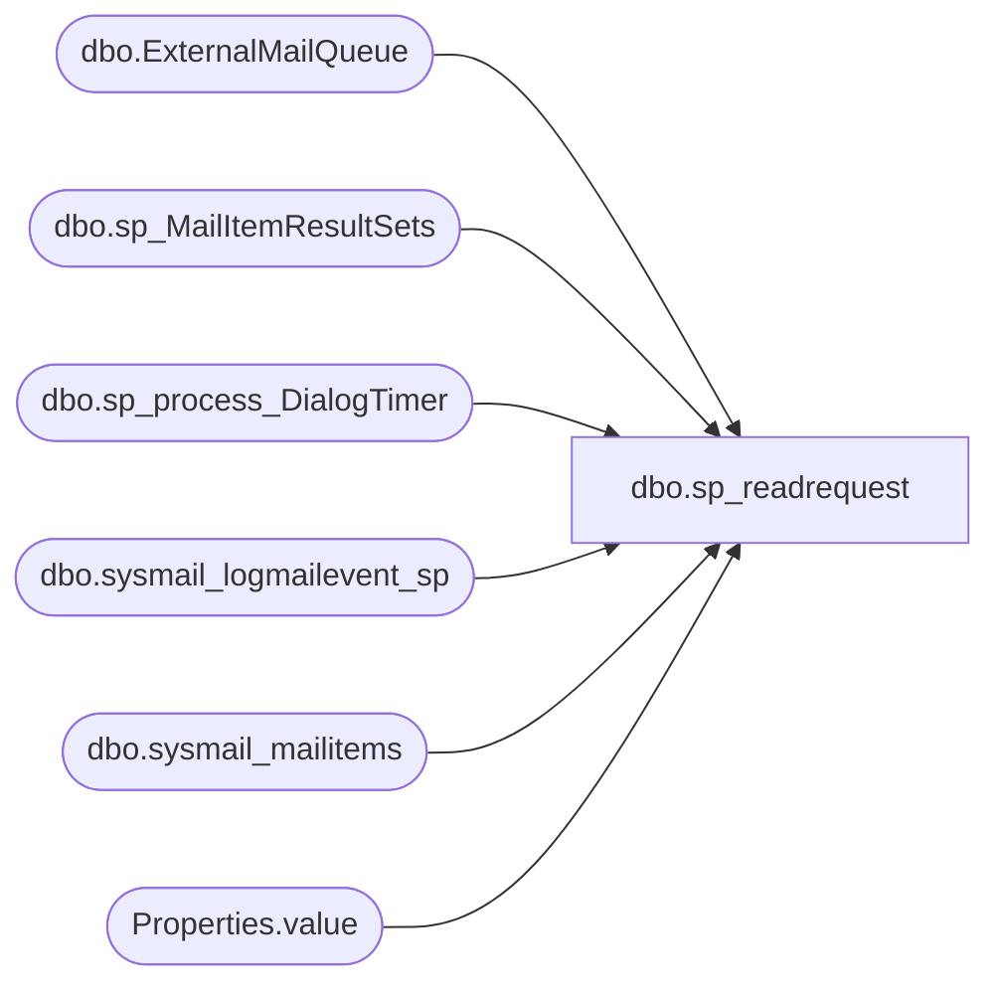

# dbo.sp_readrequest

**Database:** msdb  

## Architecture Diagram



## Table Dependencies

| Referenced Table |
|---|
| dbo.ExternalMailQueue |
| dbo.sp_MailItemResultSets |
| dbo.sp_process_DialogTimer |
| dbo.sysmail_logmailevent_sp |
| dbo.sysmail_mailitems |
| Properties.value |

## Stored Procedure Code

```sql
-- sp_readrequest : Reads a request from the the queue and returns its
--                  contents.
CREATE PROCEDURE sp_readrequest
    @receive_timeout    INT     -- the max time this read will wait for new message
AS
BEGIN
    SET NOCOUNT ON

    -- Table to store message information.
    DECLARE @msgs TABLE
    (
       [conversation_handle] uniqueidentifier,
       [service_contract_name] nvarchar(256),
       [message_type_name] nvarchar(256),
       [message_body] varbinary(max)
    )

    -- Declare variables to store row values fetched from the cursor
    DECLARE 
        @exit                   INT,
        @mailitem_id            INT,
        @profile_id             INT,
        @conversation_handle    uniqueidentifier,
        @service_contract_name  NVARCHAR(256),
        @message_type_name      NVARCHAR(256),
        @xml_message_body       VARCHAR(max),
        @timediff               INT,
        @rec_timeout            INT,
        @start_time             DATETIME,
        @localmessage           NVARCHAR(256),
        @rc                     INT

    --Init variables
    SELECT @start_time = GETDATE(),
           @timediff = 0,
           @exit = 0,
           @rc = 0

    WHILE (@timediff <= @receive_timeout)
    BEGIN
        -- Delete all messages from @msgs table
        DELETE FROM @msgs

        -- Pick all message from queue
        SET @rec_timeout = @receive_timeout - @timediff
        WAITFOR(RECEIVE conversation_handle, service_contract_name, message_type_name, message_body 
                FROM ExternalMailQueue INTO @msgs), TIMEOUT @rec_timeout

        -- Check if there was some error in reading from queue
        SET @rc = @@ERROR
        IF (@rc <> 0)
        BEGIN
           IF(@rc < 4) -- make sure return code is not in reserved range (1-3)
               SET @rc = 4

           --Note: we will get error no. 9617 if the service queue 'ExternalMailQueue' is currently disabled.
           BREAK
        END

       --If there is no message in the queue return 1 to indicate a timeout
        IF NOT EXISTS(SELECT * FROM @msgs)
        BEGIN
          SET @rc = 1
          BREAK
        END

        -- Create a cursor to iterate through the messages.
        DECLARE msgs_cursor CURSOR FOR
        SELECT conversation_handle, 
            service_contract_name, 
            message_type_name,
            CONVERT(VARCHAR(MAX), message_body)
        FROM @msgs;

        -- Open the cursor
        OPEN msgs_cursor;

        -- Perform the first fetch and store the values in the variables.
        FETCH NEXT FROM msgs_cursor
        INTO 
            @conversation_handle,
            @service_contract_name,
            @message_type_name,
            @xml_message_body

        -- Check @@FETCH_STATUS to see if there are any more rows to fetch.
        WHILE (@@FETCH_STATUS = 0)
        BEGIN
            -- Check if the message is a send mail message
            IF(@message_type_name = N'{//www.microsoft.com/databasemail/messages}SendMail')
            BEGIN
                DECLARE @xmlblob xml
                
                SET @xmlblob = CONVERT(xml, @xml_message_body) 
                    
                SELECT  @mailitem_id = MailRequest.Properties.value('(MailItemId)[1]', 'int') 
                FROM @xmlblob.nodes('
                declare namespace requests="http://schemas.microsoft.com/databasemail/requests";
                /requests:SendMail') 
                AS MailRequest(Properties) 
                				
                -- get account information 
                SELECT @profile_id = profile_id
                FROM sysmail_mailitems 
                WHERE mailitem_id = @mailitem_id

                IF(@profile_id IS NULL) -- mail item has been deleted from the database
                BEGIN
                   -- log warning
                   SET @localmessage = FORMATMESSAGE(14667, @mailitem_id)
                   exec msdb.dbo.sysmail_logmailevent_sp @event_type=2, @description=@localmessage

                   -- Resource clean-up
                   IF(@conversation_handle IS NOT NULL)
                      END CONVERSATION @conversation_handle;
                   
                   -- return code has special meaning and will be propagated to the calling process
                   SET @rc = 2
                END
                ELSE
                BEGIN
                   -- This returns the mail item to the client as multiple result sets
                   EXEC sp_MailItemResultSets
                           @mailitem_id            = @mailitem_id,
                           @profile_id             = @profile_id,
                           @conversation_handle    = @conversation_handle,
                           @service_contract_name  = @service_contract_name,
                           @message_type_name      = @message_type_name
                
                   SET @exit = 1 -- make sure we exit outer loop
                END

                -- always break from the loop upon processing SendMail message
                BREAK
            END
            -- Check if the message is a dialog timer. This is used for account retries
            ELSE IF(@message_type_name = N'http://schemas.microsoft.com/SQL/ServiceBroker/DialogTimer')
            BEGIN
                -- Handle the retry case. - DialogTimer is used for send mail reties
                EXEC @rc = sp_process_DialogTimer
                            @conversation_handle    = @conversation_handle,
                            @service_contract_name  = @service_contract_name,
                            @message_type_name      = N'{//www.microsoft.com/databasemail/messages}SendMail'

                -- Always break from the loop upon processing DialogTimer message
                -- In case of failure return code from procedure call will simply be propagated to the calling process
                SET @exit = 1 -- make sure we exit outer loop
                BREAK
            END
            -- Error case
            ELSE IF (@message_type_name = 'http://schemas.microsoft.com/SQL/ServiceBroker/Error')
            -- Error in the conversation, hence ignore all the messages of this conversation.
                BREAK

            -- This is executed as long as fetch succeeds.
            FETCH NEXT FROM msgs_cursor
            INTO 
                @conversation_handle,
                @service_contract_name,
                @message_type_name,
                @xml_message_body
        END

        CLOSE msgs_cursor;
        DEALLOCATE msgs_cursor;

        -- Check if we read any request or only SSB generated messages
        -- If a valid request is read with or without an error break out of loop
        IF (@exit = 1 OR @rc <> 0)
            BREAK

       --Keep track of how long this sp has been running
        select @timediff = DATEDIFF(ms, @start_time, getdate()) 
    END

    -- propagate return code to the calling process
    RETURN @rc
END

dbo,sp_reassign_proxy,CREATE PROCEDURE sp_reassign_proxy
	@current_proxy_id [int] = NULL,  -- must specify either @current_proxy_id or @current_proxy_name 
	@current_proxy_name [sysname] = NULL, 
	@target_proxy_id [int] = NULL,  -- must specify either @target_proxy_id or @target_proxy_name 
	@target_proxy_name [sysname] = NULL -- N'' is a special case to allow change of an existing proxy as NULL (run job step in sql agent service account context)
AS
BEGIN
    DECLARE @retval   INT
    SET NOCOUNT ON
    
    -- validate current proxy id
    EXECUTE @retval = sp_verify_proxy_identifiers '@current_proxy_name',
                                                 '@current_proxy_id',
                                                @current_proxy_name OUTPUT,
                                                 @current_proxy_id   OUTPUT

    IF (@retval <> 0)
    BEGIN
        -- exception message was raised inside sp_verify_proxy_identifiers; we dont need to RAISERROR again here
        RETURN(1) -- Failure
    END

    -- @target_proxy_name = N'' is a special case to allow change of an existing proxy as NULL (run job step in sql agent service account context)
    IF (@target_proxy_id IS NOT NULL) OR (@target_proxy_name IS NOT NULL AND @target_proxy_name <> N'') 
    BEGIN
        EXECUTE @retval = sp_verify_proxy_identifiers '@target_proxy_name',
                                                 '@target_proxy_id',
                                                 @target_proxy_name OUTPUT,
                                                 @target_proxy_id   OUTPUT

        IF (@retval <> 0)
        BEGIN
            -- exception message was raised inside sp_verify_proxy_identifiers; we dont need to RAISERROR again here
            RETURN(1) -- Failure
        END
    END
 
    -- Validate that  current proxy id and target proxy id are not the same
    IF(@current_proxy_id = @target_proxy_id)
    BEGIN
        RAISERROR(14399, -1, -1, @current_proxy_id, @target_proxy_id)
	RETURN(1) -- Failure
    END

    DECLARE @job_id UNIQUEIDENTIFIER
    DECLARE @step_id int
    DECLARE @proxy_id int
    DECLARE @subsystem_id int

    -- cursor to enumerate list of job steps what has proxy_id as current proxy_id
    DECLARE @jobstep_cursor CURSOR
    SET @jobstep_cursor = CURSOR FOR
    SELECT js.job_id, js.step_id,  js.proxy_id , subsys.subsystem_id
    FROM sysjobsteps js  
    JOIN syssubsystems subsys ON js.subsystem = subsys.subsystem
    WHERE js.proxy_id = @current_proxy_id

    OPEN @jobstep_cursor
    FETCH NEXT FROM @jobstep_cursor INTO @job_id, @step_id, @proxy_id, @subsystem_id

    WHILE @@FETCH_STATUS = 0
    BEGIN
        -- current proxy might have been granted to be used by this specific subsystem
        -- making sure that the target proxy has been granted access to same subsystem
        -- Grant target proxy to subsystem if it was not granted before
        IF NOT EXISTS( SELECT  DISTINCT ps.proxy_id, subsyst.subsystem_id
                        FROM  syssubsystems subsyst  
                        JOIN sysproxysubsystem  ps ON  (ps.subsystem_id = subsyst.subsystem_id 
				                        AND ps.proxy_id = @target_proxy_id
				                        AND ps.subsystem_id = @subsystem_id)
                    )
        BEGIN
            -- throw error that user needs to grant permission to this target proxy
            IF @target_proxy_id IS NOT NULL
            BEGIN
		     RAISERROR(14400, -1, -1, @target_proxy_id, @subsystem_id)
		     RETURN(1) -- Failure
            END
        END

        -- Update proxy_id for job step with target proxy id using sp_update_jobstep 
        EXEC sp_update_jobstep @job_id = @job_id, @step_id = @step_id , @proxy_name = @target_proxy_name
              
        FETCH NEXT FROM @jobstep_cursor INTO @job_id, @step_id, @proxy_id, @subsystem_id
    END

    CLOSE @jobstep_cursor
    DEALLOCATE @jobstep_cursor

    RETURN(0)
END

dbo,sp_remove_job_from_targets,CREATE PROCEDURE sp_remove_job_from_targets
  @job_id               UNIQUEIDENTIFIER = NULL,   -- Must provide either this or job_name
  @job_name             sysname          = NULL,   -- Must provide either this or job_id
  @target_server_groups NVARCHAR(1024)   = NULL,   -- A comma-separated list of target server groups
  @target_servers       NVARCHAR(1024)   = NULL    -- A comma-separated list of target servers
AS
BEGIN
  DECLARE @retval INT

  SET NOCOUNT ON

  EXECUTE @retval = sp_apply_job_to_targets @job_id,
                                            @job_name,
                                            @target_server_groups,
                                            @target_servers,
                                           'REMOVE'
  RETURN(@retval) -- 0 means success
END
```

