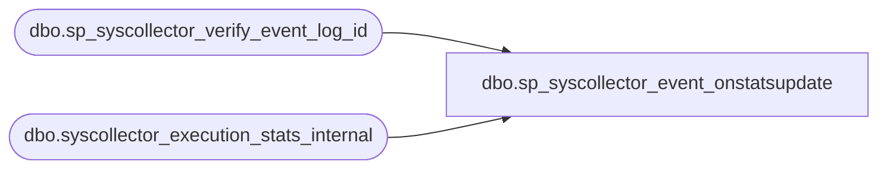

# dbo.sp_syscollector_event_onstatsupdate

**Database:** msdb  

## Architecture Diagram



## Table Dependencies

| Referenced Table |
|---|
| dbo.sp_syscollector_verify_event_log_id |
| dbo.syscollector_execution_stats_internal |

## Stored Procedure Code

```sql
CREATE PROCEDURE [dbo].[sp_syscollector_event_onstatsupdate]
    @log_id bigint,
    @task_name nvarchar(128),
    @row_count_in int = NULL,
    @row_count_out int = NULL,
    @row_count_error int = NULL,
    @execution_time_ms int = NULL
AS
BEGIN
    SET NOCOUNT ON

    -- Security check (role membership)
    IF (NOT (ISNULL(IS_MEMBER(N'dc_proxy'), 0) = 1) AND NOT (ISNULL(IS_MEMBER(N'db_owner'), 0) = 1))
    BEGIN
        RAISERROR(14677, -1, -1, 'dc_proxy')
        RETURN(1) -- Failure
    END

    -- Check the log_id
    DECLARE @retVal INT
    EXEC @retVal = dbo.sp_syscollector_verify_event_log_id @log_id
    IF (@retVal <> 0)
        RETURN (@retVal)
    
    -- Check task name
    IF (@task_name IS NOT NULL)
    BEGIN
        SET @task_name = NULLIF(LTRIM(RTRIM(@task_name)), N'')
    END
    IF (@task_name IS NULL)
    BEGIN
        RAISERROR(14606, -1, -1, '@task_name')
        RETURN (1)
    END
    
    -- Insert the log entry
    INSERT INTO dbo.syscollector_execution_stats_internal (
        log_id,
        task_name,
        execution_row_count_in,
        execution_row_count_out,
        execution_row_count_errors,
        execution_time_ms,
        log_time
    ) VALUES (
        @log_id,
        @task_name,
        @row_count_in,
        @row_count_out,
        @row_count_error,
        NULLIF(@execution_time_ms, 0),
        GETDATE()
    )

    RETURN (0)
END

dbo,sp_syscollector_get_collection_set_execution_status,CREATE PROCEDURE [dbo].[sp_syscollector_get_collection_set_execution_status]
    @collection_set_id            int,
    @is_running                    int = NULL OUTPUT,
    @is_collection_running        int = NULL OUTPUT,
    @collection_job_state        int = NULL OUTPUT,
    @is_upload_running            int = NULL OUTPUT,
    @upload_job_state            int = NULL OUTPUT
WITH EXECUTE AS OWNER -- 'MS_DataCollectorInternalUser'
AS
BEGIN
    DECLARE @TranCounter INT
    SET @TranCounter = @@TRANCOUNT
    IF (@TranCounter > 0)
        SAVE TRANSACTION tran_get_execution_status
    ELSE
        BEGIN TRANSACTION

    BEGIN TRY

    DECLARE @xp_results TABLE (job_id             UNIQUEIDENTIFIER NOT NULL,
                            last_run_date         INT              NOT NULL,
                            last_run_time         INT              NOT NULL,
                            next_run_date         INT              NOT NULL,
                            next_run_time         INT              NOT NULL,
                            next_run_schedule_id  INT              NOT NULL,
                            requested_to_run      INT              NOT NULL, -- BOOL
                            request_source        INT              NOT NULL,
                            request_source_id     sysname          COLLATE database_default NULL,
                            running               INT              NOT NULL, -- BOOL
                            current_step          INT              NOT NULL,
                            current_retry_attempt INT              NOT NULL,
                            job_state             INT              NOT NULL)


    DECLARE @is_sysadmin INT
    SELECT @is_sysadmin = ISNULL(IS_SRVROLEMEMBER(N'sysadmin'), 0)

    DECLARE @collection_job_id UNIQUEIDENTIFIER
    DECLARE @upload_job_id UNIQUEIDENTIFIER
    
    SELECT @collection_job_id = collection_job_id, @upload_job_id = upload_job_id 
    FROM dbo.syscollector_collection_sets WHERE collection_set_id = @collection_set_id

    DECLARE @agent_enabled int
    SELECT @agent_enabled = CAST(value_in_use AS int) FROM sys.configurations WHERE name = N'Agent XPs'

    --  initialize to 0  == not running state; when agent XPs are disabled, call to xp_sqlagent_enum_jobs is never made in 
    -- code below.  When Agent Xps are disabled agent would not be running, in this case, jobs will also be in 'not running" state
    SET @is_collection_running = 0  
    SET @is_upload_running = 0
    SET @collection_job_state = 0
    SET @upload_job_state = 0

    IF (@agent_enabled <> 0)
    BEGIN
        INSERT  INTO @xp_results    
        EXECUTE master.dbo.xp_sqlagent_enum_jobs @is_sysadmin, N'', @upload_job_id

        INSERT  INTO @xp_results    
        EXECUTE master.dbo.xp_sqlagent_enum_jobs @is_sysadmin, N'', @collection_job_id

        SELECT @is_collection_running = running, 
        @collection_job_state = job_state 
        FROM @xp_results WHERE job_id = @collection_job_id

        SELECT @is_upload_running = running, 
        @upload_job_state = job_state 
        FROM @xp_results WHERE job_id = @upload_job_id
    END

    SELECT @is_running = is_running FROM dbo.syscollector_collection_sets WHERE collection_set_id = @collection_set_id

    IF (@TranCounter = 0)
        COMMIT TRANSACTION
    RETURN (0)

    END TRY
    BEGIN CATCH
        IF (@TranCounter = 0 OR XACT_STATE() = -1)
            ROLLBACK TRANSACTION
        ELSE IF (XACT_STATE() = 1)
            ROLLBACK TRANSACTION tran_get_execution_status

        DECLARE @ErrorMessage   NVARCHAR(4000);
        DECLARE @ErrorSeverity  INT;
        DECLARE @ErrorState     INT;
        DECLARE @ErrorNumber    INT;
        DECLARE @ErrorLine      INT;
        DECLARE @ErrorProcedure NVARCHAR(200);
        SELECT @ErrorLine = ERROR_LINE(),
               @ErrorSeverity = ERROR_SEVERITY(),
               @ErrorState = ERROR_STATE(),
               @ErrorNumber = ERROR_NUMBER(),
               @ErrorMessage = ERROR_MESSAGE(),
               @ErrorProcedure = ISNULL(ERROR_PROCEDURE(), '-');
        RAISERROR (14684, @ErrorSeverity, -1 , @ErrorNumber, @ErrorSeverity, @ErrorState, @ErrorProcedure, @ErrorLine, @ErrorMessage);

        RETURN (1)        
    END CATCH
END

dbo,sp_syscollector_get_instmdw,CREATE PROCEDURE [dbo].[sp_syscollector_get_instmdw]
AS
BEGIN
    -- only dc_admin and dbo can setup MDW
    IF (NOT (ISNULL(IS_MEMBER(N'dc_admin'), 0) = 1) AND NOT (ISNULL(IS_MEMBER(N'db_owner'), 0) = 1))
    BEGIN
        RAISERROR(14712, -1, -1) WITH LOG
        RETURN(1) -- Failure
    END

    -- if the script has not been loaded, load it now
    IF (NOT EXISTS(SELECT parameter_name 
                   FROM syscollector_blobs_internal
                   WHERE parameter_name = N'InstMDWScript'))
    BEGIN
        EXECUTE sp_syscollector_upload_instmdw
    END
               
    SELECT cast(parameter_value as nvarchar(max)) 
    FROM syscollector_blobs_internal
    WHERE parameter_name = N'InstMDWScript'
END
```

