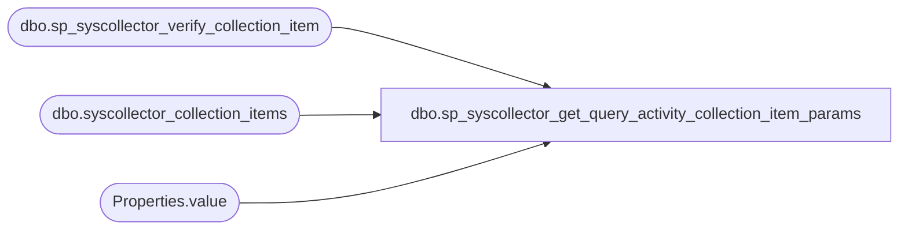

# dbo.sp_syscollector_get_query_activity_collection_item_params

**Database:** msdb  

## Architecture Diagram



## Table Dependencies

| Referenced Table |
|---|
| dbo.sp_syscollector_verify_collection_item |
| dbo.syscollector_collection_items |
| Properties.value |

## Stored Procedure Code

```sql
CREATE PROC [dbo].[sp_syscollector_get_query_activity_collection_item_params]
  @collection_item_id         int,
  @include_system_databases bit = 1 OUTPUT
AS
BEGIN
    -- Validate if collection item is valid
    DECLARE @retVal int
    DECLARE @name   sysname
    EXEC @retVal = dbo.sp_syscollector_verify_collection_item @collection_item_id OUTPUT, @name OUTPUT
    IF (@retVal <> 0)
    BEGIN
        RETURN (1)
    END

    -- Validate if collector type is "Query Activity"
    IF NOT EXISTS(SELECT collector_type_uid FROM dbo.syscollector_collection_items
                 WHERE collector_type_uid = '14AF3C12-38E6-4155-BD29-F33E7966BA23'
                 AND collection_item_id = @collection_item_id)
    BEGIN
       -- TODO - Fix Error code
        RAISERROR(14262, -1, -1, '@collection_item_id', 'Collection item type is not Query Activity collector')
        RETURN (1)
    END


    -- Get collection set param value from collection item config param
    DECLARE @paramxml XML
    SELECT @paramxml = parameters
    FROM dbo.syscollector_collection_items
    WHERE collection_item_id = @collection_item_id
    
    SELECT  
    @include_system_databases = CollectionItem.Properties.value('(Databases/@IncludeSystemDatabases)[1]', 'bit')
    FROM @paramxml.nodes('
    declare namespace ns="DataCollectorType";
    /ns:QueryActivityCollector') 
    AS CollectionItem(Properties) 

    RETURN (0)
END


dbo,sp_syscollector_get_trace_info,CREATE PROCEDURE [dbo].[sp_syscollector_get_trace_info]
    @trace_path  nvarchar(512),
    @use_default int
AS
BEGIN
    SELECT 
        CONVERT(nvarchar(30), t.start_time, 126) as start_time,
        CASE t.status 
            WHEN 1 THEN 1 
            ELSE 0 
        END AS is_running, 
        ISNULL(t.dropped_event_count,0) as dropped_event_count,
        t.id
    FROM sys.traces t
    WHERE (@use_default=1 and t.is_default=1)
          OR (@use_default=0 AND t.path LIKE (@trace_path + N'%.trc'))
END

dbo,sp_syscollector_get_tsql_query_collector_package_ids,CREATE PROCEDURE [dbo].[sp_syscollector_get_tsql_query_collector_package_ids]
    @collection_set_uid            uniqueidentifier,
    @collection_item_id            int,
    @collection_package_id        uniqueidentifier OUTPUT,
    @upload_package_id            uniqueidentifier OUTPUT,
    @collection_package_name    sysname OUTPUT,
    @upload_package_name        sysname OUTPUT    
AS
BEGIN
    -- Security check (role membership)
    IF (NOT (ISNULL(IS_MEMBER(N'dc_operator'), 0) = 1) AND 
        NOT (ISNULL(IS_MEMBER(N'dc_proxy'), 0) = 1) AND
        NOT (ISNULL(IS_MEMBER(N'db_owner'), 0) = 1))
    BEGIN
        RAISERROR(14677, -1, -1, 'dc_operator'' or ''dc_proxy')
        RETURN(1) -- Failure
    END

    SELECT @collection_package_id = collection_package_id,
        @upload_package_id = upload_package_id
    FROM dbo.syscollector_tsql_query_collector
    WHERE @collection_item_id = collection_item_id 
      AND @collection_set_uid = collection_set_uid

    IF(@collection_package_id IS NOT NULL AND @upload_package_id IS NOT NULL)
    BEGIN
        SELECT @collection_package_name = name
        FROM dbo.sysssispackages
        WHERE @collection_package_id = id

        SELECT @upload_package_name = name
        FROM dbo.sysssispackages
        WHERE @upload_package_id = id
    END
END

dbo,sp_syscollector_get_warehouse_connection_string,CREATE PROCEDURE [dbo].[sp_syscollector_get_warehouse_connection_string]
    @connection_string              nvarchar(512) = NULL OUTPUT
AS
BEGIN
    DECLARE @instance_name sysname
    DECLARE @database_name sysname
    DECLARE @user_name sysname
    DECLARE @password sysname
    DECLARE @product_version  nvarchar(128) -- SERVERPROPERTY('ProductVersion') returns value of type nvarchar(128)
    DECLARE @provider_name  nvarchar(128)

    SELECT @instance_name = CONVERT(sysname,parameter_value)
    FROM [msdb].[dbo].[syscollector_config_store_internal]
    WHERE parameter_name = N'MDWInstance'

    IF (@instance_name IS NULL)
    BEGIN
        RAISERROR(14686, -1, -1)
        RETURN (1)
    END
    
    -- '"' is the delimiter for the sql client connection string
    SET @instance_name = QUOTENAME(@instance_name, '"')

    SELECT @database_name = CONVERT(sysname,parameter_value)
    FROM [msdb].[dbo].[syscollector_config_store_internal]
    WHERE parameter_name = N'MDWDatabase'

    IF (@database_name IS NULL)
    BEGIN
        RAISERROR(14686, -1, -1)
        RETURN (1)
    END

    SET @database_name = QUOTENAME(@database_name, '"')
    
    SET @product_version = CONVERT(nvarchar(128), SERVERPROPERTY('ProductVersion'))
	
    -- SQLNCLI11 remains as SQLNCLI11 for SQL12 
    SET @provider_name = 'SQLNCLI11'
    SET @connection_string = N'Data Source=' + @instance_name + N';Application Name="Data Collector - MDW";Initial Catalog=' + @database_name
    SET @connection_string = @connection_string + N';Use Encryption for Data=true;Trust Server Certificate=true;Provider=' + @provider_name 
    SET @connection_string = @connection_string + N';Integrated Security=SSPI;Connect Timeout=60;';

    RETURN (0)
END

dbo,sp_syscollector_purge_collection_logs,CREATE PROCEDURE [dbo].[sp_syscollector_purge_collection_logs]
    @reference_date datetime = NULL,
    @delete_batch_size int = 500
AS
BEGIN
    SET NOCOUNT ON

    -- Security check (role membership)
    IF (NOT (ISNULL(IS_MEMBER(N'dc_proxy'), 0) = 1) AND NOT (ISNULL(IS_MEMBER(N'db_owner'), 0) = 1))
    BEGIN
        RAISERROR(14677, -1, -1, 'dc_proxy')
        RETURN(1) -- Failure
    END

    IF (@reference_date IS NULL)
    BEGIN
        SET @reference_date = GETDATE()
    END
    
    -- An expired log record is any record of a collection set that is older than 
    -- the reference date minus the collection set's days_until_expiration
    CREATE TABLE #purged_log_ids (log_id BIGINT, package_execution_id uniqueidentifier)
    
    -- Identify logs to purge based on following criteria
    -- a) limit max batch size 
    -- b) do not delete last log record that is a root log record for a collection set
    INSERT INTO #purged_log_ids
    SELECT TOP (@delete_batch_size) log_id, package_execution_id
    FROM syscollector_execution_log_internal as l
    INNER JOIN syscollector_collection_sets s ON l.collection_set_id = s.collection_set_id
    WHERE s.days_until_expiration > 0
    AND @reference_date >= DATEADD(DAY, s.days_until_expiration, l.finish_time)
    AND log_id NOT IN (
                        SELECT TOP 1 log_id  from syscollector_execution_log_internal 
                        WHERE parent_log_id IS NULL 
                        AND collection_set_id = l.collection_set_id
                        ORDER BY start_time DESC
                        )

    DECLARE @purge_log_count int
    SELECT @purge_log_count  = COUNT(log_id) 
    FROM  #purged_log_ids

    -- Delete all ssis log records pertaining to expired logs
    DELETE FROM dbo.sysssislog
        FROM dbo.sysssislog AS s
        INNER JOIN #purged_log_ids AS i ON i.package_execution_id = s.executionid
        
    -- Then delete the actual logs
    DELETE FROM syscollector_execution_log_internal
        FROM syscollector_execution_log_internal AS l
        INNER Join #purged_log_ids AS i ON i.log_id = l.log_id


    DROP TABLE #purged_log_ids

    -- making sure that delete # record does not exceed given delete batch size
    DECLARE @orphaned_record_cleanup_count int
    SET @orphaned_record_cleanup_count = @delete_batch_size - @purge_log_count

    -- Go for another round to cleanup the orphans
    -- Ideally, the log heirarchy guarantees that a finish time by a parent log will always
    -- be higher than the finish time of any of its descendants.
    -- The purge step however does not delete log records with a null finish time
    -- A child log can have a null finish time while its parent is closed if there is an
    -- error in execution that causes the log to stay open.
    -- If such a child log exists, its parent will be purged leaving it as an orphan
    
    -- get orphan records and all their descendants in a cursor and purge them
    DECLARE orphaned_log_cursor INSENSITIVE CURSOR FOR
            SELECT TOP (@orphaned_record_cleanup_count) log_id 
            FROM syscollector_execution_log_internal
            WHERE parent_log_id NOT IN (
                SELECT log_id FROM syscollector_execution_log_internal
            )
            FOR READ ONLY
            
    DECLARE @log_id BIGINT

    -- for every orphan, delete all its remaining tree
    -- this is supposedly a very small fraction of the entire log
    OPEN orphaned_log_cursor    
    FETCH orphaned_log_cursor INTO @log_id
    WHILE @@FETCH_STATUS = 0
    BEGIN
        EXEC sp_syscollector_delete_execution_log_tree @log_id = @log_id, @from_collection_set = 0
        FETCH orphaned_log_cursor INTO @log_id
    END
    
    CLOSE orphaned_log_cursor
    DEALLOCATE orphaned_log_cursor
END

dbo,sp_syscollector_run_collection_set,CREATE PROCEDURE [dbo].[sp_syscollector_run_collection_set]
    @collection_set_id        int = NULL,
    @name                     sysname = NULL
WITH EXECUTE AS OWNER -- 'MS_DataCollectorInternalUser'
AS
BEGIN
    SET NOCOUNT ON

    DECLARE @TranCounter INT
    SET @TranCounter = @@TRANCOUNT
    IF (@TranCounter > 0)
        SAVE TRANSACTION tran_run_collection_set
    ELSE
        BEGIN TRANSACTION

    BEGIN TRY


    -- Security check (role membership)
    EXECUTE AS CALLER;
    IF (NOT (ISNULL(IS_MEMBER(N'dc_operator'), 0) = 1) AND NOT (ISNULL(IS_MEMBER(N'db_owner'), 0) = 1))
    BEGIN
        REVERT;
        RAISERROR(14677, -1, -1, 'dc_operator')
        RETURN(1) -- Failure
    END
    REVERT;

    -- Verify the input parameters
    DECLARE @retVal int
    EXEC @retVal = dbo.sp_syscollector_verify_collection_set @collection_set_id OUTPUT, @name OUTPUT
    IF (@retVal <> 0)
        RETURN (1)

    -- Make sure the collection set is in the right mode
    DECLARE @collection_mode smallint
    DECLARE @collection_set_uid uniqueidentifier;

    SELECT 
        @collection_set_uid = collection_set_uid,
        @collection_mode = collection_mode            
    FROM [dbo].[syscollector_collection_sets]
    WHERE collection_set_id = @collection_set_id

    IF (@collection_mode <> 1)
    BEGIN
        RAISERROR(14695, -1, -1, @name)
        RETURN(1)
    END


    -- Make sure the collector is enabled
    EXEC @retVal = [dbo].[sp_syscollector_verify_collector_state] @desired_state = 1
    IF (@retVal <> 0)
        RETURN (1)

    -- check if SQL Server Agent is enabled
    DECLARE @agent_enabled int
    SELECT @agent_enabled = CAST(value_in_use AS int) FROM sys.configurations WHERE name = N'Agent XPs'
    IF @agent_enabled <> 1
    BEGIN
        RAISERROR(14688, -1, -1)
        RETURN (1)
    END

    -- check if MDW is setup
    DECLARE @instance_name sysname
    SELECT @instance_name = CONVERT(sysname,parameter_value)
    FROM [msdb].[dbo].[syscollector_config_store_internal]
    WHERE parameter_name = N'MDWInstance'
    IF (@instance_name IS NULL)
    BEGIN
        RAISERROR(14689, -1, -1)
        RETURN (1)
    END    
    DECLARE @database_name sysname
    SELECT @database_name = CONVERT(sysname,parameter_value)
    FROM [msdb].[dbo].[syscollector_config_store_internal]
    WHERE parameter_name = N'MDWDatabase'
    IF (@database_name IS NULL)
    BEGIN
        RAISERROR(14689, -1, -1)
        RETURN (1)
    END

    -- Make sure the jobs are created for the collection set
    -- Verify the input parameters
    EXEC @retVal = dbo.sp_syscollector_verify_collection_set @collection_set_id OUTPUT, @name OUTPUT
    IF (@retVal <> 0)
        RETURN (1)

    -- Check if the collection set does not have any collection items
    IF NOT EXISTS(
        SELECT i.collection_item_id 
        FROM [dbo].[syscollector_collection_sets] AS s
        INNER JOIN [dbo].[syscollector_collection_items] AS i
            ON(s.collection_set_id = i.collection_set_id)
        WHERE s.collection_set_id = @collection_set_id
    )
    BEGIN
        RAISERROR(14685, 10, -1, @name) -- Raise a warning message
        IF (@TranCounter = 0)
            COMMIT TRANSACTION
        RETURN (0)
    END

    DECLARE @proxy_id int;
    DECLARE @collection_job_id uniqueidentifier
    DECLARE @upload_job_id uniqueidentifier

    SELECT @collection_job_id = collection_job_id, 
           @upload_job_id = upload_job_id, 
           @proxy_id = proxy_id
    FROM [dbo].[syscollector_collection_sets_internal]
    WHERE collection_set_id = @collection_set_id;

    -- Check if the set does not have a proxy
    IF (@proxy_id IS NULL)
    BEGIN
        -- to start a collection set without a proxy, the caller has to be a sysadmin
        EXECUTE AS CALLER;
            IF (NOT (ISNULL(IS_SRVROLEMEMBER(N'sysadmin'), 0) = 1))
            BEGIN
                REVERT;
                RAISERROR(14692, -1, -1, @name)
                RETURN (1)
            END
        REVERT;
    END

    -- Check if we have jobs created, and if not, create them
    DECLARE @jobs_just_created bit
    SET @jobs_just_created = 0  -- False until further notice
    IF (@collection_job_id IS NULL AND @upload_job_id IS NULL)
    BEGIN
        DECLARE @schedule_id int;
        DECLARE @schedule_uid uniqueidentifier;

        SELECT 
            @schedule_uid = schedule_uid
        FROM [dbo].[syscollector_collection_sets_internal]
        WHERE collection_set_id = @collection_set_id;
        
        IF (@schedule_uid IS NOT NULL)
        BEGIN
            SELECT @schedule_id = schedule_id FROM sysschedules_localserver_view WHERE @schedule_uid = schedule_uid
        END

        -- Sanity check
        -- Make sure the proxy and schedule are still there, someone could have
        -- remove them between when the collection set was created and now.
        IF (@proxy_id IS NOT NULL)
        BEGIN
            DECLARE @proxy_name sysname
            
            -- this will throw an error of proxy_id does not exist
            EXEC @retVal = msdb.dbo.sp_verify_proxy_identifiers '@proxy_name', '@proxy_id', @proxy_name OUTPUT, @proxy_id OUTPUT
            IF (@retVal <> 0)
                RETURN (0)
        END

        IF (@schedule_uid IS NOT NULL)
        BEGIN
            EXEC @retVal = sp_verify_schedule_identifiers  @name_of_name_parameter = '@schedule_name',
                                                           @name_of_id_parameter   = '@schedule_id',
                                                           @schedule_name          = NULL,
                                                           @schedule_id            = @schedule_id,
                                                           @owner_sid              = NULL,
                                                           @orig_server_id         = NULL 
            IF (@retVal <> 0)
                RETURN (1)
        END

        -- Go add the jobs
        EXEC [dbo].[sp_syscollector_create_jobs]
            @collection_set_id    = @collection_set_id,
            @collection_set_uid = @collection_set_uid,
            @collection_set_name = @name,
            @proxy_id            = @proxy_id,
            @schedule_id        = @schedule_id,
            @collection_mode    = @collection_mode,
            @collection_job_id    = @collection_job_id OUTPUT,
            @upload_job_id        = @upload_job_id OUTPUT

        -- Finally, update the collection_sets table
        UPDATE [dbo].[syscollector_collection_sets_internal]
        SET
            upload_job_id        = @upload_job_id,
            collection_job_id    = @collection_job_id
        WHERE @collection_set_id = collection_set_id

        SET @jobs_just_created = 1  -- Record the fact that we have just created the job here
    END

    IF (@jobs_just_created = 1)
    BEGIN  -- We created the jobs here in this transaction, post a request for agent to start as soon as we commit
        EXEC @retVal = sp_start_job @job_id = @upload_job_id
        IF (@retVal <> 0)
            RETURN (1)
    END
    ELSE   
    BEGIN
        -- The jobs were created previously, we need to guard against it already executing by the schedule
        -- So, check if the job is currently running before asking agent to start it
        DECLARE @is_upload_job_running INT
        EXECUTE [dbo].[sp_syscollector_get_collection_set_execution_status]
            @collection_set_id = @collection_set_id,
            @is_upload_running = @is_upload_job_running OUTPUT

        IF (@is_upload_job_running = 0)
        BEGIN
            -- Job is not running, we can trigger it now
            -- We run only one job because for this (non-cached) mode there is only one job. The same id is stored
            -- as collection and upload job id
            EXEC @retVal = sp_start_job @job_id = @upload_job_id
            IF (@retVal <> 0)
                RETURN (1)
        END
    END

    IF (@TranCounter = 0)
        COMMIT TRANSACTION
    RETURN (0)

    END TRY
    BEGIN CATCH
        IF (@TranCounter = 0 OR XACT_STATE() = -1)
            ROLLBACK TRANSACTION
        ELSE IF (XACT_STATE() = 1)
            ROLLBACK TRANSACTION tran_run_collection_set

        DECLARE @ErrorMessage   NVARCHAR(4000);
        DECLARE @ErrorSeverity  INT;
        DECLARE @ErrorState     INT;
        DECLARE @ErrorNumber    INT;
        DECLARE @ErrorLine      INT;
        DECLARE @ErrorProcedure NVARCHAR(200);
        SELECT @ErrorLine = ERROR_LINE(),
               @ErrorSeverity = ERROR_SEVERITY(),
               @ErrorState = ERROR_STATE(),
               @ErrorNumber = ERROR_NUMBER(),
               @ErrorMessage = ERROR_MESSAGE(),
               @ErrorProcedure = ISNULL(ERROR_PROCEDURE(), '-');
        RAISERROR (14684, @ErrorSeverity, -1 , @ErrorNumber, @ErrorSeverity, @ErrorState, @ErrorProcedure, @ErrorLine, @ErrorMessage);

        RETURN (1)        
    END CATCH
END

dbo,sp_syscollector_set_cache_directory,CREATE PROCEDURE [dbo].[sp_syscollector_set_cache_directory]
    @cache_directory                    nvarchar(255) = NULL
AS
BEGIN
    -- Security check (role membership)
    IF (NOT (ISNULL(IS_MEMBER(N'dc_admin'), 0) = 1) AND NOT (ISNULL(IS_MEMBER(N'db_owner'), 0) = 1))
    BEGIN
        RAISERROR(14677, -1, -1, 'dc_admin')
        RETURN(1) -- Failure
    END

    SET @cache_directory = NULLIF(LTRIM(RTRIM(@cache_directory)), N'')

    -- Check if the collector is disabled
    DECLARE @retVal int
    EXEC @retVal = [dbo].[sp_syscollector_verify_collector_state] @desired_state = 0
    IF (@retVal <> 0)
        RETURN (1)

    UPDATE [msdb].[dbo].[syscollector_config_store_internal]
    SET parameter_value = @cache_directory
    WHERE parameter_name = N'CacheDirectory'

    RETURN (0)
END

dbo,sp_syscollector_set_cache_window,CREATE PROCEDURE [dbo].[sp_syscollector_set_cache_window]
    @cache_window                    int = 1
AS
BEGIN
    -- Security check (role membership)
    IF (NOT (ISNULL(IS_MEMBER(N'dc_admin'), 0) = 1) AND NOT (ISNULL(IS_MEMBER(N'db_owner'), 0) = 1))
    BEGIN
        RAISERROR(14677, -1, -1, 'dc_admin')
        RETURN(1) -- Failure
    END

    -- Check if the collector is disabled
    DECLARE @retVal int
    EXEC @retVal = [dbo].[sp_syscollector_verify_collector_state] @desired_state = 0
    IF (@retVal <> 0)
        RETURN (1)

    IF (@cache_window < -1)
    BEGIN
        RAISERROR(14687, -1, -1, @cache_window)
        RETURN(1)
    END

    UPDATE [msdb].[dbo].[syscollector_config_store_internal]
    SET parameter_value = @cache_window
    WHERE parameter_name = N'CacheWindow'

    RETURN (0)
END

dbo,sp_syscollector_set_warehouse_database_name,CREATE PROCEDURE [dbo].[sp_syscollector_set_warehouse_database_name]
    @database_name                    sysname = NULL
AS
BEGIN
    -- Security check (role membership)
    IF (NOT (ISNULL(IS_MEMBER(N'dc_admin'), 0) = 1) AND NOT (ISNULL(IS_MEMBER(N'db_owner'), 0) = 1))
    BEGIN
        RAISERROR(14677, -1, -1, 'dc_admin')
        RETURN(1) -- Failure
    END

    -- Check if the collector is disabled
    DECLARE @retVal int
    EXEC @retVal = [dbo].[sp_syscollector_verify_collector_state] @desired_state = 0
    IF (@retVal <> 0)
        RETURN (1)

    UPDATE [msdb].[dbo].[syscollector_config_store_internal]
    SET parameter_value = @database_name
    WHERE parameter_name = N'MDWDatabase'

    RETURN (0)
END

dbo,sp_syscollector_set_warehouse_instance_name,CREATE PROCEDURE [dbo].[sp_syscollector_set_warehouse_instance_name]
    @instance_name                    sysname = NULL
AS
BEGIN
    -- Security check (role membership)
    IF (NOT (ISNULL(IS_MEMBER(N'dc_admin'), 0) = 1) AND NOT (ISNULL(IS_MEMBER(N'db_owner'), 0) = 1))
    BEGIN
        RAISERROR(14677, -1, -1, 'dc_admin')
        RETURN(1) -- Failure
    END

    -- Check if the collector is disabled
    DECLARE @retVal int
    EXEC @retVal = [dbo].[sp_syscollector_verify_collector_state] @desired_state = 0
    IF (@retVal <> 0)
        RETURN (1)

    UPDATE [msdb].[dbo].[syscollector_config_store_internal]
    SET parameter_value = @instance_name
    WHERE parameter_name = N'MDWInstance'

    RETURN (0)
END
```

