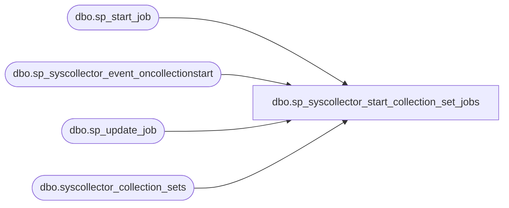

# dbo.sp_syscollector_start_collection_set_jobs

**Database:** msdb  

## Architecture Diagram



## Table Dependencies

| Referenced Table |
|---|
| dbo.sp_start_job |
| dbo.sp_syscollector_event_oncollectionstart |
| dbo.sp_update_job |
| dbo.syscollector_collection_sets |

## Stored Procedure Code

```sql
CREATE PROCEDURE [dbo].[sp_syscollector_start_collection_set_jobs]
    @collection_set_id    int
AS
BEGIN
    SET NOCOUNT ON

    -- Collection set started. Make sure the following happens:
    -- 1. Collection and upload jobs are enabled
    -- 2. Collection job is started if it is defined as running continously

    DECLARE @TranCounter INT
    SET @TranCounter = @@TRANCOUNT
    IF (@TranCounter > 0)
        SAVE TRANSACTION tran_start_collection_set_jobs
    ELSE
        BEGIN TRANSACTION

    BEGIN TRY
        
        -- Log the start of the collection set
        DECLARE @log_id bigint
        EXEC sp_syscollector_event_oncollectionstart @collection_set_id = @collection_set_id, @log_id = @log_id OUTPUT

        -- Enable both jobs
        DECLARE @collection_job_id    uniqueidentifier
        DECLARE @upload_job_id        uniqueidentifier
        DECLARE @collection_mode    smallint

        SELECT    @collection_job_id = collection_job_id,
                @upload_job_id = upload_job_id,
                @collection_mode = collection_mode
        FROM dbo.syscollector_collection_sets
        WHERE collection_set_id = @collection_set_id

        EXEC sp_update_job @job_id = @collection_job_id, @enabled = 1
        EXEC sp_update_job @job_id = @upload_job_id, @enabled = 1

        -- Start the collection job if you are in ad hoc or continuous modes
        IF (@collection_mode = 1 OR @collection_mode = 0)
        BEGIN
            EXEC sp_start_job @job_id = @collection_job_id, @error_flag = 0
        END

        IF (@TranCounter = 0)
            COMMIT TRANSACTION
        RETURN (0)
    END TRY
    BEGIN CATCH
        IF (@TranCounter = 0 OR XACT_STATE() = -1)
            ROLLBACK TRANSACTION
        ELSE IF (XACT_STATE() = 1)
            ROLLBACK TRANSACTION tran_start_collection_set_jobs

        DECLARE @ErrorMessage   NVARCHAR(4000);
        DECLARE @ErrorSeverity  INT;
        DECLARE @ErrorState     INT;
        DECLARE @ErrorNumber    INT;
        DECLARE @ErrorLine      INT;
        DECLARE @ErrorProcedure NVARCHAR(200);
        SELECT @ErrorLine = ERROR_LINE(),
               @ErrorSeverity = ERROR_SEVERITY(),
               @ErrorState = ERROR_STATE(),
               @ErrorNumber = ERROR_NUMBER(),
               @ErrorMessage = ERROR_MESSAGE(),
               @ErrorProcedure = ISNULL(ERROR_PROCEDURE(), '-');

        RAISERROR (14684, @ErrorSeverity, -1 , @ErrorNumber, @ErrorSeverity, @ErrorState, @ErrorProcedure, @ErrorLine, @ErrorMessage);
        
        RETURN (1)
    END CATCH
END

dbo,sp_syscollector_stop_collection_set,CREATE PROCEDURE [dbo].[sp_syscollector_stop_collection_set]
    @collection_set_id        int = NULL,
    @name                     sysname = NULL,
    @stop_collection_job      bit = 1           -- Do we need to stop the collection job, YES by default
AS
BEGIN
    SET NOCOUNT ON

    -- Security check (role membership)
    IF (NOT (ISNULL(IS_MEMBER(N'dc_operator'), 0) = 1) AND NOT (ISNULL(IS_MEMBER(N'db_owner'), 0) = 1))
    BEGIN
        RAISERROR(14677, -1, -1, 'dc_operator')
        RETURN(1) -- Failure
    END

    -- Verify the input parameters
    DECLARE @retVal int
    EXEC @retVal = dbo.sp_syscollector_verify_collection_set @collection_set_id OUTPUT, @name OUTPUT
    IF (@retVal <> 0)
        RETURN (1)

    IF (@stop_collection_job = 1)
    BEGIN
        DECLARE @collection_mode INT
        DECLARE @collection_job_id UNIQUEIDENTIFIER

        SELECT  @collection_mode = collection_mode, @collection_job_id = collection_job_id
        FROM    dbo.syscollector_collection_sets
        WHERE   collection_set_id = @collection_set_id
       
        DECLARE @is_collection_job_running INT
        EXECUTE [dbo].[sp_syscollector_get_collection_set_execution_status]
                @collection_set_id = @collection_set_id,
                @is_collection_running = @is_collection_job_running OUTPUT

        -- Stop the collection job if we are in cached mode, this should signal the runtime to exit
        IF (@is_collection_job_running = 1      -- Collection job is running
            AND @collection_mode = 0
            AND @stop_collection_job = 1)
        BEGIN
            EXEC sp_stop_job @job_id = @collection_job_id
        END
    END


    -- Update the is_running column for this collection set
    -- There is a trigger defined for that table that turns off
    -- the collection and uplaod jobs in response to that bit
    -- changing.
    UPDATE [dbo].[syscollector_collection_sets_internal]
    SET is_running = 0
    WHERE collection_set_id = @collection_set_id

    RETURN (0)
END
```

