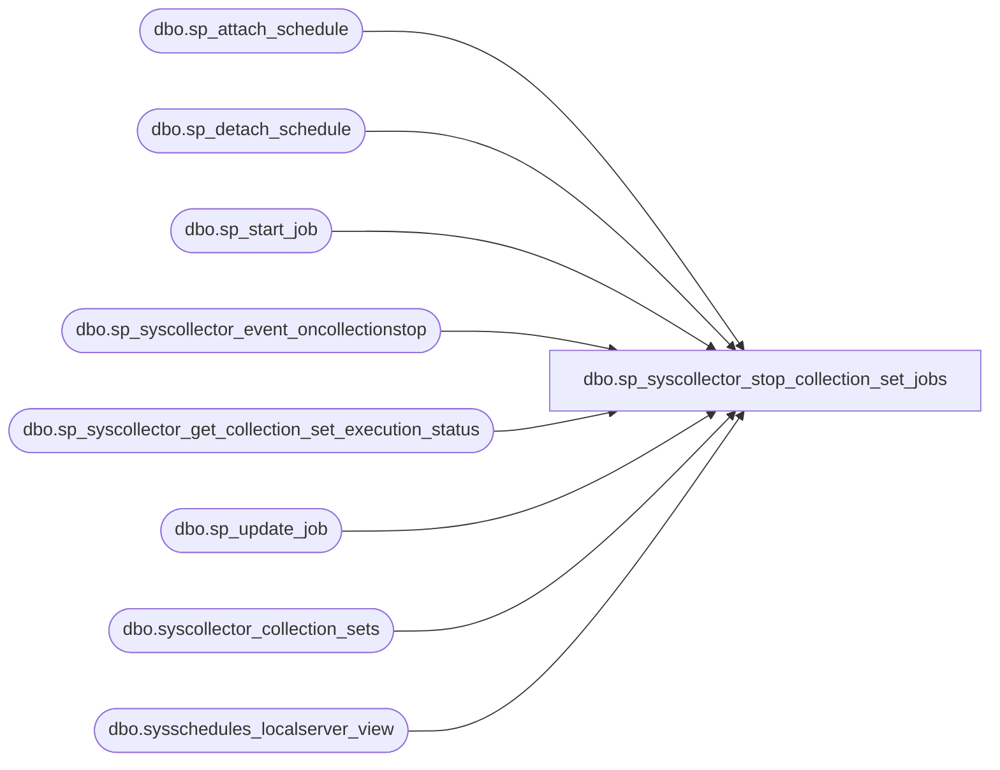

# dbo.sp_syscollector_stop_collection_set_jobs

**Database:** msdb  

## Architecture Diagram



## Table Dependencies

| Referenced Table |
|---|
| dbo.sp_attach_schedule |
| dbo.sp_detach_schedule |
| dbo.sp_start_job |
| dbo.sp_syscollector_event_oncollectionstop |
| dbo.sp_syscollector_get_collection_set_execution_status |
| dbo.sp_update_job |
| dbo.syscollector_collection_sets |
| dbo.sysschedules_localserver_view |

## Stored Procedure Code

```sql
CREATE PROCEDURE [dbo].[sp_syscollector_stop_collection_set_jobs]
    @collection_set_id    int
AS
BEGIN
    SET NOCOUNT ON

    -- Collection set stopped. Make sure the following happens:
    -- 1. Detach upload schedule
    -- 2. Collection job is stopped
    -- 3. Upload job is kicked once if it is not running now
    -- 4. Collection and upload jobs are disabled
    -- 5. Attach upload schedule
    DECLARE @TranCounter INT
    SET @TranCounter = @@TRANCOUNT
    IF (@TranCounter > 0)
        SAVE TRANSACTION tran_stop_collection_set_jobs
    ELSE
        BEGIN TRANSACTION
    
    BEGIN TRY
        DECLARE @collection_job_id    uniqueidentifier
        DECLARE @upload_job_id        uniqueidentifier
        DECLARE @schedule_uid        uniqueidentifier
        DECLARE @collection_mode    smallint

        SELECT    @collection_job_id = collection_job_id, 
                @upload_job_id = upload_job_id, 
                @collection_mode = collection_mode, 
                @schedule_uid = schedule_uid
        FROM dbo.syscollector_collection_sets
        WHERE collection_set_id = @collection_set_id

        DECLARE @schedule_id int
        IF (@collection_mode != 1)  -- detach schedule for continuous and snapshot modes
        BEGIN
            SELECT @schedule_id = schedule_id from sysschedules_localserver_view WHERE @schedule_uid = schedule_uid
            IF (@schedule_id IS NULL)
            BEGIN
                DECLARE @schedule_uid_as_char VARCHAR(36)
                SELECT @schedule_uid_as_char = CONVERT(VARCHAR(36), @schedule_uid)
                RAISERROR(14262, -1, -1, '@schedule_uid', @schedule_uid_as_char)
                RETURN (1)
            END

            -- Detach schedule
            EXEC dbo.sp_detach_schedule
                @job_id            = @upload_job_id,
                @schedule_id    = @schedule_id,
                @delete_unused_schedule = 0    -- do not delete schedule, might need to attach it back again
        END

        DECLARE @is_upload_job_running INT
        EXECUTE [dbo].[sp_syscollector_get_collection_set_execution_status]
                @collection_set_id = @collection_set_id,
                @is_upload_running = @is_upload_job_running OUTPUT

        -- Upload job (needs to be kicked off for continuous collection mode)
        IF (@is_upload_job_running = 0            -- If the upload job is not already in progress
            AND @collection_mode = 0)           -- don't do it for adhoc or snapshot, they will handle it on their own
        BEGIN
            EXEC sp_start_job @job_id = @upload_job_id, @error_flag = 0
        END

        -- Disable both jobs
        EXEC sp_update_job @job_id = @collection_job_id, @enabled = 0
        EXEC sp_update_job @job_id = @upload_job_id, @enabled = 0

        IF (@collection_mode != 1)    -- attach schedule for continuous and snapshot modes
        BEGIN
            -- Attach schedule
            EXEC dbo.sp_attach_schedule
                @job_id            = @upload_job_id,
                @schedule_id    = @schedule_id
        END

        -- Log the stop of the collection set
        EXEC sp_syscollector_event_oncollectionstop @collection_set_id = @collection_set_id

        IF (@TranCounter = 0)
            COMMIT TRANSACTION
        RETURN (0)
    END TRY
    BEGIN CATCH
        IF (@TranCounter = 0 OR XACT_STATE() = -1)
            ROLLBACK TRANSACTION
        ELSE IF (XACT_STATE() = 1)
            ROLLBACK TRANSACTION tran_stop_collection_set_jobs

        DECLARE @ErrorMessage   NVARCHAR(4000);
        DECLARE @ErrorSeverity  INT;
        DECLARE @ErrorState     INT;
        DECLARE @ErrorNumber    INT;
        DECLARE @ErrorLine      INT;
        DECLARE @ErrorProcedure NVARCHAR(200);
        SELECT @ErrorLine = ERROR_LINE(),
               @ErrorSeverity = ERROR_SEVERITY(),
               @ErrorState = ERROR_STATE(),
               @ErrorNumber = ERROR_NUMBER(),
               @ErrorMessage = ERROR_MESSAGE(),
               @ErrorProcedure = ISNULL(ERROR_PROCEDURE(), '-');

        RAISERROR (14684, @ErrorSeverity, -1 , @ErrorNumber, @ErrorSeverity, @ErrorState, @ErrorProcedure, @ErrorLine, @ErrorMessage);
        
        RETURN (1)
    END CATCH
END

dbo,sp_syscollector_text_query_plan_lookpup,CREATE PROCEDURE [dbo].[sp_syscollector_text_query_plan_lookpup]
    @plan_handle varbinary(64),
    @statement_start_offset int,
    @statement_end_offset int
AS
BEGIN
    SET NOCOUNT ON
    SELECT    
        @plan_handle AS plan_handle,
        @statement_start_offset AS statement_start_offset,
        @statement_end_offset AS statement_end_offset,
        [dbid] AS database_id,
        [objectid] AS object_id,
        OBJECT_NAME(objectid, dbid) AS object_name,
        [query_plan] AS query_plan
    FROM    
        [sys].[dm_exec_text_query_plan](@plan_handle, @statement_start_offset, @statement_end_offset) dm
END

dbo,sp_syscollector_update_collection_item,CREATE PROCEDURE [dbo].[sp_syscollector_update_collection_item]
    @collection_item_id        int = NULL,
    @name                    sysname = NULL,
    @new_name                sysname = NULL,
    @frequency                int = NULL,
    @parameters                xml = NULL
AS
BEGIN
    -- Security check (role membership)
    IF (NOT (ISNULL(IS_MEMBER(N'dc_operator'), 0) = 1) AND NOT (ISNULL(IS_MEMBER(N'db_owner'), 0) = 1))
    BEGIN
        RAISERROR(14677, -1, -1, 'dc_operator')
        RETURN(1) -- Failure
    END

    -- Security checks (restrict functionality for non-dc_admin-s)
    IF ((NOT (ISNULL(IS_MEMBER(N'dc_admin'), 0) = 1) AND NOT (ISNULL(IS_MEMBER(N'db_owner'), 0) = 1)) 
        AND (@new_name IS NOT NULL))
    BEGIN
        RAISERROR(14676, -1, -1, '@new_name', 'dc_admin')
        RETURN (1) -- Failure
    END
    IF ((NOT (ISNULL(IS_MEMBER(N'dc_admin'), 0) = 1) AND NOT (ISNULL(IS_MEMBER(N'db_owner'), 0) = 1))
        AND (@parameters IS NOT NULL))
    BEGIN
        RAISERROR(14676, -1, -1, '@parameters', 'dc_admin')
        RETURN (1) -- Failure
    END

    DECLARE @retVal int
    EXEC @retVal = dbo.sp_syscollector_verify_collection_item @collection_item_id OUTPUT, @name OUTPUT
    IF (@retVal <> 0)
        RETURN (@retVal)

    IF (@frequency < 5)
    BEGIN
        DECLARE @frequency_as_char VARCHAR(36)
        SELECT @frequency_as_char = CONVERT(VARCHAR(36), @frequency)
        RAISERROR(21405, 16, -1, @frequency_as_char, '@frequency', 5)
        RETURN (1)
    END

    IF (LEN(@new_name) = 0)  -- can't rename to an empty string
    BEGIN
      RAISERROR(21263, -1, -1, '@new_name')
      RETURN(1) -- Failure
    END    

    -- Remove any leading/trailing spaces from parameters
    SET @new_name            = LTRIM(RTRIM(@new_name))

    DECLARE @collection_set_name sysname
    DECLARE @is_system              bit
    DECLARE @is_running             bit
    DECLARE @collector_type_uid     uniqueidentifier
    DECLARE @collection_set_id      int
    SELECT @is_running = s.is_running,
           @is_system = s.is_system,
           @collection_set_name = s.name,
           @collector_type_uid = i.collector_type_uid,
           @collection_set_id = s.collection_set_id
    FROM dbo.syscollector_collection_sets s,
         dbo.syscollector_collection_items i
    WHERE s.collection_set_id = i.collection_set_id
    AND i.collection_item_id = @collection_item_id

    IF (@is_system = 1 AND (@new_name IS NOT NULL))
    BEGIN
        -- cannot update, delete, or add new collection items to a system collection set
        RAISERROR(14696, -1, -1);
        RETURN (1)
    END

    IF (@parameters IS NOT NULL)
    BEGIN
        EXEC @retVal = dbo.sp_syscollector_validate_xml @collector_type_uid = @collector_type_uid, @parameters = @parameters
        IF (@retVal <> 0)
            RETURN (@retVal)
    END

    -- if the collection item is running, stop it before update
    IF (@is_running = 1)
    BEGIN
        EXEC @retVal = sp_syscollector_stop_collection_set @collection_set_id = @collection_set_id
        IF (@retVal <> 0)
            RETURN(1)
    END

    -- all conditions go, perform the update
    EXEC @retVal = sp_syscollector_update_collection_item_internal     
                            @collection_item_id = @collection_item_id,
                            @name = @name,
                            @new_name = @new_name,
                            @frequency = @frequency,
                            @parameters = @parameters
                        
    -- if you stopped the collection set, restart it
    IF (@is_running = 1)
    BEGIN
        EXEC @retVal = sp_syscollector_start_collection_set @collection_set_id = @collection_set_id
        IF (@retVal <> 0)
            RETURN (1)
    END
    
    RETURN (0)
END

dbo,sp_syscollector_update_collection_item_internal,CREATE PROCEDURE [dbo].[sp_syscollector_update_collection_item_internal]
    @collection_item_id        int = NULL,
    @name                    sysname = NULL,
    @new_name                sysname = NULL,
    @frequency                int = NULL,
    @parameters                xml = NULL
AS
BEGIN
    DECLARE @TranCounter INT
    SET @TranCounter = @@TRANCOUNT
    IF (@TranCounter > 0)
        SAVE TRANSACTION tran_update_collection_item
    ELSE
        BEGIN TRANSACTION
    BEGIN TRY
        UPDATE [dbo].[syscollector_collection_items_internal]
        SET
            name                = ISNULL(@new_name, name),
            frequency            = ISNULL(@frequency, frequency),
            parameters            = ISNULL(@parameters, parameters)
        WHERE @collection_item_id = collection_item_id

        IF (@TranCounter = 0)
            COMMIT TRANSACTION
        RETURN (0)
    END TRY
    BEGIN CATCH
        IF (@TranCounter = 0 OR XACT_STATE() = -1)
            ROLLBACK TRANSACTION
        ELSE IF (XACT_STATE() = 1)
            ROLLBACK TRANSACTION tran_update_collection_item

        DECLARE @ErrorMessage   NVARCHAR(4000);
        DECLARE @ErrorSeverity  INT;
        DECLARE @ErrorState     INT;
        DECLARE @ErrorNumber    INT;
        DECLARE @ErrorLine      INT;
        DECLARE @ErrorProcedure NVARCHAR(200);
        SELECT @ErrorLine = ERROR_LINE(),
               @ErrorSeverity = ERROR_SEVERITY(),
               @ErrorState = ERROR_STATE(),
               @ErrorNumber = ERROR_NUMBER(),
               @ErrorMessage = ERROR_MESSAGE(),
               @ErrorProcedure = ISNULL(ERROR_PROCEDURE(), '-');

        RAISERROR (14684, @ErrorSeverity, -1 , @ErrorNumber, @ErrorSeverity, @ErrorState, @ErrorProcedure, @ErrorLine, @ErrorMessage);
        
        RETURN (1)
    END CATCH
END

dbo,sp_syscollector_update_collection_set,CREATE PROCEDURE [dbo].[sp_syscollector_update_collection_set]
    @collection_set_id        int = NULL,
    @name                    sysname = NULL,
    @new_name                sysname = NULL,
    @target                    nvarchar(128) = NULL,
    @collection_mode        smallint = NULL,         -- 0: cached, 1: non-cached
    @days_until_expiration  smallint = NULL,
    @proxy_id               int = NULL,              -- mutual exclusive; must specify either proxy_id or proxy_name to identify the proxy
    @proxy_name             sysname = NULL,          -- @proxy_name = N'' is a special case to allow change of an existing proxy with NULL
    @schedule_uid           uniqueidentifier = NULL, -- mutual exclusive; must specify either schedule_uid or schedule_name to identify the schedule
    @schedule_name          sysname = NULL,          -- @schedule_name = N'' is a special case to allow change of an existing schedule with NULL
    @logging_level            smallint = NULL,
    @description            nvarchar(4000) = NULL   -- @description = N'' is a special case to allow change of an existing description with NULL
WITH EXECUTE AS OWNER -- 'MS_DataCollectorInternalUser'
AS
BEGIN
    -- Security checks will be performed against caller's security context
    EXECUTE AS CALLER;

    -- Security check (role membership)
    IF (NOT (ISNULL(IS_MEMBER(N'dc_operator'), 0) = 1) AND NOT (ISNULL(IS_MEMBER(N'db_owner'), 0) = 1))
    BEGIN
        REVERT;
        RAISERROR(14677, -1, -1, 'dc_operator')
        RETURN (1)
    END

    -- Security checks (restrict functionality for non-dc_admin-s)
    IF (((NOT (ISNULL(IS_MEMBER(N'dc_admin'), 0) = 1)) AND NOT (ISNULL(IS_MEMBER(N'db_owner'), 0) = 1))
        AND (@new_name IS NOT NULL))
    BEGIN
        REVERT;
        RAISERROR(14676, -1, -1, '@new_name', 'dc_admin')
        RETURN (1)
    END

    IF (((NOT (ISNULL(IS_MEMBER(N'dc_admin'), 0) = 1)) AND NOT (ISNULL(IS_MEMBER(N'db_owner'), 0) = 1))
        AND (@target IS NOT NULL))
    BEGIN
        REVERT;
        RAISERROR(14676, -1, -1, '@target', 'dc_admin')
        RETURN (1)
    END

    IF (((NOT (ISNULL(IS_MEMBER(N'dc_admin'), 0) = 1)) AND NOT (ISNULL(IS_MEMBER(N'db_owner'), 0) = 1))
        AND (@proxy_id IS NOT NULL))
    BEGIN
        REVERT;
        RAISERROR(14676, -1, -1, '@proxy_id', 'dc_admin')
        RETURN (1)
    END

    IF (((NOT (ISNULL(IS_MEMBER(N'dc_admin'), 0) = 1)) AND NOT (ISNULL(IS_MEMBER(N'db_owner'), 0) = 1))
        AND (@collection_mode IS NOT NULL))
    BEGIN
        REVERT;
        RAISERROR(14676, -1, -1, '@collection_mode', 'dc_admin')
        RETURN (1)
    END

    IF (((NOT (ISNULL(IS_MEMBER(N'dc_admin'), 0) = 1)) AND NOT (ISNULL(IS_MEMBER(N'db_owner'), 0) = 1))
        AND (@description IS NOT NULL))
    BEGIN
        REVERT;
        RAISERROR(14676, -1, -1, '@description', 'dc_admin')
        RETURN (1)
    END

    IF (((NOT (ISNULL(IS_MEMBER(N'dc_admin'), 0) = 1)) AND NOT (ISNULL(IS_MEMBER(N'db_owner'), 0) = 1))
        AND (@days_until_expiration IS NOT NULL))
    BEGIN
        REVERT;
        RAISERROR(14676, -1, -1, '@days_until_expiration', 'dc_admin')
        RETURN (1) -- Failure
    END

    -- Security checks done, reverting now to internal data collector user security context
    REVERT;

    -- check for inconsistencies/errors in the parameters
    DECLARE @retVal int
    EXEC @retVal = dbo.sp_syscollector_verify_collection_set @collection_set_id OUTPUT, @name OUTPUT
    IF (@retVal <> 0)
        RETURN (1)

    IF (@collection_mode IS NOT NULL AND (@collection_mode < 0 OR @collection_mode > 1))
    BEGIN
        RAISERROR(14266, -1, -1, '@collection_mode', '0, 1')
        RETURN (1)
    END

    IF (@logging_level IS NOT NULL AND (@logging_level < 0 OR @logging_level > 2))
    BEGIN
        RAISERROR(14266, -1, -1, '@logging_level', '0, 1, or 2')
        RETURN(1)
    END

    IF (LEN(@new_name) = 0)
    BEGIN
      RAISERROR(21263, -1, -1, '@new_name')
      RETURN(1) -- Failure
    END    

    -- Remove any leading/trailing spaces from parameters
    SET @target                    = NULLIF(LTRIM(RTRIM(@target)), N'')
    SET @new_name                = NULLIF(LTRIM(RTRIM(@new_name)), N'')
    SET @description            = LTRIM(RTRIM(@description))
    
    DECLARE @is_system                    bit
    DECLARE @is_running                    bit
    DECLARE @collection_set_uid            uniqueidentifier
    DECLARE @old_collection_mode        smallint
    DECLARE @old_upload_job_id            uniqueidentifier
    DECLARE @old_collection_job_id        uniqueidentifier
    DECLARE @old_proxy_id                int

    SELECT    @is_running = is_running,
            @is_system = is_system,
            @collection_set_uid = collection_set_uid,
            @old_collection_mode = collection_mode,
            @old_collection_job_id = collection_job_id, 
            @old_upload_job_id = upload_job_id,
            @old_proxy_id = proxy_id
    FROM dbo.syscollector_collection_sets
    WHERE collection_set_id = @collection_set_id

    IF (@is_system = 1 AND (
            @new_name IS NOT NULL OR 
            @description IS NOT NULL))
    BEGIN
        -- cannot update, delete, or add new collection items to a system collection set
        RAISERROR(14696, -1, -1);
        RETURN (1)
    END
    
    IF (@proxy_id IS NOT NULL) OR (@proxy_name IS NOT NULL AND @proxy_name <> N'')
    BEGIN
        -- verify the proxy exists
        EXEC sp_verify_proxy_identifiers '@proxy_name',
                                         '@proxy_id',
                                         @proxy_name OUTPUT,
                                         @proxy_id   OUTPUT

        -- check if proxy_id is granted to dc_admin
        IF (@proxy_id NOT IN (SELECT proxy_id 
                              FROM sysproxylogin 
                              WHERE sid = USER_SID(USER_ID('dc_admin'))
                              )
            )
        BEGIN
            RAISERROR(14719, -1, -1, N'dc_admin')
            RETURN (1)
        END
    END
    ELSE -- if no proxy_id provided, get the existing proxy_id, might need it later to create new jobs
    BEGIN
        SET @proxy_id = @old_proxy_id
    END

    -- can't have both uid and name passed for the schedule
    IF (@schedule_uid IS NOT NULL) AND (@schedule_name IS NOT NULL AND @schedule_name <> N'')
    BEGIN
        RAISERROR(14373, -1, -1, '@schedule_uid', '@schedule_name')
        RETURN (1)
    END

    -- check if it attempts to remove a schedule when the collection mode is cached
    IF    (@schedule_name = N'' AND @collection_mode = 0)    OR 
        (@collection_mode IS NULL AND @old_collection_mode = 0 AND @schedule_name = N'')
    BEGIN
        RAISERROR(14683, -1, -1)    
        RETURN (1)
    END    

    -- Execute the check for the schedule as caller to ensure only schedules owned by caller can be attached
    EXECUTE AS CALLER;

    DECLARE @schedule_id int
    SET @schedule_id = NULL
    IF (@schedule_uid IS NOT NULL)
    BEGIN
        SElECT @schedule_id = schedule_id FROM sysschedules_localserver_view WHERE @schedule_uid = schedule_uid
    
        IF (@schedule_id IS NULL)
        BEGIN
            DECLARE @schedule_uid_as_char VARCHAR(36)
            SELECT @schedule_uid_as_char = CONVERT(VARCHAR(36), @schedule_uid)
            REVERT;
            RAISERROR(14262, -1, -1, N'@schedule_uid', @schedule_uid_as_char)
            RETURN (1)
        END
    END
    ELSE IF (@schedule_name IS NOT NULL AND @schedule_name <> N'') -- @schedule_name is not null
    BEGIN
        SELECT @schedule_id = schedule_id, @schedule_uid = schedule_uid FROM sysschedules_localserver_view WHERE name = @schedule_name 
    
        IF (@schedule_id IS NULL)
        BEGIN
            REVERT;
            RAISERROR(14262, -1, -1, N'@schedule_name', @schedule_name)
            RETURN (1)
        END
    END

    REVERT;
    
    -- Stop the collection set if it is currently running
    IF (@is_running = 1 AND (
            @new_name IS NOT NULL OR 
            @target IS NOT NULL OR 
            @proxy_id IS NOT NULL OR 
            @logging_level IS NOT NULL OR 
            @collection_mode IS NOT NULL))
    BEGIN
        EXEC @retVal = sp_syscollector_stop_collection_set @collection_set_id = @collection_set_id
        IF (@retVal <> 0)
            RETURN (1)
    END

    -- Passed all necessary checks, go ahead with the update
    EXEC @retVal = sp_syscollector_update_collection_set_internal
        @collection_set_id = @collection_set_id,
        @collection_set_uid = @collection_set_uid,
        @name = @name,
        @new_name = @new_name,
        @target = @target,
        @collection_mode = @collection_mode,
        @days_until_expiration = @days_until_expiration,
        @proxy_id = @proxy_id,
        @proxy_name = @proxy_name,
        @schedule_uid = @schedule_uid,
        @schedule_name = @schedule_name,
        @logging_level = @logging_level,
        @description = @description,
        @schedule_id = @schedule_id,
        @old_collection_mode = @old_collection_mode,
        @old_proxy_id = @old_proxy_id,
        @old_collection_job_id = @old_collection_job_id,
        @old_upload_job_id = @old_upload_job_id
            
     IF (@retVal <> 0)
        RETURN (1)
        
     -- Restart the collection set if it has been already running
     IF (@is_running = 1)
     BEGIN
         EXEC @retVal = sp_syscollector_start_collection_set
                            @collection_set_id = @collection_set_id
         IF (@retVal <> 0)
            RETURN (1)
     END
        
     RETURN (0)
END

dbo,sp_syscollector_update_collection_set_internal,CREATE PROCEDURE [dbo].[sp_syscollector_update_collection_set_internal]
    @collection_set_id          int,
    @collection_set_uid         uniqueidentifier,
    @name                       sysname,
    @new_name                   sysname,
    @target                     nvarchar(128),
    @collection_mode            smallint,         
    @days_until_expiration      smallint,
    @proxy_id                   int,              
    @proxy_name                 sysname,          
    @schedule_uid               uniqueidentifier, 
    @schedule_name              sysname,          
    @logging_level              smallint,
    @description                nvarchar(4000),   
    @schedule_id                int,
    @old_collection_mode        smallint,
    @old_proxy_id               int,
    @old_collection_job_id      uniqueidentifier,
    @old_upload_job_id          uniqueidentifier    
AS
BEGIN
    DECLARE @TranCounter INT
    SET @TranCounter = @@TRANCOUNT
    IF (@TranCounter > 0)
        SAVE TRANSACTION tran_update_collection_set
    ELSE
        BEGIN TRANSACTION
    BEGIN TRY
        DECLARE @old_upload_schedule_id    int
        DECLARE @old_upload_schedule_uid uniqueidentifier

        SELECT  @old_upload_schedule_id = sv.schedule_id,
                @old_upload_schedule_uid = cs.schedule_uid
        FROM dbo.syscollector_collection_sets cs 
        JOIN sysschedules_localserver_view sv ON (cs.schedule_uid = sv.schedule_uid)
        WHERE collection_set_id = @collection_set_id

        -- update job names, schedule, and collection mode in a transaction to maintain a consistent state in case of failures
        IF (@collection_mode IS NOT NULL AND @collection_mode != @old_collection_mode)
        BEGIN
            IF (@schedule_id IS NULL)
            BEGIN
                -- if no schedules is supplied as a parameter to this update SP, 
                -- we can use the one that is already in the collection set table
                SET @schedule_uid = @old_upload_schedule_uid
                
                SELECT @schedule_id = schedule_id 
                FROM sysschedules_localserver_view 
                WHERE @schedule_uid = schedule_uid
            END

            IF (@schedule_name IS NOT NULL AND @schedule_name = N'')
            BEGIN
                SET @schedule_id = NULL 
            END

            -- make sure there exists a schedule we can use
            IF (@old_collection_mode = 1 AND @schedule_id IS NULL) -- a switch from non-cached to cached mode require a schedule
            BEGIN
                -- no schedules specified in input or collection set table, raise error
                RAISERROR(14683, -1, -1)
                RETURN (1)
            END

            -- Only update the jobs if we have jobs already created. Otherwise the right
            -- jobs will be created when the collection set starts for the first time.
            IF (@old_collection_job_id IS NOT NULL AND @old_upload_job_id IS NOT NULL)
            BEGIN
                -- create new jobs 
                DECLARE @collection_job_id        uniqueidentifier 
                DECLARE @upload_job_id            uniqueidentifier 

                DECLARE @collection_set_name sysname;
                SET @collection_set_name = ISNULL(@new_name, @name);
                EXEC [dbo].[sp_syscollector_create_jobs] 
                    @collection_set_id        = @collection_set_id,
                    @collection_set_uid     = @collection_set_uid,
                    @collection_set_name    = @collection_set_name,
                    @proxy_id                = @proxy_id,
                    @schedule_id            = @schedule_id,
                    @collection_mode        = @collection_mode,
                    @collection_job_id        = @collection_job_id OUTPUT,
                    @upload_job_id            = @upload_job_id OUTPUT

                UPDATE [dbo].[syscollector_collection_sets_internal]
                SET
                    upload_job_id        = @upload_job_id,
                    collection_job_id    = @collection_job_id
                WHERE @collection_set_id = collection_set_id
                
                -- drop old upload and collection jobs
                EXEC dbo.sp_syscollector_delete_jobs 
                    @collection_job_id        = @old_collection_job_id,
                    @upload_job_id            = @old_upload_job_id,
                    @schedule_id            = @old_upload_schedule_id,
                    @collection_mode        = @old_collection_mode
            END
        END
        ELSE -- collection mode unchanged, we do not have to recreate the jobs
        BEGIN
            -- we need to update the proxy id for all job steps
            IF (@old_proxy_id <> @proxy_id) OR (@old_proxy_id IS NULL AND @proxy_id IS NOT NULL)
            BEGIN
                IF (@old_collection_job_id IS NOT NULL)
                BEGIN
                    EXEC dbo.sp_syscollector_update_job_proxy
                        @job_id    = @old_collection_job_id, 
                        @proxy_id  = @proxy_id
                END

                IF (@old_upload_job_id IS NOT NULL)
                BEGIN
                    EXEC dbo.sp_syscollector_update_job_proxy
                        @job_id    = @old_upload_job_id, 
                        @proxy_id  = @proxy_id
                END
            END
            IF (@proxy_name = N'' AND @old_proxy_id IS NOT NULL) 
            BEGIN
                IF (@old_collection_job_id IS NOT NULL)
                BEGIN
                    EXEC dbo.sp_syscollector_update_job_proxy
                        @job_id    = @old_collection_job_id, 
                        @proxy_name = @proxy_name
                END

                IF (@old_upload_job_id IS NOT NULL)
                BEGIN
                    EXEC dbo.sp_syscollector_update_job_proxy
                        @job_id    = @old_upload_job_id, 
                        @proxy_name = @proxy_name
                END
            END

            -- need to update the schedule
            IF (@old_upload_schedule_id <> @schedule_id) OR (@old_upload_schedule_id IS NULL AND @schedule_id IS NOT NULL)
            BEGIN
                -- detach the old schedule 
                IF (@old_upload_job_id IS NOT NULL) AND (@old_upload_schedule_id IS NOT NULL)
                BEGIN
                    EXEC dbo.sp_detach_schedule 
                        @job_id            = @old_upload_job_id,
                        @schedule_id    = @old_upload_schedule_id,
                        @delete_unused_schedule = 0
                END

                -- attach the new schedule
                IF (@old_upload_job_id IS NOT NULL)
                BEGIN
                    EXEC dbo.sp_attach_schedule
                        @job_id            = @old_upload_job_id,
                        @schedule_id    = @schedule_id
                END
            END

            -- special case - remove the existing schedule
            IF (@schedule_name = N'') AND (@old_upload_schedule_id IS NOT NULL)
            BEGIN
                EXEC dbo.sp_detach_schedule 
                    @job_id            = @old_upload_job_id,
                    @schedule_id    = @old_upload_schedule_id,
                    @delete_unused_schedule = 0
            END
        END

        -- after the all operations succeed, update the sollection_sets table
        DECLARE @new_proxy_id int
        SET @new_proxy_id = @proxy_id
        IF (@proxy_name    = N'')    SET @new_proxy_id = NULL

        UPDATE [dbo].[syscollector_collection_sets_internal]
        SET
            name                    = ISNULL(@new_name, name),
            target                    = ISNULL(@target, target),
            proxy_id                = @new_proxy_id,
            collection_mode            = ISNULL(@collection_mode, collection_mode),
            logging_level            = ISNULL(@logging_level, logging_level),
            days_until_expiration   = ISNULL(@days_until_expiration, days_until_expiration)
        WHERE @collection_set_id = collection_set_id

        IF (@schedule_uid IS NOT NULL OR @schedule_name IS NOT NULL)
        BEGIN
            IF (@schedule_name = N'')    SET @schedule_uid = NULL

            UPDATE [dbo].[syscollector_collection_sets_internal]
            SET schedule_uid = @schedule_uid
            WHERE @collection_set_id = collection_set_id
        END

        IF (@description IS NOT NULL)
        BEGIN
            IF (@description = N'')      SET @description = NULL

            UPDATE [dbo].[syscollector_collection_sets_internal]
            SET description = @description
            WHERE @collection_set_id = collection_set_id
        END

        IF (@TranCounter = 0)
        COMMIT TRANSACTION
        RETURN (0)
    END TRY
    BEGIN CATCH
        IF (@TranCounter = 0 OR XACT_STATE() = -1)
            ROLLBACK TRANSACTION
        ELSE IF (XACT_STATE() = 1)
            ROLLBACK TRANSACTION tran_update_collection_set

        DECLARE @ErrorMessage   NVARCHAR(4000);
        DECLARE @ErrorSeverity  INT;
        DECLARE @ErrorState     INT;
        DECLARE @ErrorNumber    INT;
        DECLARE @ErrorLine      INT;
        DECLARE @ErrorProcedure NVARCHAR(200);
        SELECT @ErrorLine = ERROR_LINE(),
               @ErrorSeverity = ERROR_SEVERITY(),
               @ErrorState = ERROR_STATE(),
               @ErrorNumber = ERROR_NUMBER(),
               @ErrorMessage = ERROR_MESSAGE(),
               @ErrorProcedure = ISNULL(ERROR_PROCEDURE(), '-');

        RAISERROR (14684, @ErrorSeverity, -1 , @ErrorNumber, @ErrorSeverity, @ErrorState, @ErrorProcedure, @ErrorLine, @ErrorMessage);
        
        RETURN (1)
    END CATCH
END

dbo,sp_syscollector_update_collector_type,CREATE PROCEDURE [dbo].[sp_syscollector_update_collector_type]
    @collector_type_uid            uniqueidentifier = NULL,
    @name                        sysname = NULL,
    @parameter_schema            xml = NULL,
    @parameter_formatter        xml = NULL,
    @collection_package_id        uniqueidentifier,
    @upload_package_id            uniqueidentifier
AS
BEGIN
    DECLARE @TranCounter INT
    SET @TranCounter = @@TRANCOUNT
    IF (@TranCounter > 0)
        SAVE TRANSACTION tran_update_collector_type
    ELSE
        BEGIN TRANSACTION
    BEGIN TRY

    -- Security check (role membership)
    IF (NOT (ISNULL(IS_MEMBER(N'dc_admin'), 0) = 1) AND NOT (ISNULL(IS_MEMBER(N'db_owner'), 0) = 1))
    BEGIN
        RAISERROR(14677, -1, -1, 'dc_admin')
        RETURN (1)
    END

    -- Check the validity of the name/uid pair
    DECLARE @retVal int
    EXEC @retVal = dbo.sp_syscollector_verify_collector_type @collector_type_uid OUTPUT, @name OUTPUT
    IF (@retVal <> 0)
        RETURN (1)
    
    DECLARE @old_parameter_schema       xml
    DECLARE @old_parameter_formatter    xml
    DECLARE @old_collection_package_id  uniqueidentifier
    DECLARE @old_upload_package_id      uniqueidentifier

    SELECT  @old_parameter_schema = parameter_schema,
            @old_parameter_formatter = parameter_formatter,
            @old_collection_package_id = collection_package_id,
            @old_upload_package_id = upload_package_id
    FROM [dbo].[syscollector_collector_types]
    WHERE name = @name
    AND collector_type_uid = @collector_type_uid

    IF (@collection_package_id IS NULL)
    BEGIN
        SET @collection_package_id = @old_collection_package_id
    END
    ELSE IF (NOT EXISTS(SELECT * from sysssispackages
                        WHERE @collection_package_id = id))
    BEGIN
        DECLARE @collection_package_id_as_char VARCHAR(36)
        SELECT @collection_package_id_as_char = CONVERT(VARCHAR(36), @collection_package_id)
        RAISERROR(14262, -1, -1, '@collection_package_id', @collection_package_id_as_char)
        RETURN (1)
    END

    IF (@upload_package_id IS NULL)
    BEGIN
        SET @upload_package_id = @old_upload_package_id
    END
    ELSE IF (NOT EXISTS(SELECT * from sysssispackages
                        WHERE @upload_package_id = id))
    BEGIN
        DECLARE @upload_package_id_as_char VARCHAR(36)
        SELECT @upload_package_id_as_char = CONVERT(VARCHAR(36), @upload_package_id)
        RAISERROR(14262, -1, -1, '@upload_package_id', @upload_package_id_as_char)
        RETURN (1)
    END

    DECLARE @collection_package_name sysname
    DECLARE @collection_package_folderid uniqueidentifier
    DECLARE @upload_package_name sysname
    DECLARE @upload_package_folderid uniqueidentifier    

    SELECT 
        @collection_package_name = name,
        @collection_package_folderid = folderid
    FROM sysssispackages
    WHERE @collection_package_id = id

    SELECT 
        @upload_package_name = name,
        @upload_package_folderid = folderid
    FROM sysssispackages
    WHERE @upload_package_id = id

    DECLARE @schema_collection sysname
    IF (@parameter_schema IS NULL)
    BEGIN
        SET @parameter_schema = @old_parameter_schema
    END
    ELSE
    BEGIN
        SELECT @schema_collection = schema_collection
        FROM [dbo].[syscollector_collector_types_internal]
        WHERE name = @name
        AND collector_type_uid = @collector_type_uid

        -- if a previous xml schema collection existed with the same name, drop it in favor of the new schema
        IF (EXISTS (SELECT * FROM sys.xml_schema_collections WHERE name = @schema_collection))
        BEGIN
            DECLARE @sql_drop_schema nvarchar(512)
            SET @sql_drop_schema = N'DROP XML SCHEMA COLLECTION ' + QUOTENAME(@schema_collection)
            EXECUTE sp_executesql @sql_drop_schema
        END

        IF(@schema_collection IS NULL)
        BEGIN
            SELECT @schema_collection = 'schema_collection' + name
            FROM [dbo].[syscollector_collector_types_internal]
            WHERE collector_type_uid = @collector_type_uid
        END

        -- recreate it with the new schema
        DECLARE @sql_create_schema nvarchar(2048)
        DECLARE @param_definition nvarchar(16)
        SET @param_definition = N'@schema xml'
        SET @sql_create_schema = N'CREATE XML SCHEMA COLLECTION ' + QUOTENAME(@schema_collection) + N' AS @schema; '
        SET @sql_create_schema = @sql_create_schema + N'GRANT EXECUTE ON XML SCHEMA COLLECTION::[dbo].' + QUOTENAME(@schema_collection) + N' TO dc_admin; ' 
        SET @sql_create_schema = @sql_create_schema + N'GRANT VIEW DEFINITION ON XML SCHEMA COLLECTION::[dbo].' + QUOTENAME(@schema_collection) + N' TO dc_admin; '
            
        EXEC sp_executesql @sql_create_schema, @param_definition, @schema = @parameter_schema
    END

    UPDATE [dbo].[syscollector_collector_types_internal]
    SET parameter_schema = @parameter_schema,
        parameter_formatter = @parameter_formatter,
        schema_collection = @schema_collection,
        collection_package_name = @collection_package_name,
        collection_package_folderid = @collection_package_folderid,
        upload_package_name = @upload_package_name,
        upload_package_folderid = @upload_package_folderid
    WHERE @collector_type_uid = collector_type_uid
    AND   @name = name

    IF (@TranCounter = 0)
        COMMIT TRANSACTION
    RETURN (0)
    END TRY
    BEGIN CATCH
        IF (@TranCounter = 0 OR XACT_STATE() = -1)
            ROLLBACK TRANSACTION
        ELSE IF (XACT_STATE() = 1)
            ROLLBACK TRANSACTION tran_update_collector_type

        DECLARE @ErrorMessage   NVARCHAR(4000);
        DECLARE @ErrorSeverity  INT;
        DECLARE @ErrorState     INT;
        DECLARE @ErrorNumber    INT;
        DECLARE @ErrorLine      INT;
        DECLARE @ErrorProcedure NVARCHAR(200);
        SELECT @ErrorLine = ERROR_LINE(),
               @ErrorSeverity = ERROR_SEVERITY(),
               @ErrorState = ERROR_STATE(),
               @ErrorNumber = ERROR_NUMBER(),
               @ErrorMessage = ERROR_MESSAGE(),
               @ErrorProcedure = ISNULL(ERROR_PROCEDURE(), '-');

        RAISERROR (14684, @ErrorSeverity, -1 , @ErrorNumber, @ErrorSeverity, @ErrorState, @ErrorProcedure, @ErrorLine, @ErrorMessage);

        RETURN (1)    
    END CATCH
END

dbo,sp_syscollector_update_job_proxy,CREATE PROCEDURE [dbo].[sp_syscollector_update_job_proxy]
    @job_id                    uniqueidentifier,
    @proxy_id                int = NULL,
    @proxy_name                sysname = NULL
AS
BEGIN
    -- update the proxy id for the all job steps
    DECLARE @TranCounter INT
    SET @TranCounter = @@TRANCOUNT
    IF (@TranCounter > 0)
        SAVE TRANSACTION tran_syscollector_update_proxy
    ELSE
        BEGIN TRANSACTION
    
    BEGIN TRY
        DECLARE @step_id         INT
        DECLARE cursor_job_steps CURSOR FOR
            SELECT step_id FROM dbo.sysjobsteps WHERE job_id = @job_id AND subsystem = N'CMDEXEC'

        OPEN cursor_job_steps
        FETCH NEXT FROM cursor_job_steps INTO @step_id

        WHILE @@FETCH_STATUS = 0
        BEGIN
            EXEC dbo.sp_update_jobstep
                @job_id = @job_id,
                @step_id = @step_id,
                @proxy_id = @proxy_id,
                @proxy_name = @proxy_name

            FETCH NEXT FROM cursor_job_steps INTO @step_id
        END

        CLOSE      cursor_job_steps
        DEALLOCATE cursor_job_steps

        IF (@TranCounter = 0)
            COMMIT TRANSACTION
        RETURN (0)
    END TRY
    BEGIN CATCH
        IF (@TranCounter = 0 OR XACT_STATE() = -1)
            ROLLBACK TRANSACTION
        ELSE IF (XACT_STATE() = 1)
            ROLLBACK TRANSACTION tran_syscollector_update_proxy

        DECLARE @ErrorMessage   NVARCHAR(4000);
        DECLARE @ErrorSeverity  INT;
        DECLARE @ErrorState     INT;
        DECLARE @ErrorNumber    INT;
        DECLARE @ErrorLine      INT;
        DECLARE @ErrorProcedure NVARCHAR(200);
        SELECT @ErrorLine = ERROR_LINE(),
               @ErrorSeverity = ERROR_SEVERITY(),
               @ErrorState = ERROR_STATE(),
               @ErrorNumber = ERROR_NUMBER(),
               @ErrorMessage = ERROR_MESSAGE(),
               @ErrorProcedure = ISNULL(ERROR_PROCEDURE(), '-');
        RAISERROR (14684, @ErrorSeverity, -1 , @ErrorNumber, @ErrorSeverity, @ErrorState, @ErrorProcedure, @ErrorLine, @ErrorMessage);

        RETURN (1)        
    END CATCH
END

dbo,sp_syscollector_upload_collection_set,CREATE PROCEDURE [dbo].[sp_syscollector_upload_collection_set]
    @collection_set_id        int = NULL,
    @name                     sysname = NULL
WITH EXECUTE AS OWNER -- 'MS_DataCollectorInternalUser'
AS
BEGIN
    SET NOCOUNT ON

    -- Security check (role membership)
    EXECUTE AS CALLER;
    IF (NOT (ISNULL(IS_MEMBER(N'dc_operator'), 0) = 1) AND NOT (ISNULL(IS_MEMBER(N'db_owner'), 0) = 1))
    BEGIN
        REVERT;
        RAISERROR(14677, -1, -1, 'dc_operator')
        RETURN(1) -- Failure
    END
    REVERT;

    -- Verify the input parameters
    DECLARE @retVal int
    EXEC @retVal = dbo.sp_syscollector_verify_collection_set @collection_set_id OUTPUT, @name OUTPUT
    IF (@retVal <> 0)
        RETURN (1)

    -- Make sure the collection set is running and is in the right mode
    DECLARE @is_running bit
    DECLARE @collection_mode smallint

    SELECT 
        @is_running = is_running,
        @collection_mode = collection_mode            
    FROM [dbo].[syscollector_collection_sets]
    WHERE collection_set_id = @collection_set_id

    IF (@collection_mode <> 0)
    BEGIN
        RAISERROR(14694, -1, -1, @name)
        RETURN(1)
    END

    IF (@is_running = 0)
    BEGIN
        RAISERROR(14674, -1, -1, @name)
        RETURN(1)
    END

    -- Make sure the collector is enabled
    EXEC @retVal = [dbo].[sp_syscollector_verify_collector_state] @desired_state = 1
    IF (@retVal <> 0)
        RETURN (1)

    -- Check if the upload job is currently running
    DECLARE @is_upload_job_running INT
    EXECUTE [dbo].[sp_syscollector_get_collection_set_execution_status]
        @collection_set_id = @collection_set_id,
        @is_upload_running = @is_upload_job_running OUTPUT

    IF (@is_upload_job_running = 0)
    BEGIN
        -- Job is not running, we can trigger it now
        DECLARE @job_id UNIQUEIDENTIFIER
        SELECT @job_id = upload_job_id 
            FROM [dbo].[syscollector_collection_sets] 
            WHERE collection_set_id = @collection_set_id

        EXEC @retVal = sp_start_job @job_id = @job_id
        IF (@retVal <> 0)
            RETURN (1)
    END

    RETURN (0)
END

dbo,sp_syscollector_upload_instmdw,CREATE PROCEDURE [dbo].[sp_syscollector_upload_instmdw]
    @installpath              nvarchar(2048) = NULL
AS
BEGIN
    -- only dc_admin and dbo can setup MDW
    IF (NOT (ISNULL(IS_MEMBER(N'dc_admin'), 0) = 1) AND NOT (ISNULL(IS_MEMBER(N'db_owner'), 0) = 1))
    BEGIN
        RAISERROR(14712, -1, -1) WITH LOG
        RETURN(1) -- Failure
    END

    IF (@installpath IS NULL)
    BEGIN
        EXEC master.dbo.xp_instance_regread N'HKEY_LOCAL_MACHINE', N'SOFTWARE\Microsoft\MSSQLServer\Setup', N'SQLPath', @installpath OUTPUT;
    
        IF RIGHT(@installpath, 1) != N'\' set @installpath = @installpath + N'\'
        SET @installpath  = @installpath + N'Install\'
    END

    DECLARE @filename nvarchar(2048);
    SET @filename = @installpath + N'instmdw.sql'
    PRINT 'Uploading instmdw.sql from disk: ' + @filename

    CREATE TABLE #bulkuploadinstmdwscript
        (
            [instmdwscript] nvarchar(max) NOT NULL
        );


    DECLARE @stmt_bulkinsert nvarchar(2048);
    SET @stmt_bulkinsert = N'
    BULK INSERT #bulkuploadinstmdwscript
    FROM ' 
        -- Escape any embedded single quotes (we can't use QUOTENAME here b/c it can't handle strings > 128 chars)
        + '''' + REPLACE(@filename COLLATE database_default, N'''', N'''''') + '''
    WITH
        (
            DATAFILETYPE = ''char'',
            FIELDTERMINATOR = ''dc:stub:ft'',
            ROWTERMINATOR = ''dc:stub:rt'',
            CODEPAGE = ''RAW''
        );
    ';

    EXECUTE sp_executesql @stmt_bulkinsert;

    DECLARE @bytesLoaded int
    SELECT @bytesLoaded = ISNULL (DATALENGTH ([instmdwscript]), 0) FROM #bulkuploadinstmdwscript
    PRINT 'Loaded ' + CONVERT (nvarchar, @bytesLoaded)
            + ' bytes from ' + '''' + REPLACE(@filename COLLATE database_default, N'''', N'''''') + ''''

    DECLARE @scriptdata varbinary(max)
    SELECT @scriptdata = convert(varbinary(max), [instmdwscript]) FROM #bulkuploadinstmdwscript;

    IF (EXISTS(SELECT * FROM [dbo].[syscollector_blobs_internal]
        WHERE parameter_name = N'InstMDWScript'))
    BEGIN
        UPDATE [dbo].[syscollector_blobs_internal]
        SET parameter_value = @scriptdata
        WHERE parameter_name = N'InstMDWScript'
    END
    ELSE
    BEGIN
        INSERT INTO [dbo].[syscollector_blobs_internal] (
            parameter_name, 
            parameter_value
        )
        VALUES
        (
            N'InstMDWScript',
            @scriptdata
        )
    END

    DROP TABLE #bulkuploadinstmdwscript
END

dbo,sp_syscollector_validate_xml,CREATE PROCEDURE [dbo].[sp_syscollector_validate_xml]
    @collector_type_uid        uniqueidentifier = NULL,
    @name                    sysname = NULL,
    @parameters                xml
AS
BEGIN
    DECLARE @retVal int
    EXEC @retVal = dbo.sp_syscollector_verify_collector_type @collector_type_uid OUTPUT, @name OUTPUT
    IF (@retVal <> 0)
        RETURN (1)

    DECLARE @schema_collection sysname
    SET @schema_collection = (SELECT schema_collection 
                                FROM syscollector_collector_types_internal
                                WHERE @collector_type_uid = collector_type_uid)

    IF (@schema_collection IS NULL)
    BEGIN
        RAISERROR(21263, -1, -1, '@schema_collection')
        RETURN (1)
    END

        -- @sql_string should have enough buffer to include 2n+2 max size for QUOTENAME(@schema_collection).
    DECLARE @sql_string nvarchar(328)
    DECLARE @param_definition nvarchar(16)
    SET @param_definition = N'@param xml'
    SET @sql_string = N'DECLARE @validated_xml XML (DOCUMENT ' + QUOTENAME(@schema_collection, '[') + N'); SELECT @validated_xml = @param';
    EXEC @retVal = sp_executesql @sql_string, @param_definition, @param = @parameters

    IF (@retVal <> 0)
    BEGIN
        RETURN (1)
    END
END

dbo,sp_syscollector_verify_collection_item,CREATE PROCEDURE [dbo].[sp_syscollector_verify_collection_item]
    @collection_item_id        int = NULL OUTPUT,
    @name                    sysname = NULL OUTPUT
AS
BEGIN
    IF (@name IS NOT NULL)
    BEGIN
        -- Remove any leading/trailing spaces from parameters
        SET @name                    = NULLIF(LTRIM(RTRIM(@name)), N'')
    END

    IF (@collection_item_id IS NULL AND @name IS NULL)
    BEGIN
        RAISERROR(14624, -1, -1, '@collection_item_id, @name')
        RETURN(1)
    END

    IF (@collection_item_id IS NOT NULL AND @name IS NOT NULL)
    BEGIN
        IF (NOT EXISTS(SELECT *
                        FROM dbo.syscollector_collection_items
                        WHERE collection_item_id = @collection_item_id
                        AND name = @name))
        BEGIN
            DECLARE @errMsg NVARCHAR(196)
            SELECT @errMsg = CONVERT(NVARCHAR(36), @collection_item_id) + ', ' + @name
            RAISERROR(14262, -1, -1, '@collection_item_id, @name', @errMsg)
            RETURN(1)
        END
    END
    -- Check id
    ELSE IF (@collection_item_id IS NOT NULL)
    BEGIN
        SELECT @name = name
        FROM dbo.syscollector_collection_items
        WHERE (collection_item_id = @collection_item_id)
    
        -- the view would take care of all the permissions issues.
        IF (@name IS NULL) 
        BEGIN
            DECLARE @collection_item_id_as_char VARCHAR(36)
            SELECT @collection_item_id_as_char = CONVERT(VARCHAR(36), @collection_item_id)
            RAISERROR(14262, -1, -1, '@collection_item_id', @collection_item_id_as_char)
            RETURN(1) -- Failure
        END
    END
    -- Check name
    ELSE IF (@name IS NOT NULL)
    BEGIN
        -- get the corresponding collection_item_id (if the collection_item exists)
        SELECT @collection_item_id = collection_item_id
        FROM dbo.syscollector_collection_items
        WHERE (name = @name)

        -- the view would take care of all the permissions issues.
        IF (@collection_item_id IS NULL)
        BEGIN
            RAISERROR(14262, -1, -1, '@name', @name)
            RETURN(1) -- Failure
        END
    END
    RETURN (0)
END

dbo,sp_syscollector_verify_collection_set,CREATE PROCEDURE [dbo].[sp_syscollector_verify_collection_set]
    @collection_set_id        int = NULL OUTPUT,
    @name                    sysname = NULL OUTPUT
AS
BEGIN
    IF (@name IS NOT NULL)
    BEGIN
        -- Remove any leading/trailing spaces from parameters
        SET @name =            NULLIF(LTRIM(RTRIM(@name)), N'')
    END

    IF (@collection_set_id IS NULL AND @name IS NULL)
    BEGIN
        RAISERROR(14624, -1, -1, '@collection_set_id, @name')
        RETURN(1)
    END

    IF (@collection_set_id IS NOT NULL AND @name IS NOT NULL)
    BEGIN
        IF (NOT EXISTS(SELECT *
                        FROM dbo.syscollector_collection_sets
                        WHERE collection_set_id = @collection_set_id
                        AND name = @name))
        BEGIN
            DECLARE @errMsg NVARCHAR(196)
            SELECT @errMsg = CONVERT(NVARCHAR(36), @collection_set_id) + ', ' + @name
            RAISERROR(14262, -1, -1, '@collection_set_id, @name', @errMsg)
            RETURN(1)
        END
    END
    -- Check id
    ELSE IF (@collection_set_id IS NOT NULL)
    BEGIN
        SELECT @name = name
        FROM dbo.syscollector_collection_sets
        WHERE (collection_set_id = @collection_set_id)
    
        -- the view would take care of all the permissions issues.
        IF (@name IS NULL) 
        BEGIN
            DECLARE @collection_set_id_as_char VARCHAR(36)
            SELECT @collection_set_id_as_char = CONVERT(VARCHAR(36), @collection_set_id)
            RAISERROR(14262, -1, -1, '@collection_set_id', @collection_set_id_as_char)
            RETURN(1) -- Failure
        END
    END
    -- Check name
    ELSE IF (@name IS NOT NULL)
    BEGIN
        -- get the corresponding collection_set_id (if the collection set exists)
        SELECT @collection_set_id = collection_set_id
        FROM dbo.syscollector_collection_sets
        WHERE (name = @name)

        -- the view would take care of all the permissions issues.
        IF (@collection_set_id IS NULL)
        BEGIN
            RAISERROR(14262, -1, -1, '@name', @name)
            RETURN(1) -- Failure
        END
    END
    RETURN (0)
END

dbo,sp_syscollector_verify_collector_state,CREATE PROCEDURE [dbo].[sp_syscollector_verify_collector_state]
    @desired_state          int
WITH EXECUTE AS OWNER -- 'MS_DataCollectorInternalUser'
AS
BEGIN
    DECLARE @collector_enabled      INT
    SET @collector_enabled = CONVERT(int, (SELECT parameter_value FROM dbo.syscollector_config_store_internal
                            WHERE parameter_name = 'CollectorEnabled'))

    IF (@collector_enabled IS NULL)
    BEGIN
        RAISERROR(14691, -1, -1)
        RETURN(1)
    END

    IF (@collector_enabled = 0) AND (@desired_state = 1)
    BEGIN
        RAISERROR(14681, -1, -1)
        RETURN(1)
    END

    IF (@collector_enabled = 1) AND (@desired_state = 0)
    BEGIN
        RAISERROR(14690, -1, -1)
        RETURN(1)
    END

    RETURN(0)
END

dbo,sp_syscollector_verify_collector_type,CREATE PROCEDURE [dbo].[sp_syscollector_verify_collector_type]
    @collector_type_uid        uniqueidentifier = NULL OUTPUT,
    @name                    sysname = NULL OUTPUT
AS
BEGIN
    IF (@name IS NOT NULL)
    BEGIN
        -- Remove any leading/trailing spaces from parameters
        SET @name                    = NULLIF(LTRIM(RTRIM(@name)), N'')
    END

    IF (@collector_type_uid IS NULL AND @name IS NULL)
    BEGIN
        RAISERROR(14624, -1, -1, '@collector_type_uid, @name')
        RETURN(1)
    END

    IF (@collector_type_uid IS NOT NULL AND @name IS NOT NULL)
    BEGIN
        IF (NOT EXISTS(SELECT *
                        FROM dbo.syscollector_collector_types
                        WHERE collector_type_uid = @collector_type_uid
                        AND name = @name))
        BEGIN
            DECLARE @errMsg NVARCHAR(196)
            SELECT @errMsg = CONVERT(NVARCHAR(36), @collector_type_uid) + ', ' + @name
            RAISERROR(14262, -1, -1, '@collector_type_uid, @name', @errMsg)
            RETURN(1)
        END
    END
    -- Check id
    ELSE IF (@collector_type_uid IS NOT NULL)
    BEGIN
        SELECT @name = name
        FROM dbo.syscollector_collector_types
        WHERE (collector_type_uid = @collector_type_uid)
    
        -- the view would take care of all the permissions issues.
        IF (@name IS NULL) 
        BEGIN
            DECLARE @collector_type_uid_as_char VARCHAR(36)
            SELECT @collector_type_uid_as_char = CONVERT(VARCHAR(36), @collector_type_uid)
            RAISERROR(14262, -1, -1, '@collector_type_uid', @collector_type_uid_as_char)
            RETURN(1) -- Failure
        END
    END
    -- Check name
    ELSE IF (@name IS NOT NULL)
    BEGIN
        -- get the corresponding collector_type_uid (if the collector type exists)
        SELECT @collector_type_uid = collector_type_uid
        FROM dbo.syscollector_collector_types
        WHERE (name = @name)

        -- the view would take care of all the permissions issues.
        IF (@collector_type_uid IS NULL)
        BEGIN
            RAISERROR(14262, -1, -1, '@name', @name)
            RETURN(1) -- Failure
        END
    END
    RETURN (0)
END
```

