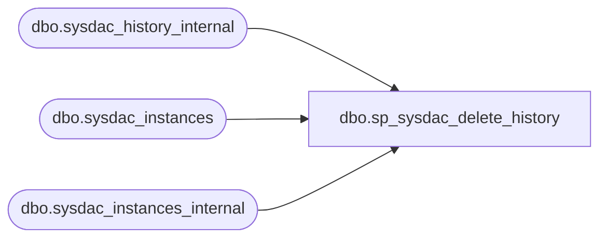

# dbo.sp_sysdac_delete_history

**Database:** msdb  

## Architecture Diagram



## Table Dependencies

| Referenced Table |
|---|
| dbo.sysdac_history_internal |
| dbo.sysdac_instances |
| dbo.sysdac_instances_internal |

## Stored Procedure Code

```sql
CREATE PROCEDURE [dbo].[sp_sysdac_delete_history]  
    @dac_instance_name sysname, 
    @older_than datetime
AS  
SET NOCOUNT ON;
BEGIN  
    DECLARE @retval INT  
    DECLARE @instanceId UniqueIdentifier

    SELECT @older_than = COALESCE(@older_than, GETDATE())


    IF @dac_instance_name IS NULL
    BEGIN
       -- Delete everyone who is not orphaned that you have visibility to 
       DELETE FROM dbo.sysdac_history_internal
              WHERE instance_id IN (SELECT instance_id FROM dbo.sysdac_instances)
              AND (date_modified < @older_than)

       -- Also remove orphans (note that we need to look into sysdac_instances_internal table)
       DELETE FROM dbo.sysdac_history_internal
              WHERE instance_id NOT IN( SELECT instance_id FROM dbo.sysdac_instances_internal)
              AND (date_modified < @older_than)
    END
    ELSE
    BEGIN
        -- Delete all entries that the user can view (i.e own the DAC or be sysadmin)
        DELETE FROM dbo.sysdac_history_internal
        WHERE instance_id IN (
            SELECT instance_id 
            FROM dbo.sysdac_instances 
            WHERE instance_name = @dac_instance_name)
        AND (date_modified < @older_than)
    END


    SELECT @retval = @@error
    RETURN(@retval)
END

dbo,sp_sysdac_delete_instance,CREATE PROCEDURE [dbo].[sp_sysdac_delete_instance]  
    @instance_id UniqueIdentifier
AS  
SET NOCOUNT ON;
BEGIN  
    DECLARE @retval INT  
    DECLARE @partId INT

    IF @instance_id IS NULL
    BEGIN
        RAISERROR(14043, -1, -1, 'instance_id', 'sp_sysdac_delete_instance')
        RETURN(1)
    END
  
    -- Ensure that the package being referred to exists by using the package view. We only continue if we can see 
    -- the specified package. The package will only be visible if we are the associated dbo or sysadmin and it exists
    IF NOT EXISTS (SELECT * from dbo.sysdac_instances WHERE instance_id = @instance_id)
    BEGIN
        RAISERROR(36004, -1, -1)
        RETURN(1)
    END
    
    --Delete the entry of DacInstance
    DELETE FROM sysdac_instances_internal WHERE instance_id=@instance_id 

    SELECT @retval = @@error
    RETURN(@retval)
END

dbo,sp_sysdac_drop_database,CREATE PROCEDURE [dbo].[sp_sysdac_drop_database]  
        @database_name sysname
AS  
SET NOCOUNT ON;
BEGIN  
    IF EXISTS(SELECT name FROM sys.databases WHERE name = @database_name)
    BEGIN
        DECLARE @engineEdition int = CAST(SERVERPROPERTY('EngineEdition') AS int);
        
        DECLARE @quoteddbname nvarchar(258)
        SET @quoteddbname = QUOTENAME(@database_name)
        
        DECLARE @sqlstatement nvarchar(1000)
        
        IF (@engineEdition != 5)
        BEGIN
            SET @sqlstatement = 'ALTER DATABASE ' + @quoteddbname + ' SET SINGLE_USER WITH ROLLBACK IMMEDIATE'
            EXEC (@sqlstatement)
        END 
        
        SET @sqlstatement = 'DROP DATABASE ' + @quoteddbname
        
        IF (@engineEdition = 5)
        BEGIN
			DECLARE @dbname SYSNAME 
			SET @dbname = db_name()
			
            RAISERROR (36012, 0, 1, @dbname, @sqlstatement);
            SELECT @dbname as databasename, @sqlstatement as sqlscript
        END
        ELSE
        BEGIN
            EXEC (@sqlstatement)
        END    
    END
    
    RETURN(@@error)
END

dbo,sp_sysdac_ensure_dac_creator,CREATE PROCEDURE dbo.sp_sysdac_ensure_dac_creator
as
BEGIN
    -- only users that can create a dac can add parts
    IF (dbo.fn_sysdac_is_dac_creator() != 1)
    BEGIN
        RAISERROR(36010, -1, -1);
        RETURN(1); -- failure
    END
END

dbo,sp_sysdac_rename_database,CREATE PROCEDURE [dbo].[sp_sysdac_rename_database]  
        @database_name sysname,
        @new_name sysname
AS  
SET NOCOUNT ON;
BEGIN  
    DECLARE @sqlstatement nvarchar(1000)

    -- Alter the database to single user mode    
    DECLARE @quoted_database_name nvarchar(258)
    SET @quoted_database_name = QUOTENAME(@database_name)
    SET @sqlstatement = 'ALTER DATABASE ' + @quoted_database_name + ' SET SINGLE_USER WITH ROLLBACK IMMEDIATE'
    EXEC (@sqlstatement)

    -- Rename the database
    EXEC sp_rename @objname=@quoted_database_name, @newname=@new_name, @objtype='DATABASE'

    -- Revert the database back to multi user mode
    DECLARE @quoted_new_name nvarchar(258)
    SET @quoted_new_name = QUOTENAME(@new_name)
    SET @sqlstatement = 'ALTER DATABASE ' + @quoted_new_name + ' SET MULTI_USER WITH ROLLBACK IMMEDIATE'
    EXEC (@sqlstatement)
            
    RETURN(@@error)
END

dbo,sp_sysdac_resolve_pending_entry,CREATE PROCEDURE [dbo].[sp_sysdac_resolve_pending_entry]  
    @action_id INT,
    @sequence_id INT
AS  
SET NOCOUNT ON;
BEGIN  
    DECLARE @null_column sysname    
    SET @null_column = NULL

    IF (@action_id IS NULL)
        SET @null_column = '@action_id'
    ELSE IF (@sequence_id IS NULL)
        SET @null_column = '@sequence_id'

    IF @null_column IS NOT NULL
    BEGIN
        RAISERROR(14043, -1, -1, @null_column, 'sp_sysdac_resolve_pending_entry')
        RETURN(1)
    END

    DECLARE @instance_id UNIQUEIDENTIFIER
    DECLARE @action_type TINYINT
    DECLARE @dac_object_type TINYINT        
    DECLARE @action_status TINYINT
    DECLARE @dac_object_name_pretran SYSNAME
    DECLARE @dac_object_name_posttran SYSNAME

    SELECT @instance_id = instance_id, 
            @action_type = action_type, 
            @dac_object_type = dac_object_type,
            @dac_object_name_pretran = dac_object_name_pretran, 
            @dac_object_name_posttran = dac_object_name_posttran
    FROM sysdac_history_internal
    WHERE action_id = @action_id AND sequence_id = @sequence_id

   
    --Below are the constants set based on history table    
    DECLARE @create TINYINT
    DECLARE @rename TINYINT
    DECLARE @database TINYINT
    DECLARE @success TINYINT
    DECLARE @rollback TINYINT
    DECLARE @fail TINYINT
    DECLARE @register TINYINT
    DECLARE @unregister TINYINT
    DECLARE @upgrade TINYINT
    DECLARE @readonly TINYINT
    DECLARE @readwrite TINYINT
    DECLARE @disconnectusers TINYINT
    DECLARE @readonlymode INT

    SET @create = 1
    SET @rename = 2
    SET @database = 2
    SET @success = 2
    SET @rollback = 4
    SET @fail = 3
    SET @register = 3
    SET @unregister = 14
    SET @upgrade = 15
    SET @readonly = 12
    SET @readwrite = 16
    SET @disconnectusers = 17
    SET @readonlymode = 1024
    
    SET @action_status = @fail --initialize result of the action to failure and adjust if below cases succeed!
    
    IF @action_type = @create AND @dac_object_type = @database --database create
    BEGIN
        IF EXISTS(SELECT 1 FROM sys.sysdatabases WHERE name = @dac_object_name_pretran)
            SET @action_status = @success
    END
    ELSE IF @action_type = @rename AND @dac_object_type = @database --database rename
    BEGIN
        IF (EXISTS(SELECT 1 FROM sys.sysdatabases WHERE name = @dac_object_name_posttran)) AND 
            (NOT EXISTS(SELECT 1 FROM sys.sysdatabases WHERE name = @dac_object_name_pretran))
            SET @action_status = @success 
    END
    ELSE IF @action_type = @register --register DAC
    BEGIN
        IF (EXISTS(SELECT 1 FROM dbo.sysdac_instances_internal WHERE instance_name = @dac_object_name_pretran))
            SET @action_status = @success
    END
    ELSE IF @action_type = @unregister --unregister DAC
    BEGIN
        IF (NOT EXISTS(SELECT 1 FROM dbo.sysdac_instances_internal WHERE instance_name = @dac_object_name_pretran))
            SET @action_status = @success
    END
    ELSE IF @action_type = @upgrade --upgrade DAC
    BEGIN
        IF (EXISTS(SELECT 1 FROM dbo.sysdac_instances_internal WHERE instance_name = @dac_object_name_posttran)) AND 
            (NOT EXISTS(SELECT 1 FROM dbo.sysdac_instances_internal WHERE instance_name = @dac_object_name_pretran))
            SET @action_status = @success     
    END
    ELSE IF @action_type = @readonly OR @action_type = @disconnectusers -- readonly/disconnect users state
    BEGIN
        IF (EXISTS(SELECT 1 FROM sys.sysdatabases 
                            WHERE ((status & @readonlymode) = @readonlymode) AND name=@dac_object_name_pretran))
            SET @action_status = @success
    END
    ELSE IF @action_type = @readwrite -- readwrite state
    BEGIN
        IF (EXISTS(SELECT 1 FROM sys.sysdatabases 
                            WHERE ((status & @readonlymode) != @readonlymode) AND name=@dac_object_name_pretran))
            SET @action_status = @success
    END

    UPDATE sysdac_history_internal
    SET action_status = @action_status
    WHERE action_id = @action_id AND sequence_id = @sequence_id
    
END

dbo,sp_sysdac_rollback_all_pending_objects,CREATE PROCEDURE [dbo].[sp_sysdac_rollback_all_pending_objects] (@return_scripts TINYINT = 0)
AS  
SET NOCOUNT ON;
BEGIN  
    DECLARE @action_id INT
    DECLARE @sequence_id INT

    --Below are the constants set based on history table    
    DECLARE @header_id bit
    DECLARE @pending TINYINT

    SET @header_id = 0
    SET @pending = 1
    
    CREATE TABLE #additional_scripts(databasename sysname, sqlscript VARCHAR(MAX))
    
    WHILE EXISTS (SELECT 1 FROM sysdac_history_internal WHERE sequence_id = @header_id AND action_status = @pending)
    BEGIN
        SET @action_id = (SELECT TOP 1 action_id FROM sysdac_history_internal WHERE sequence_id = @header_id AND action_status = @pending)

        INSERT INTO #additional_scripts
        EXEC dbo.sp_sysdac_rollback_pending_object @action_id = @action_id
    END
    
    IF (@return_scripts = 1)
    BEGIN
        SELECT databasename, sqlscript FROM #additional_scripts
    END
END

dbo,sp_sysdac_rollback_committed_step,CREATE PROCEDURE [dbo].[sp_sysdac_rollback_committed_step]  
    @action_id INT,
    @sequence_id INT
AS  
SET NOCOUNT ON;
BEGIN  
    DECLARE @retval INT  

    DECLARE @null_column sysname    
    SET @null_column = NULL

    IF (@action_id IS NULL)
        SET @null_column = '@action_id'
    ELSE IF (@sequence_id IS NULL)
        SET @null_column = '@sequence_id'

    IF @null_column IS NOT NULL
    BEGIN
        RAISERROR(14043, -1, -1, @null_column, 'sp_sysdac_rollback_committed_step')
        RETURN(1)
    END

    DECLARE @instance_id UNIQUEIDENTIFIER
    DECLARE @part_name NVARCHAR(128)
    DECLARE @action_type TINYINT
    DECLARE @dac_object_type TINYINT        
    DECLARE @action_status TINYINT
    DECLARE @dac_object_name_pretran SYSNAME
    DECLARE @dac_object_name_posttran SYSNAME
    DECLARE @sqlstatement NVARCHAR(1000)        

    SELECT @instance_id = instance_id, 
            @action_id = action_id, 
            @action_type = action_type, 
            @sequence_id = sequence_id,
            @dac_object_type = dac_object_type,
            @action_status = action_status, 
            @dac_object_name_pretran = dac_object_name_pretran, 
            @dac_object_name_posttran = dac_object_name_posttran
    FROM sysdac_history_internal
    WHERE action_id = @action_id AND sequence_id = @sequence_id
    
    --Below are the constants set based on history table    
    DECLARE @create TINYINT
    DECLARE @rename TINYINT
    DECLARE @register TINYINT
    DECLARE @database TINYINT
    DECLARE @rollback TINYINT
    DECLARE @rollback_pending TINYINT
    DECLARE @rollback_success TINYINT
    DECLARE @setreadonly TINYINT
    DECLARE @setreadwrite TINYINT

    SET @create = 1
    SET @rename = 2
    SET @register = 3
    SET @database = 2
    SET @rollback = 4
    SET @rollback_pending = 0
    SET @rollback_success = 1
    SET @setreadonly = 12
    SET @setreadwrite = 16
    
    IF @action_type = @create AND @dac_object_type = @database --database create
    BEGIN
        RAISERROR(N'%d, %d, %s', -1, 1, @sequence_id, @rollback_pending, NULL) WITH NOWAIT

        EXEC dbo.sp_sysdac_drop_database @database_name = @dac_object_name_pretran
        
        RAISERROR(N'%d, %d, %s', -1, 1, @sequence_id, @rollback_success, NULL) WITH NOWAIT
    END
    ELSE IF @action_type = @rename AND @dac_object_type = @database --database rename
    BEGIN
        RAISERROR(N'%d, %d, %s', -1, 1, @sequence_id, @rollback_pending, NULL) WITH NOWAIT

        EXEC dbo.sp_sysdac_rename_database @dac_object_name_posttran, @dac_object_name_pretran

        RAISERROR(N'%d, %d, %s', -1, 1, @sequence_id, @rollback_success, NULL) WITH NOWAIT
    END
    ELSE IF @action_type = @register --register DAC
    BEGIN
        SET @instance_id = (
            SELECT instance_id 
            FROM dbo.sysdac_instances_internal 
            WHERE instance_name = @dac_object_name_pretran)

        RAISERROR(N'%d, %d, %s', -1, 1, @sequence_id, @rollback_pending, NULL) WITH NOWAIT

        EXEC dbo.sp_sysdac_delete_instance @instance_id = @instance_id

        RAISERROR(N'%d, %d, %s', -1, 1, @sequence_id, @rollback_success, NULL) WITH NOWAIT
    END
    ELSE IF @action_type = @setreadonly  --readonly step
    BEGIN
        RAISERROR(N'%d, %d, %s', -1, 1, @sequence_id, @rollback_pending, NULL) WITH NOWAIT

        EXEC dbo.sp_sysdac_setreadonly_database @database_name = @dac_object_name_pretran, @readonly = 1

        RAISERROR(N'%d, %d, %s', -1, 1, @sequence_id, @rollback_success, NULL) WITH NOWAIT        
    END
    ELSE IF @action_type = @setreadwrite  --readonly step
    BEGIN
        RAISERROR(N'%d, %d, %s', -1, 1, @sequence_id, @rollback_pending, NULL) WITH NOWAIT

        EXEC dbo.sp_sysdac_setreadonly_database @database_name = @dac_object_name_pretran, @readonly = 0

        RAISERROR(N'%d, %d, %s', -1, 1, @sequence_id, @rollback_success, NULL) WITH NOWAIT        
    END
    
    --mark the entry as rolledback
    UPDATE sysdac_history_internal
    SET action_status = @rollback
    WHERE action_id = @action_id AND sequence_id = @sequence_id
    
    SELECT @retval = @@error
    RETURN(@retval)
END

dbo,sp_sysdac_rollback_pending_object,CREATE PROCEDURE [dbo].[sp_sysdac_rollback_pending_object]  
    @action_id INT
AS  
SET NOCOUNT ON;
BEGIN  
    IF (@action_id IS NULL)
    BEGIN
        RAISERROR(14043, -1, -1, '@action_id', 'sp_sysdac_rollback_pending_object')
        RETURN(1)
    END

    DECLARE @sequence_id INT
    DECLARE @action_status TINYINT

    --Below are the constants set based on history table    
    DECLARE @header_id bit
    DECLARE @pending TINYINT
    DECLARE @success TINYINT
    DECLARE @true bit
    DECLARE @rollback TINYINT
    DECLARE @fail TINYINT
    DECLARE @rollback_failure TINYINT

    SET @header_id = 0
    SET @pending = 1
    SET @success = 2
    SET @true = 1
    SET @rollback = 4
    SET @fail = 3
    SET @rollback_failure = 2
    
    --if step 0 is not pending, exit
    IF ((SELECT action_status 
        FROM sysdac_history_internal 
        WHERE action_id = @action_id AND sequence_id = @header_id) != @pending)
        RETURN;

    
    --STEP 1. Resolve pending entry 
    SET @sequence_id = (SELECT TOP 1 sequence_id 
                        FROM sysdac_history_internal 
                        WHERE sequence_id != @header_id AND action_id = @action_id AND action_status = @pending)

    IF (@sequence_id IS NOT NULL)
        EXEC dbo.sp_sysdac_resolve_pending_entry @action_id = @action_id, @sequence_id = @sequence_id
    
    --check if all required steps are committed(success). If so, mark the action success and return!
    IF NOT EXISTS (SELECT 1
                    FROM sysdac_history_internal 
                    WHERE action_id = @action_id AND sequence_id != @header_id AND required = @true AND action_status != @success)
    BEGIN
        UPDATE dbo.sysdac_history_internal
        SET action_status = @success
        WHERE action_id = @action_id AND sequence_id = @header_id
    
        RETURN
    END
     
    BEGIN TRY
        
        --STEP 2. rollback commit entries
        WHILE EXISTS( SELECT 1 
                        FROM sysdac_history_internal 
                        WHERE action_status = @success AND action_id = @action_id AND sequence_id > 0)
        BEGIN
            SELECT TOP 1 @sequence_id = sequence_id,
                        @action_status = action_status
            FROM sysdac_history_internal
            WHERE action_status = @success AND action_id = @action_id AND sequence_id != @header_id
            ORDER BY sequence_id DESC

            EXEC dbo.sp_sysdac_rollback_committed_step @action_id = @action_id, @sequence_id = @sequence_id
            
        END

        --Mark the header entry as rolledback
        SET @action_status = @rollback    

    END TRY
    BEGIN CATCH
        DECLARE @error_message NVARCHAR(4000);
        
        SELECT @error_message = ERROR_MESSAGE()

        RAISERROR(N'%d, %d, %s', -1, 1, @sequence_id, @rollback_failure, @error_message) WITH NOWAIT

        --Mark the header entry as failed
        SET @action_status = @fail
    END CATCH

    --STEP 3. Mark the header entry with final action status
    UPDATE dbo.sysdac_history_internal
    SET action_status = @action_status
    WHERE action_id = @action_id AND sequence_id = @header_id    

END

dbo,sp_sysdac_setreadonly_database,CREATE PROCEDURE [dbo].[sp_sysdac_setreadonly_database]  
        @database_name sysname,
        @readonly bit = 0
AS  
SET NOCOUNT ON;
BEGIN  
    DECLARE @sqlstatement nvarchar(1000)
    
    DECLARE @quoted_database_name nvarchar(258)   
    SET @quoted_database_name = QUOTENAME(@database_name)
    
    IF (@readonly = 0)
        SET @sqlstatement = 'ALTER DATABASE ' + @quoted_database_name + ' SET READ_ONLY WITH ROLLBACK IMMEDIATE'
    ELSE IF (@readonly = 1)
        SET @sqlstatement = 'ALTER DATABASE ' + @quoted_database_name + ' SET READ_WRITE WITH ROLLBACK IMMEDIATE'    

    EXEC (@sqlstatement)
            
    RETURN(@@error)
END

dbo,sp_sysdac_update_history_entry,CREATE PROCEDURE [dbo].[sp_sysdac_update_history_entry]
    @action_id int,
    @instance_id UniqueIdentifier = NULL,
    @action_type tinyint = NULL,
    @dac_object_type tinyint = NULL,
    @action_status tinyint = NULL,
    @dac_object_name_pretran sysname = N'',
    @dac_object_name_posttran sysname = N'',
    @sqlscript nvarchar(max) = N'',
    @error_string nvarchar(max) = N''
AS  
SET NOCOUNT ON;
BEGIN  
    DECLARE @retval INT  

    DECLARE @null_column sysname    
    SET @null_column = NULL

    IF (@instance_id IS NULL)
        SET @null_column = '@instance_id'
    ELSE IF (@action_type IS NULL)
        SET @null_column = '@action_type'
    ELSE IF (@dac_object_type IS NULL)
        SET @null_column = '@dac_object_type'
    ELSE IF (@action_status IS NULL) --action_status should be non-pending (success/failure)
        SET @null_column = '@action_status'

    IF @null_column IS NOT NULL
    BEGIN
        RAISERROR(14043, -1, -1, @null_column, 'sp_sysdac_update_history_entry')
        RETURN(1)
    END
     
    -- Only allow users who created history entry or 'sysadmins' to update the row
    DECLARE @username SYSNAME
    SET @username = (SELECT created_by 
                     FROM dbo.sysdac_history_internal 
                     WHERE instance_id              = @instance_id AND 
                           action_id                = @action_id AND 
                           action_type              = @action_type AND
                           dac_object_type          = @dac_object_type AND
                           dac_object_name_pretran  = @dac_object_name_pretran AND
                           dac_object_name_posttran = @dac_object_name_posttran)

    IF ((@username != [dbo].[fn_sysdac_get_currentusername]()) AND ([dbo].[fn_sysdac_is_currentuser_sa]() != 1))
    BEGIN
        RAISERROR(36011, -1, -1);
        RETURN(1); -- failure
    END

    UPDATE [dbo].[sysdac_history_internal] 
    SET            
                action_status           = @action_status,
                sqlscript               = @sqlscript,
                error_string            = @error_string,
                date_modified           = (SELECT GETDATE()) 
    WHERE
                action_id               = @action_id AND
                action_type             = @action_type AND
                dac_object_type         = @dac_object_type AND
                dac_object_name_pretran = @dac_object_name_pretran AND
                dac_object_name_posttran = @dac_object_name_posttran
    
    SELECT @retval = @@error
    RETURN(@retval)
END

dbo,sp_sysdac_update_instance,CREATE PROCEDURE [dbo].[sp_sysdac_update_instance]  
    @type_name sysname,
    @instance_id UniqueIdentifier = NULL,            
    @instance_name sysname,
    @type_version NVARCHAR(64) = NULL,
    @description nvarchar(4000) = N'',
    @type_stream varbinary(max)
AS  
SET NOCOUNT ON;
BEGIN  
    DECLARE @retval INT  

    DECLARE @null_column sysname    
    SET @null_column = NULL

   IF (@type_name = N'')
        SET @null_column = '@type_name'
    ELSE IF (@instance_name = N'')
        SET @null_column = '@instance_name'
    ELSE IF (@instance_id IS NULL )
        SET @null_column = '@instance_id'
    ELSE IF( @type_version = N'')
        SET @null_column = '@type_version'
    ELSE IF( @type_stream IS NULL)
        SET @null_column = '@type_stream'
      
    IF @null_column IS NOT NULL
    BEGIN
        RAISERROR(14043, -1, -1, @null_column, 'sp_sysdac_add_instance')
        RETURN(1)
    END

    -- Ensure that the package being referred to exists by using the package view. We only continue if we can see 
    -- the specified package. The package will only be visible if we are the associated dbo or sysadmin and it exists
    IF NOT EXISTS (SELECT * from dbo.sysdac_instances WHERE instance_id = @instance_id)
    BEGIN
        RAISERROR(36004, -1, -1)
        RETURN(1)
    END
    
    UPDATE sysdac_instances_internal SET
        type_name = ISNULL(@type_name, type_name),
        instance_name = ISNULL(@instance_name, instance_name),
		type_version = @type_version,
		description = @description, 
		type_stream = @type_stream
    WHERE instance_id = @instance_id 
    
    SELECT @retval = @@error
    RETURN(@retval)
END

dbo,sp_sysdac_upgrade_instance,CREATE PROCEDURE [dbo].[sp_sysdac_upgrade_instance]  
    @source_instance_id UniqueIdentifier = NULL,   
    @instance_id UniqueIdentifier = NULL,            
    @instance_name sysname,
    @database_name sysname
AS  
SET NOCOUNT ON;
BEGIN  
    DECLARE @retval INT  

    DECLARE @null_column sysname    
    SET @null_column = NULL

    IF (@source_instance_id IS NULL)
        SET @null_column = '@source_instance_id'
    ELSE IF (@instance_id IS NULL )
        SET @null_column = '@instance_id'
    ELSE IF( @database_name IS NULL)
        SET @null_column = '@database_name'

    IF @null_column IS NOT NULL
    BEGIN
        RAISERROR(14043, -1, -1, @null_column, 'sp_sysdac_upgrade_instance')
        RETURN(1)
    END
    
    -- Ensure that the package being referred to exists by using the package view. We only continue if we can see 
    -- the specified package. The package will only be visible if we are the associated dbo or sysadmin and it exists
    IF NOT EXISTS (SELECT * from dbo.sysdac_instances WHERE instance_id = @instance_id)
    BEGIN
        RAISERROR(36004, -1, -1)
        RETURN(1)
    END
    
    --Ensure that the package being referred exists
    IF NOT EXISTS (SELECT * from dbo.sysdac_instances_internal WHERE instance_id = @instance_id)
    BEGIN
        RAISERROR(36004, -1, -1)
        RETURN(1)
    END

    BEGIN TRAN 
    
    --Delete the source DacInstance first
    EXEC dbo.sp_sysdac_delete_instance @instance_id = @instance_id
    
    --Update the new version DacInstance metadata with the original DacInstance
    UPDATE [dbo].[sysdac_instances_internal]
    SET instance_id   = @instance_id, 
        instance_name = @instance_name
    WHERE instance_id = @source_instance_id

    COMMIT
    
    SELECT @retval = @@error
    RETURN(@retval)
END

dbo,sp_sysmail_activate,-- sp_sysmail_activate : Starts the DatabaseMail process if it isn't already running
--
CREATE PROCEDURE [dbo].[sp_sysmail_activate]
AS
BEGIN
    DECLARE @mailDbName sysname
    DECLARE @mailDbId INT
    DECLARE @mailEngineLifeMin INT
    DECLARE @loggingLevel nvarchar(256)
    DECLARE @loggingLevelInt int   
    DECLARE @parameter_value nvarchar(256)
    DECLARE @localmessage nvarchar(max)
    DECLARE @readFromConfigFile INT
    DECLARE @rc INT

    SET NOCOUNT ON
    EXEC sp_executesql @statement = N'RECEIVE TOP(0) * FROM msdb.dbo.ExternalMailQueue'

    EXEC @rc = msdb.dbo.sysmail_help_configure_value_sp @parameter_name = N'DatabaseMailExeMinimumLifeTime', 
                                                        @parameter_value = @parameter_value OUTPUT
    IF(@rc <> 0)
        RETURN (1)

    --ConvertToInt will return the default if @parameter_value is null or config value can't be converted
    --Setting max exe lifetime is 1 week (604800 secs). Can't see a reason for it to ever run longer that this
    SET @mailEngineLifeMin = dbo.ConvertToInt(@parameter_value, 604800, 600) 

    EXEC msdb.dbo.sysmail_help_configure_value_sp @parameter_name = N'ReadFromConfigurationFile', 
                                                  @parameter_value = @parameter_value OUTPUT
    --Try to read the optional read from configuration file:
    SET @readFromConfigFile = dbo.ConvertToInt(@parameter_value, 1, 0) 

    --Try and get the optional logging level for the DatabaseMail process
    EXEC msdb.dbo.sysmail_help_configure_value_sp @parameter_name = N'LoggingLevel', 
                                                  @parameter_value = @loggingLevel OUTPUT

    --Convert logging level into string value for passing into XP
    SET @loggingLevelInt = dbo.ConvertToInt(@loggingLevel, 3, 2) 
    IF @loggingLevelInt = 1
       SET @loggingLevel = 'Normal'
    ELSE IF @loggingLevelInt = 3
       SET @loggingLevel = 'Verbose'
    ELSE -- default
       SET @loggingLevel = 'Extended'

    SET @mailDbName = DB_NAME()
    SET @mailDbId   = DB_ID()

    EXEC @rc = master..xp_sysmail_activate @mailDbId, @mailDbName, @readFromConfigFile,
    @mailEngineLifeMin, @loggingLevel
    IF(@rc <> 0)
    BEGIN
        SET @localmessage = FORMATMESSAGE(14637)
        exec msdb.dbo.sysmail_logmailevent_sp @event_type=3, @description=@localmessage
    END
    ELSE
    BEGIN
        SET @localmessage = FORMATMESSAGE(14638)
        exec msdb.dbo.sysmail_logmailevent_sp @event_type=0, @description=@localmessage
    END

    RETURN @rc
END

dbo,sp_sysmanagement_add_shared_registered_server,CREATE PROCEDURE [dbo].[sp_sysmanagement_add_shared_registered_server]
    @name sysname,
    @server_group_id INT,
    @server_name sysname,
    @description NVARCHAR(2048) = N'',
    @server_type INT,
    @server_id INT OUTPUT
AS
BEGIN
    DECLARE @retval INT

    EXECUTE @retval = sp_sysmanagement_verify_shared_server_type @server_type

    IF (@retval <> 0)
        RETURN(1) -- Failure
    
    IF( (@server_group_id IS NULL) OR 
        (@server_group_id NOT IN (SELECT sg.server_group_id FROM msdb.dbo.sysmanagement_shared_server_groups_internal sg)))
    BEGIN
        RAISERROR (35001, -1, -1)
        RETURN (1)
    END

    IF EXISTS (SELECT * FROM [msdb].[dbo].[sysmanagement_shared_server_groups_internal]  sg 
                WHERE @server_group_id = sg.server_group_id AND @server_type <> sg.server_type)
    BEGIN
        RAISERROR (35002, -1, -1)
        RETURN (1)
    END    

    IF (@server_name IS NULL)
    BEGIN
        RAISERROR(14618, -1, 1, '@server_name')
        RETURN(1)   
    END

    set @server_name = LTRIM(@server_name)
    set @server_name = RTRIM(@server_name)

    -- Disallow relative names
    IF ('.' = @server_name) OR
        (1 = CHARINDEX(N'.\', @server_name)) OR
        (1 = CHARINDEX(N'LOCALHOST\', UPPER(@server_name collate SQL_Latin1_General_CP1_CS_AS))) OR
        (UPPER(@server_name collate SQL_Latin1_General_CP1_CS_AS) = 'LOCALHOST') OR
        (UPPER(@server_name collate SQL_Latin1_General_CP1_CS_AS) = '(LOCAL)')
    BEGIN
        RAISERROR (35011, -1, -1)
        RETURN (1)
    END

    IF (UPPER(@@SERVERNAME collate SQL_Latin1_General_CP1_CS_AS) = UPPER(@server_name collate SQL_Latin1_General_CP1_CS_AS))
    BEGIN
        RAISERROR (35012, -1, -1)
        RETURN (1)
    END

    INSERT INTO [msdb].[dbo].[sysmanagement_shared_registered_servers_internal]
        (server_group_id, name, server_name, description, server_type)
    VALUES
        (@server_group_id, @name, @server_name, @description, @server_type)
        
    SELECT @server_id = SCOPE_IDENTITY()
    RETURN (0)
END

dbo,sp_sysmanagement_add_shared_server_group,CREATE PROCEDURE [dbo].[sp_sysmanagement_add_shared_server_group]
    @name sysname,
    @description NVARCHAR (2048) = N'',
    @parent_id INT,
    @server_type INT,
    @server_group_id INT OUTPUT
AS
BEGIN
    DECLARE @retval INT

    EXECUTE @retval = sp_sysmanagement_verify_shared_server_type @server_type

    IF (@retval <> 0)
        RETURN(1) -- Failure
    
    -- user created server groups should have a valid parent 
    IF( (@parent_id IS NULL) OR 
        (@parent_id NOT IN (SELECT sg.server_group_id FROM msdb.dbo.sysmanagement_shared_server_groups_internal sg)))
    BEGIN
        RAISERROR (35001, -1, -1)
        RETURN (1)
    END

    IF EXISTS (SELECT * FROM [msdb].[dbo].[sysmanagement_shared_server_groups_internal]  sg 
                WHERE @parent_id = sg.server_group_id AND @server_type <> sg.server_type)
    BEGIN
        RAISERROR (35002, -1, -1)
        RETURN (1)
    END    
    
    INSERT INTO [msdb].[dbo].[sysmanagement_shared_server_groups_internal]
        (name, description, parent_id, server_type)
    VALUES
        (
        @name, 
        @description, 
        @parent_id, 
        @server_type
        )

    SELECT @server_group_id = SCOPE_IDENTITY()
    RETURN (0)
END

dbo,sp_sysmanagement_delete_shared_registered_server,CREATE PROCEDURE [dbo].[sp_sysmanagement_delete_shared_registered_server]
    @server_id INT
AS
BEGIN
    IF NOT EXISTS (SELECT * FROM [msdb].[dbo].[sysmanagement_shared_registered_servers_internal] WHERE server_id = @server_id)
    BEGIN
        RAISERROR (35007, -1, -1)
        RETURN(1)
    END
    
    DELETE FROM [msdb].[dbo].[sysmanagement_shared_registered_servers_internal]
    WHERE
            server_id = @server_id
    RETURN (0)
END

dbo,sp_sysmanagement_delete_shared_server_group,CREATE PROCEDURE [dbo].[sp_sysmanagement_delete_shared_server_group]
    @server_group_id INT
AS
BEGIN
    IF NOT EXISTS (SELECT * FROM [msdb].[dbo].[sysmanagement_shared_server_groups_internal] WHERE server_group_id = @server_group_id)
    BEGIN
        RAISERROR (35004, -1, -1)
        RETURN(1)
    END;

    WITH ChildGroups (parent_id, server_group_id, name, server_type, server_level)
    AS
    (
        -- Anchor
        SELECT g.parent_id, g.server_group_id, g.name, g.server_type, 0 AS server_level
        FROM [msdb].[dbo].[sysmanagement_shared_server_groups_internal] AS g
        WHERE g.server_group_id = @server_group_id
        UNION ALL
        -- Recursive definition
        SELECT r.parent_id, r.server_group_id, r.name, r.server_type, server_level + 1
        FROM [msdb].[dbo].[sysmanagement_shared_server_groups_internal] AS r
        INNER JOIN ChildGroups AS children ON r.parent_id = children.server_group_id
    )
    -- Execute CTE to delete the hierarchy of server groups
    DELETE FROM [msdb].[dbo].[sysmanagement_shared_server_groups_internal]
        FROM ChildGroups children
        JOIN [msdb].[dbo].[sysmanagement_shared_server_groups_internal] ServerGroups
            ON children.server_group_id = ServerGroups.server_group_id
    RETURN (0)
END

dbo,sp_sysmanagement_move_shared_registered_server,CREATE PROCEDURE [dbo].[sp_sysmanagement_move_shared_registered_server]
    @server_id INT,
    @new_parent_id INT
AS
BEGIN
    IF (@server_id IS NULL)
    BEGIN
        RAISERROR (35006, -1, -1)
        RETURN(1)
    END
    
    IF NOT EXISTS (SELECT * FROM [msdb].[dbo].[sysmanagement_shared_registered_servers_internal] WHERE server_id = @server_id)
    BEGIN
        RAISERROR (35007, -1, -1)
        RETURN(1)
    END
    
    IF (@new_parent_id IS NULL) OR 
        NOT EXISTS (SELECT * FROM [msdb].[dbo].[sysmanagement_shared_server_groups_internal] WHERE server_group_id = @new_parent_id)
    BEGIN
        RAISERROR (35001, -1, -1)
        RETURN(1)
    END

    IF (@new_parent_id IS NOT NULL)
        AND ((SELECT server_type FROM [msdb].[dbo].[sysmanagement_shared_server_groups_internal] WHERE server_group_id = @new_parent_id)
                <>
             (SELECT server_type FROM [msdb].[dbo].[sysmanagement_shared_registered_servers_internal] WHERE server_id = @server_id))
    BEGIN
        RAISERROR (35002, -1, -1)
        RETURN(1)
    END
    
    UPDATE [msdb].[dbo].[sysmanagement_shared_registered_servers_internal]
        SET server_group_id = @new_parent_id
    WHERE
        server_id = @server_id
    RETURN (0)
END

dbo,sp_sysmanagement_move_shared_server_group,CREATE PROCEDURE [dbo].[sp_sysmanagement_move_shared_server_group]
    @server_group_id INT,
    @new_parent_id INT
AS
BEGIN
    IF (@new_parent_id IS NULL) OR 
        NOT EXISTS (SELECT * FROM [msdb].[dbo].[sysmanagement_shared_server_groups_internal] WHERE server_group_id = @new_parent_id)
    BEGIN
        RAISERROR (35001, -1, -1)
        RETURN(1)
    END

    IF (@new_parent_id IS NOT NULL)
        AND ((SELECT server_type FROM [msdb].[dbo].[sysmanagement_shared_server_groups_internal] WHERE server_group_id = @new_parent_id)
                <>
             (SELECT server_type FROM [msdb].[dbo].[sysmanagement_shared_server_groups_internal] WHERE server_group_id = @server_group_id))
    BEGIN
        RAISERROR (35002, -1, -1)
        RETURN(1)
    END

    DECLARE @DeletedGroups TABLE
    (
        server_group_id int
    );

    -- Check if the destination group you're moving to isn't already a descendant of the current group
    WITH ChildGroups (parent_id, server_group_id, server_level)
    AS
    (
        -- Anchor
        SELECT g.parent_id, g.server_group_id, 0 AS server_level
        FROM [msdb].[dbo].[sysmanagement_shared_server_groups_internal] AS g
        WHERE g.server_group_id = @server_group_id
        UNION ALL
        -- Recursive definition
        SELECT r.parent_id, r.server_group_id, server_level + 1
        FROM [msdb].[dbo].[sysmanagement_shared_server_groups_internal] AS r
        INNER JOIN ChildGroups AS children ON r.parent_id = children.server_group_id
    )
    -- Execute CTE
    INSERT INTO @DeletedGroups
    SELECT server_group_id FROM ChildGroups

    IF (SELECT COUNT(*) FROM @DeletedGroups WHERE server_group_id = @new_parent_id) > 0
    BEGIN
        RAISERROR (35003, -1, -1)
        RETURN(1)
    END
    
    UPDATE [msdb].[dbo].[sysmanagement_shared_server_groups_internal]
        SET parent_id = @new_parent_id
    WHERE
        server_group_id = @server_group_id
    RETURN (0)
END

dbo,sp_sysmanagement_rename_shared_registered_server,CREATE PROCEDURE [dbo].[sp_sysmanagement_rename_shared_registered_server]
    @server_id INT,
    @new_name sysname
AS
BEGIN
    IF (@server_id IS NULL)
    BEGIN
        RAISERROR (35006, -1, -1)
        RETURN(1)
    END
    
    IF NOT EXISTS (SELECT * FROM [msdb].[dbo].[sysmanagement_shared_registered_servers_internal] WHERE server_id = @server_id)
    BEGIN
        RAISERROR (35007, -1, -1)
        RETURN(1)
    END
    
    IF (@new_name IS NULL or LEN(@new_name) = 0)
    BEGIN
      RAISERROR(21263, -1, -1, '@new_name')
      RETURN(1) -- Failure
    END

    UPDATE [msdb].[dbo].[sysmanagement_shared_registered_servers_internal]
        SET name = @new_name
    WHERE
        server_id = @server_id

    RETURN (0)
END

dbo,sp_sysmanagement_rename_shared_server_group,CREATE PROCEDURE [dbo].[sp_sysmanagement_rename_shared_server_group]
    @server_group_id INT,
    @new_name sysname
AS
BEGIN
    IF (@server_group_id IS NULL)
    BEGIN
        RAISERROR (35006, -1, -1)
        RETURN(1)
    END
    
    IF NOT EXISTS (SELECT * FROM [msdb].[dbo].[sysmanagement_shared_server_groups_internal] WHERE server_group_id = @server_group_id)
    BEGIN
        RAISERROR (35007, -1, -1)
        RETURN(1)
    END
    
    IF (@new_name IS NULL or LEN(@new_name) = 0)
    BEGIN
      RAISERROR(21263, -1, -1, '@new_name')
      RETURN(1) -- Failure
    END

    UPDATE [msdb].[dbo].[sysmanagement_shared_server_groups_internal]
        SET name = @new_name
    WHERE
        server_group_id = @server_group_id

    RETURN (0)
END

dbo,sp_sysmanagement_update_shared_registered_server,CREATE PROCEDURE [dbo].[sp_sysmanagement_update_shared_registered_server]
    @server_id INT,
    @server_name sysname = NULL,
    @description NVARCHAR(2048) = NULL
AS
BEGIN
    IF (@server_id IS NULL)
    BEGIN
        RAISERROR (35006, -1, -1)
        RETURN(1)
    END
    
    IF NOT EXISTS (SELECT * FROM [msdb].[dbo].[sysmanagement_shared_registered_servers_internal] WHERE server_id = @server_id)
    BEGIN
        RAISERROR (35007, -1, -1)
        RETURN(1)
    END

    IF (@server_name IS NULL)
    BEGIN
        SET @server_name = (select server_name FROM [msdb].[dbo].[sysmanagement_shared_registered_servers_internal] WHERE server_id = @server_id)
    END

    set @server_name = LTRIM(@server_name)
    set @server_name = RTRIM(@server_name)

    -- Disallow relative names
    IF ('.' = @server_name) OR
        (1 = CHARINDEX(N'.\', @server_name)) OR
        (1 = CHARINDEX(N'LOCALHOST\', UPPER(@server_name collate SQL_Latin1_General_CP1_CS_AS))) OR
        (UPPER(@server_name collate SQL_Latin1_General_CP1_CS_AS) = 'LOCALHOST') OR
        (UPPER(@server_name collate SQL_Latin1_General_CP1_CS_AS) = '(LOCAL)')
    BEGIN
        RAISERROR (35011, -1, -1)
        RETURN (1)
    END

    IF (UPPER(@@SERVERNAME collate SQL_Latin1_General_CP1_CS_AS) = UPPER(@server_name collate SQL_Latin1_General_CP1_CS_AS))
    BEGIN
        RAISERROR (35012, -1, -1)
        RETURN (1)
    END

    UPDATE [msdb].[dbo].[sysmanagement_shared_registered_servers_internal]
        SET server_name = ISNULL(@server_name, server_name),
            description = ISNULL(@description, description)
    WHERE
        server_id = @server_id
    RETURN (0)
END

dbo,sp_sysmanagement_update_shared_server_group,CREATE PROCEDURE [dbo].[sp_sysmanagement_update_shared_server_group]
    @server_group_id INT,
    @description NVARCHAR (2048) = NULL
AS
BEGIN
    IF (@server_group_id IS NULL)
    BEGIN
        RAISERROR (35005, -1, -1)
        RETURN(1)
    END

    IF NOT EXISTS (SELECT * FROM [msdb].[dbo].[sysmanagement_shared_server_groups_internal] WHERE server_group_id = @server_group_id)
    BEGIN
        RAISERROR (35004, -1, -1)
        RETURN(1)
    END

    UPDATE [msdb].[dbo].[sysmanagement_shared_server_groups_internal]
        SET description = ISNULL(@description, description)
    WHERE
        server_group_id = @server_group_id
    
    RETURN (0)
END

dbo,sp_sysmanagement_verify_shared_server_type,CREATE PROCEDURE [dbo].[sp_sysmanagement_verify_shared_server_type]
    @server_type INT
AS
BEGIN
    IF (@server_type IS NULL)
    BEGIN
        RAISERROR (35009, -1, -1)
        RETURN(1)
    END
    
    -- 0 --> DatabaseEngineServerGroup, 1 --> AnalysisServicesServerGroup, 2 --> ReportingServicesServerGroup, 3 --> IntegrationServicesServerGroup, 4 --> SqlServerCompactEditionServerGroup
    IF (@server_type < 0 OR @server_type > 4)
    BEGIN
        RAISERROR (35010, -1, -1, @server_type)
        RETURN (1)
    END
    
    RETURN (0)
END

dbo,sp_syspolicy_add_condition,CREATE PROCEDURE [dbo].[sp_syspolicy_add_condition] 
@name sysname,
@description nvarchar(max) = N'',
@facet nvarchar(max),
@expression nvarchar(max),
@is_name_condition smallint = 0,
@obj_name sysname = NULL,
@condition_id int = NULL OUTPUT 
AS
BEGIN
	DECLARE @retval_check int;
	EXECUTE @retval_check = [dbo].[sp_syspolicy_check_membership] 'PolicyAdministratorRole'
	IF ( 0!= @retval_check)
	BEGIN
		RETURN @retval_check
	END

	DECLARE @retval              INT
	DECLARE @facet_id            INT
	DECLARE @null_column	sysname
	
	SET @null_column = NULL

    IF (@name IS NULL OR @name = N'')
        SET @null_column = '@name'
    ELSE IF( @description IS NULL)
        SET @null_column = '@description'
    ELSE IF( @facet IS NULL)
        SET @null_column = '@facet'
    ELSE IF( @expression IS NULL)
        SET @null_column = '@expression'

    IF @null_column IS NOT NULL
    BEGIN
        RAISERROR(14043, -1, -1, @null_column, 'sp_syspolicy_add_condition')
        RETURN(1)
    END

    IF EXISTS (SELECT * FROM msdb.dbo.syspolicy_conditions WHERE name = @name)
    BEGIN
        RAISERROR(34010, -1, -1, 'Condition', @name)
        RETURN(1)
    END

    SET @facet_id = (SELECT management_facet_id FROM [dbo].[syspolicy_management_facets] WHERE name = @facet)
    IF (@facet_id IS NULL)
    BEGIN
        RAISERROR (34014, -1, -1)
        RETURN(1)
    END

    INSERT INTO msdb.dbo.syspolicy_conditions_internal(name, description,facet_id,expression,is_name_condition,obj_name) 
        VALUES(@name, @description,@facet_id,@expression,@is_name_condition,@obj_name)
    SELECT @retval = @@error
    SET @condition_id = SCOPE_IDENTITY()
    RETURN(@retval)
END

dbo,sp_syspolicy_add_object_set,CREATE PROCEDURE [dbo].[sp_syspolicy_add_object_set]
@object_set_name sysname,
@facet nvarchar (max),
@object_set_id int OUTPUT
AS
BEGIN
	DECLARE @retval_check int;
	EXECUTE @retval_check = [dbo].[sp_syspolicy_check_membership] 'PolicyAdministratorRole'
	IF ( 0!= @retval_check)
	BEGIN
		RETURN @retval_check
	END

	DECLARE @retval             INT
	
	DECLARE @facet_id           INT
	DECLARE @null_column		sysname
	
	IF( @facet IS NULL)
		SET @null_column = '@facet'
		
	IF @null_column IS NOT NULL
	BEGIN
		RAISERROR(14043, -1, -1, @null_column, 'sp_syspolicy_add_object_set')
		RETURN(1)
	END

    SET @facet_id = (SELECT management_facet_id FROM [dbo].[syspolicy_management_facets] WHERE name = @facet)
        
    IF (@facet_id IS NULL)
    BEGIN
        RAISERROR (34014, -1, -1)
        RETURN(1)
    END

    INSERT INTO msdb.[dbo].[syspolicy_object_sets_internal]
                                        (object_set_name,
                                        facet_id)
    VALUES                            
                                        (@object_set_name,
                                        @facet_id)

    SELECT @retval = @@error
    SET @object_set_id = SCOPE_IDENTITY()
    RETURN(@retval)
END

dbo,sp_syspolicy_add_policy,CREATE PROCEDURE [dbo].[sp_syspolicy_add_policy] 
@name sysname,
@condition_id int = NULL,
@condition_name sysname = NULL,
@schedule_uid uniqueidentifier = NULL,
@policy_category sysname = NULL,
@description nvarchar(max) = N'',
@help_text nvarchar(4000) = N'',
@help_link nvarchar(2083) = N'',
@execution_mode int,
@is_enabled bit = 0,
@root_condition_id int = NULL,
@root_condition_name sysname = NULL,
@object_set sysname = NULL,
@policy_id int = NULL OUTPUT
WITH EXECUTE AS OWNER
AS
BEGIN
    DECLARE @retval_check int;
    EXECUTE @retval_check = [dbo].[sp_syspolicy_check_membership] 'PolicyAdministratorRole'
    IF ( 0!= @retval_check)
    BEGIN
        RETURN @retval_check
    END

    DECLARE @retval         INT
    DECLARE @null_column    sysname
    
    SET @null_column = NULL

    IF (@name IS NULL OR @name = N'')
        SET @null_column = '@name'
    ELSE IF (@execution_mode IS NULL )
        SET @null_column = '@execution_mode'
    ELSE IF( @is_enabled IS NULL)
        SET @null_column = '@is_enabled'
    ELSE IF( @description IS NULL)
        SET @null_column = '@description'
    ELSE IF( @help_text IS NULL)
        SET @null_column = '@help_text'
    ELSE IF( @help_link IS NULL)
        SET @null_column = '@help_link'
    

    IF @null_column IS NOT NULL
    BEGIN
        RAISERROR(14043, -1, -1, @null_column, 'sp_syspolicy_add_policy')
        RETURN(1)
    END

    IF EXISTS (SELECT * FROM msdb.dbo.syspolicy_policies WHERE name = @name)
    BEGIN
        RAISERROR(34010, -1, -1, 'Policy', @name)
        RETURN(1)
    END

    SET @schedule_uid = ISNULL (@schedule_uid, '{00000000-0000-0000-0000-000000000000}')

    --Check for the execution mode value
    IF (@execution_mode NOT IN (0,1,2,4,5,6))
    BEGIN 
        RAISERROR(34004, -1, -1, @execution_mode)
        RETURN (1)
    END

    IF (@schedule_uid = '{00000000-0000-0000-0000-000000000000}' AND (@execution_mode & 4) = 4)
    BEGIN
        RAISERROR (34011, -1, -1, 'schedule_uid', 4)
        RETURN(1)
    END

    IF (@is_enabled = 1 AND @execution_mode = 0)
    BEGIN
        RAISERROR (34011, -1, -1, 'is_enabled', @execution_mode)
        RETURN(1)
    END

    -- Turn [nullable] empty string parameters into NULLs
    IF @condition_name = '' SELECT @condition_name = NULL
    IF @policy_category = ''   SELECT @policy_category = NULL
    IF @root_condition_name = '' SELECT @root_condition_name = NULL

    -- verify that the condition exists
    EXEC @retval = msdb.dbo.sp_syspolicy_verify_condition_identifiers @condition_name = @condition_name OUTPUT, @condition_id = @condition_id OUTPUT
    IF (@retval <> 0)
        RETURN(1)
        
    -- convert @object_set into id if needed
    DECLARE @object_set_id INT
    DECLARE @object_set_facet_id INT
    IF (@object_set IS NOT NULL)
    BEGIN
        SELECT @object_set_id = object_set_id FROM msdb.dbo.syspolicy_object_sets WHERE object_set_name = @object_set
        IF @object_set_id IS NULL
        BEGIN
            -- TODO: RAISERROR that specified object set doesn't exist
            RAISERROR(N'specified object set does not exists', -1, -1)
            RETURN(1) -- Failure
        END
        ELSE
        BEGIN
            SELECT @object_set_facet_id = facet_id FROM msdb.dbo.syspolicy_object_sets WHERE object_set_name = @object_set
            -- Ensure the object set has been created from the same facet that the policy condition has been created
            IF (@object_set_facet_id <> (SELECT facet_id FROM msdb.dbo.syspolicy_conditions_internal WHERE condition_id = @condition_id))
            BEGIN
                -- TODO: RAISEERROR that specified object_set isn't created from the facet that the policy condition has been created from
                RAISERROR(N'specified object set does not match facet the policy condition was created off', -1, -1)
                RETURN(1) -- Failure
            END
        END
    END

    IF (@root_condition_name IS NOT NULL) OR (@root_condition_id IS NOT NULL)
    BEGIN
        -- verify that the root condition exists
        EXEC @retval = msdb.dbo.sp_syspolicy_verify_condition_identifiers @condition_name = @root_condition_name OUTPUT, @condition_id = @root_condition_id OUTPUT
        IF (@retval <> 0)
            RETURN(1)
            
        -- Check execution mode for compatibility with root_condition
        IF (@execution_mode = 1) OR (@execution_mode = 2) -- Enforce or Check on Change
        BEGIN
            RAISERROR (34011, -1, -1, 'root_condition', @execution_mode)
            RETURN(1)
        END

    END

    -- verify schedule
    IF (@schedule_uid != '{00000000-0000-0000-0000-000000000000}')
    BEGIN
        IF NOT EXISTS (SELECT * FROM msdb.dbo.sysschedules WHERE schedule_uid = @schedule_uid)
        BEGIN
            RAISERROR(14365, -1, -1)
            RETURN(1) -- Failure
        END
    END

    -- convert group_name into id if needed
    DECLARE @policy_category_id INT
    IF ( (@policy_category IS NOT NULL) )
    BEGIN 
        IF NOT EXISTS (SELECT * from msdb.dbo.syspolicy_policy_categories WHERE name = @policy_category)
        BEGIN
            RAISERROR(34015, -1, -1,@policy_category)
            RETURN(1) -- Failure
        END
        ELSE
            SELECT @policy_category_id = policy_category_id FROM msdb.dbo.syspolicy_policy_categories WHERE name = @policy_category
    END
    
    INSERT INTO msdb.dbo.syspolicy_policies_internal
                                        (name, 
                                        execution_mode, 
                                        schedule_uid,
                                        policy_category_id,
                                        description,
                                        help_text,
                                        help_link,
                                        condition_id,
                                        root_condition_id,
                                        object_set_id,
                                        is_enabled)
    VALUES                            
                                        (@name, 
                                        @execution_mode, 
                                        @schedule_uid,
                                        @policy_category_id,
                                        @description,
                                        @help_text,
                                        @help_link,
                                        @condition_id,
                                        @root_condition_id,
                                        @object_set_id,
                                        @is_enabled)

    SELECT @retval = @@error
    SET @policy_id = SCOPE_IDENTITY()
    RETURN(@retval)
END

dbo,sp_syspolicy_add_policy_category,CREATE PROCEDURE [dbo].[sp_syspolicy_add_policy_category]
@name sysname,
@mandate_database_subscriptions bit = 1,
@policy_category_id int OUTPUT 
AS
BEGIN
	DECLARE @retval_check int;
	EXECUTE @retval_check = [dbo].[sp_syspolicy_check_membership] 'PolicyAdministratorRole'
	IF ( 0!= @retval_check)
	BEGIN
		RETURN @retval_check
	END

	DECLARE @retval			INT
	DECLARE @null_column	sysname
	
	SET @null_column = NULL
	
	IF(@name IS NULL OR @name = N'')
		SET @null_column = '@name'

    IF @null_column IS NOT NULL
    BEGIN
        RAISERROR(14043, -1, -1, @null_column, 'sp_syspolicy_add_policy_category')
        RETURN(1)
    END

    IF EXISTS (SELECT * FROM msdb.dbo.syspolicy_policy_categories_internal WHERE name = @name)
    BEGIN
        RAISERROR(34010, -1, -1, 'Policy Category', @name)
        RETURN(1)
    END

    INSERT INTO msdb.dbo.syspolicy_policy_categories_internal(name, mandate_database_subscriptions) VALUES (@name, @mandate_database_subscriptions)
    SELECT @retval = @@error
    SET @policy_category_id = SCOPE_IDENTITY()
    RETURN(@retval)
END

dbo,sp_syspolicy_add_policy_category_subscription,CREATE PROCEDURE [dbo].[sp_syspolicy_add_policy_category_subscription] 
    @target_type sysname,
    @target_object sysname,
    @policy_category sysname,
    @policy_category_subscription_id int = NULL OUTPUT
WITH EXECUTE AS OWNER
AS
BEGIN
    DECLARE @retval int    

 IF(@target_type IS NOT NULL)
	BEGIN
		IF(@target_type <> 'DATABASE')
		BEGIN
			RAISERROR(34018,-1,-1,@target_type);
			RETURN(1)
		END
	END


 IF(NOT EXISTS(SELECT * FROM sys.databases WHERE name=@target_object))
	BEGIN
		RAISERROR(34019,-1,-1,@target_object);
		RETURN(1)
	END

    -- convert category_name into id if needed
    DECLARE @policy_category_id INT
    BEGIN TRANSACTION 
    IF ( (@policy_category IS NOT NULL AND @policy_category != '') )
    BEGIN 
        IF NOT EXISTS (SELECT * from syspolicy_policy_categories WHERE name = @policy_category)
        BEGIN
            INSERT INTO syspolicy_policy_categories_internal(name) VALUES (@policy_category)
            SELECT @policy_category_id = SCOPE_IDENTITY()
        END
        ELSE
            SELECT @policy_category_id = policy_category_id FROM syspolicy_policy_categories WHERE name = @policy_category
    END
    
    INSERT INTO msdb.[dbo].[syspolicy_policy_category_subscriptions_internal]
                                            (target_type, 
                                            target_object,
                                            policy_category_id)
        VALUES                            
                                            (@target_type, 
                                            @target_object, 
                                            @policy_category_id)

    SELECT @retval = @@error
    SET @policy_category_subscription_id = SCOPE_IDENTITY()

    COMMIT TRANSACTION
    RETURN(@retval)

END

dbo,sp_syspolicy_add_target_set,CREATE PROCEDURE [dbo].[sp_syspolicy_add_target_set] 
@object_set_id int = NULL,
@object_set_name sysname = NULL,
@type_skeleton nvarchar(max),
@type sysname,
@enabled bit,
@target_set_id int OUTPUT
AS
BEGIN
	DECLARE @retval_check int;
	EXECUTE @retval_check = [dbo].[sp_syspolicy_check_membership] 'PolicyAdministratorRole'
	IF ( 0!= @retval_check)
	BEGIN
		RETURN @retval_check
	END

	DECLARE @retval              INT

    EXEC @retval = dbo.sp_syspolicy_verify_object_set_identifiers @name = @object_set_name OUTPUT, @object_set_id = @object_set_id OUTPUT
    if( @retval <> 0)
        RETURN(1)
    
    INSERT INTO msdb.[dbo].[syspolicy_target_sets_internal]
                                        (object_set_id,
                                        type_skeleton,
                                        type,
                                        enabled)
    VALUES                            
                                        (@object_set_id, 
                                        @type_skeleton,
                                        @type,
                                        @enabled)

    SELECT @retval = @@error
    SET @target_set_id = SCOPE_IDENTITY()
    RETURN(@retval)
END

dbo,sp_syspolicy_add_target_set_level,CREATE PROCEDURE [dbo].[sp_syspolicy_add_target_set_level] 
@target_set_id int,
@type_skeleton nvarchar(max),
@condition_id int = NULL,
@condition_name sysname = NULL,
@level_name sysname,
@target_set_level_id int OUTPUT
AS
BEGIN
	DECLARE @retval_check int;
	EXECUTE @retval_check = [dbo].[sp_syspolicy_check_membership] 'PolicyAdministratorRole'
	IF ( 0!= @retval_check)
	BEGIN
		RETURN @retval_check
	END

	DECLARE @retval              INT

    IF NOT EXISTS (SELECT * FROM syspolicy_target_sets WHERE target_set_id = @target_set_id)
            RETURN (1)

    IF (@condition_name = '')
        SET @condition_name = NULL

    IF(@condition_id IS NOT NULL or @condition_name IS NOT NULL)
    BEGIN
        EXEC @retval = msdb.dbo.sp_syspolicy_verify_condition_identifiers @condition_name = @condition_name OUTPUT, @condition_id = @condition_id OUTPUT
        IF (@retval <> 0)
            RETURN (1)
    END

    
    INSERT INTO msdb.[dbo].[syspolicy_target_set_levels_internal]
                                        (target_set_id,
                                        type_skeleton,
                                        condition_id,
                                        level_name)
    VALUES                            
                                        (@target_set_id,
                                        @type_skeleton,
                                        @condition_id,
                                        @level_name)

    SELECT @retval = @@error
    SET @target_set_level_id = SCOPE_IDENTITY()
    RETURN(@retval)
END
```

