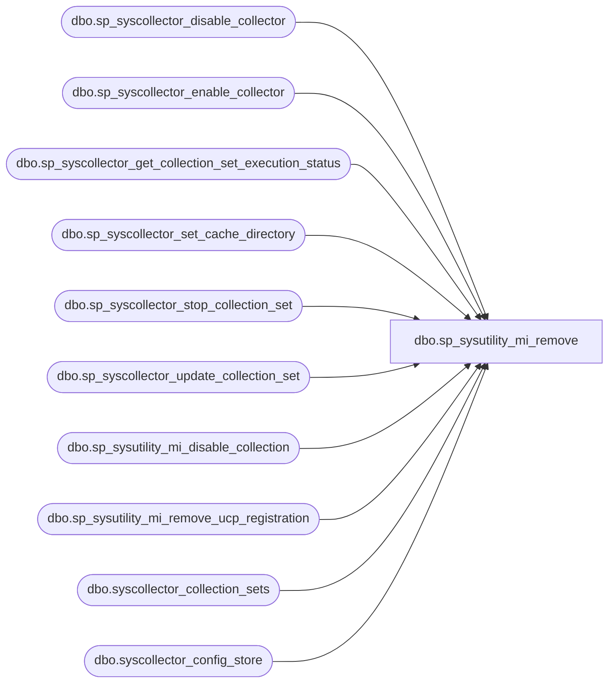

# dbo.sp_sysutility_mi_remove

**Database:** msdb  

## Architecture Diagram



## Table Dependencies

| Referenced Table |
|---|
| dbo.sp_syscollector_disable_collector |
| dbo.sp_syscollector_enable_collector |
| dbo.sp_syscollector_get_collection_set_execution_status |
| dbo.sp_syscollector_set_cache_directory |
| dbo.sp_syscollector_stop_collection_set |
| dbo.sp_syscollector_update_collection_set |
| dbo.sp_sysutility_mi_disable_collection |
| dbo.sp_sysutility_mi_remove_ucp_registration |
| dbo.syscollector_collection_sets |
| dbo.syscollector_config_store |

## Stored Procedure Code

```sql
CREATE PROCEDURE [dbo].[sp_sysutility_mi_remove]
WITH EXECUTE AS OWNER
AS
BEGIN
    SET NOCOUNT ON;

    EXEC msdb.dbo.sp_sysutility_mi_disable_collection;
    
    --###FP 1

    EXEC msdb.dbo.sp_syscollector_disable_collector;
    
    --###FP 2

    DECLARE @collection_set_id int;
    DECLARE @proxy_id int;
    DECLARE @utility_collection_set_uid uniqueidentifier = N'ABA37A22-8039-48C6-8F8F-39BFE0A195DF';

    -- find our collection set and determine if its proxy is set
    SELECT 
         @collection_set_id = collection_set.collection_set_id
        ,@proxy_id = collection_set.proxy_id
    FROM msdb.dbo.syscollector_collection_sets AS collection_set
    WHERE collection_set.collection_set_uid = @utility_collection_set_uid;

    -- determine if DC is running
    -- if agent is not running, is_running won't be changed
    -- so default it to false
    DECLARE @is_running int = 0
    EXEC msdb.dbo.sp_syscollector_get_collection_set_execution_status @collection_set_id, @is_running OUTPUT;
    
    --###FP 3

    IF (@is_running = 1)
    BEGIN
      EXEC msdb.dbo.sp_syscollector_stop_collection_set @collection_set_id;
    END
    
    --###FP 4

    IF (@proxy_id IS NOT NULL )
    BEGIN
        -- retrieve the current cache directory setting
        -- if the setting can't be found, assume it is not set	
        DECLARE @cache_directory_is_set bit = 0
        SELECT @cache_directory_is_set = CASE WHEN config.parameter_value IS NULL THEN 0 ELSE 1 END
        FROM msdb.dbo.syscollector_config_store AS config
        WHERE config.parameter_name = N'CacheDirectory';
        
        IF(@cache_directory_is_set = 1)
        BEGIN
          EXEC msdb.dbo.sp_syscollector_set_cache_directory @cache_directory = NULL;
        END
        
        --###FP 5
        
        -- clear the proxy
        -- because we only enter this block if proxy is set,
        -- postpone clearing proxy until the end of the block
        -- to ensure that if clearing the cache directory fails
        -- we will re-enter this block the next time this proc is called
        EXEC msdb.dbo.sp_syscollector_update_collection_set @collection_set_id = @collection_set_id, @proxy_name = N'';
        
        --###FP 6
    END
    
    EXEC msdb.dbo.sp_syscollector_enable_collector;
    
    --###FP 7

    EXEC msdb.dbo.sp_sysutility_mi_remove_ucp_registration;
END;

dbo,sp_sysutility_mi_remove_ucp_registration,CREATE PROCEDURE [dbo].[sp_sysutility_mi_remove_ucp_registration]
WITH EXECUTE AS OWNER
AS
BEGIN
   SET NOCOUNT ON;
   SET XACT_ABORT ON;
 
   BEGIN TRANSACTION;
    
    IF EXISTS (SELECT * FROM [msdb].[dbo].[sysutility_mi_configuration_internal])
    BEGIN
      UPDATE [msdb].[dbo].[sysutility_mi_configuration_internal]
      SET
         ucp_instance_name          = NULL,
         mdw_database_name          = NULL
    END
    ELSE
    BEGIN
         INSERT INTO [msdb].[dbo].[sysutility_mi_configuration_internal] (ucp_instance_name, mdw_database_name)
         VALUES (NULL, NULL);
    END     

   COMMIT TRANSACTION;

   ---- If the above part fails it will not execute the following XPs.
   ---- The following XP calls are not transactional, so they are put outside
   ---- the transaction.
   ---- Remove the MiUcpName registry key if it is present
   DECLARE @mi_ucp_name nvarchar(1024)
   EXEC master.dbo.xp_instance_regread N'HKEY_LOCAL_MACHINE',
                                       N'SOFTWARE\Microsoft\MSSQLServer\MSSQLServer\Utility',
                                       N'MiUcpName',
                                       @mi_ucp_name OUTPUT

   IF @mi_ucp_name IS NOT NULL
   BEGIN
       EXEC master.dbo.xp_instance_regdeletevalue N'HKEY_LOCAL_MACHINE',
                                                  N'SOFTWARE\Microsoft\MSSQLServer\MSSQLServer\Utility',
                                                  N'MiUcpName'
   END

   ---- Remove the registry key if this instance is NOT a UCP.
   ---- If this instance is a UCP we cannot remove the key entirely as
   ---- the version number is still stored under the key.
   IF (msdb.dbo.fn_sysutility_get_is_instance_ucp() = 0)
   BEGIN
       EXEC master.dbo.xp_instance_regdeletekey N'HKEY_LOCAL_MACHINE',
                                                  N'SOFTWARE\Microsoft\MSSQLServer\MSSQLServer\Utility'
   END
   
END

dbo,sp_sysutility_mi_upload,CREATE PROCEDURE [dbo].[sp_sysutility_mi_upload]
WITH EXECUTE AS OWNER
AS
BEGIN
   SET NOCOUNT ON;
   
   -- Check if the instance is enrolled
   IF ( 0 = (select [dbo].[fn_sysutility_ucp_get_instance_is_mi]()) )
   BEGIN
	  RAISERROR(37006, -1, -1)
     RETURN(1)
   END
   
   -- Check if Data Collector is enabled
   -- The following sproc will throw the correct error DC is disabled
   DECLARE @return_code INT;
   EXEC @return_code = [dbo].[sp_syscollector_verify_collector_state] @desired_state = 1
   IF (@return_code <> 0)
        RETURN (1)

   DECLARE @poll_delay_hh_mm_ss char(8)  = '00:00:10';
   DECLARE @start_delay_hh_mm_ss char(8)  = '00:00:10';
   
   DECLARE @start_time datetime2 = SYSUTCDATETIME();
   DECLARE @elapsed_time_ss INT
   
   DECLARE @collection_set_uid UNIQUEIDENTIFIER = N'ABA37A22-8039-48C6-8F8F-39BFE0A195DF';  
   DECLARE @collection_set_id INT = (SELECT collection_set_id FROM [dbo].[syscollector_collection_sets_internal]
                                    WHERE collection_set_uid = @collection_set_uid);
           
   DECLARE @is_upload_running INT;
   DECLARE @is_collection_running INT;

   -- If the collection set is running for some reason, wait for it
   -- to complete before instructing it to upload again.
   -- Assume that the collection is running before the loop starts
   SET @is_upload_running = 1;
   SET @is_collection_running = 1;
   
   -- Wait for the collection set to finish its previous execution        
   WHILE(1 = @is_collection_running OR 1 = @is_upload_running)
   BEGIN  
      -- Reset the while loop variables.  The sp will not update the values, if the collection
      -- is currently not running
      SET @is_upload_running = NULL;
      SET @is_collection_running = NULL;
      EXEC @return_code = [dbo].[sp_syscollector_get_collection_set_execution_status] 
            @collection_set_id = @collection_set_id,
            @is_collection_running = @is_collection_running OUTPUT,
            @is_upload_running = @is_upload_running OUTPUT
      IF (@@ERROR <> 0 OR @return_code <> 0) GOTO QuitWithError;

      -- Check to see if the collection is running before calling wait.
      -- It is more likely that it is not running, thus it is not optimal to wait.
      IF (1 = @is_collection_running OR 1 = @is_upload_running)
      BEGIN    
         SET @elapsed_time_ss = DATEDIFF(second, @start_time, SYSUTCDATETIME())
         RAISERROR ('Waiting for collection set to finish its previous run.  Total seconds spent waiting : %i', 0, 1, @elapsed_time_ss) WITH NOWAIT;
         WAITFOR DELAY @poll_delay_hh_mm_ss
      END

   END

   -- Grab the time before running the collection.  Use local time because later this value is used
   -- to find failures in the DC logs, which use local time.
   DECLARE @run_start_time datetime = SYSDATETIME();

   -- Start the collect and upload by invoking the run command
   RAISERROR ('Starting collection set.', 0, 1) WITH NOWAIT;
   EXEC @return_code = [msdb].[dbo].[sp_syscollector_run_collection_set] @collection_set_id = @collection_set_id
   IF (@@ERROR <> 0 OR @return_code <> 0) GOTO QuitWithError;    

   -- Allow the collection set to start
   RAISERROR ('Waiting for the collection set to kick off jobs.', 0, 1) WITH NOWAIT;
   WAITFOR DELAY @start_delay_hh_mm_ss
   
   -- Assume that the collection is running before the loop starts
   SET @is_upload_running = 1;
   SET @is_collection_running = 1;
   
   -- Wait for the collection set to finish it's previous execution        
   WHILE(1 = @is_collection_running OR 1 = @is_upload_running)
   BEGIN
      -- Reset the while loop variables.  The sp will not update the values, if the collection
      -- is currently not running
      SET @is_upload_running = NULL;
      SET @is_collection_running = NULL;
      
      -- Go ahead and wait on entry to the loop because it takes a 
      -- while for the collection set to finish collection
      SET @elapsed_time_ss = DATEDIFF(second, @start_time, SYSUTCDATETIME())
      RAISERROR ('Waiting for collection set to finish its previous run.  Total seconds spent waiting : %i', 0, 1, @elapsed_time_ss) WITH NOWAIT;
      WAITFOR DELAY @poll_delay_hh_mm_ss

      EXEC @return_code = [dbo].[sp_syscollector_get_collection_set_execution_status] 
            @collection_set_id = @collection_set_id,
            @is_collection_running = @is_collection_running OUTPUT,
            @is_upload_running = @is_upload_running OUTPUT
      IF (@@ERROR <> 0 OR @return_code <> 0) GOTO QuitWithError;
   END
   
   DECLARE @status_failure smallint = 2
   DECLARE @last_reported_status smallint = NULL
   
   -- Check if the collect/upload failed anytime after the call to run
   -- This is not precise in finding our exact run, but most of the time it will find our run
   -- What we really need to know is if the collect/upload failed
   -- There is a possibility that there are false positives (report failure, when our call to run passed)
   -- However, we are willing to risk it for simplicity.
   SELECT TOP 1 @last_reported_status = status 
   FROM msdb.dbo.syscollector_execution_log_internal 
      WHERE collection_set_id = @collection_set_id 
      AND parent_log_id IS NULL
      AND finish_time IS NOT NULL   
      AND start_time >= @run_start_time
      ORDER BY finish_time DESC

    IF (@last_reported_status = @status_failure)
    BEGIN
        RAISERROR(37007, -1, -1)
        RETURN(1) -- Failure
    END

   Return(0);
    
   QuitWithError:
      RAISERROR ('An error occurred during execution.', 0, 1) WITH NOWAIT;
      RETURN (1);
END
```

