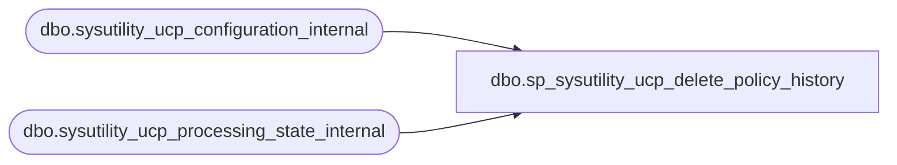

# dbo.sp_sysutility_ucp_delete_policy_history

**Database:** msdb  

## Architecture Diagram



## Table Dependencies

| Referenced Table |
|---|
| dbo.sysutility_ucp_configuration_internal |
| dbo.sysutility_ucp_processing_state_internal |

## Stored Procedure Code

```sql
CREATE PROCEDURE dbo.sp_sysutility_ucp_delete_policy_history 
WITH EXECUTE AS OWNER
AS
BEGIN
    SET NOCOUNT ON; 
    
    DECLARE @over_utilization_trailing_window INT = 1
    DECLARE @under_utilization_trailing_window INT = 1

    DECLARE @rows_affected bigint;
    DECLARE @delete_batch_size int;

    -- As we delete the master record in the history table which cascades
    -- to foreign key records in details table; keep the delete batch size to 100.
    SET @delete_batch_size = 100;
    SET @rows_affected = -1;

    -- Get the configured over utilization trailing window
    SELECT @over_utilization_trailing_window = CAST(ci.current_value AS INT)
    FROM msdb.dbo.sysutility_ucp_configuration_internal ci
    WHERE ci.name = 'OverUtilizationTrailingWindow'

    -- Get the configured under utilization trailing window
    SELECT @under_utilization_trailing_window = CAST(ci.current_value AS INT)
    FROM msdb.dbo.sysutility_ucp_configuration_internal ci
    WHERE ci.name = 'UnderUtilizationTrailingWindow'

    -- Purge volatile resource policy evaluation history against over utilization trailing window
    DECLARE @max_end_date datetime;
    SET @max_end_date = DATEADD(HH, -@over_utilization_trailing_window, CURRENT_TIMESTAMP);
    SET @rows_affected = -1;
    WHILE (@rows_affected != 0)
    BEGIN
        -- We use sp_executesql here because the values of @delete_batch_size and @max_end_date could 
        -- influence plan selection. These are variables that have unknown values when the plan for the 
        -- proc is compiled.  By deferring compilation until the variables have taken on their final values, 
        -- we give the optimizer information that it needs to choose the best possible plan.  We could also 
        -- use an OPTION(RECOMPILE) hint to accomplish the same thing, but the sp_executesql approach avoids 
        -- paying the plan compile cost for each loop iteration. 
        EXEC sp_executesql N'
            DELETE TOP (@delete_batch_size) h
            FROM msdb.dbo.syspolicy_policy_execution_history_internal h
            INNER JOIN msdb.dbo.sysutility_ucp_policies p ON p.policy_id = h.policy_id
            WHERE p.resource_type = 3        -- processor resource type
                AND p.utilization_type = 2   -- over-utilization
                AND h.end_date < @max_end_date', 

            N'@delete_batch_size int, @max_end_date datetime', 
            @delete_batch_size = @delete_batch_size, @max_end_date = @max_end_date;

        SET @rows_affected = @@ROWCOUNT;
    END;
    
    -- Purge volatile resource policy evaluation history against under utilization trailing window
    SET @max_end_date = DATEADD(HH, -@under_utilization_trailing_window, CURRENT_TIMESTAMP);
    SET @rows_affected = -1;
    WHILE (@rows_affected != 0)
    BEGIN    
        EXEC sp_executesql N'
            DELETE TOP (@delete_batch_size) h
            FROM msdb.dbo.syspolicy_policy_execution_history_internal h
            INNER JOIN msdb.dbo.sysutility_ucp_policies p ON p.policy_id = h.policy_id
            WHERE p.resource_type = 3        -- processor resource type
                AND p.utilization_type = 1   -- under-utilization
                AND h.end_date < @max_end_date', 

            N'@delete_batch_size int, @max_end_date datetime', 
            @delete_batch_size = @delete_batch_size, @max_end_date = @max_end_date;

        SET @rows_affected = @@ROWCOUNT;
    END;
    
    -- Purge non-volatile resource policy evaluation history older than the current processing_time recorded 
    -- The latest policy evaluation results are not purged to avoid potential conflicts with the health 
    -- state computation running simultaneoulsy in the caching (master) job during the same time schedule. 
    SET @rows_affected = -1;
    -- PBM stores the end_date in local time so convert the 'latest_processing_time' datetimeoffset to a local datetime
    SELECT @max_end_date = CONVERT(DATETIME, latest_processing_time) FROM [msdb].[dbo].[sysutility_ucp_processing_state_internal];
    WHILE (@rows_affected != 0)
    BEGIN     
        EXEC sp_executesql N'
            DELETE TOP (@delete_batch_size) h
            FROM msdb.dbo.syspolicy_policy_execution_history_internal h
            INNER JOIN msdb.dbo.sysutility_ucp_policies p ON p.policy_id = h.policy_id
            WHERE p.resource_type = 1    -- storage space resource type
                AND h.end_date < @max_end_date', 

            N'@delete_batch_size int, @max_end_date datetime',  
            @delete_batch_size = @delete_batch_size, @max_end_date = @max_end_date; 
            
        SET @rows_affected = @@ROWCOUNT;
    END;            
    
END

dbo,sp_sysutility_ucp_get_policy_violations,CREATE PROCEDURE dbo.sp_sysutility_ucp_get_policy_violations 
WITH EXECUTE AS OWNER
AS
BEGIN
    -- Clear the existing policy violations        
    TRUNCATE TABLE dbo.sysutility_ucp_policy_violations_internal
    
    -- Cache the latest policy violations for non-volatile resources
    -- The health state for non-volatile resource is determined based on 
    -- the latest policy violation against the target (file, volume) type.
    INSERT INTO dbo.sysutility_ucp_policy_violations_internal
    SELECT p.health_policy_id
        , p.policy_id
        , p.policy_name
        , d.history_id
        , d.detail_id
        , d.target_query_expression
        , d.target_query_expression_with_id
        , d.execution_date
        , d.result
    FROM msdb.dbo.sysutility_ucp_policies p
    INNER JOIN msdb.dbo.syspolicy_policy_execution_history_internal h 
        ON h.policy_id = p.policy_id
    INNER JOIN msdb.dbo.syspolicy_policy_execution_history_details_internal d 
        ON d.history_id = h.history_id
    WHERE p.resource_type = 1 -- Filter non-volatile resources (currently storage type only)   
        -- PBM stores the end_date in local time so convert the 'latest_processing_time' datetimeoffset to local datetime before compare
        AND h.end_date >= (SELECT CONVERT(DATETIME, latest_processing_time) FROM [msdb].[dbo].[sysutility_ucp_processing_state_internal]) 
        AND h.is_full_run = 1
        AND h.result = 0
        AND d.result = 0; 
        
    -- Get the policy evaluation count for volatile resources over the trailing window. 
    -- The health state for volatile resource is determined based on the policy 
    -- violation against the target (cpu) type over a trailing window and should
    -- exeed the occurrence frequency percent. E.g. a tartget can be considered
    -- as over utilized if its violating the policy for last 3 out of 4 evaluations
    -- (1 hour trailing window and 70 % occurrence frequency)    
    SELECT p.policy_id
          , MAX(h.end_date) execution_date
          , CASE WHEN 0 = COUNT(*) THEN 1 ELSE COUNT(*) END AS evaluation_count
          , p.utilization_type
          , p.health_policy_id
          , p.policy_name
          , pc.occurence_frequency
    INTO #policy_evaluations 
    FROM msdb.dbo.sysutility_ucp_policies p
    INNER JOIN msdb.dbo.syspolicy_policy_execution_history_internal h 
        ON p.policy_id = h.policy_id
    INNER JOIN msdb.dbo.sysutility_ucp_policy_configuration pc
        ON p.utilization_type = pc.utilization_type
    WHERE h.end_date >= DATEADD(MI, -60*pc.trailing_window, CURRENT_TIMESTAMP) 
        AND h.is_full_run = 1  
        AND p.resource_type = 3 -- Filter volatile resources (currently cpu type only)
    GROUP BY p.policy_id
        , p.utilization_type
        , p.health_policy_id
        , p.policy_name
        , pc.occurence_frequency;


    -- Get the policy violation count for the target types over the trailing window
    -- Note: 
    -- 1. If the trailing window is size increased, this computation will continue to
    -- use the exiting violations in the history against the newly configured window size. 
    -- It will only be effective after the full trailing window size is reached.
    -- 2. If the occurrence frequency is changed, it will be effective in the next run of the
    -- health state computation.
    SELECT p.policy_id
        , d.target_query_expression
        , COUNT(*) AS violation_count
        , MAX(h.history_id) as history_id
        , MAX(d.detail_id) AS detail_id
    INTO #policy_violations 
    FROM msdb.dbo.sysutility_ucp_policies p
    INNER JOIN msdb.dbo.syspolicy_policy_execution_history_internal h 
        ON p.policy_id = h.policy_id
    INNER JOIN msdb.dbo.syspolicy_policy_execution_history_details_internal d
        ON d.history_id = h.history_id 
    INNER JOIN msdb.dbo.sysutility_ucp_policy_configuration pc
        ON p.utilization_type = pc.utilization_type
    WHERE h.end_date >= DATEADD(MI, -60*pc.trailing_window, CURRENT_TIMESTAMP)			
        AND h.is_full_run = 1	
        AND h.result = 0
        AND d.result = 0
        AND p.resource_type = 3 -- Filter volatile resources (currently cpu type only)
    GROUP BY p.policy_id, d.target_query_expression;
    
    INSERT INTO dbo.sysutility_ucp_policy_violations_internal
    SELECT pe.health_policy_id
      , pe.policy_id
      , pe.policy_name
      , pv.history_id
      , pv.detail_id
      , pv.target_query_expression
      , N'' AS target_query_expression_with_id
      , pe.execution_date
      , 0 AS result
    FROM #policy_evaluations pe
    INNER JOIN #policy_violations pv 
        ON pe.policy_id = pv.policy_id
    WHERE pe.occurence_frequency <= ((pv.violation_count * 100) / pe.evaluation_count);
	        
END
```

