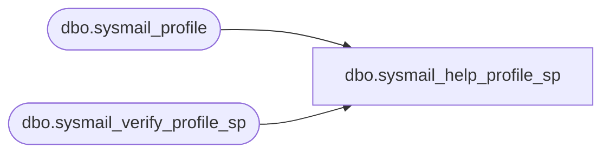

# dbo.sysmail_help_profile_sp

**Database:** msdb  

## Architecture Diagram



## Table Dependencies

| Referenced Table |
|---|
| dbo.sysmail_profile |
| dbo.sysmail_verify_profile_sp |

## Stored Procedure Code

```sql
CREATE PROCEDURE dbo.sysmail_help_profile_sp
   @profile_id int = NULL,
   @profile_name sysname = NULL
AS
   SET NOCOUNT ON

   DECLARE @rc int
   DECLARE @profileid int
   exec @rc = msdb.dbo.sysmail_verify_profile_sp @profile_id, @profile_name, 1, 0, @profileid OUTPUT
   IF @rc <> 0
      RETURN(1)

   IF (@profileid IS NOT NULL)
      SELECT profile_id, name, description 
      FROM msdb.dbo.sysmail_profile 
      WHERE profile_id = @profileid
      
   ELSE -- don't filter the output
      SELECT profile_id, name, description      
      FROM msdb.dbo.sysmail_profile 

   RETURN(0)
```

