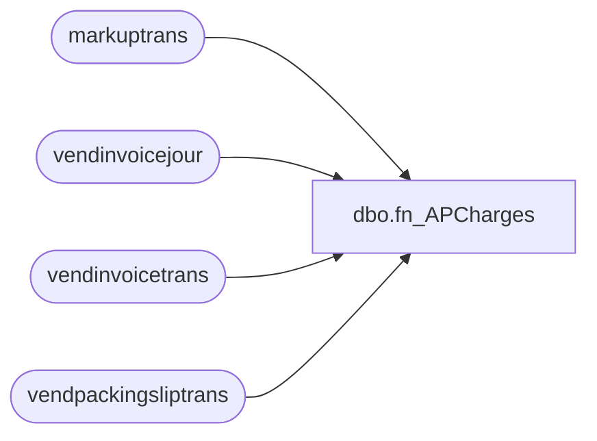

# dbo.fn_APCharges

**Database:** LH_D365  
**Server:** 4db76rlxaxcuvmuh5kw37wbnqq-m2o53thjetderkgqw4nc6a676e.datawarehouse.fabric.microsoft.com  
**Function Type:** Inline Table-Valued Function  

## Architecture Diagram



## Parameters

_No parameters._

## Table Dependencies

| Referenced Table |
|---|
| markuptrans |
| vendinvoicejour |
| vendinvoicetrans |
| vendpackingsliptrans |

## Function Code

```sql
CREATE     FUNCTION [dbo].[fn_APCharges]()
RETURNS TABLE
AS
RETURN
(
/*
in src CTE, combining invoice charges and receipt charges using voucher, b/c is some cases the charges are posted when receipt is posted 
but in most cases it's posted on invoice
*/
WITH src as (
SELECT
    mt.voucher,
    mt.transtableid,
    mt.transrecid,
    UPPER(REPLACE(mt.markupcode, ' ', '')) AS markupcode_norm,
    mt.calculatedamount,
	vt.invoiceid as [documentid],
	vt.invoicedate as [documentdate],
	vt.dataareaid,
	vt.inventdimid,
	vt.qty,
	vt.itemid,
	vt.lineamount
FROM markuptrans mt
    INNER JOIN vendinvoicetrans vt
        ON vt.tableid = mt.transtableid
       AND vt.recid   = mt.transrecid
		AND vt.itemid IS NOT NULL
INNER JOIN vendinvoicejour vj
	on vj.invoiceid = vt.invoiceid
	AND vj.dataareaid = vt.dataareaid
	AND vj.invoicedate = vt.invoicedate
	AND vj.ledgervoucher = mt.voucher
Where mt.calculatedamount <> 0 
UNION ALL
SELECT
    mt.voucher,
    mt.transtableid,
    mt.transrecid,
    UPPER(REPLACE(mt.markupcode, ' ', '')) AS markupcode_norm,
    mt.calculatedamount,
	vp.packingslipid as [documentid],
	vp.deliverydate as [documentdate],
	vp.dataareaid,
	vp.inventdimid,
	vp.qty,
	vp.itemid,
	vp.valuemst as lineamount
FROM markuptrans mt
INNER JOIN vendpackingsliptrans vp
    on vp.tableid = mt.transtableid
      AND vp.recid   = mt.transrecid
	  AND vp.costledgervoucher = mt.voucher
Where mt.calculatedamount <> 0	
)

    SELECT
    itemid,
    transtableid,
    transrecid,
    voucher,
	[documentid],
	[documentdate],
	dataareaid,
	inventdimid,
	qty,
	lineamount,
    ISNULL([SALESTAX],   0) AS SalesTax,
    ISNULL([FOBROY],     0) AS FOBROY,
    ISNULL([PLATE],      0) AS PLATE,
    ISNULL([TARIFFS],    0) AS TARIFFS,
    ISNULL([FREIGHT],    0) AS FREIGHT,
    ISNULL([DIE],        0) AS DIE,
    ISNULL([GSTRECLAIM], 0) AS GSTReclaim,
    ISNULL([OCEANFRT],   0) AS OCEANFRT,
    ISNULL([SERVFEE],    0) AS SERVFEE,
    ISNULL([MOLD],       0) AS MOLD,
    ISNULL([BROKER],     0) AS BROKER,
    ISNULL([CUSTOMS],    0) AS CUSTOMS
FROM src
PIVOT (
    SUM(calculatedamount)
    FOR markupcode_norm IN (
        [SALESTAX],
        [FOBROY],
        [PLATE],
        [TARIFFS],
        [FREIGHT],
        [DIE],
        [GSTRECLAIM],
        [OCEANFRT],
        [SERVFEE],
        [MOLD],
        [BROKER],
        [CUSTOMS]
    )
) p
);
```

