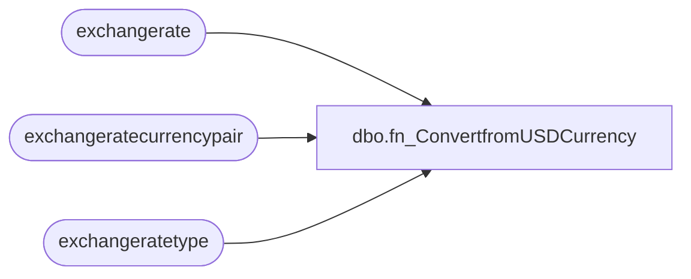

# dbo.fn_ConvertfromUSDCurrency

**Database:** LH_D365  
**Server:** 4db76rlxaxcuvmuh5kw37wbnqq-m2o53thjetderkgqw4nc6a676e.datawarehouse.fabric.microsoft.com  
**Function Type:** Inline Table-Valued Function  

## Architecture Diagram



## Parameters

| Parameter | Data Type | Max Length | Is Output |
|---|---|---|---|
| @FromCurrency | varchar | 10 | NO |
| @ToCurrency | varchar | 10 | NO |
| @USDAmount | decimal | 9 | NO |
| @Transdate | date | 3 | NO |
| @fxType | varchar | 8000 | NO |

## Table Dependencies

| Referenced Table |
|---|
| exchangerate |
| exchangeratecurrencypair |
| exchangeratetype |

## Function Code

```sql
CREATE   FUNCTION [dbo].[fn_ConvertfromUSDCurrency]
(
    @FromCurrency VARCHAR(10),
    @ToCurrency VARCHAR(10),
    @USDAmount DECIMAL(18,4),
	@Transdate date,
    --@LegalEntity VARCHAR(10),
	@fxType varchar(8000)
)
RETURNS TABLE
AS
RETURN
(
    --  
    SELECT TOP 1
        ConvertedAmount = CAST ((@USDAmount * round((100.00/e.exchangerate),4,1)) as decimal(18, 2))
    FROM exchangerate e
    JOIN exchangeratecurrencypair  cp
        ON e.exchangeratecurrencypair = cp.recid
	JOIN exchangeratetype et
		ON et.recid = cp.exchangeratetype
    --JOIN ledger 
    --    ON ledger.defaultexchangeratetype = exchangeratecurrencypair.exchangeratetype
    WHERE @Transdate between e.validfrom and e.validto         
      AND cp.fromcurrencycode = @ToCurrency
      AND cp.tocurrencycode   = @FromCurrency 
      --AND ledger.name = @LegalEntity    
	  AND et.name = @fxType
    
);
```

