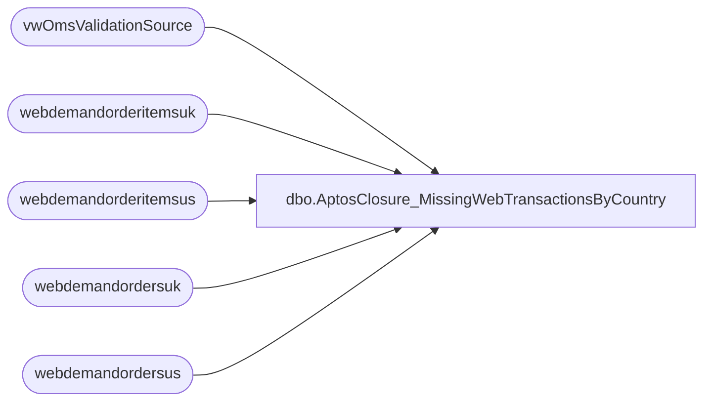

# dbo.AptosClosure_MissingWebTransactionsByCountry

**Database:** LH_Mart  
**Server:** 4db76rlxaxcuvmuh5kw37wbnqq-m2o53thjetderkgqw4nc6a676e.datawarehouse.fabric.microsoft.com  

## Architecture Diagram



## Table Dependencies

| Referenced Table |
|---|
| vwOmsValidationSource |
| webdemandorderitemsuk |
| webdemandorderitemsus |
| webdemandordersuk |
| webdemandordersus |

## Stored Procedure Code

```sql
-- =============================================
-- Author:      Brandon Hickey
-- Create Date: 2026-01-20
-- Description: Returns missing web transactions by country
-- Notes:
-- =============================================

CREATE   PROCEDURE [dbo].[AptosClosure_MissingWebTransactionsByCountry]
   @startDate DATE,
        @endDate DATE,
        @Country VARCHAR(5)
AS
	BEGIN
		SET NOCOUNT ON;

		/* Basic parameter validation */
		IF @StartDate IS NULL OR @EndDate IS NULL
		BEGIN
			RAISERROR('StartDate and EndDate are required.', 16, 1);
			RETURN;
		END;

		IF @StartDate > @EndDate
		BEGIN
			RAISERROR('StartDate must be less than or equal to EndDate.', 16, 1);
			RETURN;
		END;

		WITH IncludedOrderItems AS (
		SELECT DISTINCT OrderNumber, ShippingMethodCode, WarehouseCode
		FROM webdemandorderitemsus
		WHERE ItemStatus IN (
			--'Shipped','Store Shipped','Ready For Pickup','Picked Up',
			--'Ready for Delivery Pickup','Gift Card Processed','Delivered (Same Day)','Cancelled'
			'Pending Wave', 'New Pending Pickup'
		)
		UNION
		SELECT DISTINCT OrderNumber, ShippingMethodCode, WarehouseCode 
		FROM webdemandorderitemsuk
		WHERE ItemStatus IN (
			--'Shipped','Store Shipped','Ready For Pickup','Picked Up',
			--'Ready for Delivery Pickup','Gift Card Processed','Delivered (Same Day)','Cancelled'
			'Pending Wave', 'New Pending Pickup'
		)
	),
	IncludedOrders AS (
		SELECT DISTINCT OrderNumber
		FROM webdemandordersus
		--WHERE OrderStatus = 'Completed'
		WHERE OrderStatus = 'Pending'
		UNION
		SELECT DISTINCT OrderNumber
		FROM webdemandordersuk
		--WHERE OrderStatus = 'Completed'
		WHERE OrderStatus = 'Pending'
	),
	JoinedOrders AS (
		SELECT DISTINCT i.OrderNumber, i.ShippingMethodCode, i.WarehouseCode
		FROM IncludedOrderItems i
		JOIN IncludedOrders o ON i.OrderNumber = o.OrderNumber
	),
	ValidationSource AS (
		SELECT DISTINCT SequenceNumber
		FROM vwOmsValidationSource
	),
	MissingOrders AS (
		SELECT j.OrderNumber, j.ShippingMethodCode, j.WarehouseCode
		FROM JoinedOrders j
		LEFT JOIN ValidationSource v ON j.OrderNumber = v.SequenceNumber
		WHERE v.SequenceNumber IS NULL
	), _all(OrderDateUTC, ShippingCountry, OrderNumber, OrderNumberText, ShippingMethodCode, WarehouseCode, transaction_key) AS
	(
	SELECT DISTINCT CAST(us.OrderDateUTC AS DATE) AS OrderDateUTC,
		   us.ShippingCountry,
		   us.OrderNumber,
		   '"' + us.OrderNumber + '",' AS OrderNumberText,
		   m.ShippingMethodCode,
		   m.WarehouseCode,
		   CONCAT(
				CAST('1013-052' AS varchar(64)),
				'-',
				TRY_CONVERT(CHAR(8), us.OrderDateUTC, 112),
				'-',
				CAST(us.OrderNumber AS varchar(50)),
				'_1'
			) AS transaction_key
	FROM webdemandordersus us
	JOIN MissingOrders m ON us.OrderNumber = m.OrderNumber
	WHERE (@startDate IS NULL OR @endDate IS NULL OR CAST(us.OrderDateUTC AS DATE) BETWEEN @startDate AND @endDate)
	  AND (@Country IS NULL OR us.ShippingCountry = @Country) AND us.OrderNumber NOT LIKE ('7%')

	UNION ALL

	SELECT DISTINCT CAST(uk.OrderDateUTC AS DATE) AS OrderDateUTC,
		   uk.ShippingCountry,
		   uk.OrderNumber,
		   '"' + uk.OrderNumber + '",' AS OrderNumberText,
		   m.ShippingMethodCode,
		   m.WarehouseCode,
		   CONCAT(
				CAST('1013-052' AS varchar(64)),
				'-',
				TRY_CONVERT(CHAR(8), uk.OrderDateUTC, 112),
				'-',
				CAST(uk.OrderNumber AS varchar(50)),
				'_1'
			) AS transaction_key
	FROM webdemandordersuk uk
	JOIN MissingOrders m ON uk.OrderNumber = m.OrderNumber
	WHERE (@startDate IS NULL OR @endDate IS NULL OR CAST(uk.OrderDateUTC AS DATE) BETWEEN @startDate AND @endDate)
	  AND (@Country IS NULL OR uk.ShippingCountry = @Country) AND uk.OrderNumber NOT LIKE ('7%'))
	 SELECT *
	 --INTO #tmp
	 FROM _all
	  order by 1 desc,3;
END
```

