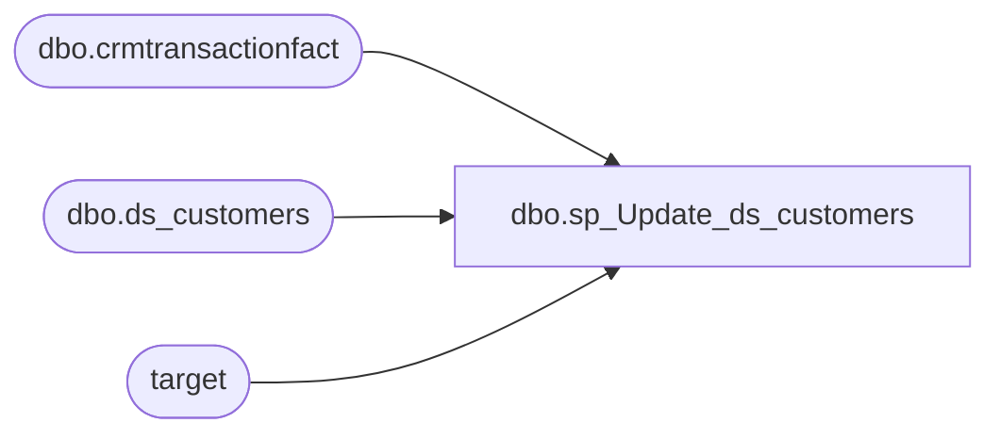

# dbo.sp_Update_ds_customers

**Database:** LH_Mart_CI  
**Server:** 4db76rlxaxcuvmuh5kw37wbnqq-m2o53thjetderkgqw4nc6a676e.datawarehouse.fabric.microsoft.com  

## Architecture Diagram



## Table Dependencies

| Referenced Table |
|---|
| dbo.crmtransactionfact |
| dbo.ds_customers |
| target |

## Stored Procedure Code

```sql
CREATE   PROCEDURE sp_Update_ds_customers AS
BEGIN
    -- Create a temporary staging table
    IF OBJECT_ID('tempdb..#staging_ds_customers') IS NOT NULL
        DROP TABLE #staging_ds_customers;

    SELECT
        CustomerNumber,
        MIN(TransactionDate) AS first_TransactionDate,
        MAX(TransactionDate) AS last_TransactionDate,
        COUNT(DISTINCT TransactionID) AS num_txn_lifetime
    INTO #staging_ds_customers
    FROM dbo.crmtransactionfact
    GROUP BY CustomerNumber;

    -- Update existing rows
    UPDATE target
    SET
        target.first_TransactionDate = source.first_TransactionDate,
        target.last_TransactionDate = source.last_TransactionDate,
        target.num_txn_lifetime = source.num_txn_lifetime
    FROM dbo.ds_customers AS target
    INNER JOIN #staging_ds_customers AS source
        ON target.CustomerNumber = source.CustomerNumber;

    -- Insert new rows
    INSERT INTO dbo.ds_customers (CustomerNumber, first_TransactionDate, last_TransactionDate, num_txn_lifetime)
    SELECT
        source.CustomerNumber,
        source.first_TransactionDate,
        source.last_TransactionDate,
        source.num_txn_lifetime
    FROM #staging_ds_customers AS source
    LEFT JOIN dbo.ds_customers AS target
        ON source.CustomerNumber = target.CustomerNumber
    WHERE target.CustomerNumber IS NULL;
END;
```

