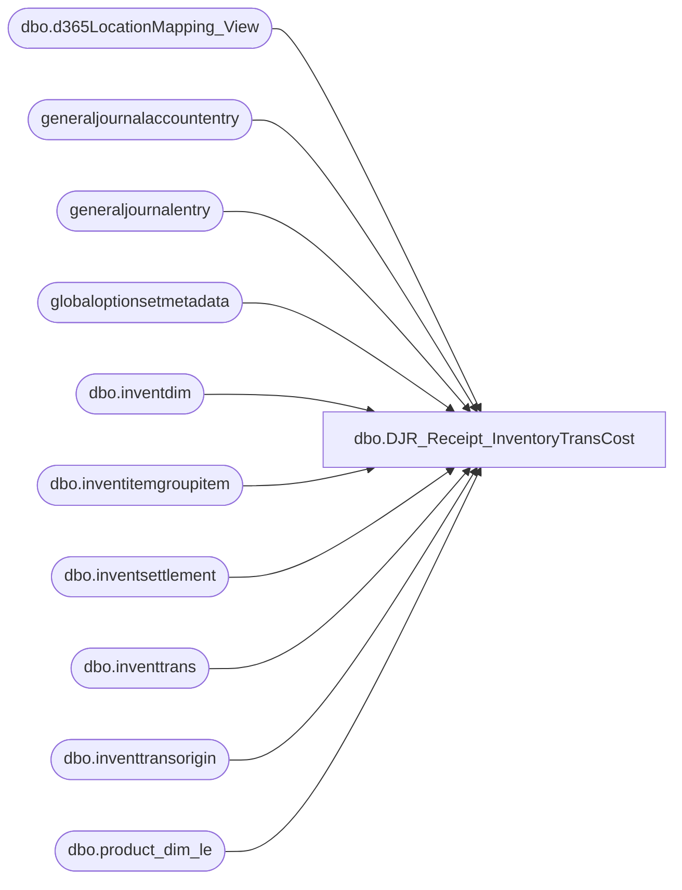

# dbo.DJR_Receipt_InventoryTransCost

**Database:** LH_D365  
**Server:** 4db76rlxaxcuvmuh5kw37wbnqq-m2o53thjetderkgqw4nc6a676e.datawarehouse.fabric.microsoft.com  

## Architecture Diagram



## Table Dependencies

| Referenced Table |
|---|
| dbo.d365LocationMapping_View |
| generaljournalaccountentry |
| generaljournalentry |
| globaloptionsetmetadata |
| dbo.inventdim |
| dbo.inventitemgroupitem |
| dbo.inventsettlement |
| dbo.inventtrans |
| dbo.inventtransorigin |
| dbo.product_dim_le |

## View Code

```sql
CREATE   VIEW [dbo].[DJR_Receipt_InventoryTransCost]
AS
WITH IPR_Cost_of_purchased_materials_received AS
     (
             select distinct
                     gje.subledgervoucher          ,
                     gje.accountingdate            ,
                     gje.documentdate              ,
                     gje.subledgervoucherdataareaid
             from
                     generaljournalentry gje
             join
                     generaljournalaccountentry gjae
             on
                     gjae.generaljournalentry = gje.recid
             where
                     gje.subledgervoucher like 'IPRR%'
             and     gjae.postingtype     = 82
             and     gjae.IsDelete is null
             and     gje.IsDelete is null
             and     (
                             gjae.ledgeraccount    LIKE '100500%'
                             OR gjae.ledgeraccount LIKE '100530%'
                             OR gjae.ledgeraccount LIKE '100531%')
				--and     gje.subledgervoucher in (
				--'IPRR000051500',
				--'IPRR000051534' ,
				--'IPRR000042926',
				--'IPRR000042923',
				--'IPRR000042945',
				--'IPRR000042948',
				--'IPRR000042882',
				--'IPRR000042883',
				--'IPRR000042907',
				--'IPRR000042900',
				--'IPRR000045491',
				--'IPRR000051467',
				--'IPRR000051182',
				--'IPRR000047859',
				--'IPRR000047588',
				--'IPRR000045188',
				--'IPRR000051825',
				--'IPRR000051869',
				--'IPRR000051929',
				--'IPRR000052290',
				--'IPRR000052251'
			--			   )
     ) ,
     InvSettlements AS
     (
             SELECT
                     [balancesheetposting]                                                 ,
                     GOSM_balanceSheetPosting.LocalizedLabel AS [balancesheetposting_label],
                     [operationsposting]                                                   ,
                     GOSM_operationsposting.LocalizedLabel AS [operationsposting_label]    ,
                     [settlemodel]                                                         ,
                     GOSM_settlemodel.LocalizedLabel AS [settlemodel_label]                ,
                     [voucher]                                                             ,
                     [dataareaid]                                                          ,
                     [itemid]                                                              ,
                     SUM([costamountadjustment]) AS [costamountadjustment]
             FROM
                     [dbo].[inventsettlement] AS ism
             LEFT JOIN
                     globaloptionsetmetadata AS GOSM_balanceSheetPosting
             ON
                     ism.balancesheetposting                = GOSM_balanceSheetPosting.[Option]
             AND     GOSM_balanceSheetPosting.EntityName    = 'inventsettlement'
             AND     GOSM_balanceSheetPosting.OptionSetName = 'balancesheetposting'
             LEFT JOIN
                     globaloptionsetmetadata AS GOSM_operationsposting
             ON
                     ism.[operationsposting]              = GOSM_operationsposting.[Option]
             AND     GOSM_operationsposting.EntityName    = 'inventsettlement'
             AND     GOSM_operationsposting.OptionSetName = 'operationsposting'
             LEFT JOIN
                     globaloptionsetmetadata AS GOSM_settlemodel
             ON
                     ism.[settlemodel]              = GOSM_settlemodel.[Option]
             AND     GOSM_settlemodel.EntityName    = 'inventsettlement'
             AND     GOSM_settlemodel.OptionSetName = 'settlemodel'
             WHERE
                     ism.IsDelete IS NULL

					 GROUP BY [balancesheetposting]                                                 ,
                     GOSM_balanceSheetPosting.LocalizedLabel,
                     [operationsposting]
```

