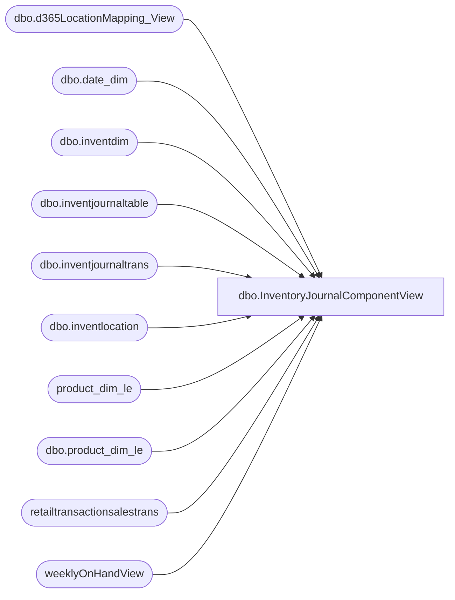

# dbo.InventoryJournalComponentView

**Database:** LH_D365  
**Server:** 4db76rlxaxcuvmuh5kw37wbnqq-m2o53thjetderkgqw4nc6a676e.datawarehouse.fabric.microsoft.com  

## Architecture Diagram



## Table Dependencies

| Referenced Table |
|---|
| dbo.d365LocationMapping_View |
| dbo.date_dim |
| dbo.inventdim |
| dbo.inventjournaltable |
| dbo.inventjournaltrans |
| dbo.inventlocation |
| product_dim_le |
| dbo.product_dim_le |
| retailtransactionsalestrans |
| weeklyOnHandView |

## View Code

```sql
CREATE   VIEW [dbo].InventoryJournalComponentView
    AS
    WITH DatePeriods AS (
        -- Defines the date range and calculates the week-ending Saturday for each actual date
        SELECT
            d.actual_date,
            MAX(CASE WHEN d.day_of_week = 7 THEN d.actual_date END) OVER (PARTITION BY d.fiscal_year, d.fiscal_week) AS WeekEndingDate
        FROM
            LH_Mart.dbo.[date_dim] d
        WHERE
            d.actual_date >= DATEADD(MONTH, -12, CAST(GETDATE() AS DATE))
            AND d.actual_date <= GETDATE()
    )
    ,InventoryJournalComponentBase AS (
     -- Selects and pre-processes all necessary fields from the transaction view
     -- and joins to the date dimension to get the WeekEndingDate.
     SELECT
        a.WeekEndingDate,
        locationMapping.LocationKey,
        pd.product_key as productkey,
        inventjournaltrans.[costamount], --AS [Inventory Trans Cost] ,
        InventJournalTable.[journalnameid], --as [InventoryTrans TypeCode],
        InventJournalTable.[journaltype],
           -- Pre-process text fields in the base layer for consistency
           LOWER(inventjournaltrans.[countingreasoncode]) AS reasoncode,--[Trans Reason Code (outer)],
           LOWER(InventJournalTable.[description]) AS transdescription -- [Inventory Trans Type Desc]
        FROM
        dbo.[inventjournaltrans] AS inventjournaltrans
        INNER JOIN dbo.[inventjournaltable] AS InventJournalTable
            ON inventjournaltrans.[journalid] = InventJournalTable.[journalid] AND inventjournaltrans.[dataareaid] = InventJournalTable.[dataareaid]
        INNER JOIN dbo.[inventdim] AS InventDim
            ON inventjournaltrans.inventdimid = InventDim.inventdimid AND inventjournaltrans.dataareaid = InventDim.dataareaid
        INNER JOIN dbo.[inventlocation] AS InventLocation
            ON InventDim.[inventlocationid] = InventLocation.[inventlocationid] 
    		AND inventjournaltrans.[dataareaid] = InventLocation.[dataareaid]
        INNER JOIN dbo.[d365LocationMapping_View] AS locationMapping
            ON InventLocation.[inventlocationid] = locationMapping.[inventlocationid] 
    		AND inventjournaltrans.[dataareaid] = locationMapping.[legalentity]
        INNER JOIN dbo.product_dim_le AS pd
            ON pd.[style_code] = inventjournaltrans.[itemid] 
    		AND pd.[jurisdiction_code] = locationMapping.[JurisidictionCode] 
    		AND inventjournaltrans.dataareaid = pd.LegalEntity
    	INNER JOIN DatePeriods a
    		ON inventjournaltrans.transdate = a.actual_date
    WHERE
    InventJournalTable.posted = 1

    )
    ,InventoryJournalComponents AS (
        -- Consolidates queries for components sourced from InventJourTransView
        SELECT
            WeekEndingDate,
            t.LocationKey,
            CAST(t.productkey AS VARCHAR(50)) AS ProductKey,
            SUM(CASE WHEN t.reasoncode = 'atrium' THEN t.costamount ELSE 0 END) AS AtriumCost,
            SUM(CASE WHEN t.transdescription LIKE '%damage%' THEN t.costamount * -1 ELSE 0 END) AS DamagesCost,
            SUM(CASE WHEN t.transdescription LIKE 'gxo po%' THEN t.costamount ELSE 0 END) AS GXOPOCost,
            SUM(CASE WHEN t.journalnameid = 'ICNT' AND LOWER(t.transdescription) LIKE 'clear out%' THEN t.costamount ELSE 0 END) AS ClearOutCost,
            SUM(CASE WHEN t.journalnameid = 'ICNT' 
                     AND t.transdescription NOT LIKE 'clear out%' 
                     AND reasoncode <> 'atrium'
                     AND transdescription NOT LIKE '%damage%'
                     AND transdescription NOT LIKE 'gxo po%'
                THEN t.costamount ELSE 0 END) AS ShortageCost,
    		--SUM(t.[Inventory Trans Cost]) AS STSAdjCost,
            SUM(CASE WHEN t.[journaltype] = 1
                     AND reasoncode <> 'atrium'
                     AND transdescription NOT LIKE '%damage%'
                     AND transdescription NOT LIKE 'gxo po%'
                THEN
```

