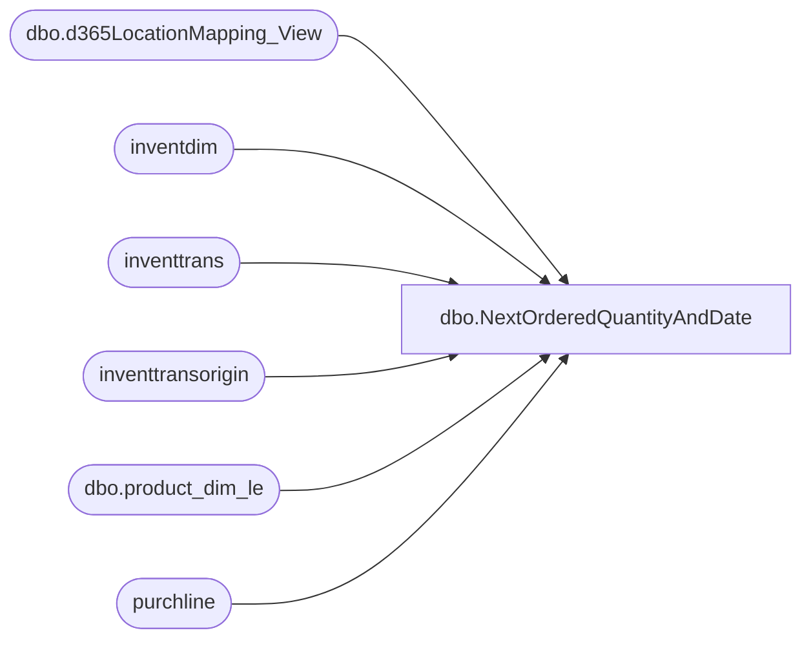

# dbo.NextOrderedQuantityAndDate

**Database:** LH_D365  
**Server:** 4db76rlxaxcuvmuh5kw37wbnqq-m2o53thjetderkgqw4nc6a676e.datawarehouse.fabric.microsoft.com  

## Architecture Diagram



## Table Dependencies

| Referenced Table |
|---|
| dbo.d365LocationMapping_View |
| inventdim |
| inventtrans |
| inventtransorigin |
| dbo.product_dim_le |
| purchline |

## View Code

```sql
CREATE   VIEW [dbo].[NextOrderedQuantityAndDate]
AS
with base as (
    select
        it.dataareaid,
        it.itemid,
        id.inventlocationid,
        id.inventsiteid,
        id.inventstatusid,
        ito.inventtransid,
        ito.referencecategory,
        ito.referenceid,
        it.qty,
        it.dateexpected
    from inventtrans it
    join inventtransorigin ito
        on ito.recid = it.inventtransorigin
    join inventdim id
        on id.dataareaid  = it.dataareaid
       and id.inventdimid = it.inventdimid
    where it.qty <> 0
      AND ito.referencecategory = 3
	  AND it.statusreceipt = 5
)
,
doc_dates as (
    select
        b.dataareaid,
        b.itemid,
        b.inventlocationid,
        b.inventsiteid,
        b.inventstatusid,
        b.referencecategory,
        b.referenceid,
        b.qty,
        -- Compute nextdate once here
        cast(
            coalesce(
                case when b.referencecategory = 3
                    then
                        NULLIF(pl.deliverydate, CONVERT(datetime2(6), '1900-01-01T00:00:00.000000'))
                end,
                b.dateexpected
            ) as date
        ) as nextdate
    from base b
    left join purchline pl
        on pl.dataareaid   = b.dataareaid
       and pl.inventtransid = b.inventtransid
       and pl.purchstatus in (1, 2)
       and b.referencecategory = 3  -- Only join when needed
    where cast(
            coalesce(
                case when b.referencecategory = 3
                    then 
                        NULLIF(pl.deliverydate, CONVERT(datetime2(6), '1900-01-01T00:00:00.000000'))
                end,
                b.dateexpected
            ) as date
        ) > cast(getdate() as date)
),
ranked as (
    select
        dataareaid,
        itemid,
        inventlocationid,
        inventsiteid,
        inventstatusid,
        nextdate,
        qty,
        row_number() over (
            partition by dataareaid, itemid, inventlocationid, inventsiteid, inventstatusid
            order by nextdate
        ) as rn
    from doc_dates
)
select
    ranked.[inventlocationid] + '-' + ranked.[dataareaid] AS [LocationKey],
    [pd].[product_key],
    dataareaid,
    itemid,
    ranked.inventlocationid,
    ranked.inventsiteid,
    inventstatusid,
    nextdate,
    sum(qty) as nextorderedqty
from ranked
LEFT JOIN [dbo].[d365LocationMapping_View] AS [locationMapping]
    ON ranked.inventlocationid = [locationMapping].[inventlocationid]
    AND [locationMapping].[legalentity] = ranked.[dataareaid]
LEFT JOIN [LH_D365].[dbo].[product_dim_le] AS [pd]
    ON [pd].[style_code] = ranked.[itemid]
    AND [pd].[jurisdiction_code] = [locationMapping].[JurisidictionCode]
    AND ranked.[dataareaid] = [pd].[LegalEntity]
where rn = 1
group by [pd].[product_key], dataareaid, itemid, ranked.inventlocationid, ranked.inventsiteid, inventstatusid, nextdate
```

