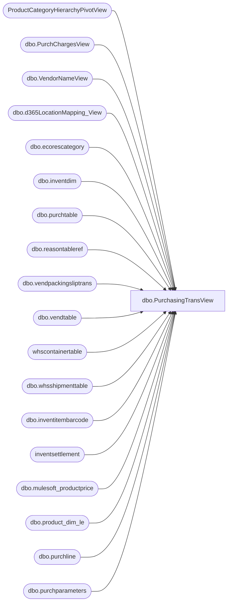

# dbo.PurchasingTransView

**Database:** LH_D365  
**Server:** 4db76rlxaxcuvmuh5kw37wbnqq-m2o53thjetderkgqw4nc6a676e.datawarehouse.fabric.microsoft.com  

## Architecture Diagram



## Table Dependencies

| Referenced Table |
|---|
| ProductCategoryHierarchyPivotView |
| dbo.PurchChargesView |
| dbo.VendorNameView |
| dbo.d365LocationMapping_View |
| dbo.ecorescategory |
| dbo.inventdim |
| dbo.purchtable |
| dbo.reasontableref |
| dbo.vendpackingsliptrans |
| dbo.vendtable |
| whscontainertable |
| dbo.whsshipmenttable |
| dbo.inventitembarcode |
| inventsettlement |
| dbo.mulesoft_productprice |
| dbo.product_dim_le |
| dbo.purchline |
| dbo.purchparameters |

## View Code

```sql
CREATE   VIEW [dbo].[PurchasingTransView] AS

/* =========================================================================================
   CHANGE LOG (keep existing comments below; additions are marked with "CHANGE:")

   Recent changes:
   - Add CurrentRetailDecimal from LH_Source.dbo.mulesoft_productprice (per PO line)
   - Use PO create date (purchtable.createddatetime) for effective dating (StartDate/StopDate)
   - Per PO line (PurchLine RecId + dataareaid), not per receipt
   - Fallback when no StartDate <= PO create date:
       -> use oldest record for StyleCode + Jurisdiction (CreateDate ASC, StartDate ASC)
   - If Style starts with '1' and JurisdictionCode = 'US', also try CandidateJurisdiction = 'CA'
   - **Optimization:** only create the CA candidate when a CA price exists for the StyleCode (reduces unnecessary joins)
   - Protect against NULL: default CurrentRetailDecimal to 0
   - Use Style (ISNULL(purchline.itemid, ecat.name)) as the lookup key for productprice.StyleCode
   - Fabric SQL endpoint notes: use CURRENT_TIMESTAMP, avoid OUTER APPLY
========================================================================================= */

WITH base AS (
    SELECT DISTINCT
        purchtable.purchstatus AS 'PO Status',
	    packingSlip.packingslipid AS 'Receipt number',

        -- LOC (exclude null/WEBSUP in WHERE)
        idm.inventlocationid AS 'LOC',
        idm.inventlocationid + '-' + purchline.dataareaid AS 'LocationKey',

        purchline.purchid AS 'PO number',
        packingSlip.deliverydate AS 'Receipt Date',

        ISNULL(purchline.itemid, ecat.name) AS 'Style',
        pd.style_desc AS 'Short Desciption',

        COALESCE( 
            CASE
            -- If item begins with 8: always use US version barcode (0 + rest), per doc from Paul
            WHEN LEFT(purchline.itemid, 1) = '8'
                THEN usBC.itembarcode

            -- If item begins with 9 AND its barcode is "000000" + itemid: use US version barcode in 1100
            WHEN LEFT(purchline.itemid, 1) = '9'
                    AND curBC.itembarcode = CONCAT('000000', purchline.itemid)
                THEN usBC.itembarcode

            -- Else: display what is found for the item itself
            ELSE curBC.itembarcode
        END,
        curBC.itembarcode) AS 'EAN-13',

        pd.department_code AS 'Department',
        purchline.purchqty AS 'on order units',
        packingSlip.qty AS 'units received',
        ((ISNULL(
            CASE
                WHEN pd.jurisdiction_code <> 'US' THEN packingSlip.valuemst
                ELSE packingSlip.lineamount_w
            END,
            0
        ) + ISNULL(pc.TotalCharge, 0)) / ISNULL(packingSlip.qty, 1)) AS 'Cost',
        (ISNULL(
            CASE
                WHEN pd.jurisdiction_code <> 'US' THEN packingSlip.valuemst
                ELSE packingSlip.lineamount_w
            END,
            0
        ) + ISNULL(pc.TotalCharge, 0)) AS 'X-Cost',
        ISNULL(packingSlip.qty, 0) * ((ISNULL(
            CASE
                WHEN pd.jurisdiction_code <> 'US' THEN packingSlip.valuemst
                ELSE packingSlip.lineamount_w
            END,
            0
        ) + ISNULL(pc.TotalCharge, 0)) / NULLIF(packingSlip.qty, 1) - purchline.purchprice) AS 'Costfactor',
	    --packingSlip.qty * purchline.purchprice AS 'Receipt cost w/o charges', -- commented b/c it doesn;t work for other currencies
	    ISNULL(CASE WHEN locationMapping.JurisidictionCode <> 'US' THEN packingSlip.valuemst ELSE packingSlip.lineamount_w END, 0) AS 'Receipt cost w/o charges',
	    --Added following column to include cost adjustment posted against the po receipt 
	    --ISNULL(s.costamountadjustment, 0)+ ISNULL(pc.TotalCharge, 0) + ISNULL(CASE WHEN locationMapping.JurisidictionCode <> 'US' THEN packingSlip.valuemst ELSE packingSlip.lineamount_w END, 0) AS 'Receipt_cost_w_adjustment_old',
	    ISNULL(s.costamountadjustment,
```

