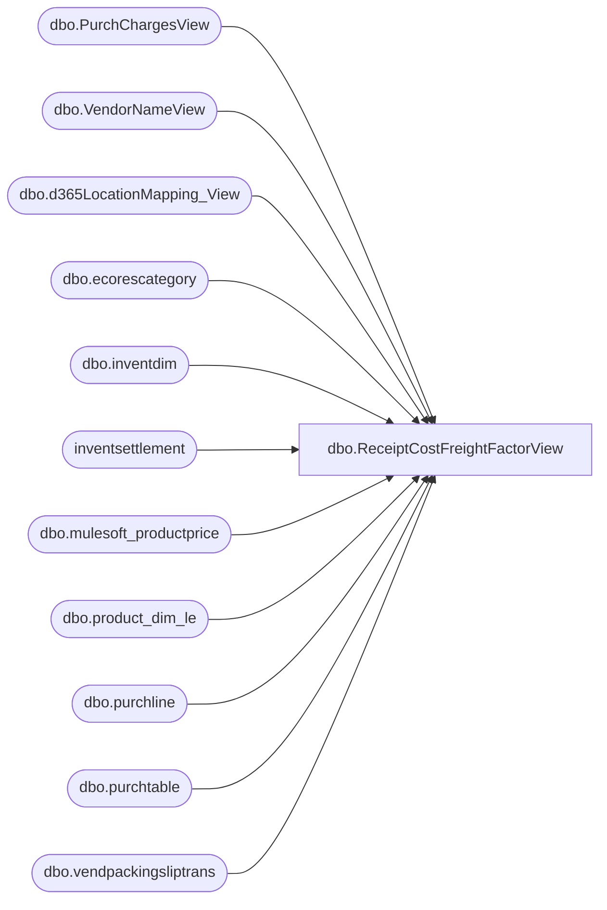

# dbo.ReceiptCostFreightFactorView

**Database:** LH_D365  
**Server:** 4db76rlxaxcuvmuh5kw37wbnqq-m2o53thjetderkgqw4nc6a676e.datawarehouse.fabric.microsoft.com  

## Architecture Diagram



## Table Dependencies

| Referenced Table |
|---|
| dbo.PurchChargesView |
| dbo.VendorNameView |
| dbo.d365LocationMapping_View |
| dbo.ecorescategory |
| dbo.inventdim |
| inventsettlement |
| dbo.mulesoft_productprice |
| dbo.product_dim_le |
| dbo.purchline |
| dbo.purchtable |
| dbo.vendpackingsliptrans |

## View Code

```sql
/****** Object:  View [dbo].[ReceiptCostFreightFactorView]    Script Date: 2/20/2026 9:35:13 AM ******/



CREATE   VIEW [dbo].[ReceiptCostFreightFactorView] AS
/*  Purpose
      Aggregate by Style + Receipt Year (YEAR(vendpackingsliptrans.deliverydate)).
      Allocate each PO line’s Cost Factor (pc.TotalCharge) evenly across its receipts.
      Include Vendor number & name joined via purchtable.invoiceaccount.

    Output columns:
      -- [PO number]                 
      -- [Receipt number]            
      -- [PurchLine RecId]           
         [Style]
         [Product_Key]
         [Receipt Year]
         [Vendor Number]
         [Vendor Name]
         [Net Receipt Cost]          = [Receipt Cost without charges] + [Cost Factor]
         --[Receipt Cost without charges]  
         [Cost Factors Total Cost]
         [Net Receipts Units]
         [Net Receipts Retail TE]
*/
WITH base AS (
    SELECT
        pl.purchid                                        AS [PO number],
        pl.recid                                          AS [PurchLine RecId],
        ps.packingslipid                                  AS [Receipt number],
        ISNULL(pl.itemid, ec.name)                        AS [Style],
        pd.product_key                                    AS [Product_Key],
        YEAR(ps.deliverydate)                             AS [Receipt Year],
        ps.deliverydate                                   AS [Receipt Date],

        ISNULL(ps.lineamount_w,0)                         AS rc_wo,
        ISNULL(ps.qty, 0)                                 AS units,
        ISNULL(pd.current_selling_retail_home * ISNULL(ps.qty, 0), 0) AS retail,

        pt.invoiceaccount                                 AS [Vendor Number],
        vnv.name                                          AS [Vendor Name],
        vnv.vendgroup                                     AS [Vendor Group],
        ps.costledgervoucher                              AS voucher,
        CONCAT(idm.inventlocationid, '-', pl.dataareaid)  AS location_key,
        CASE WHEN ps.packingslipid IS NOT NULL
             THEN CONCAT(pl.recid, '-', ps.packingslipid)
             ELSE NULL
        END AS PurchChargeview_Key,
        pl.dataareaid,

        -- kept for reference/output
        CAST(pt.createdon AS datetime2(0))                AS PO_CreateDate,

        -- Jurisdiction used for price lookup
        lm.JurisidictionCode                              AS JurisdictionCode
    FROM LH_D365.dbo.purchline AS pl
    INNER JOIN dbo.inventdim AS idm
            ON pl.inventdimid = idm.inventdimid
           AND pl.dataareaid  = idm.dataareaid
    INNER JOIN LH_D365.dbo.purchtable AS pt
            ON pt.purchid    = pl.purchid
           AND pt.dataareaid = pl.dataareaid
    LEFT  JOIN dbo.d365LocationMapping_View AS lm
            ON idm.inventlocationid = lm.inventlocationid
           AND lm.legalentity       = pl.dataareaid
    LEFT  JOIN LH_D365.dbo.product_dim_le AS pd
            ON pd.style_code        = pl.itemid
           AND pd.jurisdiction_code = lm.JurisidictionCode
           AND lm.legalentity       = pd.LegalEntity
    LEFT  JOIN LH_D365.dbo.vendpackingsliptrans AS ps
            ON pl.inventtransid = ps.inventtransid
           AND pl.dataareaid    = ps.dataareaid
           AND ps.qty <> 0
    LEFT  JOIN LH_D365.dbo.ecorescategory AS ec
            ON pl.procurementcategory = ec.recid
    LEFT  JOIN LH_D365.dbo.VendorNameView AS vnv
            ON vnv.accountnum = pt.invoiceaccount
           AND vnv.dataareaid = pt.dataareaid
    WHERE
        pl.purchstatus <> 4
        AND vnv.vendgroup <> '80'
        AND ps.deliverydate >= DATEADD(MONTH, -36, GETDATE())
        AND pt.intercompanyorder = 0   -- exclude intercompany POs (0/1)
),

charges AS (
    SELECT
        pc.PurchChargeview_Key,
        pc.PurchLineRecId,
        pc.dataareaid,
        pc.packingslipid AS [
```

