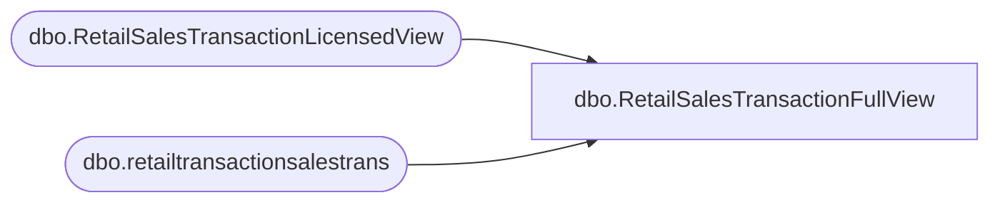

# dbo.RetailSalesTransactionFullView

**Database:** LH_D365  
**Server:** 4db76rlxaxcuvmuh5kw37wbnqq-m2o53thjetderkgqw4nc6a676e.datawarehouse.fabric.microsoft.com  

## Architecture Diagram



## Table Dependencies

| Referenced Table |
|---|
| dbo.RetailSalesTransactionLicensedView |
| dbo.retailtransactionsalestrans |

## View Code

```sql
-- =============================================================================
-- View: dbo.RetailSalesTransactionFullView
--
-- Purpose: Returns ALL rows from retailtransactionsalestrans for the last
--          12 months. Rows that exist in RetailSalesTransactionLicensedView
--          are enriched with dimension and royalty data. Rows that do NOT
--          exist in the licensed view are included with NULL for those columns.
--
-- Use the is_licensed flag to distinguish:
--   1 = row exists in RetailSalesTransactionLicensedView
--   0 = row is excluded from RetailSalesTransactionLicensedView
-- =============================================================================

CREATE   VIEW [dbo].[RetailSalesTransactionFullView]
AS

SELECT
    rt.transactionid,
    rt.store,
    rt.businessdate,
    rt.transdate,
    rt.itemid,
    rt.dataareaid,
    rt.inventlocationid,
    rt.linenum,
    rt.qty,
    rt.netamount,
    rt.netamountincltax,
    rt.netprice,
    rt.originalprice,
    rt.price,
    rt.taxamount,
    rt.costamount,
    rt.discamount,
    rt.discamountwithouttax,
    rt.totaldiscamount,
    rt.totaldiscpct,
    rt.currency,
    rt.custaccount
FROM dbo.retailtransactionsalestrans rt
WHERE rt.businessdate >= DATEADD(MONTH, -12, GETDATE())
  AND (rt.IsDelete IS NULL OR rt.IsDelete = 0)
  -- Test filters - remove for full execution
  AND rt.dataareaid   = '1100'
  AND rt.businessdate >= '2025-11-02'
  AND rt.businessdate <= '2025-11-08'
  AND NOT EXISTS (
      SELECT 1
      FROM dbo.RetailSalesTransactionLicensedView v
      WHERE v.transactionid = rt.transactionid
        AND v.itemid        = rt.itemid
        AND v.store         = rt.store
        AND v.dataareaid    = rt.dataareaid
  )
--ORDER BY
--    rt.itemid,
--    rt.transactionid,
--    rt.linenum;
```

