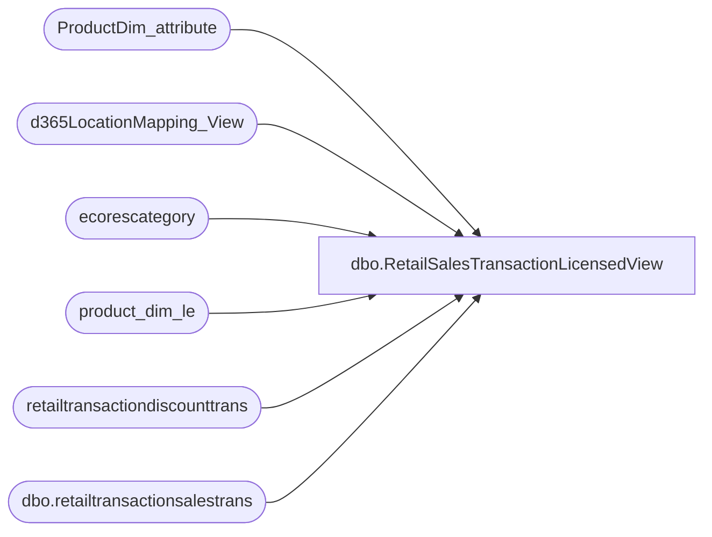

# dbo.RetailSalesTransactionLicensedView

**Database:** LH_D365  
**Server:** 4db76rlxaxcuvmuh5kw37wbnqq-m2o53thjetderkgqw4nc6a676e.datawarehouse.fabric.microsoft.com  

## Architecture Diagram



## Table Dependencies

| Referenced Table |
|---|
| ProductDim_attribute |
| d365LocationMapping_View |
| ecorescategory |
| product_dim_le |
| retailtransactiondiscounttrans |
| dbo.retailtransactionsalestrans |

## View Code

```sql
/****** Object:  View [dbo].[RetailSalesTransactionLicensedView]    Script Date: 4/1/2026 1:25:22 PM ******/

CREATE   VIEW [dbo].[RetailSalesTransactionLicensedView]
AS
WITH CTE_retailtransactionsalestrans AS (
    SELECT
--        pd.product_key,
		rt.transactionid,
        rt.itemid,
        rt.dataareaid,
        rt.store,
		rt.inventlocationid,
--        pd.jurisdiction_code,
        rt.currency,
--        l.accountingcurrency,
        --CONCAT(DATEPART(YEAR, rt.businessdate), '', RIGHT('0' + CAST(DATEPART(WEEK, rt.businessdate) AS VARCHAR(2)), 2)) AS merch_year_wk,
		rt.businessdate,
		rt.qty,
		rt.netamountincltax,
		rt.netamount,
		rt.costamount,
		rt.discamount,
		rt.discamountwithouttax,
		rt.transdate,
		rt.custaccount,
		rt.netprice,
		rt.originalprice,
		rt.price,
		rt.taxamount,
		rt.totaldiscamount,
		rt.totaldiscpct,
		rt.linenum
    FROM dbo.retailtransactionsalestrans AS rt
    WHERE rt.businessdate >= DATEADD(MONTH, -12, GETDATE())	
	AND (rt.[IsDelete] IS NULL OR rt.[IsDelete] = 0)   
     
	-- AND NOT EXISTS 
	-- (Select 1 from transformedretailsalestransactions tr 
	-- 	where 
	-- 	tr.transactionid = rt.transactionid 
	-- 	--and tr.itemid = rt.itemid
	-- 	and tr.store = rt.store
	-- 	and tr.dataareaid = rt.dataareaid)    
    
)

SELECT DISTINCT
    RoyaltyType,
    Licensor,
    pa.AttributeValue AS LICEN,
    [product_dim_le].product_key,
    [product_dim_le].jurisdiction_code,
    [product_dim_le].style_desc,
    [product_dim_le].department_code,
    [product_dim_le].department,
    [product_dim_le].class_code,
    [product_dim_le].class,
    [product_dim_le].subclass_code,
    [product_dim_le].subclass,
	[product_dim_le].color_code,
	[product_dim_le].color_desc,
    consumer_group.code AS consumergroup_code,
    consumer_group.name AS consumergroup,
    rt.[store],
    rt.[businessdate],
    rt.transdate,
    rt.[itemid],
    rt.transactionid,
    rt.[inventlocationid] + '-' + [rt].[dataareaid] AS LocationKey,
    SUM([rt].[costamount]) AS [costamount],
    MIN([rt].[currency]) AS [currency],
    MIN([rt].[custaccount]) AS [custaccount],
    SUM([rt].[discamount]) AS [discamount],
    SUM([rt].[discamountwithouttax]) AS [discamountwithouttax],
    MIN([rtdt].[periodicdiscountofferid]) AS [periodicdiscountofferid],
    SUM([rt].[netamount]) AS [netamount],
    SUM([rt].[netamountincltax]) AS [netamountincltax],
    AVG([rt].[netprice]) AS [netprice],    
    AVG([rt].[originalprice]) AS [originalprice],
    AVG([rt].[price]) AS [price],
    SUM([rt].[qty]) AS [qty],
    SUM([rt].[taxamount]) AS [taxamount],
    SUM([rt].[totaldiscamount]) AS [totaldiscamount],
    SUM([rt].[totaldiscpct]) AS [totaldiscpct],
    [rt].[dataareaid] AS [dataareaid]
FROM
    CTE_retailtransactionsalestrans as rt
    LEFT JOIN d365LocationMapping_View lm
        ON lm.inventlocationid = rt.inventlocationid
        AND lm.legalentity = rt.dataareaid
    LEFT JOIN [product_dim_le]
        ON [product_dim_le].style_code = rt.itemid 
        AND [product_dim_le].LegalEntity = rt.dataareaid
        AND product_dim_le.jurisdiction_code = lm.JurisidictionCode
    outer apply (
            select top 1 p.AttributeValue
            from ProductDim_attribute p
            where p.style_code = rt.itemid
            and p.AttributeName = 'LICEN'
            and p.product_key = [product_dim_le].product_key
            -- and RIGHT(p.product_key, LEN(rt.jurisdiction_code))
            --      = rt.jurisdiction_code
        ) pa
    LEFT JOIN
    (
        SELECT
            transactionid,
            salelinenum,
            periodicdiscountofferid,
            SUM(discountamount) AS discountamount
        FROM
            [retailtransactiondiscounttrans]
        GROUP BY
            transactionid,
            salelinenum,
            periodicdiscountofferid
    ) AS [rtdt]
        ON rt.transactionid = [rtdt].transactionid
```

