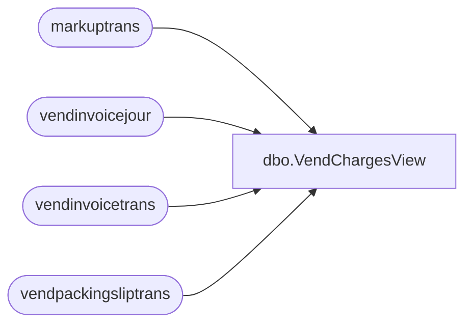

# dbo.VendChargesView

**Database:** LH_D365  
**Server:** 4db76rlxaxcuvmuh5kw37wbnqq-m2o53thjetderkgqw4nc6a676e.datawarehouse.fabric.microsoft.com  

## Architecture Diagram



## Table Dependencies

| Referenced Table |
|---|
| markuptrans |
| vendinvoicejour |
| vendinvoicetrans |
| vendpackingsliptrans |

## View Code

```sql
CREATE   VIEW  [dbo].VendChargesView
AS
WITH src AS (
SELECT
	CONCAT (mt.voucher,'-', vt.itemid,'-',mt.transrecid) as VoucherItemKey,
    mt.voucher,
    mt.transtableid,
    mt.transrecid,
    UPPER(REPLACE(mt.markupcode, ' ', '')) AS markupcode_norm,
    mt.calculatedamount,
	vt.purchid,
	vt.invoiceid as [documentid],
	vt.invoicedate as [documentdate],
	vt.dataareaid,
	vt.inventdimid,
	vt.qty,
	vt.itemid,
	vt.lineamount
FROM markuptrans mt
    INNER JOIN vendinvoicetrans vt
        ON vt.tableid = mt.transtableid
       AND vt.recid   = mt.transrecid
		AND vt.itemid IS NOT NULL
INNER JOIN vendinvoicejour vj
	on vj.invoiceid = vt.invoiceid
	AND vj.dataareaid = vt.dataareaid
	AND vj.invoicedate = vt.invoicedate
	AND vj.ledgervoucher = mt.voucher
Where mt.calculatedamount <> 0 
UNION ALL
SELECT
	CONCAT (mt.voucher,'-', vp.itemid,'-',mt.transrecid) as VoucherItemKey,
    mt.voucher,
    mt.transtableid,
    mt.transrecid,
    UPPER(REPLACE(mt.markupcode, ' ', '')) AS markupcode_norm,
    mt.calculatedamount,
	vp.origpurchid as purchid,
	vp.packingslipid as [documentid],
	vp.deliverydate as [documentdate],
	vp.dataareaid,
	vp.inventdimid,
	vp.qty,
	vp.itemid,
	vp.valuemst as lineamount
FROM markuptrans mt
 INNER JOIN vendpackingsliptrans vp
    on vp.tableid = mt.transtableid
      AND vp.recid   = mt.transrecid
	  AND vp.costledgervoucher = mt.voucher
Where mt.calculatedamount <> 0	
)

Select * from src
--where 
--markupcode_norm like 'SALE%'
--voucher = 'API000011755'
--and dataareaid = '2110'
```

