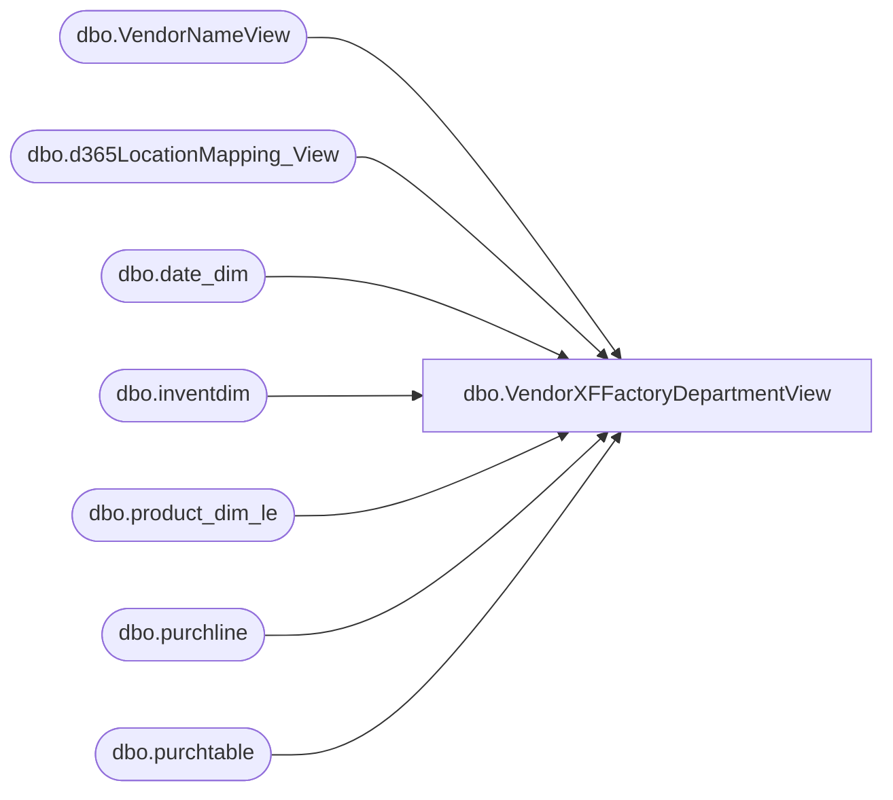

# dbo.VendorXFFactoryDepartmentView

**Database:** LH_D365  
**Server:** 4db76rlxaxcuvmuh5kw37wbnqq-m2o53thjetderkgqw4nc6a676e.datawarehouse.fabric.microsoft.com  

## Architecture Diagram



## Table Dependencies

| Referenced Table |
|---|
| dbo.VendorNameView |
| dbo.d365LocationMapping_View |
| dbo.date_dim |
| dbo.inventdim |
| dbo.product_dim_le |
| dbo.purchline |
| dbo.purchtable |

## View Code

```sql
/****** Object:  View [dbo].[VendorXFFactoryDepartmentView]    Script Date: 2/27/2026 2:47:14 PM ******/
/****** Object:  View [dbo].[VendorXFFactoryDepartmentView]    Script Date: 2/25/2026 10:51:08 PM ******/
/****** Object:  View [dbo].[VendorXFFactoryDepartmentView]    Script Date: 2/12/2026 3:30:28 PM ******/


CREATE   VIEW [dbo].[VendorXFFactoryDepartmentView]
AS
with src as (
select YEAR(purchline.babshipdate) as 'Year',
		case when vendorName.babvendorcode = 'INNOFLW' and vendorName.babfactorycode = 'INFEVE' then 'IFKEVE'
			 when vendorName.babvendorcode = 'INNOVIN' and vendorName.babfactorycode = 'INFVIN' then 'IFKVIN'
			 when vendorName.babvendorcode = 'INNONTR' and vendorName.babfactorycode = 'INFNTR' then 'IFKNTR'
			 when vendorName.babvendorcode = 'DREAMVT' and vendorName.babfactorycode = 'DREJY2' then 'JYIJY2'
			 when vendorName.babvendorcode = 'DREAMVT' and vendorName.babfactorycode = 'DREPLA' then 'JYIPLA' 
				else vendorName.babfactorycode end as 'Factory',
		isnull(vendorName.babfobport,'NONE') as 'Port',
		pd.departmentLabel as DepartmentLabel,
		pd.departmentLabel
		+ ' ' +
		LEFT(
        SUBSTRING(pd.department, CHARINDEX('(', pd.department) + 1, LEN(pd.department)),
        CHARINDEX('-', SUBSTRING(pd.department, CHARINDEX('(', pd.department) + 1, LEN(pd.department)) + '-') - 1) AS DeptFormatted,
		MONTH(purchline.babshipdate) as 'Month',
		purchline.purchqty as 'PurchQty',
		purchline.lineamount as 'TotalCost',
		pd.current_retail * purchline.purchqty as 'TotalRetail'
    FROM
        LH_D365.dbo.purchline purchline
        INNER JOIN LH_D365.dbo.purchtable purchtable ON purchtable.purchid = purchline.purchid AND purchtable.dataareaid = purchline.dataareaid
		INNER JOIN LH_MART.dbo.date_dim  dd on dd.actual_date = purchline.babshipdate
        INNER JOIN dbo.inventdim idm ON purchline.inventdimid = idm.inventdimid And purchline.dataareaid = idm.dataareaid
        INNER JOIN LH_D365.dbo.VendorNameView vendorName ON vendorName.accountnum = purchline.vendaccount AND vendorName.dataareaid = purchline.dataareaid
        LEFT JOIN dbo.d365LocationMapping_View locationMapping ON idm.inventlocationid = locationMapping.inventlocationid AND locationMapping.legalentity = purchline.dataareaid
        LEFT JOIN LH_D365.dbo.product_dim_le pd ON pd.style_code = purchline.itemid AND pd.jurisdiction_code = locationMapping.JurisidictionCode And purchline.dataareaid = pd.LegalEntity

    WHERE
        purchline.createddatetime >= DATEADD(MONTH, -48, GETDATE()) 
		and pd.department is not null
		and purchline.babshipdate is not null
		and purchline.babshipdate != '1900-01-01 00:00:00.000000'
		and purchline.babshipdate >= DATEADD(MONTH, -48, GETDATE())
		and dd.date_key != '0'
		and dd.date_key != '-99'	
		and purchline.purchstatus <> 4 -- exclude cancelled POs
		and purchtable.intercompanyorder = 0 -- only non-intercompany orders
		)

		select [Year], 
			case when grouping(DepartmentLabel) = 1 then 'All Departments' else DepartmentLabel end as DepartmentLabel,
			case when grouping(DeptFormatted) = 1 then 'All Departments' else DeptFormatted end as 'DepartmentName',
			case when grouping (Factory) = 1 then 'All Factories' else Factory +' '+ Port end as 'FactoryLabel',
			--case when grouping (Factory) = 1 then 'All Factories' else Factory end as 'FactoryLabel',
			cast(case when grouping (DeptFormatted) = 1 then 0 else 1 end as int) as 'DeptSortKey',
			cast(case when grouping (Factory) = 1 then 0 else 1 end as int) as 'FactorySortKey',
			FLOOR(sum(case when [Month] = 1 then PurchQty else 0 end)) as 'Jan',
			FLOOR(sum(case when [Month] = 2 then PurchQty else 0 end)) as 'Feb',
			FLOOR(sum(case when [Month] = 3 then PurchQty else 0 end)) as 'Mar',
			FLOOR(sum(case when [Month] = 4 then PurchQty else 0 end))  as 'Apr',
			FLOOR(sum(case when [Month] = 5 then PurchQty else 0 end))  as 'May',
			FLOOR(sum(case when [Month] = 6 then PurchQty else 0 end))  as
```

