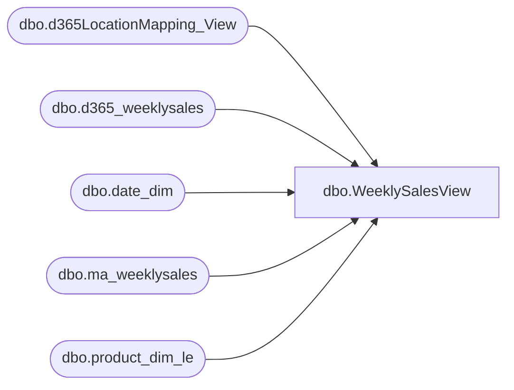

# dbo.WeeklySalesView

**Database:** LH_D365  
**Server:** 4db76rlxaxcuvmuh5kw37wbnqq-m2o53thjetderkgqw4nc6a676e.datawarehouse.fabric.microsoft.com  

## Architecture Diagram



## Table Dependencies

| Referenced Table |
|---|
| dbo.d365LocationMapping_View |
| dbo.d365_weeklysales |
| dbo.date_dim |
| dbo.ma_weeklysales |
| dbo.product_dim_le |

## View Code

```sql
CREATE   VIEW [dbo].[WeeklySalesView]
AS
WITH weeklysales
AS (
    SELECT distinct
        CAST(CONCAT(ws.style_code,ws.LegalEntity,ws.jurisdiction_code) as varchar(50)) AS [product_key],
        ws.[store_key],
        ws.[date_key],
        ws.[merch_year_wk],
        ws.[perm_md_retail],
        ws.[perm_mu_retail],
        ws.[perm_mdc_retail],
        ws.[perm_muc_retail],
        ws.[promo_pc_total_retail],
        ws.[promo_pc_total_retail_te],
        ws.[received_units],
        ws.[received_retail],
        ws.[return_to_vendor_units],
        ws.[return_to_vendor_retail],
        ws.[distributions_units],
        ws.[distributions_retail],
        ws.[transfer_in_units],
        ws.[transfer_in_retail],
        ws.[transfer_out_units],
        ws.[transfer_out_retail],
        ws.[sales_total_units],
        ws.[sales_total_retail],
        ws.[sales_total_retail_us_te],
        ws.[sales_total_retail_native_te],
        ws.[sales_total_cost],
        ws.[return_units],
        ws.[return_retail],
        ws.[return_retail_us_te],
        ws.[return_retail_native_te],
        ws.[return_cost],
        ws.[shrink_actual_units],
        ws.[shrink_actual_retail],
        ws.[adjustments_total_units],
        ws.[adjustments_total_retail],
        ws.[sales_total_cost_native],
        ws.[return_cost_native],
		ws.[jurisdiction_code]
    FROM
        [LH_Source].[dbo].[ma_weeklysales] ws
        INNER JOIN [LH_Mart].[dbo].[date_dim] dd
            ON ws.date_key = dd.date_key

    WHERE
        dd.actual_date >= DATEADD(MONTH, -36, GETDATE())
		and ws.merch_year_wk < '202539'
		AND ws.INS_DT = (SELECT MAX(INS_DT) FROM [LH_Source].[dbo].[ma_weeklysales])
    UNION 
    SELECT distinct
        CAST(CONCAT(ws.style_code,ws.LegalEntity,ws.jurisdiction_code) as varchar(50)) AS [product_key],   
        ws.[store_key],
        ws.[date_key],
        ws.[merch_year_wk],
        ws.[perm_md_retail],
        ws.[perm_mu_retail],
        0.00 AS [perm_mdc_retail],
        0.00 AS [perm_muc_retail],
        ws.[promo_pc_total_retail],
        ws.[promo_pc_total_retail_te],
        ws.[received_units],
        ws.[received_retail],
        0.00 AS [return_to_vendor_units],
        0.00 AS [return_to_vendor_retail],
        ws.[distributions_units],
        ws.[distributions_retail],
        ws.[transfer_in_units],
        ws.[transfer_in_retail],
        ws.[transfer_out_units],
        ws.[transfer_out_retail],
        ws.[sales_total_units],
        ws.[sales_total_retail],
        ws.[sales_total_retail_us_te],
        ws.[sales_total_retail_native_te],
        ws.[sales_total_cost],
        ws.[return_units],
        ws.[return_retail],
        ws.[return_retail_us_te],
        ws.[return_retail_native_te],
        ws.[return_cost],
        ws.[shrink_actual_units],
        ws.[shrink_actual_retail],
        ws.[adjustments_total_units],
        ws.[adjustments_retail],
        ws.[sales_total_cost_native],
        ws.[return_cost_native],
		ws.[jurisdiction_code]
    FROM
        [LH_Mart].[dbo].[d365_weeklysales] ws
        INNER JOIN [LH_Mart].[dbo].[date_dim] dd
            ON ws.date_key = dd.date_key

    WHERE
        dd.actual_date >= DATEADD(MONTH, -36, GETDATE())
		and ws.merch_year_wk >= '202539'
		AND ws.INS_DT = (SELECT MAX(INS_DT) FROM [LH_Mart].[dbo].[d365_weeklysales])
)
SELECT
    weeklysales.*,
    locationmapping.LocationKey,
	le.style_code
FROM
    weeklysales weeklysales
			INNER JOIN LH_D365.dbo.product_dim_le le
        ON  CAST(weeklysales.product_key as varchar(50)) = CAST(le.product_key as varchar(50))
    LEFT JOIN LH_D365.dbo.d365LocationMapping_View locationmapping
        ON locationmapping.legalentity = le.LegalEntity 
		AND locationmapping.store_key = weeklysales.store_key
		AND locationmapping.JurisidictionCode = weeklysales.jurisdiction_code
		--and locationmapping.BABconcept !
```

