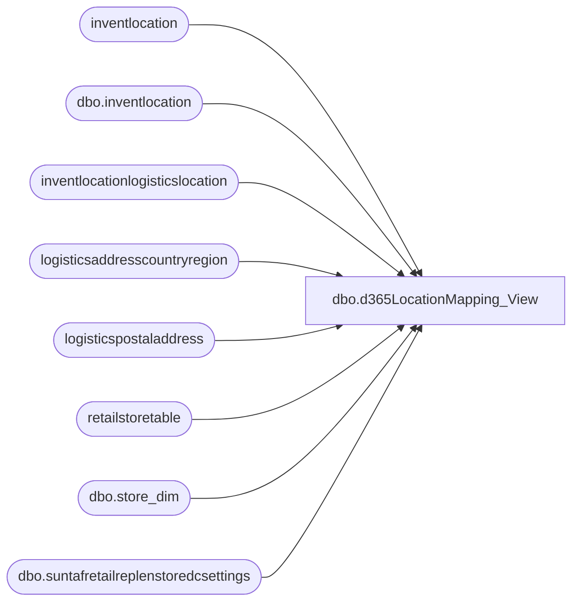

# dbo.d365LocationMapping_View

**Database:** LH_D365  
**Server:** 4db76rlxaxcuvmuh5kw37wbnqq-m2o53thjetderkgqw4nc6a676e.datawarehouse.fabric.microsoft.com  

## Architecture Diagram



## Table Dependencies

| Referenced Table |
|---|
| inventlocation |
| dbo.inventlocation |
| inventlocationlogisticslocation |
| logisticsaddresscountryregion |
| logisticspostaladdress |
| retailstoretable |
| dbo.store_dim |
| dbo.suntafretailreplenstoredcsettings |

## View Code

```sql
/****** Object:  View [dbo].[d365LocationMapping_View]    Script Date: 1/28/2026 11:38:37 AM ******/
/****** Object:  View [dbo].[d365LocationMapping_View]    Script Date: 1/8/2026 12:02:31 PM ******/
CREATE   VIEW [dbo].[d365LocationMapping_View]
AS
WITH DynStoreDim
AS (
    SELECT
        i.inventsiteid,
        i.inventlocationid,
        i.name,
        i.dataareaid AS legalentity,
        CASE
            WHEN i.dataareaid IN ('1100', '1200')
                THEN 'US'
            WHEN i.dataareaid = '1700'
                THEN 'CA'
			WHEN i.dataareaid = '3001'
                THEN 'CN'
            WHEN i.dataareaid = '2110' AND i.inventlocationid IN ('2036', '2054', '2085')
                THEN 'IE'
            WHEN i.dataareaid = '2110' AND i.inventlocationid NOT IN ('2036', '2054', '2085')
                THEN 'UK'
            ELSE NULL
        END AS JurisidictionCode,
        CAST(CASE
                 WHEN LEFT(i.inventlocationid, 1) IN ('1', '9') OR i.inventlocationid = '8010'
                     THEN CASE
                              WHEN i.inventlocationid = '9970'
                                  THEN '2970'
                              WHEN i.inventlocationid = '9940'
                                  THEN '3970'
                              WHEN i.inventlocationid = '9941'
                                  THEN '3980'
                              WHEN i.inventlocationid = '9991'
                                  THEN '9991'
                              WHEN i.inventlocationid = '9451'
                                  THEN '9451'
							  WHEN i.inventlocationid = '9452'
                                  THEN '9452'
                              WHEN i.inventlocationid = '9473'
                                  THEN '9473'
                              WHEN i.inventlocationid = '9942'
                                  THEN '9942'
                              WHEN LEFT(i.inventlocationid, 2) = '93'
                                  THEN i.inventlocationid
                              WHEN LEFT(i.inventlocationid, 2) = '92'
                                  THEN i.inventlocationid
                              WHEN i.inventlocationid = '8010'
                                  THEN '2991'							 
                             ELSE CONCAT('0', RIGHT(CAST(i.inventlocationid AS VARCHAR(10)), 3))
                          END
                 ELSE i.inventlocationid
             END AS VARCHAR(4)) AS LocationCode,
    (
        select top 1 babconcept from retailstoretable store
        where store.storenumber = i.inventlocationid
    )as BABconcept
    FROM
        [dbo].[inventlocation] i
    WHERE
        ISNUMERIC(i.inventlocationid) = 1
		and i.inventlocationid <> '10'
)
SELECT DISTINCT
    d.inventsiteid,
    d.inventlocationid,
    d.legalentity,
    d.inventlocationid + '-' + d.legalentity AS LocationKey,
    d.JurisidictionCode,
    d.LocationCode,
    sd.store_key,
    sd.bearritory,
    d.LocationCode + '-' + d.legalentity AS LocationCodeKey,
    d.name,
    CASE
        WHEN d.inventlocationid IN ('9990', '9991', '9980', '9970', '9960', '9942', '9941', '9940', '8010')
            THEN 1
        ELSE 0
    END AS IsDC,
    srs.dc_source,
    d.BABconcept
FROM
    DynStoreDim d
    LEFT JOIN LH_Mart.dbo.store_dim sd
        ON sd.store_id = d.LocationCode
    LEFT JOIN
    (
        SELECT
            s.storenumber,
            STRING_AGG(s.inventlocationid, ', ') AS dc_source
        FROM
            dbo.suntafretailreplenstoredcsettings s
        GROUP BY
            storenumber
    ) AS srs
        ON d.inventlocationid = srs.storenumber
    LEFT JOIN
    (
        SELECT
            il.dataareaid,
            il.inventlocationid,
            cr.isocode
        FROM
            inventlocation il
            INNER JOIN inventlocationlogisticslocation ill
                ON ill.inventlocation =
```

